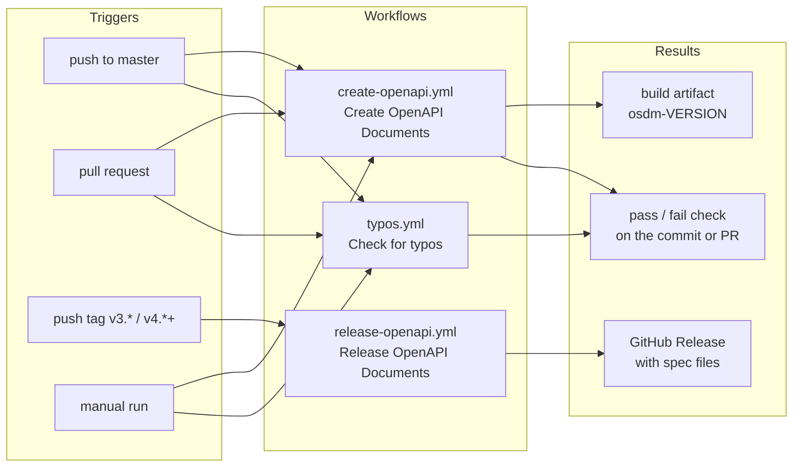
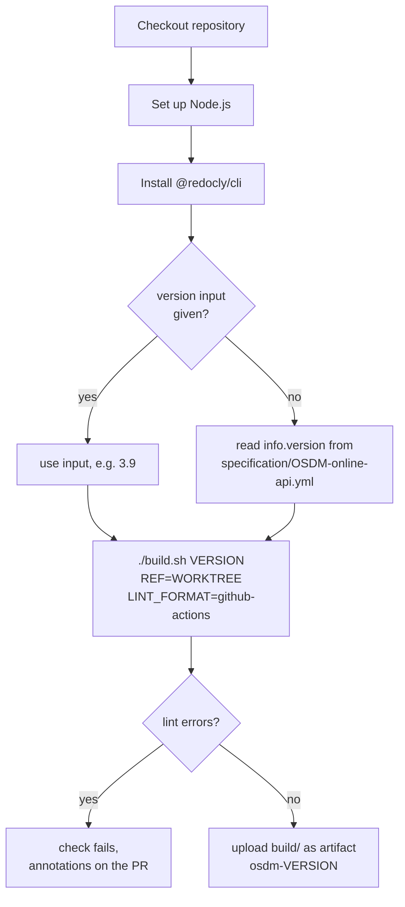
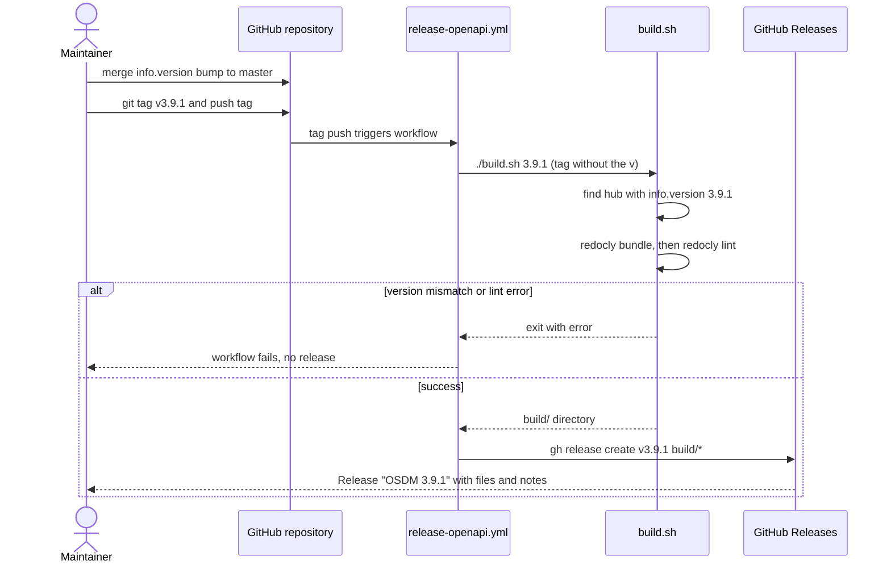
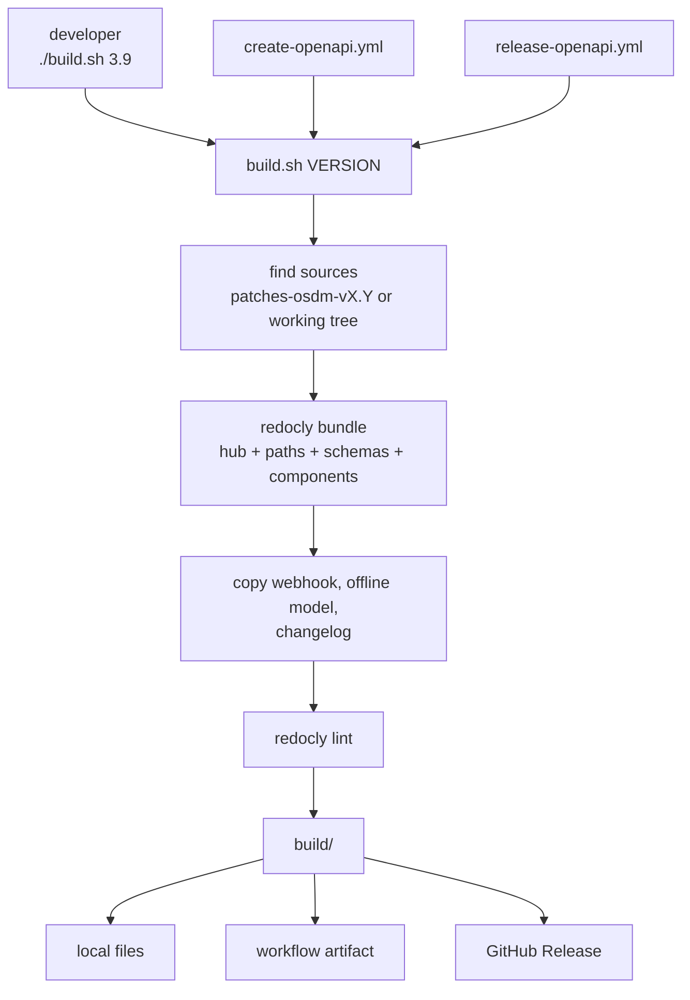

# GitHub Workflows

This document explains the automation in [.github/workflows/](../.github/workflows/): what starts each workflow,
what it does, and what it produces. For the build script they share, see
[Building the Specification](../README.md#building-the-specification).

## 1. Overview

Three workflows live on `master`. Two build and check the specification, and one checks spelling.



| Workflow | File | Starts when | Produces |
|---|---|---|---|
| Create OpenAPI Documents | `create-openapi.yml` | push or PR to `master`, manual | Build artifact, pass/fail check |
| Release OpenAPI Documents | `release-openapi.yml` | tag `v3.*` or `v4.*` to `v9.*` is pushed | GitHub Release |
| Check for typos | `typos.yml` | push to `master`, PR opened or updated, manual, `repository_dispatch` | Pass/fail check |

## 2. Create OpenAPI Documents

Runs on every push and pull request to `master`, and on demand from the Actions tab. It compiles the modular
specification into one file, lints it, and keeps the result as a downloadable artifact.



**Steps**

1. Checks out the repository and installs Node.js and the Redocly CLI.
2. Determines the version, from the manual `version` input or from `info.version` in the hub.
3. Runs `./build.sh` with `REF=WORKTREE`, so it builds exactly the checked-out sources and never looks at other branches.
   `LINT_FORMAT=github-actions` turns lint findings into annotations on the pull request.
4. Uploads the `build/` directory as the artifact `osdm-<version>`.

**What the artifact contains**

```text
osdm-3.9.0/
  OSDM-online-api-v3.9.0.bundled.yml   compiled Online API, a single file
  OSDM-online-webhook-v3.8.0.yml       webhook spec (carries its own version)
  OSDM-offline-model-v3.9.0.json       offline model
```

Lint errors fail the check. Warnings do not. The artifact is kept for the repository's default retention period; it
is not committed and not published.

## 3. Release OpenAPI Documents

Runs when a version tag is pushed. It builds the tagged commit and attaches the result to a GitHub Release.



**To cut a release**

1. Set `info.version` in `specification/OSDM-online-api.yml` to the new version and merge it to `master`.
2. Tag and push:

   ```bash
   git tag v3.9.1
   git push origin v3.9.1
   ```

**Behaviour**

- The release is named `OSDM <version>` and has generated release notes.
- A tag containing a hyphen, such as `v3.10.0-rc1`, is published as a pre-release.
- The number in the tag must match `info.version` at the tagged commit. A minor tag such as `v3.9` matches any 3.9.x.
- Only 3.9 and later can be built, so older tags such as `v3.8.1` fail.
- The workflow uses the built-in `GITHUB_TOKEN` with `contents: write`. No extra secret is needed.
- The release does not publish to osdm.io. That is a separate, manual step on `gh-pages`.

## 4. Check for typos

Runs [crate-ci/typos](https://github.com/crate-ci/typos) over the repository on every push to `master`, on pull
requests when they are opened or updated, on `repository_dispatch`, and on demand. Words that are correct but flagged are
listed in [typos.toml](../typos.toml). To check locally, install `typos` and run it from the repository root.

## 5. How the pieces fit together

The two build workflows and the local command all go through `build.sh`, so a local build behaves like CI.



## 6. Other branches

Workflows are per branch.

- **`patches-osdm-vX.Y`** branches carry their own copy of the validation workflow under its old name,
  `validate-openapi.yml`.
- **`gh-pages`** has a separate `jekyll.yml` that builds and deploys the osdm.io site whenever `gh-pages` is pushed.
  Nothing in the workflows above publishes to that branch.

## 7. Troubleshooting

| Symptom | Likely cause |
|---|---|
| Release workflow fails with `no OSDM-online-api.yml for X found` | The tag does not match `info.version` in the hub. Bump the version, merge, and tag again. |
| Release workflow fails with `only the modular OSDM 3.9 and later` | The tag is older than 3.9. |
| Create workflow fails on lint | Open the PR's annotations. Fix the finding, or add an intentional suppression to `.redocly.lint-ignore.yaml`. |
| A required status check never reports | Branch protection still names the old job `validate`. Update it to `create`. |
