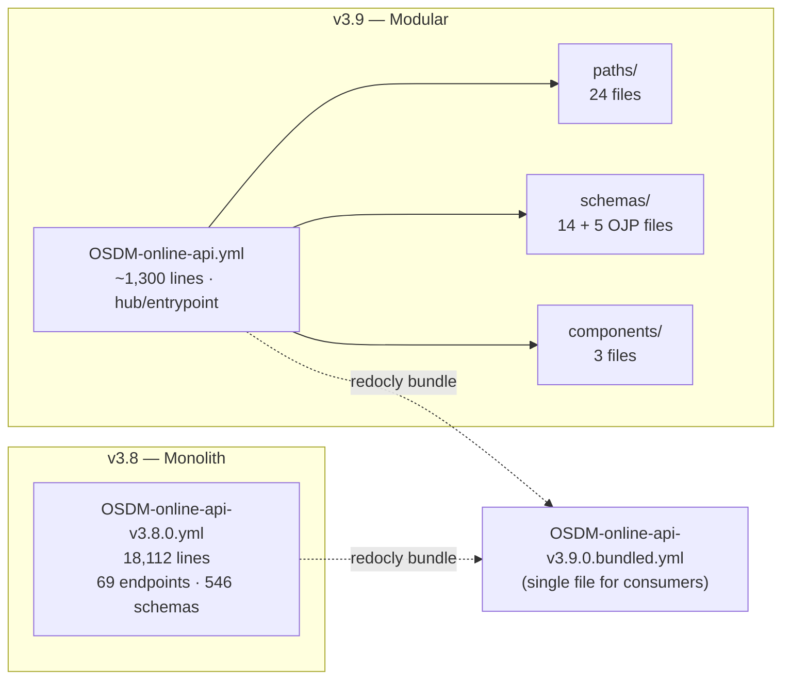
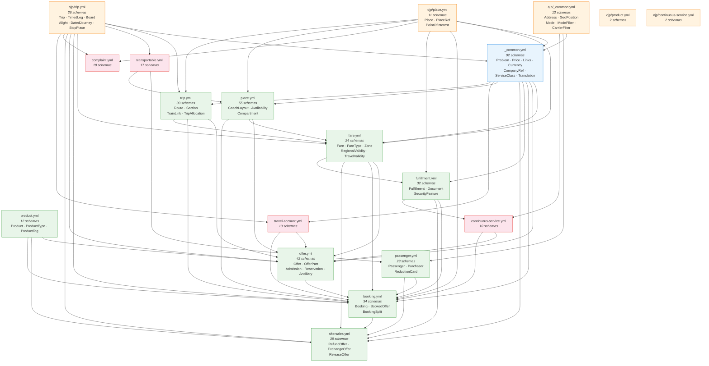
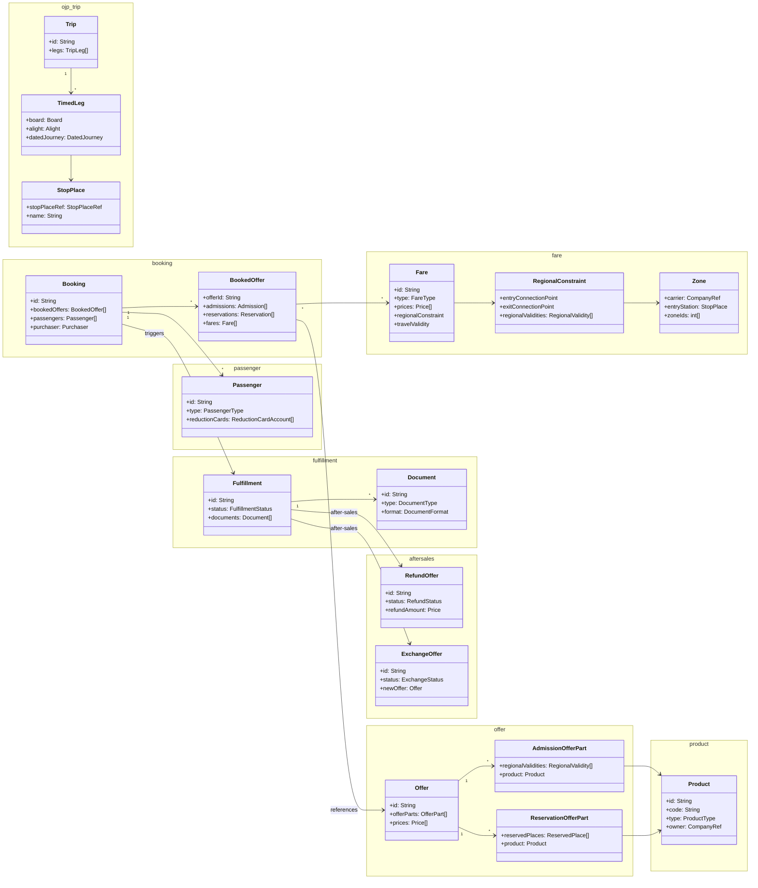
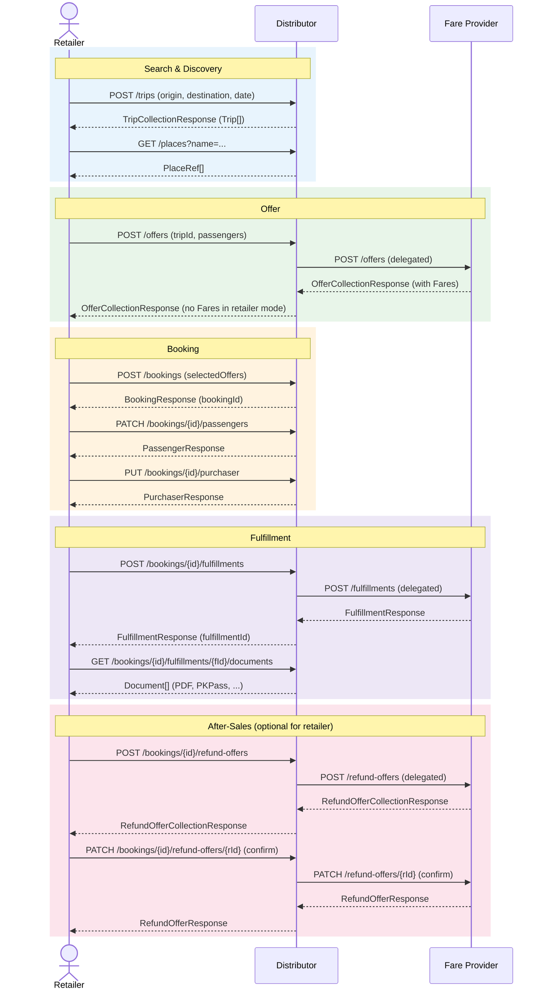
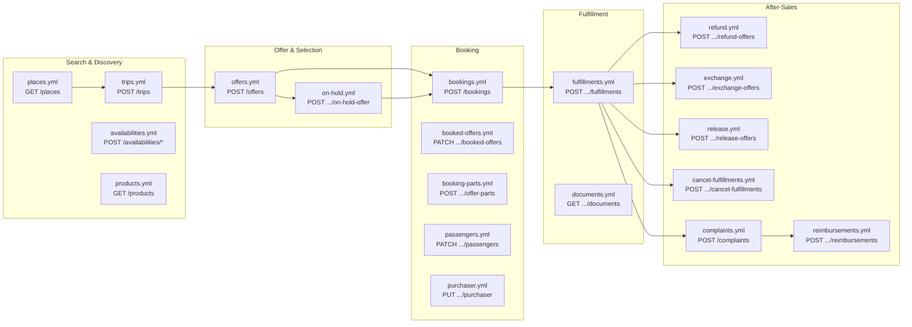
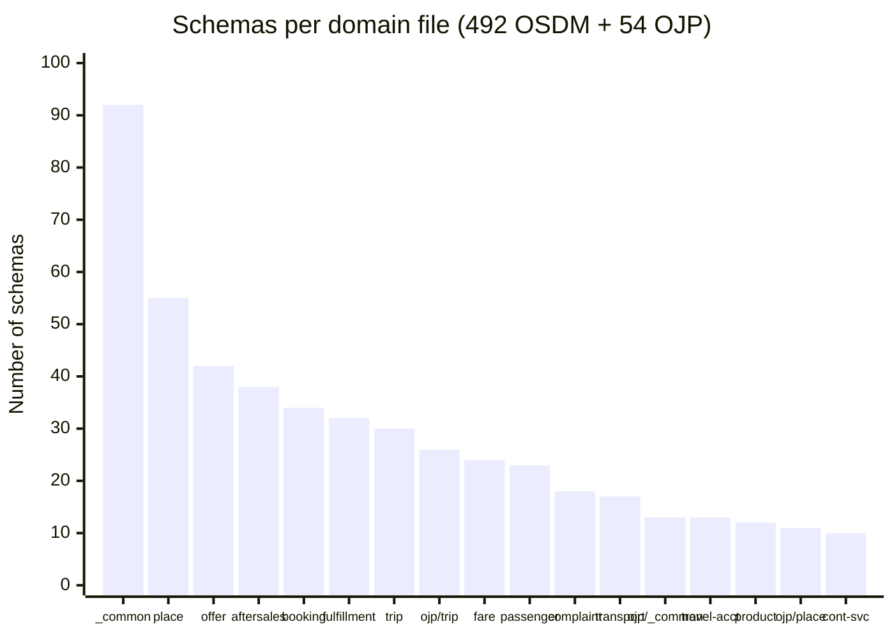
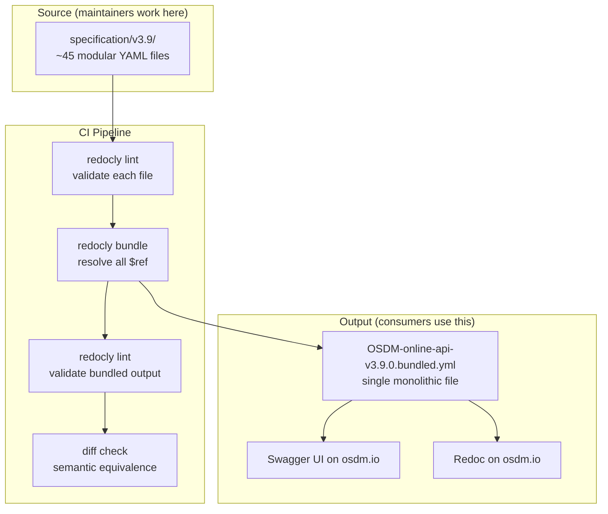

# OSDM v3.9 Specification Modularization

**Splitting 18,000 lines into manageable modules**

OSDM Working Group — March 2026

---

## The Problem

The Online API spec is a **single 18,112-line YAML file**

| Metric | Count |
|--------|-------|
| Endpoints | 69 |
| Schemas | 546 (492 OSDM + 54 OJP) |
| Internal `$ref` links | ~1,230 |
| Responses | 15 |
| Parameters | 8 |

Contributors must navigate the entire file to find what they need.

---

## Pain Points

- **Merge conflicts** — parallel work on different domains collides in one file
- **Cognitive overload** — a fulfillment developer must scroll past 12,000 lines of unrelated schemas
- **Review friction** — every PR diff spans the entire monolith, obscuring the actual change
- **Onboarding** — new contributors can't find a starting point in 18K lines

---

## The Goal

Split the monolith into **domain-aligned modules** while:

- Keeping the spec **valid OpenAPI 3.0.3**
- Producing an **identical bundled output** for consumers
- Requiring **no changes** from API implementers
- Aligning with **existing tag structure** already in the spec

---

## Before → After



---

## Directory Structure

```mermaid
graph TD
    ROOT["specification/v3.9/"]
    ROOT --> HUB["OSDM-online-api.yml<br/>(entrypoint)"]
    ROOT --> WH["OSDM-online-webhook-v3.9.0.yml"]
    ROOT --> CL["Changelog-3.9.0.md"]

    ROOT --> PATHS["paths/"]
    ROOT --> SCHEMAS["schemas/"]
    ROOT --> COMP["components/"]

    PATHS --> P1["versions.yml"]
    PATHS --> P2["places.yml"]
    PATHS --> P3["trips.yml"]
    PATHS --> P4["offers.yml"]
    PATHS --> P5["availabilities.yml"]
    PATHS --> P6["bookings.yml"]
    PATHS --> P7["booked-offers.yml"]
    PATHS --> P8["booking-parts.yml"]
    PATHS --> P9["fulfillments.yml"]
    PATHS --> P10["refund.yml"]
    PATHS --> P11["exchange.yml"]
    PATHS --> P12["release.yml"]
    PATHS --> P13["cancel-fulfillments.yml"]
    PATHS --> P14["complaints.yml"]
    PATHS --> P15["reimbursements.yml"]
    PATHS --> P16["documents.yml"]
    PATHS --> P17["passengers.yml"]
    PATHS --> P18["purchaser.yml"]
    PATHS --> P19["on-hold.yml"]
    PATHS --> P20["bookings-search.yml"]
    PATHS --> P21["bookings-split.yml"]
    PATHS --> P22["products.yml"]
    PATHS --> P23["master-data.yml"]
    PATHS --> P24["travel-accounts.yml"]

    SCHEMAS --> S0["_common.yml · 92 schemas"]
    SCHEMAS --> S1["place.yml · 55 schemas"]
    SCHEMAS --> S2["offer.yml · 42 schemas"]
    SCHEMAS --> S3["aftersales.yml · 38 schemas"]
    SCHEMAS --> S4["booking.yml · 34 schemas"]
    SCHEMAS --> S5["fulfillment.yml · 32 schemas"]
    SCHEMAS --> S6["trip.yml · 30 schemas"]
    SCHEMAS --> S7["fare.yml · 24 schemas"]
    SCHEMAS --> S8["passenger.yml · 23 schemas"]
    SCHEMAS --> S9["complaint.yml · 18 schemas"]
    SCHEMAS --> S10["transportable.yml · 17 schemas"]
    SCHEMAS --> S11["product.yml · 12 schemas"]
    SCHEMAS --> S12["travel-account.yml · 13 schemas"]
    SCHEMAS --> S13["continuous-service.yml · 10 schemas"]
    SCHEMAS --> OJP["ojp/"]

    OJP --> O1["_common.yml · 13 schemas"]
    OJP --> O2["trip.yml · 26 schemas"]
    OJP --> O3["place.yml · 11 schemas"]
    OJP --> O4["product.yml · 2 schemas"]
    OJP --> O5["continuous-service.yml · 2 schemas"]

    COMP --> C1["parameters.yml"]
    COMP --> C2["responses.yml"]
    COMP --> C3["security-schemes.yml"]
```



---

## The Hub File

`OSDM-online-api.yml` is the **single entrypoint** — ~1,300 lines

Contains:
- `openapi`, `info`, `servers`, `tags`, `security`
- All `paths` as `$ref` pointers to `paths/*.yml`
- All `components/schemas` as `$ref` pointers to `schemas/*.yml`
- All `components/parameters`, `responses`, `securitySchemes` as `$ref` pointers

Consumers and tools always start here.

---

## Schema Domains (14 core + 5 OJP files)

| File | Schemas | Domain |
|------|---------|--------|
| `_common.yml` | 92 | Problem, Price, Links, Currency, ... |
| `place.yml` | 55 | CoachLayout, PlaceAvailability, Compartment |
| `offer.yml` | 42 | Offer, Admission, Reservation, Ancillary |
| `aftersales.yml` | 38 | Refund, Exchange, Release, Cancel |
| `booking.yml` | 34 | Booking, BookedOffer, Split |
| `fulfillment.yml` | 32 | Fulfillment, Document, Security |
| `trip.yml` | 30 | Route, Section, TrainLink, TripAllocation |
| `fare.yml` | 24 | Fare, Zone, RegionalValidity, TravelValidity |
| `passenger.yml` | 23 | Passenger, Purchaser, ReductionCard |
| _+ 5 more_ | 70 | Complaint, Transport, Travel Account, ... |

---

## OJP Schemas (5 files, 54 schemas)

Schemas originating from the **Open Journey Planner** standard:

| File | Schemas | Domain |
|------|---------|--------|
| `ojp/trip.yml` | 26 | Trip, TimedLeg, Board, Alight, DatedJourney |
| `ojp/_common.yml` | 13 | Address, GeoPosition, Mode, ModeFilter |
| `ojp/place.yml` | 11 | Place, PlaceRef, PointOfInterest |
| `ojp/product.yml` | 2 | ProductCategory, ProductCategoryRef |
| `ojp/continuous-service.yml` | 2 | ContinuousMode, ContinuousService |

Separating OJP schemas clarifies the **boundary between OSDM and OJP** — these types are consumed, not owned.

---

## Path Domains (24 files)

| File | Endpoints | Lifecycle Stage |
|------|-----------|-----------------|
| `trips.yml` | 4 | Search & Discovery |
| `offers.yml` | 4 | Offer & Selection |
| `bookings.yml` | 4 | Booking Management |
| `booked-offers.yml` | 3 | Booking Management |
| `booking-parts.yml` | 6 | Booking Management |
| `fulfillments.yml` | 4 | Fulfillment |
| `refund.yml` | 3 | After-Sales |
| `exchange.yml` | 3 | After-Sales |
| `availabilities.yml` | 5 | Search & Discovery |
| _+ 15 more_ | 33 | Various |

---

## How `$ref` Linking Works

```yaml
# Hub (OSDM-online-api.yml)
paths:
  /trips:
    $ref: ./paths/trips.yml#/~1trips         # ← path file

components:
  schemas:
    Trip:
      $ref: ./schemas/trip.yml#/Trip          # ← schema file

# Schema files cross-reference each other:
# schemas/booking.yml → ./passenger.yml#/Passenger    (cross-domain)
# schemas/trip.yml    → ./_common.yml#/Price           (common types)
```

---

## Schema Dependency Graph



---

## Fare / Product Separation

The original `product.yml` (38 schemas) mixed two concerns — split into:

| `fare.yml` (24 schemas) | `product.yml` (12 schemas) |
|---|---|
| Fare, FareType, FareCombinationModel | Product, ProductType, ProductSummary |
| RegionalConstraint, RegionalValidity | ProductSearch/Response/Collection |
| Zone, ZoneDefinition, ZoneCollection | ProductTag, ProductTagGroup |
| TravelValidity, TrainValidity | PromotionCodeCollection |
| CarrierConstraint, LuggageConstraint | |

**Why?** Fare schemas are referenced by offer, booking, aftersales, fulfillment, and travel-account — a distinct dependency cluster. Product schemas serve the catalog API.

---

## Booking Lifecycle — Entity Relationships



---

## Booking Lifecycle — API Flow



---

## Booking Lifecycle — Paths Mapping



---

## Role-Based Packaging


**Legend:** Green = mandatory | Yellow/dashed = optional | Grey/dashed = not applicable

---

## Packages per Role — Summary Table

| Package | Fare Provider | Distributor | Retailer |
|---|:---:|:---:|:---:|
| `_common`, `ojp/*` | **mandatory** | **mandatory** | **mandatory** |
| `offer`, `booking`, `passenger` | **mandatory** | **mandatory** | **mandatory** |
| `fulfillment` | **mandatory** | **mandatory** | **mandatory** |
| `product` | **mandatory** | **mandatory** | **mandatory** |
| `trip` | optional | **mandatory** | **mandatory** |
| `fare` | **mandatory** | **mandatory** | *n/a* |
| `aftersales` | **mandatory** | **mandatory** | optional |
| `place`, `transportable` | optional | optional | optional |
| `complaint`, `travel-account` | *n/a* | optional | optional |

---

## Schema Size Distribution



---

## Build Pipeline



Prior versions (`v1.4` through `v3.8`) are **untouched** — no risk to existing specs.

---

## CI Pipeline Update

```yaml
# .github/workflows/validate-openapi.yml
steps:
  - name: Bundle modular v3.9 spec
    run: >
      redocly bundle
        specification/v3.9/OSDM-online-api.yml
        --output specification/v3.9/OSDM-online-api-v3.9.0.bundled.yml

  - name: Validate OpenAPI documents
    run: >
      redocly lint --format=github-actions
        specification/**/*.yml
```

---

## Verification Results

| Check | Result |
|-------|--------|
| `redocly bundle` | Succeeds |
| `redocly lint` | Valid (warnings match v3.8) |
| Paths count | 69 = 69 |
| Schemas count | 546 = 546 |
| Responses count | 15 = 15 |
| Parameters count | 8 = 8 |

The bundled output is **structurally equivalent** to v3.8.

---

## What Changes for Consumers?

**Nothing.**

- The bundled `.yml` file is the same format as before
- Swagger UI and Redoc render identically
- No API changes, no breaking changes
- Consumers never see the modular source files

The modularization is **purely an internal maintainability improvement**.

---

## What Changes for Maintainers?

| Before | After |
|--------|-------|
| Edit 1 file (18K lines) | Edit the relevant domain file |
| Merge conflicts on every PR | Conflicts only when same domain is touched |
| Full-file diffs in reviews | Focused diffs on the changed domain |
| Grep through 18K lines | Open the domain file directly |

New workflow:
1. Edit `schemas/booking.yml` or `paths/refund.yml`
2. Run `redocly bundle` to produce the bundled file
3. Run `redocly lint` to validate
4. CI does this automatically on push/PR

---

## Summary

| | v3.8 (before) | v3.9 (after) |
|---|---|---|
| Files | 1 monolith | ~45 modular files |
| Largest file | 18,112 lines | ~1,300 lines (hub) |
| Schema files | — | 14 core + 5 OJP |
| Path files | — | 24 domain-aligned |
| Domain isolation | None | Full |
| Consumer impact | — | None |
| Tooling | `redocly lint` | `redocly bundle` + `lint` |
| Merge conflict risk | High | Low |

**Modularization script** (`split-spec.py`) is included and reproducible.
All prior versions remain untouched.

The spec is ready for collaborative, domain-focused development.
