# OSDM v3.9 Specification Modularization

## 1. Current State vs Target

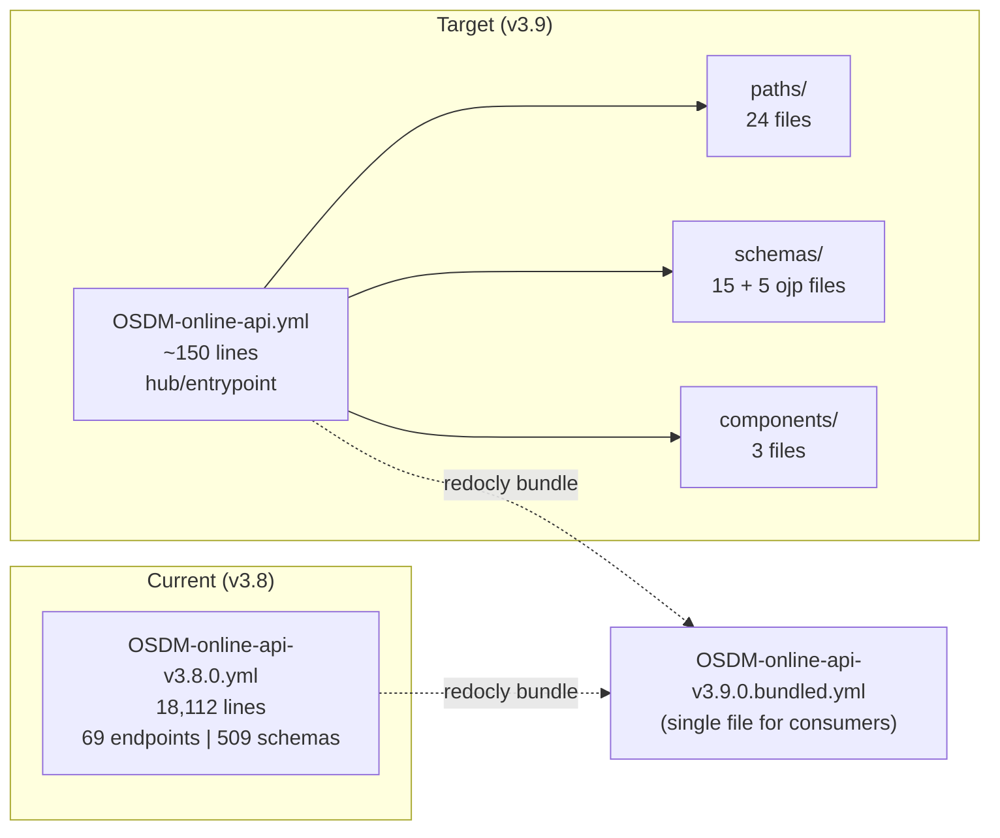

## 2. Directory Structure

```mermaid
graph TD
    ROOT["specification/v3.9/"]
    ROOT --> HUB["OSDM-online-api.yml<br/>(entrypoint)"]
    ROOT --> WH["OSDM-online-webhook-v3.9.0.yml"]
    ROOT --> CL["Changelog-3.9.0.md"]

    ROOT --> PATHS["paths/"]
    ROOT --> SCHEMAS["schemas/"]
    ROOT --> COMP["components/"]

    PATHS --> P1["versions.yml"]
    PATHS --> P2["places.yml"]
    PATHS --> P3["trips.yml"]
    PATHS --> P4["offers.yml"]
    PATHS --> P5["availabilities.yml"]
    PATHS --> P6["bookings.yml"]
    PATHS --> P7["booked-offers.yml"]
    PATHS --> P8["booking-parts.yml"]
    PATHS --> P9["fulfillments.yml"]
    PATHS --> P10["refund.yml"]
    PATHS --> P11["exchange.yml"]
    PATHS --> P12["release.yml"]
    PATHS --> P13["cancel-fulfillments.yml"]
    PATHS --> P14["complaints.yml"]
    PATHS --> P15["reimbursements.yml"]
    PATHS --> P16["documents.yml"]
    PATHS --> P17["passengers.yml"]
    PATHS --> P18["purchaser.yml"]
    PATHS --> P19["on-hold.yml"]
    PATHS --> P20["bookings-search.yml"]
    PATHS --> P21["bookings-split.yml"]
    PATHS --> P22["products.yml"]
    PATHS --> P23["master-data.yml"]
    PATHS --> P24["travel-accounts.yml"]

    SCHEMAS --> S0["_common.yml<br/>92 schemas"]
    SCHEMAS --> S1["place.yml<br/>55 schemas"]
    SCHEMAS --> S2["offer.yml<br/>42 schemas"]
    SCHEMAS --> S3["booking.yml<br/>34 schemas"]
    SCHEMAS --> S4["fulfillment.yml<br/>32 schemas"]
    SCHEMAS --> S5["aftersales.yml<br/>38 schemas"]
    SCHEMAS --> S6["trip.yml<br/>30 schemas"]
    SCHEMAS --> S7["fare.yml<br/>24 schemas"]
    SCHEMAS --> S8["passenger.yml<br/>23 schemas"]
    SCHEMAS --> S9["complaint.yml<br/>18 schemas"]
    SCHEMAS --> S10["transportable.yml<br/>17 schemas"]
    SCHEMAS --> S11["product.yml<br/>12 schemas"]
    SCHEMAS --> S12["travel-account.yml<br/>13 schemas"]
    SCHEMAS --> S13["continuous-service.yml<br/>10 schemas"]
    SCHEMAS --> OJP["ojp/"]

    OJP --> O1["_common.yml<br/>13 schemas"]
    OJP --> O2["trip.yml<br/>26 schemas"]
    OJP --> O3["place.yml<br/>11 schemas"]
    OJP --> O4["product.yml<br/>2 schemas"]
    OJP --> O5["continuous-service.yml<br/>2 schemas"]

    COMP --> C1["parameters.yml"]
    COMP --> C2["responses.yml"]
    COMP --> C3["security-schemes.yml"]
```

## 3. Package Diagram — Schema Dependencies

All cross-file `$ref` dependencies between schema packages. Arrows point from the
referencing package to the referenced package (i.e. "A → B" means A uses types from B).

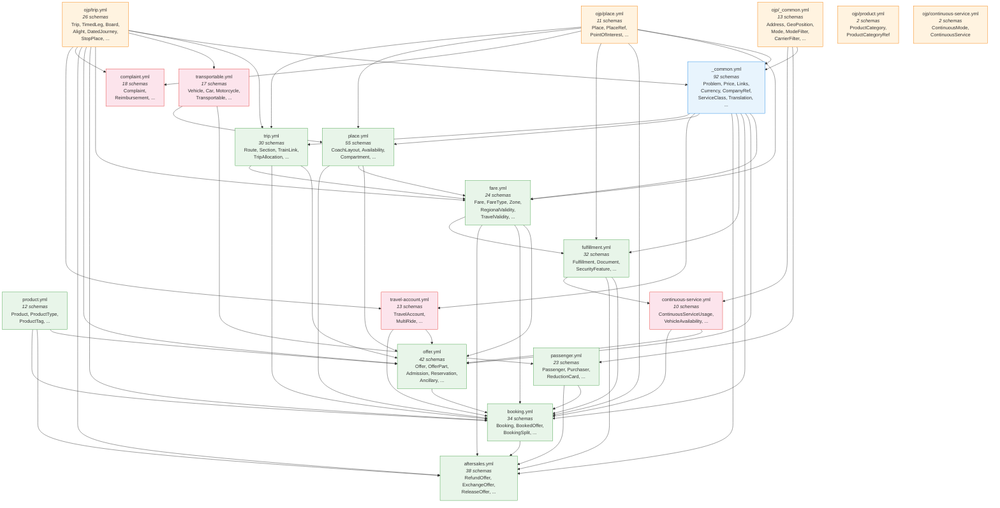

## 4. Class Diagram — Booking Lifecycle Entities

The core entities that flow through the booking lifecycle, showing key attributes
and relationships across packages.

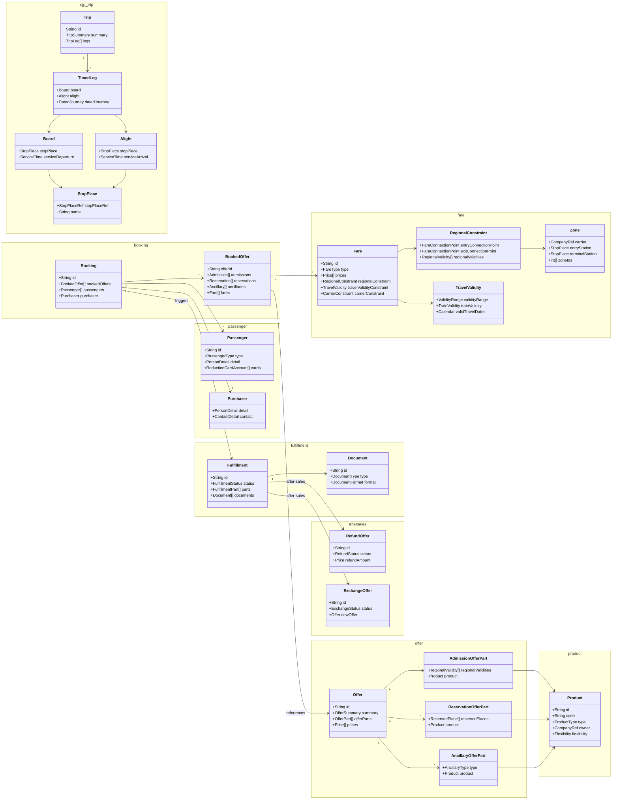

## 5. Class Diagram — OJP Schemas (Provided by Open Journey Planner)

Schemas under `schemas/ojp/` originate from the OJP standard and are used by OSDM
for trip planning, place resolution, and transport mode classification.

```mermaid
classDiagram
    direction TB

    namespace ojp_common {
        class GeoPosition {
            +Longitude longitude
            +Latitude latitude
        }
        class Address {
            +String street
            +String houseNumber
            +String postCode
            +String city
            +CountryCode country
        }
        class Mode {
            +PTMode ptMode
            +String submode
        }
        class ModeFilter {
            +Mode[] include
            +Mode[] exclude
        }
        class CarrierFilter {
            +CompanyRef[] include
            +CompanyRef[] exclude
        }
        class ServiceBrandFilter {
            +ServiceBrandCode[] include
            +ServiceBrandCode[] exclude
        }
        class IndividualMode {
            <<enumeration>>
            WALK
            CYCLE
            TAXI
            SELF_DRIVE_CAR
            OTHERS_DRIVE_CAR
        }
        class TransferMode {
            <<enumeration>>
            WALK
            PARK_AND_RIDE
            BIKE_AND_RIDE
            CAR_SHUTTLE_TRAIN
            PROTECTED_CONNECTION
            GUARANTEED_CONNECTION
            REMAIN_IN_VEHICLE
        }
    }

    namespace ojp_trip {
        class Trip {
            +String id
            +TripSummary summary
            +int transfers
            +TripLeg[] legs
        }
        class TripLeg {
            +int legId
            +TimedLeg timedLeg
            +TransferLeg transferLeg
            +ContinuousLeg continuousLeg
        }
        class TimedLeg {
            +Board board
            +Alight alight
            +DatedJourney datedJourney
            +Intermediate[] intermediates
        }
        class TransferLeg {
            +TransferMode transferMode
            +StopPlace start
            +StopPlace end
            +String duration
        }
        class DatedJourney {
            +JourneyRef journeyRef
            +OperatingDays operatingDays
            +Mode mode
            +String[] vehicleNumbers
        }
        class Board {
            +StopPlace stopPlace
            +ServiceTime serviceDeparture
        }
        class Alight {
            +StopPlace stopPlace
            +ServiceTime serviceArrival
        }
        class Intermediate {
            +StopPlace stopPlace
            +ServiceTime serviceArrival
            +ServiceTime serviceDeparture
        }
        class StopPlace {
            +StopPlaceRef stopPlaceRef
            +String name
            +GeoPosition geoPosition
        }
        class StopPlaceRef {
            +String stopPlaceRef
            +String providerCode
        }
        class TripSearchCriteria {
            +PlaceRef origin
            +PlaceRef destination
            +TripVia[] vias
            +ModeFilter modeFilter
        }
    }

    namespace ojp_place {
        class Place {
            +PlaceRef placeRef
            +String name
            +GeoPosition geoPosition
        }
        class PlaceRef {
            +StopPlaceRef stopPlaceRef
            +GeoPositionRef geoPositionRef
            +PointOfInterestRef pointOfInterestRef
            +AddressRef addressRef
        }
        class PointOfInterest {
            +String id
            +String name
            +GeoPosition geoPosition
            +PointOfInterestCategory category
        }
    }

    %% Relationships
    Trip "1" --> "*" TripLeg
    TripLeg --> TimedLeg
    TripLeg --> TransferLeg
    TimedLeg --> Board
    TimedLeg --> Alight
    TimedLeg --> DatedJourney
    TimedLeg "1" --> "*" Intermediate
    Board --> StopPlace
    Alight --> StopPlace
    Intermediate --> StopPlace
    StopPlace --> StopPlaceRef
    StopPlace --> GeoPosition
    DatedJourney --> Mode
    TransferLeg --> StopPlace
    TripSearchCriteria --> PlaceRef
    TripSearchCriteria --> ModeFilter
    ModeFilter --> Mode
    Place --> PlaceRef
    Place --> GeoPosition
    PlaceRef --> StopPlaceRef
    PlaceRef --> PointOfInterest
    PlaceRef --> Address
```

## 6. Class Diagram — Fare & Regional Validity

The fare domain models pricing rules, regional constraints, zones, and travel validity.

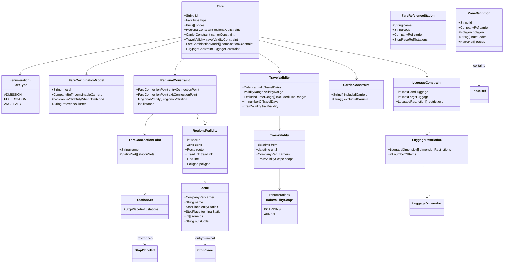

## 7. Class Diagram — Place & Seat Selection

The place domain handles coach layouts, seat availability, and graphical reservation.

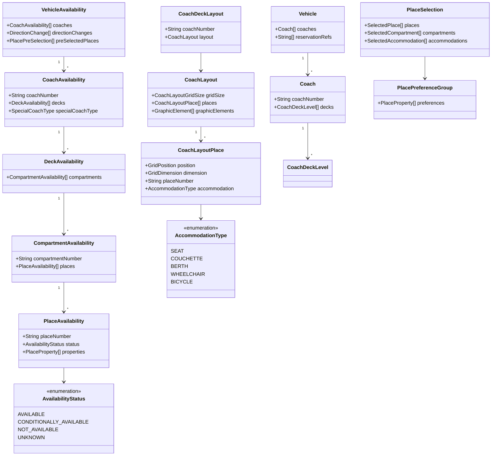

## 8. Class Diagram — After-Sales Operations

After-sales covers refunds, exchanges, releases, and fulfillment cancellations.

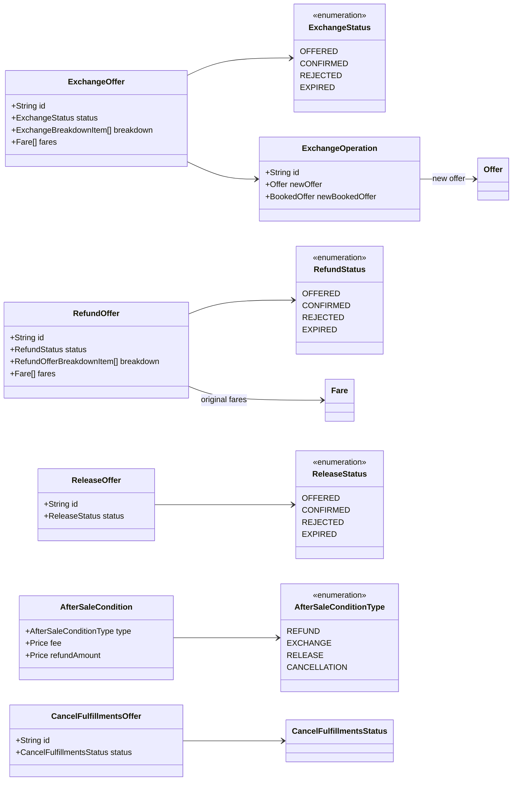

## 9. Sequence Diagram — Booking Lifecycle

The complete flow from trip search through fulfillment and after-sales.

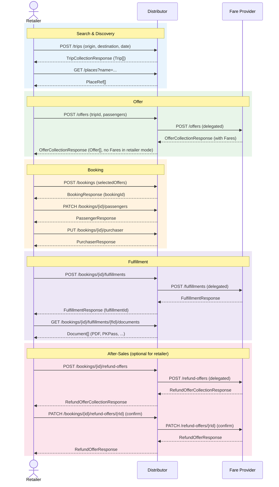

## 10. Component Diagram — Role-Based Packaging

Shows which packages each role (Fare Provider, Distributor, Retailer) requires.
Mandatory packages have solid borders, optional have dashed borders.

## 11. Fare / Product Separation

The original `product.yml` (38 schemas) mixed two distinct concerns:

- **Fare domain** — pricing rules, regional validity, zones, luggage constraints, travel validity
- **Product domain** — product catalog, search, tags, promotion codes

These were split into `fare.yml` (24 schemas) and `product.yml` (12 schemas):

| `fare.yml` | `product.yml` |
|---|---|
| Fare, FareType, FareCombinationModel | Product, ProductType, ProductSummary |
| FareConnectionPoint, FareConnectionPointRef | ProductSearch/Response/Collection |
| FareReferenceStation, StationSet | ProductTag, ProductTagGroup, ProductTagName |
| RegionalConstraint, RegionalValidity, RegionalValiditySummary | ProductTagsResponse |
| CarrierConstraint, ExclusionScope | PromotionCodeCollectionResponse |
| TravelValidity, TravelValidityRange | |
| TrainValidity, TrainValidityScope | |
| Zone, ZoneDefinition, ZoneCollectionResponse | |
| LuggageConstraint, LuggageDimension, LuggageDimensionEnum | |
| LuggageRestriction, LuggageRestrictionRuleEnum | |

**Rationale:** Fare schemas are referenced by offer, booking, aftersales, fulfillment, and travel-account — they form a distinct dependency cluster. Product schemas primarily serve the product catalog API. Separating them reduces cognitive load and aligns file boundaries with domain boundaries.

## 12. Packages per Role

The three OSDM roles — Fare Provider, Distributor, and Retailer — require different subsets of the modular packages. **"—"** means the package is architecturally outside the role's scope.

### Schema packages

| Package | Fare Provider | Distributor | Retailer |
|---|:---:|:---:|:---:|
| **Foundation** | | | |
| `_common.yml` | **mandatory** | **mandatory** | **mandatory** |
| `ojp/_common.yml` | **mandatory** | **mandatory** | **mandatory** |
| **Trip & Place** | | | |
| `ojp/trip.yml` | **mandatory** | **mandatory** | **mandatory** |
| `ojp/place.yml` | **mandatory** | **mandatory** | **mandatory** |
| `trip.yml` | optional | **mandatory** | **mandatory** |
| **Fare & Product** | | | |
| `fare.yml` | **mandatory** | **mandatory** | — |
| `product.yml` | **mandatory** | **mandatory** | **mandatory** |
| `ojp/product.yml` | optional | optional | optional |
| **Offer & Booking** | | | |
| `offer.yml` | **mandatory** | **mandatory** | **mandatory** |
| `booking.yml` | **mandatory** | **mandatory** | **mandatory** |
| `passenger.yml` | **mandatory** | **mandatory** | **mandatory** |
| **Fulfillment** | | | |
| `fulfillment.yml` | **mandatory** | **mandatory** | **mandatory** |
| **After-Sales** | | | |
| `aftersales.yml` | **mandatory** | **mandatory** | optional |
| `complaint.yml` | — | optional | optional |
| **Seat/Place Selection** | | | |
| `place.yml` | optional | optional | optional |
| **Extensions** | | | |
| `transportable.yml` | — | optional | optional |
| `travel-account.yml` | — | optional | optional |
| `continuous-service.yml` | — | optional | optional |
| `ojp/continuous-service.yml` | — | optional | optional |

### Path packages

| Package | Fare Provider | Distributor | Retailer |
|---|:---:|:---:|:---:|
| **Discovery** | | | |
| `versions.yml` | **mandatory** | **mandatory** | **mandatory** |
| `places.yml` | — | **mandatory** | **mandatory** |
| `trips.yml` | — | **mandatory** | **mandatory** |
| `products.yml` | **mandatory** | **mandatory** | optional |
| **Offer** | | | |
| `offers.yml` | **mandatory** | **mandatory** | **mandatory** |
| `on-hold.yml` | — | optional | optional |
| `availabilities.yml` | — | optional | optional |
| **Booking** | | | |
| `bookings.yml` | **mandatory** | **mandatory** | **mandatory** |
| `bookings-search.yml` | **mandatory** | **mandatory** | optional |
| `bookings-split.yml` | — | optional | — |
| `booked-offers.yml` | **mandatory** | **mandatory** | **mandatory** |
| `booking-parts.yml` | **mandatory** | **mandatory** | **mandatory** |
| `passengers.yml` | **mandatory** | **mandatory** | **mandatory** |
| `purchaser.yml` | **mandatory** | **mandatory** | **mandatory** |
| **Fulfillment** | | | |
| `fulfillments.yml` | **mandatory** | **mandatory** | **mandatory** |
| `documents.yml` | **mandatory** | **mandatory** | **mandatory** |
| **After-Sales** | | | |
| `refund.yml` | **mandatory** | **mandatory** | optional |
| `exchange.yml` | **mandatory** | **mandatory** | optional |
| `release.yml` | **mandatory** | **mandatory** | optional |
| `cancel-fulfillments.yml` | **mandatory** | **mandatory** | optional |
| `complaints.yml` | — | optional | optional |
| `reimbursements.yml` | — | optional | optional |
| **Extensions** | | | |
| `master-data.yml` | — | optional | optional |
| `travel-accounts.yml` | — | optional | optional |

### Rationale

- **Fare Provider** must support the full booking lifecycle (offer → book → fulfill → after-sales) for its own fares when a distributor delegates operations. Complaint handling and transport details remain outside its scope.
- **Distributor** implements the full API as a server. All core lifecycle packages are mandatory. Place selection, transport, travel accounts, and complaints are value-adds.
- **Retailer** consumes the API as a client. The core flow (search → offer → book → fulfill) is mandatory. After-sales is optional — some retailers route refund/exchange back through the distributor's own UI. Fares are not applicable (distributor-mode concept).

## 13. Booking Lifecycle — Paths Mapping

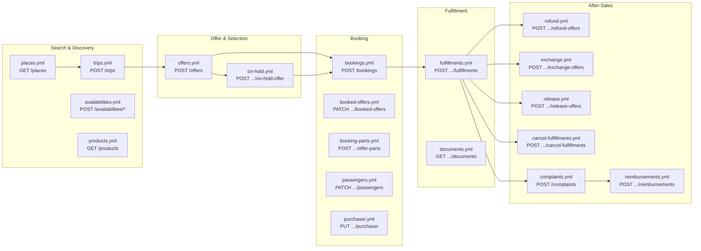

## 14. Build Pipeline

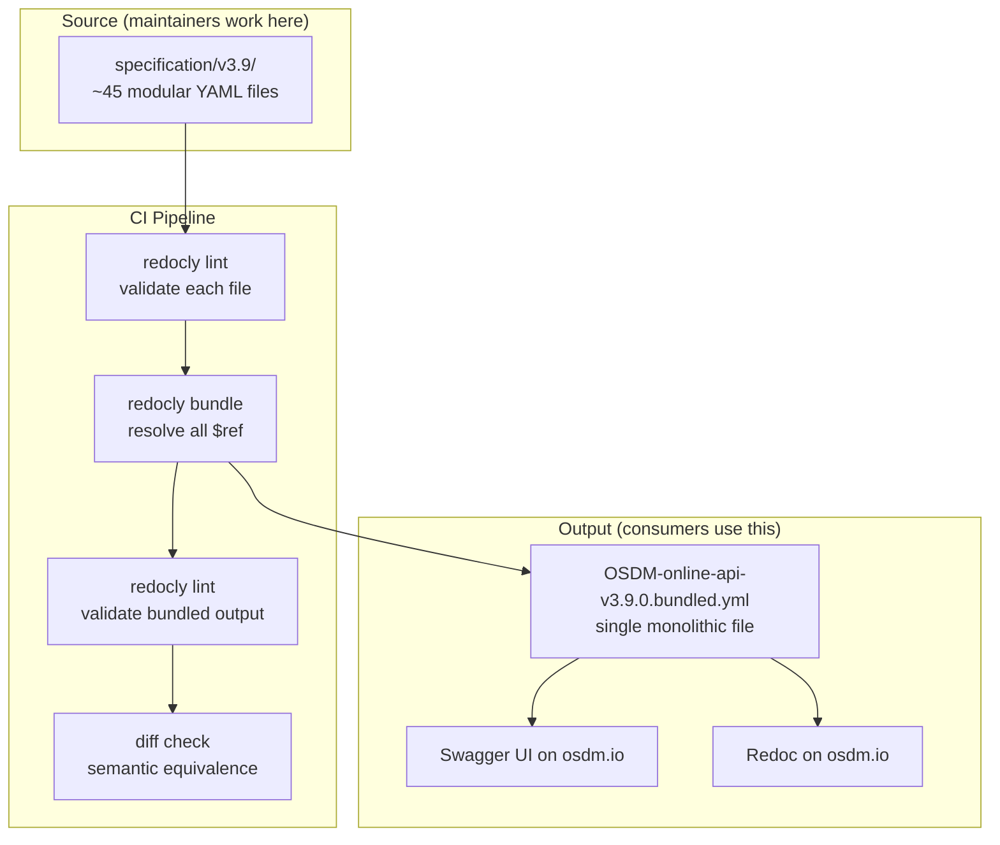

## 15. Schema Size Distribution

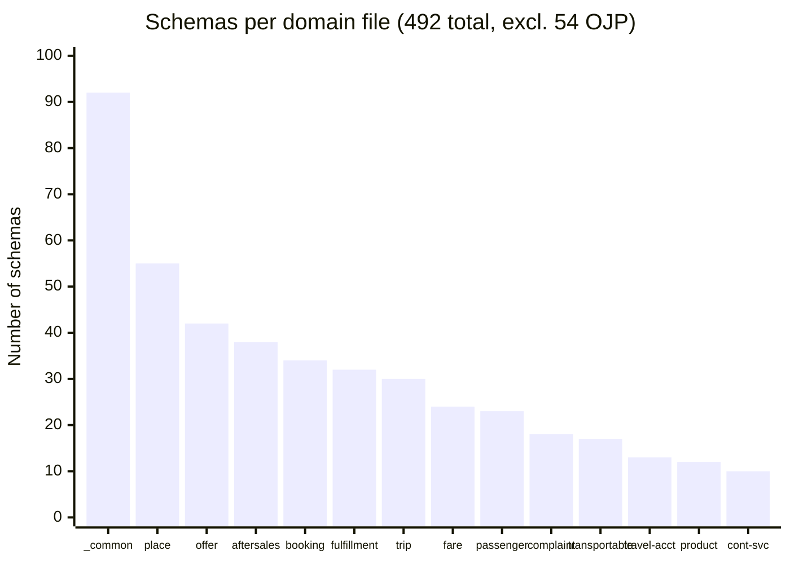

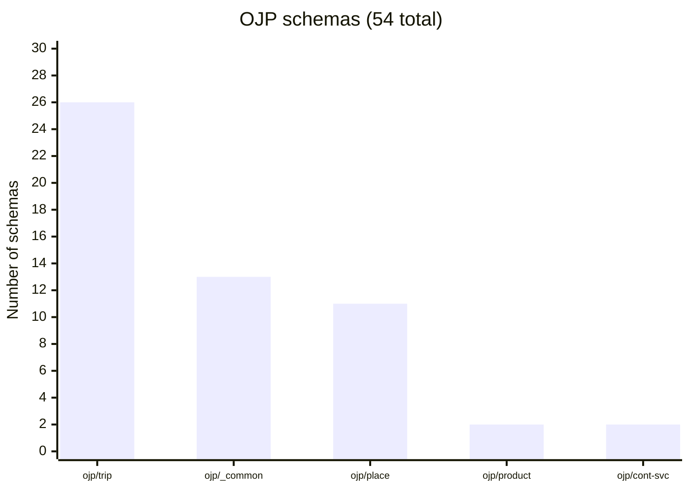
