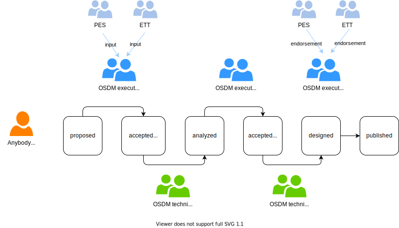

## Evolution Process

As customer and business **needs change**, the specification needs to evolve
continuously. To address the need for improvement the project has been setup in
an **agile manner**.

### Basic Concepts

A specification as a **product** which is managed as follows:

- We have a backlog of improvements where everybody can contribute.

- An improvement addresses a need and solves a problem, thus producing
  **value**.

- The **Sales Progress Group (SPG) Working group (NRT/IRT/NT groups)**
  identifies the business needs on behalf of the railway undertakings. The
  business representatives prepare the new requirements with Chairs of OSDM
  technical Working group. The output is a functional specification document to
  be examined by the **Personal Expert Subgroup (PES)** (input). On the side the
  distributors' side, the business needs are identified by **Eu Travel Tech
  (ETT)** representatives.

- The **OSDM executive committee** (Chair:
  [Marc Guigon](https://www.linkedin.com/in/marcguigon/) &
  [Vittorio Carta](https://www.linkedin.com/in/vittorio-carta-mba-0b90b728/))
  prioritizes the backlog based on the value for the **railway customer** and
  the **railway sector** as a whole. The committee is a **fair representation**
  of the parties involved, thus railways and distributors and others.

- The **OSDM technical working group** (Chair:
  [Clemens Gantert](https://www.linkedin.com/in/clemens-g-88783725/) &
  [Andreas Schlapbach](https://www.linkedin.com/in/andreas-schlapbach-09b095ab/))
  designs and implements improvements to the standard. Thus, it is responsible
  to translate the functional specification identified by the SPG/PES and ETT
  into a document of technical specification. To stay focused, the work in
  progress should not be larger than seven items. The working group takes
  special care not to break existing implementations, thus **securing
  investments** made by all the parties.

- The **PES** endorses the functional and technical specifications prepared by
  the OSDM Technical WG, preparing the agenda of the OSDM executive committee.
  Similarly, **ETT** endorses the improvements prepared.

Illustration of the concepts:

### Structure of an Improvement

An improvement is structured similar to an
[epic](https://www.scaledagileframework.com/epic/) in the
[SAFe](https://www.scaledagileframework.com/) framework as follows:

- **Name**: Short name for the improvement

- **Owner**: Name of the owner

- **Description** "For _customers_ who _do something_ the _solution_ is a
  _improvement_ that _provides this value_ unlike _current solution or
  non-existing solution_ our solution _does something better_."

- **Business Value**: The business value which is generated after the
  improvement has been implemented (low/middle/high).

- **Business Outcomes**: The measurable benefits that the business can
  anticipate if the epic hypothesis is proven to be correct.

- **Leading Indicators**: The early measures that will help predict the business
  outcome hypothesis.

- **Non-functional Requirements**: If a business requirement has critical
  non-functional constraints they should be noted here.

- **Specification Effort**: An assessment of the effort to specify the
  improvement (_EXTRA_SMALL_, _SMALL_, _MEDIUM_, _LARGE_, _EXTRA_LARGE_).

### State of an Improvement

An improvement takes the following steps:

- An improvement is in the initial state **proposed**.
- The steering board then decides which improvements to analyze based on their
  business value → state **accepted for analysis**.
- The technical experts then analyses the improvement and determine its
  complexity (low/middle/high). After their work the improvement is in state
  **analyzed**.
- The steering board decides which improvements are to be implemented based on a
  **transparent** prioritization model (e.g. Weighted Shortest Job First) →
  state **accepted for design**.
- The technical experts then design the solution, thus the API, the
  documentation and the test sets. After their work the improvement is in state
  **designed**.
- The steering board releases **major, i.e. breaking changes** → the improvement
  is **published**.

## Working Mode

The technical working group meets online every Friday from 9:00 to 11:00.
Participation is open to everybody and highly encouraged. If you wish to join,
please contact
[Schlapbach Andreas](https://www.linkedin.com/in/andreas-schlapbach-09b095ab/).

The meeting minutes as well as future improvements are documented in the
[GitHub Wiki](https://github.com/UnionInternationalCheminsdeFer/OSDM/wiki).

## Road Map

The specification, i.e., the product is improved in fixed-length time boxes
similar to a
[program increment](https://www.scaledagileframework.com/program-increment/) in
the [SAFe](https://www.scaledagileframework.com/) framework.

The following increments are planned:

| Product Increment |  End Date  | State                                                                                                   |
| ----------------- | :--------: | ------------------------------------------------------------------------------------------------------- |
| `PI-0`            | 17.12.2020 | _delivered with OSDM v.1.0_                                                                             |
| `PI-1`            | 11.02.2021 | _delivered with OSDM v.1.1_                                                                             |
| `PI-2`            | 24.06.2021 | _delivered with OSDM v.1.2_, see [Release Notes 1.2](https://osdm.io/releases/OSDM-release-notes-v1.2/) |
| `PI-3`            | 28.10.2021 | _delivered with OSDM v.1.3_, see [Release Notes 1.3](https://osdm.io/releases/OSDM-release-notes-v1.3/) |
| `PI-4`            | 14.02.2022 | _delivered with OSDM v.1.4_, see [Release Notes 1.4](https://osdm.io/releases/OSDM-release-notes-v1.4/) |
| `PI-5`            | 24.06.2022 | merged into V.2.0                                                                                       |
| `PI-6`            | 28.10.2022 | _delivered with OSDM v.2.0_ see [Release Notes 2.0](https://osdm.io/releases/OSDM-release-notes-v2.0/)  |
| `PI-7`            | 09.02.2023 | _scope_, specification work on going                                                                    |
