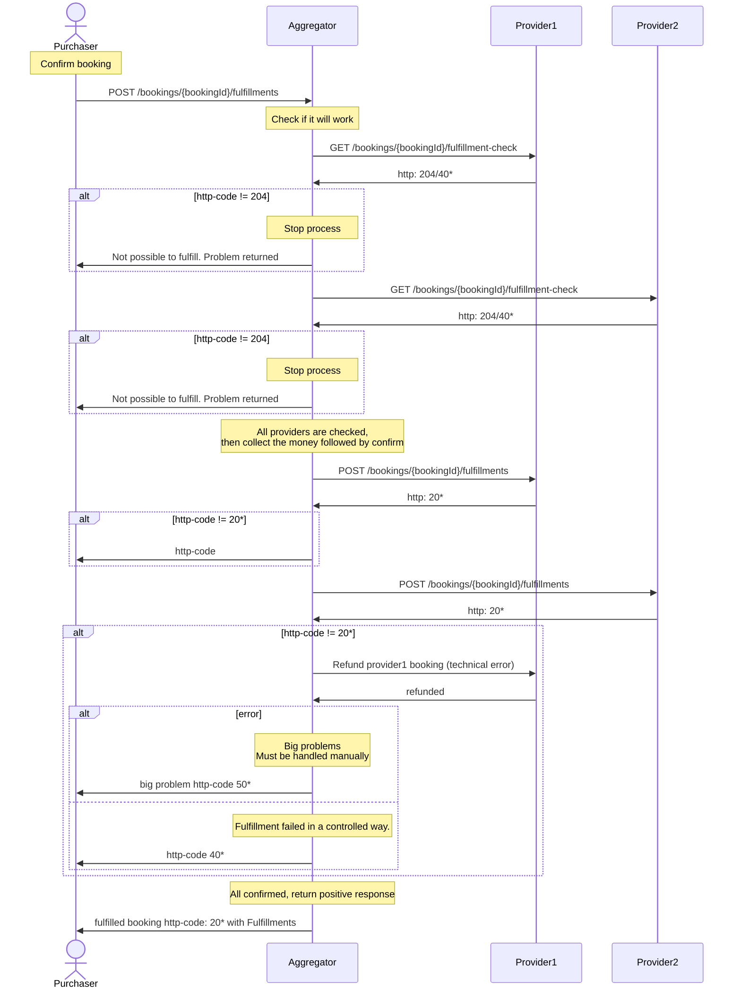

# Two phase commit
This feature is intended for aggregators and distributors to build robust integrations for trips operated by multiple provider systems.
In a distributed environment, it is impossible to be 100% bulletproof.

OSDM introduces a validatin/check step for the most critical operations.
The idea is that the aggregator runs the check step for each involved provider system before performing the final confirmation.
This represents a reasonable level of effort for providers and will significantly reduce the amount of manual work required in case of errors.

New Endpoints
Two new endpoints are introduced:
* `GET /bookings/{bookingId}/fulfillment-check`
* `GET /bookings/{bookingId}/refund-offers/{refundOfferId}/confirmation-check`

The exchange is confirmed with `POST /fulfillments`.
`GET /bookings/{bookingId}/fulfillment-check` can be used beforehand to validate the booking.

Ideally, the same code is executed on the provider side for both the check and commit steps (except the actual commit).
While this might not be fully achievable for every provider, all validations must at least be performed during the check step.
There is still a small risk that issues may occur between the check step and the actual commit a few milliseconds later.

The endpoints are not mandatory for provider systems, but aggregators will likely request them when integrating a provider into an ecosystem with multiple provider systems.

## Response Structure
* **HTTP 204** – Empty respons (successful check)
* **HTTP 400** – Problems returned a ProblemDetail with array of pointers detailed failed checks:
```
{
  "code": "urn:uic:problem:CONFIRMATION_CHECK_FAILED",
  "type": "https://osdm.io/errors/confirmation-check-failed",
  "title": "Confirmation check failed",
  "status": 400,
  "detail": "Confirmation check failed for Fulfillments",
  "instance": "string",
  "pointers": [
    {
      "code": "string",
      "type": "https://example.com/probs/passenger-email-address-missing",
      "title": "Validation error",
      "status": 400,
      "detail": "Passenger email address is missing",
      "instance": "string",
      "responsePointer": "#/booking/passenger[4]"
    }
  ]
}
```

## Advantages:
- Ping mechanism. Aggregator knows that **all** involved provider systems are up and running
- Aggregator now that all needed information is in the provider bookings and it is ready to be confirmed.

## Sequence diagrm
This sequence diagram describe the two phase commit secuence at fulfillment. Same approach can be used for refund and exchange.


