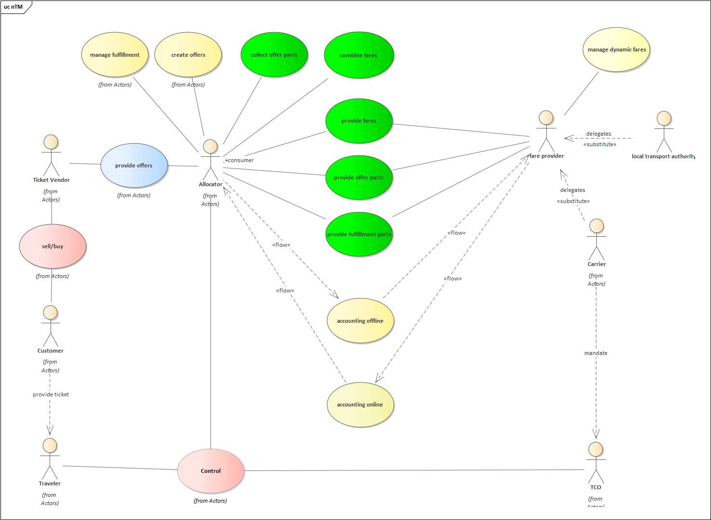

*Note: to be released with version 1.1*

## Actors / Business Capabilities

Actors are defined according to the UML specification. An Actor models a type of role played by an entity that interacts with the subject (e.g., by exchanging signals and data), but which is external to the subject.

Actors may represent roles played by human users, external hardware, or other subjects.

Note that **an actor does not necessarily represent a specific entity but merely a facet (i.e., “role”) of some entity** that is relevant to the specification of its associated use cases. Thus, a single instance may play the role of several different actors and, conversely, a given actor may be played by multiple different instances.

The following diagram shows the actors and principal use cases involved in rail distribution and control. The principal use case relevant for this specification is marked in yellow.

### Actors in OSDM

| **Actor**   | **Description** | Motivation / Distinction to other roles |
|-------------|-----------------|-----------------------------------------|
| Allocator   | The **allocator** manages the lifecycle of a product sold (the travel contract). He therefore needs to establish information exchange with the ticket **vendor**, **carriers** and **TCOs** involved. The **allocator** makes products available to the **ticket vendor**. The allocator could provide direct services to the **passenger** to modify the ticket status (e.g. activate / check in on a ticket). The allocator combines fares defined by the carriers according to their rules.The allocator creates the ticket fulfillment data (e.g. pdf, pkpass, ...). *Note*: To avoid confusion due to usage differences (see the CIT term bank as well as the European TAP-TSI regulation), the terms “Issuer” and “Attributor” have been avoided in this IRS. | The allocator is introduced to separate the role of just selling tickets along a route (Ticket Vendor) from the role of creating the ticket content and providing it to vendors for sale.
| Carrier     | The **carrier** is the owner of the fare. He provides the transport service to the **traveller himself or via a substitute carrier**. The travel contract provided to the customer establishes a contract between the traveller and each carrier participating in the service. Carriers include Railway undertaking, Bus companies, Maritime companies. |
| Customer    | The **customer** purchases a travel contract for one or more traveller. *Note*: **The customer** is entitled to receive refund payments.
| Distributor | The **distributor** is the company selling the ticket provided and managed by the allocator to the customer. | Alias: **Ticket Vendor**
| Fare Provider | The **fare provider** manages fares on behalf of a carrier or a local transport authority.
| Local Transport Authority | The **local transport authority** organizes the local traffic within an area a behalf of the government or is itself a governmental organization. It defines a fare structure for the local transport which all carriers included must apply.
| Passenger   | The **passenger** is the person who travels using a travel contract. | The passenger and the customer can be to distinct person, e.g., if a mom buys a ticket for her daughter.
| Ticket Controller | Ticket checking machines, e.g. gates are also part of a ticket controller are also part of a **ticket controlling organization**. | Alias: **Train Agent**
| Ticket Vendor | The **ticket vendor** is the company selling the ticket provided and managed by the allocator to the customer. The ticket vendor does not combine fare into one ticket. | Alias: **Distributor** |
| Train agent | A **train agent** controls whether the passenger has a valid travel contract. The train agent is part of a **ticket controlling organization**. | Alias: **Ticket Controller** |

## Common Business Capabilities

### Powerful Fare Combination

It must be possible to combine fare according to existing fare
combinations (e.g. NRT-style PRIFIS) as well as new fare combination
models.

### Simple Distribution

It must be easily possible to distribute existing and new products.
Easily possible means two things: Firstly, for a customer it must be
easily possible to find and book and – if needed – refund a booking.
Secondly, for the rail sector as a whole the complexity of distribution
must be reduced to save costs both for development as well as
distribution.

## Business Capabilities for Distribution

### Lookup Location

In order to uniquely identify a place of origin and destination a
service to look up the unique code is needed. For railway stations this
code is the UIC station code.

### Search Trips

A service to lookup possible trips from origin to destination is needed,
especially as the most attractive offers are bound to trip.

### Find Offers

For a given trip possible offers spanning the complete trip need to be
calculated to the customer. An offer has an overall flexibility, an
overall comfort class and a minimal price. An offer consists of
admissions, reservations or ancillaries. Reservations or ancillaries can
be included, optional or mandatory.

The overall offer should be “homogenous”, i.e. consisting of offers of
the same service class. For the Italian market, non-homogenous offers
need to be supported.

**Scope**: Only trip-based offer search is defined in this version of
the specification.

**Scope:** The offer must span the complete trip in this version of the
specification.

### Pre-book Offers

If a customer puts an offer into a basket on a distributor channel, it
most be possible to retain this offer for a given time using a prebook
service. In our design this service creates a booking in the created in
the status “pre-booked”. If the pre-booked booking is not booked after a
given time limit it well be freed which also includes freeing all
eventual reservations on inventories.

### Book pre-booked Booking

After the booking has been paid by the customer, he or she owns the
booking and the booking is changed to “booked” by a booking service.

### Fulfill Booking

After the booking process the customer needs a set of documents to
travel and to prove to a ticket control organization that he or she is
eligible to travel. Therefore, a service to fulfill a booking in given
form, e.g. a ticket is needed. Internally, the state of the booking is
changed to “fulfilled”.

**Scope**: Only support for UIC PDF is mandatory in this version of the
specification.

### Get Booking

To get the booking of a customer a service is needed. Specially care
needs to be taken into account that privacy regulations are respected.

### Refund Booking

If a customer wants to refund a booking a service to refund a booking is
needed. The service calculates a refund offer including fees and amount
returned which is offered to the customer. If he or she accepts the
refund offer the refund offer can be booked. Special refund reasons need
to exist, which affect fees and amount returned. Especially, if an agent
or a machine makes a mistake a refund reason is needed to refund a
booking with no penalties.

By design, the refund process is modelled similarly to the offer/booking
process.

**Scope**: Only support for total refund is mandatory in this version of
the specification.

### Exchange Booking

If a customer wants to exchange a booking a service to exchange is
needed. Conceptually it takes the existing booking and a new trip and
calculates an exchange-offer. This exchange-offer can be booked and
fulfilled similarly to refund-offer.

**Scope:** This capability is optional to support in this version of the
specification.

### Graphical Seat Reservation

In order to display the layout of a train to a customer a service to
access coach layout data and availability pf places is needed.

**Scope**: This capability is optional to support in this version of the
specification.

### Edit Passenger Information

To add or in special cases edit passenger information a service is
provided. This service is explicitly designed to be fully complaint to
GDPR regulation.

### Retrieve Product Information

A service to access the attributes of a product such as detailed sales
and after-sales is needed.

### Retrieve Stored Personal Data

A customer can request information on the stored personal data. This
includes also information on personal data passed on to allocators. The
booking data can be used to show the stored personal data.

## Business Capabilities for Fare Allocation

### Combine Fares

The allocator combines fares from different carriers into one offer. The
rules on how to combine fares are part of the fare data.

### Service Resource Location  (Locate Dynamic Fares)

Dynamic fares must be requested online. The allocator needs to find the
online resource where to request the offer and book. The fare data
provide information on how to find the online service.

### Provide Bulk Fare Data

The carrier provides bulk data on his static fares and additional data
for locating online services to the allocators.

### Provide Dynamic Fare

The carrier provides an online service to retrieve dynamic fares.

### Book Offer

The carrier provides online services to book fares and cancel or
exchange fares. These can be either as defined in the specification
herein or via the interface defined in IRS 90918-1.

### Fulfillment

All necessary information for an allocator to build a valid a ticket
including necessary attributes and control elements most be included by
the fare provider.

### Reservation

Reservation has been included in the online services and the inventory
resolution data for fare or reservation are included in the bulk data
(see FareResourceLocation).

#### Option/Step 1: Using 90918-1 messages for reservation

1. offer (90918-10 REST service) à parameters for 90918-1 soap services are delivered
2. reservation as-if (90918-1 soap service) / graphical place display (90918-1 soap service)
3. reservation (90918-1 soap service) / specific place reservation (90918-1 soap service)
4. pre-booking NRT (90918-10 REST service)
5. confirm booking NRT (90918-10 REST service)

#### Option/Step 2: Using REST services 90918-10 for all services

1. offer (90918-10 REST service)
2. checkPreferences (90918-10 REST service) / graphical place display (90918-10 REST service)
3. pre-booking NRT / reservation (90918-10 REST service)
4. confirm booking of reservation / NRT (90918-10 REST service)

### Get Booking

To get the booking of a customer a service is needed. Specially care
needs to be taken into account that privacy regulations are respected.

### Refund Booking

If a customer wants to refund a booking a service to refund a booking is
needed. The service calculates a refund offer including fees and amount
returned which is offered to the customer. If he or she accepts the
refund offer the refund offer can be booked. Special refund reasons need
to exist, which affect fees and amount returned. Especially, if an agent
or a machine makes a mistake a refund reason is needed to refund a
booking with no penalties.

By design, the refund process is modelled similarly to the offer/booking
process.

**Scope**: Only support for total refund is mandatory in this version of
the specification.

### Exchange booking

If a customer wants to exchange a booking a service to exchange is
needed. Conceptually it takes the existing booking and a new trip and
calculates an exchange-offer. This exchange-offer can be booked and
fulfilled similarly to refund-offer.

**Scope:** This capability is optional to support in this version of the
specification.

### Accounting

The specification of the accounting data is not part of this document,
however some on the fare content defined in this specification must be
included in the accounting data.

The accounting data of a booking should include:

- The identification of the entire ticket sold (unique id within the
  context of the allocator for at least 2 years)

- The booking id provided by the carriers in case of online fares (unique
  id within the context of the carrier for at least 2 years)

- The identification of each fare included in the ticket (unique id e.g. UUID)

- The identification of individual tickets of the allocator (unique id within
  the context of the allocator for at least 2 years)

- The identification of individual tickets of the carriers (unique id within
  the context of the carrier for at least 2 years)

- The price for each fare and carrier included in the ticket

- The VAT does not need to be included in the accounting data (to be verified in RCF-1)

When using the existing 301 data file structure the ids cannot be
included. Until the accounting data structures have not been extended
the following intermediate solution is included:

For NRT fares distributed in the bulk data exchange:

A legacy accounting identifier is included in the fare element:

- `seriesId`: the last five digits of the index of a regionalValidity
  within the list of regional validities

- `addId`: the remaining digits of the index of a regionalValidity
  within the list of regional validities (max. 2 digits)

- `tariffId`: the index of the fare Element in a list of all fare
  elements referencing the same regionalValidity

Thereby it is possible to identify the fare element uniquely in the
context of a fare data delivery.

Accounting data flow:

- In case of NRT fares used from a bulk data exchange:

The allocator is responsible for the accounting. The data structure for
NRT is used.

- In case of fares (IRT or NRT) used with an online booking service:

The carrier is responsible for the accounting. The data structure for
IRT is used.

- In case of fares (IRT or NRT) used with an online booking service
  but with carrier fees defined by the allocator:

The carrier is responsible for the accounting. The data structure for
IRT is used. The allocator will inform the carrier on the applied fees
in the cancellation confirmation.

### Graphical seat reservation

In order to display the layout of a train to a customer a service to
access coach layout data and availability pf places is needed.

**Scope**: This capability is optional to support in this version of the
specification.

### Edit passenger information

To add or in special cases edit passenger information a service is
provided. This service is explicitly designed to be fully complaint to
GDPR regulation.

### Retrieve stored personal data

A customer can request information on the stored personal data. This
includes also information on personal data passed on to fare providers /
carriers. The booking data can be used to show the stored personal data.
