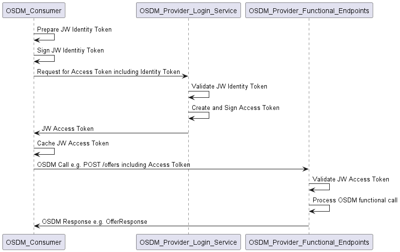
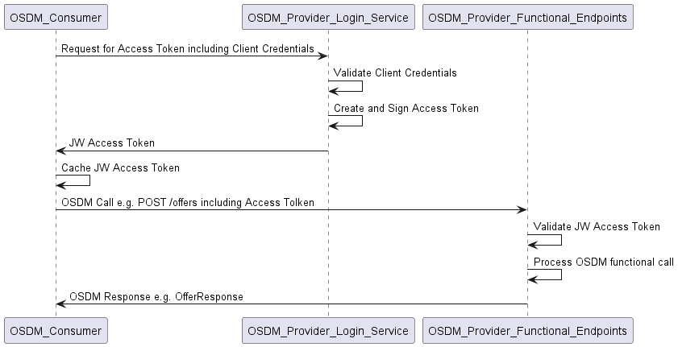

## Table of contents

1. [Introduction](#introduction)
2. [Using JWTs for client authentication](#jwts)
2.1 [Flow using JWTs](#flow_jwt)
2.2 [JW identity token](#jw_identity_token)
2.3 [Request for an access token using JWTs](#request_for_access_token_jwt)
2.4 [Validation of identity token](#validation_of_identity_token)
2.5 [Configuration for identity JWTs](#configuration_jwt)
2.6 [Examples](#examples)
3. [Using client credentials for access token request](#client_credentials)
3.1 [Flow using client credentials](#flow_client_credentials)
3.2 [Request for an access token using a client secret](#request_for_access_token_with_client_credentials)
3.3 [Validation of client credentials](#validation_of_client_credentials)
3.4 [Configuration of client credentials](#configuration_client_credentials)
3.5 [Example request using client credentials](#example_request_client_credentials)

## Introduction <a name="introduction">

The general requirement of the OSDM standard to use OAuth2 for authentication and authorization by means of JW tokens (JWTs) should be implemented in one of two consistent methods. Either by

- **Using JWTs for Client Authentication** according to [RFC-7523 Section 2.2](https://datatracker.ietf.org/doc/html/rfc7523#section-2.2), (recommended) or by
- **Using Client Credentials for Access Token Request** according to [RFC.6749 Section 4.4.2](https://datatracker.ietf.org/doc/html/rfc6749#section-4.4.2)

The following RFC documents apply:

 1. [RFC-7519](https://datatracker.ietf.org/doc/rfc7519/) which explains what a JWT token is;
 2. [RFC-6749 Section 3.2](https://datatracker.ietf.org/doc/html/rfc6749#section-3.2) which defines OAuth2 and the token endpoint involved in the creation of tokens;
 3. [RFC-6749 Section 4.4.2](https://datatracker.ietf.org/doc/html/rfc6749#section-4.4.2) which defines the use of client credentials to obtain an access token;
 4. [RFC-7521](https://datatracker.ietf.org/doc/rfc7521/) laying the groundwork for cryptographic client assertions;
 5. [RFC-7523 Section 2.2](https://datatracker.ietf.org/doc/html/rfc7523#section-2.2) which describes how to properly secure the token endpoint with modern cryptography, thus not relying on static secrets;
 6. [RFC-8725](https://datatracker.ietf.org/doc/rfc8725/) which gives guidance on securely validating and using JWTs.

This document defines the two variants of flows to be used. It also defines the parameters used, which must be agreed and exchanged bilaterally between the parties involved.

## Using JWTs for client authentication <a name="jwts">

This flow uses a **client authentication assertion** in the form of a **JW identity token** (`private_key_jwt` in terms of OpenID Connect (OIDC)), which is cryptographically signed by the client (OSDM consumer) and can be verified by the server (OSDM provider). It is the recommended 

The OSDM provider then issues a **JW access token** which can in turn be used by the OSDM consumer to prove their access rights to the OSDM endpoints by providing the JW access token in the Authenticate header of the OSDM endpoint invocation.

This method makes it unnecessary to exchange actual client secrets between the consumers and providers of the service and relies on asymmetric cryptography, i.e., the use of private/public keys for signing such requests.

### Flow using JWTs <a name="flow_jwt">

The general flow between consumer and provider looks like this:



In this flow, the following services are defined:

- The **OSDM Consumer** is the engine trying to issue OSDM "functional" calls, e.g., do a `POST /offers`
- The **OSDM Provider Login Service** is the service which controls the authentication of the OSDM Consumer by issuing JW access tokens
- The **OSDM Provider Functional Endpoints** implement the actual business logic of the OSDM Provider. Calls to these endpoints need to be authorized by providing the appropriate JW access tokens.

### JW identity token <a name="jw_identity_token">

A JW token (JWT) consists of three parts which are separated by dots ("."):

- The JWT header
- The JWT payload
- The JWT signature

Each part is separately encoded using Base64URL encoding. The encoded header and payload fields together are signed using the agreed-upon algorithm (which is also specified within the header), then the signature is added to the end of the token. Thus a complete JW token has the form `<JWT Header>.<JWT Payload>.<Signature>`, where each part is separately Base64Url encoded.

Header and Payload of the JW token are encoded as JSON structures. Their content is defined in the following sections.

#### JW identity token header <a name="jw_identity_token_header">

The identity token contains the following header fields. Where some fields are optional according to the relevant RFC, we still consider them mandatory for the purposes of usage within the OSDM standard.

| Attribute | RFC requirement | OSDM requirement | Description                               | Recommended value                                                  |
| --------- | --------------- | ---------------- | ----------------------------------------- | ------------------------------------------------------------------ |
| alg       | REQUIRED        | MANDATORY        | Algorithm used for signing this token     | to be agreed between parties, use at least RS256                   |
| kid       | OPTIONAL        | MANDATORY        | Id of the key used for signing this token | defined by OSDM consumer. Should be provided to the OSDM provider. |
| typ       | REQUIRED        | MANDATORY        | Type of the token                         | fixed value "JWT"                                                  |

#### JW identity token payload <a name="jw_identity_token_payload">

| Attribute | RFC requirement | OSDM requirement | Description                               | Recommended value                                                  |
| --------- | --------------- | ---------------- | ----------------------------------------- | ------------------------------------------------------------------ |
| iss       | REQUIRED        | MANDATORY        | Issuer of the identity token              | defined by the OSDM provider (client id)                           |
| sub       | REQUIRED        | MANDATORY        | Identity of the client                    | defined by the OSDM provider (client id)                           |
| aud       | REQUIRED        | MANDATORY        | URL login service endpoint                | defined by the OSDM provider                                       |
| exp       | REQUIRED        | MANDATORY        | Timestamp when this request expires       | current time + grace period of at least 2 minutes (120 seconds)    |
| scope     | OPTIONAL        | MANDATORY        | Usage of the token                        | fixed value "uic_osdm"                                             |
| nbf       | OPTIONAL        | OPTIONAL         | Timestamp when request begins to be valid | current time - grace period of at least 2 minutes (120 seconds)    |
| iat       | OPTIONAL        | OPTIONAL         | Timestamp of the creation of the token    | current time                                                       |
| jti       | OPTIONAL        | MANDATORY        | Unique ID of the token to prevent replays | newly generated UUID                                               |

Note: All timestamps are in "Unix epoch", which is defined as the number of seconds since 1st January, 1970 UTC.

#### JW identity token signature <a name="jw_identity_token_signature">

The signature is obtained by creating the string `<JWT Header Base64URL encoded>.<JWT Payload Base64URL encoded>`, and signing this string with the private key of the OSDM consumer using the algorithm specified in the JWT header field "alg". The signature is then also Base64URL encoded and added to the token.

### Request for an access token using JWTs <a name="request_for_access_token_jwt">

To obtain the actual JW access token required to authenticate the functional OSDM requests, a token request message needs to be issued to the OSDM provider's login service. This has the following attributes:

- `grant_type=client_credentials`
- `client_assertion_type=urn:ietf:params:oauth:client-assertion-type:jwt-bearer`
- `client_assertion=<JWT>`
- `scope=uic_osdm`

The `<JWT>` means the JW identity token which has been described above.

The provider should set the **expires_in** attribute of the response, so that the consumer does not need to parse the token content.

Consumers should cache the access token in order to avoid overloading the provider's login server, using the value from the expires_in attribute to invalidate cache entries.

### Validation of identity token <a name="validation_of_identity_token">

The provider's login service should take certain steps in order to validate the identity token received from the consumer before it issues the access token. The most important include:

- Check the signing algorithm against a whitelist of allowed algorithms or against a pinned value for the consumer, to mitigate these attacks:
  - A third party (attacker) sends an identity token with alg: none, disabling signature verification and allowing token forgery.
  - A third party (attacker) sends an identity token with alg set to a symmetric algorithm, but kid set to an asymmetric key. This allows token forgery if the public key is known
- Check that sub, iss, kid and the public key match (note: the provider should store this data), to mitigate this attack:
  - Consumer signs an identity token for another consumer's username with their own key
- Check the signature of the token against the public key of the requestor, to mitigate this attack:
  - A third party (attacker) tries to request an access token without knowledge of the secret key, but tries anyway
- Retire old kid/public key pairs shortly after key rollover, to mitigate this attack:
  - A third party (attacker) uses an old, leaked private key to impersonate a valid consumer
- Store the value in the jti field for at least the time specified in the exp field. Do not respond to requests with a jti field contents that match a stored value, to mitigate this attack:
  - A third party (attacker) replays a valid signing request to obtain an access token

Additionally, implementers should consult [RFC 8725](https://datatracker.ietf.org/doc/html/rfc8725) for guidance on securely validating and using JWTs, both in the login service and in the functional endpoints.

### Configuration for identity JWTs <a name="configuration_jwt">

Some configuration parameters need to be agreed upon bilaterally between the partners. They are listed in the following table.

| Parameter                            | Usage                                                       | Explanation                                                | Parameter flow |
| ------------------------------------ | ----------------------------------------------------------- | ---------------------------------------------------------- | ------------------------------------------------------------ |
| Signing algorithm                    | JW identity token, header field 'alg'                       | Algorithm used for signing the JW identity token           | Mutually agreed between provider and consumer                |
| Signing key ID                       | JW identity token, header field 'kid'                       | Key used for signing the JW identity token                 | Defined by consumer                                          |
| Issuer of JW identity token          | JW identity token, payload field 'iss'                      | Identity of the client within the provider's system        | Defined by provider                                          |
| Subject of the access token request  | JW identity token, payload field 'sub'                      | Identity of the client within the provider's system        | Defined by provider                                          |
| Audience of the access token request | JW identity token, payload field 'aud'                      | URL of the login service                                   | Defined by provider                                          |
| Public key                           | Validation of signature within the provider's login service | Public key used for validating signature of identity token | Defined by consumer, part of the public/private key pair     |

When the signing key pair is **rotated** (which should happen on a regular basis), the consumer needs to provide the new signing key ID and the new public key to the provider, and the provider 
should - for a limited time - accept either pair of key_ID/public_key for validation.

### Examples <a name="examples">

Some examples are provided here.

#### Example JW identity token <a name="example_jw_identity_token">

##### JSON structure <a name="json_structure">

**Header:**
```
{
  "alg" = "RS256",
  "typ" = "JWT",
  "kid" = "1234567890"
}
```

**Payload:**
```
{
  "iss" = "UIC_OSDM_1080_4",
  "sub" = "UIC_OSDM_1080_4",
  "aud" = "https://osdm-provider.eu/logon-server/public/token",
  "exp" = "1709041312",
  "scope" = "uic_osdm",
  "nbf" = "1709040292",
  "iat" = "1709040412",
  "iti" = "e57b0901-19cf-471e-81fe-61b6a7ee19b7"
}
```

##### Encoded token <a name="encoded_token">

`eyJhbGciPSJSUzI1NiIsInR5cCI9IkpXVCIsImtpZCI9IjEyMzQ1Njc4OTAifQ.eyJpc3MiPSJVSUNfT1NETV8xMDgwXzQiLCJzdWIiPSJVSUNfT1NETV8xMDgwXzQiLCJhdWQiPSJodHRwczovL29zZG0tcHJvdmlkZXIuZXUvbG9nb24tc2VydmVyL3B1YmxpYy90b2tlbiIsImV4cCI9IjE3MDkwNDEzMTIiLCJzY29wZSI9InVpY19vc2RtIiwibmJmIj0iMTcwOTA0MDI5MiIsImlhdCI9IjE3MDkwNDA0MTIiLCJpdGkiPSJlNTdiMDkwMS0xOWNmLTQ3MWUtODFmZS02MWI2YTdlZTE5YjcifQo.<signature>`

#### Example request <a name="example_request">

```
POST /logon-server/public/token
Host: osdm-provider.eu
Content-Type: application/x-www-form-urlencoded
grant_type=client_credentials
&client_assertion_type=urn:ietf:params:oauth:client-assertion-type:jwt-bearer
&client_assertion=eyJhbGciPSJSUzI1NiIsInR5cCI9IkpXVCIsImtpZCI9IjEyMzQ1Njc4OTAifQ.eyJpc3MiPSJVSUNf...
&scope=uic_osdm
```

## Using client credentials for access token request <a name="client_credentials">

As an alternative to the flow described above using a signed JWT as the client credential, a simpler method can - at the discretion of the OSDM provider, and subject to mutual agreement with their 
consumers - also be used. The resulting JWT access tokens are identical to those obtained by the other method, so there is no difference for the subsequent invocations of functional OSDM endpoints.

This method - according to [RFC-6749 Section 4.4.2](https://datatracker.ietf.org/doc/html/rfc6749#section-4.4.2) - relies on the exchange of a client_id and a client_secret between the OSDM provider
and the OSDM consumer.

### Flow using client credentials <a name="flow_client_credentials">

The flow to be implemented by the OSDM consumer is somewhat simpler to the other method.



### Request for an access token using a client secret <a name="request_for_access_token_with_client_credentials">

To obtain the actual JW access token required to authenticate the functional OSDM requests, a token request message needs to be issued to the OSDM provider's login service. This has the following attributes:

- `grant_type=client_credentials`
- `client_id=<client_id>`
- `client_secret=<client_secret>`
- `scope=uic_osdm`

The provider should set the **expires_in** attribute of the response, so that the consumer does not need to parse the token content.

Consumers should cache the access token in order to avoid overloading the provider's login server, using the value from the expires_in attribute to invalidate cache entries.

### Validation of client credentials <a name="validation_of_client_credentials">

The login service needs to validate that client_id and client_secret match. To provide additional security, it may also include other methods, like checking the IP address of the requestor against a defined
range of allowed IP addresses.

### Configuration of client credentials <a name="configuration_client_credentials">

Some configuration parameters need to be agreed upon bilaterally between the partners. They are listed in the following table.

| Parameter      | Usage                                        | Explanation                                                   | Parameter flow             |
| ---------------| ---------------------------------------------| ------------------------------------------------------------- | ---------------------------|
| Client id      | Token request, parameter 'client_id'         | Identity of the client within the provider's system           | Defined by provider        |
| Client secret  | Token request, parameter 'client_secret'     | Secet ('password') of the client within the provider's system | Defined by provider        |

When credentials need to be  **rotated** (which should happen on a regular basis), the provider needs to provide the consumer with a **second** client_id/client_secret pair and needs,
for a limited time, to accept either for validation. When the consumer has switched to the new client_id/client_secret pair, the original pair should be disabled in the provider's system.

### Example request using client credentials <a name="example_request_client_credentials">

```
POST /logon-server/public/token
Host: osdm-provider.eu
Content-Type: application/x-www-form-urlencoded
grant_type=client_credentials
&client_id=UIC_OSDM_1080_4
&client_secret=MXCleFO22w2yAfolea75lrIE5RdqimPL
&scope=uic_osdm
```
