This code lists are provided for convenience only. The mandatory code lists are
provided within the schema or within the IRS90918-10 specification.

## URNs for code lists

| Code List  | Name Space and domain | CodeList | Description | example | base path for relative references |
| ---------- |-----------------------|----------|-------------|---------| --------------------------------- |
| stations   | `urn:uic`    | `stn`      | UIC station codes (TAP-TSI) | `urn:uic:stn:8512345` |  `urn:uic:stn:` |
| service brands , products | `urn:uic`  | `sbc` | UIC service brand code (TAP-TSI) | `urn:uic:sbc:17` | `urn:uic:sbc:` |
| companies  | `urn:uic`    | `rics`     | UIC company code (TAP-TSI) | `urn:uic:rics:1080` | `urn:uic:rics:` |
| countries  | `urn:iso`    | `std:iso:3166` | ISO Country Codes  | `urn:iso:std:iso:3166:CH`  |  `urn:iso:std:iso:3166:` |
| currencies | `urn:iso`    | `std:iso:4217` | ISO Currency Codes | `urn:iso:std:iso:4217:CFR` |  `urn:iso:std:iso:4217:` |

## Accommodation Type

| Code | Description |
|------|-------------|
| `SEAT` |  |
| `COUCHETTE` | Night trains only |
| `BERTH` | Night trains only  |
| `VEHICLE` |  |

## Accommodation Sub Type, Place Property, Reservation Place Preference

The Accommodation Sub Type defines the characteristics of a place for an offer. It can not be changed within the offer.

(Reservation) Place Preferences define the options that can be selected within the offer when requesting a reservation. Place Properties define the place characteristics for the places in a reservation.

Depending on the commercial decisions some codes might be used in accommodation sub type with one carrier whereas another carrier might alow them in the place preferences (e.g. Bicycle and Tandem Bicycle might have the same price (Place Preference) of different prices (Accommodation Sub Type). There might be place properties that indicate characteristics of a place to the traveller which are not selectable (e.g. Place without Window)). Therefore the shown usage for the different types are an indication but not mandatory.

Place Preference Group collects Place preferences where only one can be chosen of.

| Code | Accommodation Sub Type | Place Preference | Place Property | Description | Place Preference Group |
|------|------------------------|----------------|------------------|-------------|------------------------|
|`AISLE`| N | Y | Y | Place at the aisle | `PLACE_LOCATION` |
|`AIR-CONDITIONED`| N | Y | Y | Place in air conditioned area | |
|`BISTRO` | N | Y | Y | Places in a coach with self-service bistro | |
|`BICYCLE`| Y | Y | Y | Bicycle hook | |
|`BUSINESS`| Y | Y | Y | Manager compartment/business| |
|`BUSINESS_COMFORT`| Y | Y | N | Business Comfort – business seat with reduced service |  |
|`CABIN8`| N | Y | Y | Special place group in TGV | |
|`CAR_SMALL`| Y | N | Y | Vehicle parking place category 1-3 |  |
|`CAR_LARGE`| Y | N | Y | Vehicle parking place category 6-8 |  |
|`CARRE`| N | Y | Y | Carré (4 seats facing normally 2nd Class)| |
|`CHILDREN_AREA`|  N | Y | Y | Places in children area |`FAMILY` |
|`CLUB`| Y | N | Y | Club Category (RENFE)| |
|`CLUB_2`|  N | Y | Y | Club Duo (2 seats facing in a separate compartment)| |
|`CLUB_4`|  N | Y | Y | Club 4 (4 seats facing)| |
|`COMPARTMENT`|  N | N | Y |  places in a compartment | `PLACE_GROUPING` |
|`CONFERENCE`|  Y | N | Y |  Conference compartment| |
|`CONNECTING_DOOR`| N | Y | Y |  Compartments with connecting Door (in Sleepers)| |
|`COUCHETTE_2`| Y | N | Y | Two person couchette cabin | |
|`COUCHETTE_4`| Y | N | Y | Couchette Four-berth |  |
|`COUCHETTE_5`| Y | N | Y | Couchette Five-berth | |
|`COUCHETTE_6`| Y | N | Y | Couchette Six-berth | |
|`DOUBLE`| Y | N | Y | Two person sleeper compartment |  |
|`DOUBLE_SWC`| Y | N | Y |  Double sleeper compartment with shower & WC |  |
|`DOUBLE_SWC_DB`| Y | N | Y |  Double sleeper compartment with shower & WC & double bed |  |
|`DOUBLE_S`| Y | N | Y |  Double sleeper compartment with shower | |
|`EASY_ACCESS`|  N | Y | Y | Place with easy access for PRMs| |
|`FACE_2_FACE`| N | Y | Y |  places face to face (2 seats facing) | |
|`EXCELLENCE`| N | Y | Y |  Special Excellence Places (RhB) | |
|`FAMILY`|  N | Y | Y | Places in family area |'FAMILY' |
|`FRONT_VIEW`| N | Y | Y | Seat with front-view | |
|`HISTORIC_COACH`| Y | Y | Y | Seat in historic coach |  |
|`INCLUDING_MEAL`| Y | Y | Y | Meal at the place is included |  |
|`INCLUDING_DRINK`| Y | Y | Y | A drink is included at the place |  |
|`KIOSQUE`| N | Y | Y |  Kiosque (special seats in edge area of a TGV) | |
|`LADIES`|  N | Y | Y | Ladies compartment | |
|`LADIES_CHOUCHETTE_4` | Y | N | Y | Ladies compartment, 4-couchettes |  |
|`LADIES_CHOUCHETTE_6` | Y | N | Y | Ladies compartment, 6-couchettes | |
|`LOWER_BED`| N | Y | Y | Lower bed or couchette | `BERTH_LOCATION` |
|`LOWER_DECK`| N | Y | Y | Lower deck in a double deck train | `LEVEL` |
|`MIDDLE_BED` | N | Y | Y | Middle bed or couchette | `BERTH_LOCATION` |
|`MINI_SUITE`| Y | N | Y |  Mini Suite - single person couchette compartment (Capsule)  |  |
|`MOTOR_CYCLE`| Y | N | Y | Motorcycle |  |
|`MOTOR_CYCLE_SC`| Y | N | Y | Motorcycle with sidecar  |  |
|`NEAR_ANIMALS`| N | N | Y | Places close to place with animals| |
|`NEAR_DINING`|  N | Y | Y | Places near the dining car| |
|`NEAR_PLAY_AREA`|  N | Y | Y | Places near a child play area| `FAMILY` |
|`OPEN_SPACE`|  N | Y | Y | Places in open space area | `PLACE_GROUPING` |
|`PANORAMA`|  N | Y | Y | Places in a panorama coach| |
|`PHONE`|  N | Y | Y | Places in an area with mobile phone amplifier| |
|`POWER`|  N | Y | Y | Place with power socket| |
|`PRAM`|  Y | N | Y | Place for a Pram| |
|`PRAM_WITH_SEAT`|  Y | N | Y | Seat with space for a pram | |
|`PRIVATE_COMP`| Y | N | Y | Private compartment seats, compartment not to be shared with other passengers |  |
|`PRIVATE_COUCHETTE`| Y | N | Y| Private compartment couchettes, compartment not to be shared with other passengers, usually a 6 Person compartment |  |
|`PRIVATE_COUCHETTE_4`| Y | N | Y |  Private compartment four couchettes, compartment not to be shared with other passengers | |
|`PRIVATE_SLEEPER`| Y | N | Y | Private compartment berth, compartment not to be shared with other passengers | |
|`PRIVATE_SLEEPER_DELUXE`| Y | N | Y | Private compartment berth deluxe, compartment not to be shared with other passengers |  |
|`RESTAURANT`| Y | Y | Y | Restaurant (places in a dining car) |  |
|`SEPARATE_COMPARTMENT`| Y | Y | N |Seat in separate Compartment, compartment not to be shared with other passengers  |  |
|`SILENCE`| Y | Y | Y | Quiet Compartment (Seat) | |
|`SINGLE`| Y | N | Y | Single sleeper compartment|  |
|`SINGLE_SWC`| Y | N | Y | Single sleeper compartment with shower & WC |  |
|`SINGLE_SWC_DOUBLE` |  Y | N | Y |  Single compartment with shower & WC & double bed |  |
|`SIDE_BY_SIDE`|  N | Y | Y | places side by side (2 seats side by side) | |
|`SALON`| N | Y | Y | Salon (6 seats facing in a separate compartment)| |
|`SLEEPERETTE`| Y | N | Y | Sleeperette (reclining seat) | |
|`SOLO`|  N | Y | Y | Separate place without neighbor seat | `PLACE_LOCATION` |
|`SPECIAL_SLEEPER`| Y | N | Y | Special Sleeper Compartment, one Person sleeper compartment smaller than a Single |  |
|`TABLE`| N | Y | Y | Places at a table| |
|`TANDEM`| Y | Y | Y | Tandem Bicycle| |
|`TOURIST_SLEEPER_2`| Y | N | Y | T2 sleeper compartment | |
|`TOURIST_SLEEPER_3`| Y | N | Y | T3 sleeper compartment | |
|`TOURIST_SLEEPER_4`| Y | N | Y | T4 sleeper compartment | |
|`TOURIST_SLEEPER_3_WC`| Y | N | Y |  T3 sleeper compartment with shower & WC |  |
|`UPPER_BED`| N | Y | Y | Upper bed or couchette | `BERTH_LOCATION` | |
|`UPPER_DECK`| N | Y | Y | Upper deck in a double deck train |  `LEVEL` |
|`VIDEO`| N | Y | Y | Place with video entertainment| |
|`WHEELCHAIR`| Y | Y | Y | Wheel chair place | |
|`WHEELCHAIR_AND_SEAT`| N | Y | Y | Wheelchair place with additional seat |  |
|`WHEELCHAIR_NO_SEAT`| N | Y | Y | Wheelchair space without additional seat|  |
|`WIFI`| N | Y | Y | Places with WiFi access point| |
|`WINDOW`| N | Y | Y | place at the window | `PLACE_LOCATION` |
|`WITH_ANIMALS`| Y | Y | Y | Place with animals (animals allowed)| |
|`WITH_SMALL_CHILDREN`| N | Y | Y | Places for passengers with small children| 'FAMILY' |
|`WITHOUT_ANIMALS`| N | Y | Y | Place in an area where animals are not allowed | |

## BarcodeType

| Code | Description |
|------|-------------|
| `FCB` | Flexible Content Barcode - See IRS 90918-9 |
| `TLB` | Ticket Layout Barcode - See IRS 90918-9 |
| `SSB` | Small Structured Barcode - See IRS 90918-9 |
| `DOSIPAS` | Double Signed Dynamic Barcode (static part (FCB) and dynamic part created at the control time) - See IRS 90918-9 |

## CardType

| Code | Description |
|------|-------------|
| `LOYALTY_CARD` | Loyalty card |
| `REDUCTION_CARD` | Card providing reduction |
| `CHIP_CARD` | Chip card to load bookings/references onto it |
| `PASS` | A pass providing full or partial reduction within the region where the pass is valid |

## CarrierCode

See code [RICS code list](https://uic.org/support-activities/it/rics?recherche=RICS%20code).

| Country | Carrier Code | Short Name           | Full Name                                                                                     |
|---------|------|------------------------------|-----------------------------------------------------------------------------------------------|
| AT      | 1281 | ÖBB                          | ÖBB- Personenverkehr AG                                                                       |
| AT      | 2133 | CAT                          | City Air Terminal Betriebsgesellschaft m.b.H                                                  |
| AT      | 3039 | WLC                          | Wiener Lokalbahnen Cargo GmbH                                                                 |
| AT      | 3063 | RTS                          | RTS Rail Transport Service GmbH                                                               |
| AT      | 3153 | WIENER LINIEN                | WIENER LINIEN GmbH & Co KG                                                                    |
| AT      | 3178 | RNE                          | RailNetEurope                                                                                 |
| AT      | 3226 | LINZ LINIEN GmbH             | LINZ LINIEN GmbH für öffentlichen Personenverkehr                                             |
| AT      | 3236 | WESTbahn                     | WESTbahn Management GmbH                                                                      |
| AT      | 3268 | Holding Graz                 | Holding Graz - Kommunale Dienstleistungen GmbH                                                |
| AT      | 3282 | IVB                          | Innsbrucker Verkehrsbetriebe und Stubaitalbahn GmbH                                           |
| AT      | 3306 | VOR                          | Verkehrsverbund Ost-Region (VOR) GmbH                                                         |
| AT      | 3427 | VAL                          | ÖBB-Postbus GmbH - Vienna Airport Lines                                                       |
| AT      | 3465 | OÖVG                         | OÖ Verkehrsverbund-Organisations GmbH Nfg. & Co KG                                            |
| AT      | 3602 | VVV                          | Verkehrsverbund Vorarlberg GmbH                                                               |
| AT      | 3608 | WLB                          | WIENER LOKALBAHNEN GmbH                                                                       |
| AT      | 3613 | STB                          | Steiermarkbahn und Bus GmbH                                                                   |
| AT      | 3786 | ROeEE PV                     | Raab Odenburg Ebenfurter Eisenbahn AG Personenverkehr                                         |
| BE      | 18   | THI Factory                  | THI Factory SA                                                                                |
| BE      | 1088 | SNCB/NMBS                    | Société nationale des chemins de fer Belges / Nationale Maatschappij der Belgische Spoorwegen |
| BE      | 3018 | THI                          | Thalys International                                                                          |
| BE      | 3914 | Moonlight Express            | Moonlight Express Travel BV                                                                   |
| BE      | 7187 | VSB                          | Voyages SNCF Benelux SPRL                                                                     |
| BG      | 1052 | HOLDING BDZ                  | HOLDING BULGARIAN STATE RAILWAYS                                                              |
| BG      | 1152 | BDZ PASSENGER                | BULGARIAN STATE RAILWAYS PASSENGER                                                            |
| CH      | 1085 | SBB AG                       | Schweizerische Bundesbahnen                                                                   |
| CH      | 1185 | SBB-Passengers               | Swiss Federal Railways-Passenger subsidiary                                                   |
| CH      | 1285 | SBB-EPA                      | Schweizerische Bundesbahnen SBB Division Voyageur                                             |
| CH      | 1385 | SBB2                         | Schweizerische Bundesbahnen Personenverkehr                                                   |
| CH      | 3017 | CBB                          | Centralbahn AG                                                                                |
| CH      | 3342 | VöV                          | Verband öffentlicher Verkehr                                                                  |
| CH      | 3917 | THU                          | Regionalbahn Thurbo AG                                                                        |
| CH      | 7387 | VSS                          | Voyages SNCF Suisse SARL                                                                      |
| CZ      | 3189 | ARV                          | ARRIVA vlaky, s.r.o.                                                                          |
| CZ      | 3244 | LE                           | LEO Express Global a.s.                                                                       |
| CZ      | 3246 | RJ                           | Regiojet a.s.                                                                                 |
| CZ      | 3288 | GWTR                         | GW Train Regio a.s.                                                                           |
| CZ      | 3641 | LG                           | Lokalka Group, spolek                                                                         |
| CZ      | 3725 | LET                          | Leo Express Tenders s.r.o                                                                     |
| CZ      | 3752 | RJUK                         | Regiojet UK a.s.                                                                              |
| CZ      | 3825 | Gepard Express               | Gepard Express, SE                                                                            |
| DE      | 1080 | DB AG                        | Deutsche Bahn AG                                                                              |
| DE      | 1180 | DB Vertrieb GmbH             | DB Vertrieb GmbH                                                                              |
| DE      | 3012 | BSB                          | Bodensee-Schiffsbetriebe GmbH                                                                 |
| DE      | 3016 | evb                          | EVB Elbe-Weser GmbH                                                                           |
| DE      | 3030 | GVG                          | Georg Verkehrsorganisation GmbH                                                               |
| DE      | 3071 | EVG                          | Eifelbahn Verkehrsgesellschaft mbH                                                            |
| DE      | 3076 | Transdev                     | Transdev GmbH                                                                                 |
| DE      | 3118 | AG EMS                       | Aktien-Gesellschaft 'EMS'                                                                     |
| DE      | 3155 | RVF                          | Regio-Verkehrsverbund Freiburg GmbH                                                           |
| DE      | 3164 | agilis                       | agilis Verkehrsgesellschaft mbH & Co. KG                                                      |
| DE      | 3165 | ODEG                         | ODEG Ostdeutsche Eisenbahn GmbH                                                               |
| DE      | 3202 | SSB AG                       | Stuttgarter Straßenbahnen AG                                                                  |
| DE      | 3213 | HVV                          | Hamburger Verkehrsverbund GmbH                                                                |
| DE      | 3229 | RNV GmbH                     | Rhein-Neckar-Verkehr GmbH                                                                     |
| DE      | 3230 | Die Länderbahn               | Die Länderbahn GmbH DLB                                                                       |
| DE      | 3243 | üstra AG                     | üstra Hannoversche Verkehrsbetriebe AG                                                        |
| DE      | 3249 | NBE                          | NBE nordbahn Eisenbahngesellschaft mbH                                                        |
| DE      | 3254 | HKX                          | Hamburg-Köln-Express GmbH                                                                     |
| DE      | 3258 | metronom                     | metronom Eisenbahngesellschaft mbH                                                            |
| DE      | 3274 | S-Bahn Berlin                | S-Bahn Berlin GmbH                                                                            |
| DE      | 3275 | HOCHBAHN                     | Hamburger Hochbahn AG                                                                         |
| DE      | 3279 | RMV                          | Rhein-Main-Verkehrsverbund GmbH                                                               |
| DE      | 3284 | VBK GmbH                     | Verkehrsbetriebe Karlsruhe GmbH                                                               |
| DE      | 3295 | FlixMobility                 | FlixMobility GmbH                                                                             |
| DE      | 3312 | Ticex GmbH                   | Ticex GmbH                                                                                    |
| DE      | 3314 | BVG                          | Berliner Verkehrsbetriebe (AöR)                                                               |
| DE      | 3316 | AVG                          | AVG Augsburger Verkehrsgesellschaft mbH                                                       |
| DE      | 3318 | MVV                          | Münchner Verkehrs- und Tarifverbund GmbH                                                      |
| DE      | 3321 | MVG                          | Münchner Verkehrsgesellschaft mbH                                                             |
| DE      | 3392 | highQ                        | highQ Computerlösungen GmbH                                                                   |
| DE      | 3393 | SVDE                         | SNCF Voyages Deutschland GmbH                                                                 |
| DE      | 3396 | DB Fernverkehr               | DB Fernverkehr AG                                                                             |
| DE      | 3426 | BVGHT                        | B.Verkehrsbetriebe HT                                                                         |
| DE      | 3453 | MVB                          | Magdeburger Verkehrsbetriebe GmbH & Co. KG                                                    |
| DE      | 3469 | Naldo                        | Verkehrsverbund Neckar-Alb-Donau GmbH (naldo)                                                 |
| DE      | 3493 | WEG                          | Werra-Eisenbahnverkehrsgesellschaft mbH                                                       |
| DE      | 3496 | VIASP                        | VIAS Passenger                                                                                |
| DE      | 3510 | BTE                          | BTE BahnTouristikExpress GmbH                                                                 |
| DE      | 3540 | INVG                         | Ingolstädter Verkehrsgesellschaft mbH                                                         |
| DE      | 3541 | SP SE                        | SPITZKE SE                                                                                    |
| DE      | 3546 | VVW                          | Verkehrsverbund Warnow GmbH                                                                   |
| DE      | 3549 | ERB                          | KEOLIS Deutschland GmbH & Co. KG                                                              |
| DE      | 3591 | AKN                          | AKN Eisenbahn AG                                                                              |
| DE      | 3594 | Abellio                      | Abellio GmbH                                                                                  |
| DE      | 3607 | AVG                          | Albtal-Verkehrs-Gesellschaft mbH                                                              |
| DE      | 3684 | ABRM                         | Abellio Rail Mitteldeutschland GmbH                                                           |
| DE      | 3719 | RFG                          | Regiobahn Fahrbetriebsgesellschaft mbH                                                        |
| DE      | 3722 | erixx                        | erixx GmbH                                                                                    |
| DE      | 3729 | RDC Deutschland              | RDC Deutschland GmbH                                                                          |
| DE      | 3817 | DVB                          | Dresdner Verkehrsbetriebe AG                                                                  |
| DE      | 3834 | VRB                          | Verkehrsverbund Region Braunschweig GmbH                                                      |
| DE      | 3837 | SVG                          | Schienenverkehrsgesellschaft mbH                                                              |
| DE      | 3841 | HANS                         | Hanseatische Eisenbahn GmbH                                                                   |
| DE      | 3848 | Go Ahead BW                  | Tricon                                                              |
| DE      | 3849 | NXG                          | National Express Rail GmbH                                                                    |
| DE      | 3864 | DB Regio                     | DB Regio AG                                                                                   |
| DE      | 3873 | RTB                          | Rurtalbahn GmbH                                                                               |
| DE      | 3885 | BEG                          | Brohltal-Schmalspureisenbahn Betriebs-GmbH                                                    |
| DE      | 3925 | VIASR                        | VIAS Rail GmbH                                                                                |
| DE      | 7287 | VSD                          | Voyages SNCF Deutschland GmbH                                                                 |
| DK      | 1186 | DSB-Passenger                | Danske Statsbaner-Passenger subsidiary                                                        |
| DK      | 1286 | DSB-EPA                      | DSB - Passenger - Reservations issued via EPA                                                 |
| ES      | 1071 | Renfe                        | Renfe Operadora                                                                               |
| ES      | 1171 | RENFE VIAJEROS               | RENFE VIAJEROS, S.A                                                                           |
| ES      | 3256 | ELIPSOS                      | ELIPSOS INTERNACIONAL                                                                         |
| ES      | 3780 | Rielsfera                    | RIELSFERA SAU                                                                                 |
| ES      | 3860 | ILSA                         | ILSA Intermodalidad de Levante                                                                |
| ES      | 7587 | VSE                          | Voyages SNCF Espana SRLU                                                                      |
| FI      | 3191 | HMVY                         | Haapamäen museoveturiyhdistys ry                                                              |
| FI      | 3204 | PMR                          | Porvoon Museorautatie ry                                                                      |
| FR      | 14   | CWL                          | Compagnie des Wagons-Lits                                                                     |
| FR      | 1187 | SNCF Voyages                 | SNCF Voyages                                                                                  |
| FR      | 3216 | THELLO                       | THELLO                                                                                        |
| GB      | 15   | RMF                          | Rail Manche Finance                                                                           |
| GB      | 17   | ENS                          | European Night Services Ltd                                                                   |
| GB      | 19   | Eurostar I                   | Eurostar International Limited                                                                |
| GB      | 1170 | ATOC Ltd                     | Association of Train Operating Companies Limited                                              |
| GB      | 3008 | StL UK                       | Stena Line UK Ltd                                                                             |
| GB      | 3048 | STA Travel                   | STA Travel International Ltd                                                                  |
| GB      | 3448 | STC                          | Switzerland Travel Center Ltd                                                                 |
| GB      | 7087 | VSUK                         | Voyages SNCF UK Limited                                                                       |
| HR      | 1178 | HŽ Putnički prijevoz d.o.o.  | HŽ Putnički prijevoz d.o.o. za prijevoz putnika                                               |
| HU      | 1143 | GYSEV Passenger              | Győr-Sopron-Ebenfurti Vasút Zrt. Személyszállítás                                             |
| HU      | 1155 | MÁV-Start                    | MÁV-Start Vasúti Személyszállító Zrt.                                                         |
| HU      | 1355 | MAV START Zrt                | MAV START Railway Passenger Transport Co.                                                     |
| IT      | 77   | FS EPA                       | Ferrovie dello Stato Italiane SpA EPA                                                         |
| IT      | 1183 | TI                           | TRENITALIA                                                                                    |
| IT      | 1280 | DB B I                       | DB Bahn Italia Srl                                                                            |
| IT      | 3270 | TN                           | Trenord Srl                                                                                   |
| IT      | 3280 | SAD                          | SAD Trasporto Locale SpA                                                                      |
| IT      | 3451 | FT SpA                       | Ferrotramviaria SpA                                                                           |
| IT      | 3454 | TT                           | Trentino Trasporti SPA                                                                        |
| IT      | 3455 | TFT S.p.A.                   | Trasporto Ferroviario Toscano S.p.A.                                                          |
| IT      | 3458 | GTT                          | Gruppo Torinese Trasporti                                                                     |
| IT      | 3460 | Fergargano                   | Ferrovie del Gargano S.r.l.                                                                   |
| IT      | 3462 | BI                           | Busitalia Sita Nord s.r.l.                                                                    |
| IT      | 3463 | AIR                          | ARRIVA Italia Rail S.r.l.                                                                     |
| IT      | 3470 | NTV SPA                      | Nuovo Trasporto Viaggiatori SpA                                                               |
| IT      | 3827 | OBB IT                       | OBB Italia S.r.l.                                                                             |
| IT      | 7487 | VSI                          | Voyages SNCF Italia SRL                                                                       |
| LT      | 24   | LTG                          | AB 'Lietuvos geležinkeliai'                                                                   |
| LT      | 1124 | LTG Link                     | UAB LTG Link                                                                                  |
| LU      | 1182 | CFL Voyageurs                | Société Nationale des Chemins de Fer Luxembourgeois.                                          |
| NL      | 6    | StL Holland                  | Stena Line Holland BV                                                                         |
| NL      | 1084 | NS holding                   | N.V. Nederlandse Spoorwegen                                                                   |
| NL      | 1184 | NS Reizigers                 | NS Reizigers BV                                                                               |
| NL      | 3095 | Arriva                       | Arriva Nederland                                                                              |
| NL      | 3553 | Keolis                       | Keolis Nederland                                                                              |
| NL      | 3564 | HTM                          | HTM Personenvervoer N.V.                                                                      |
| NL      | 3604 | GoAbout                      | GoAbout B.V.                                                                                  |
| NL      | 3606 | Qbuzz                        | Qbuzz B.V.                                                                                    |
| NL      | 3626 | GVB                          | GVB Exploitatie BV                                                                            |
| NL      | 3888 | European Sleeper             | European Sleeper Cooperatie U.A.                                                              |
| NL      | 8999 | Connexxion                   | Connexxion Openbaar Vervoer N.V.                                                              |
| NL      | 9901 | Eurail B.V.                  | Eurail B.V.                                                                                   |
| NL      | 9902 | Eurail Group - management    | Eurail Group G.I.E. management                                                                |
| NO      | 3028 | Narvik                       | Visit Narvik                                                                                  |
| NO      | 3403 | FT                           | Flytoget AS                                                                                   |
| NO      | 3822 | Vy Tog                       | Vy Tog AS                                                                                     |
| PL      | 1051 | PKP                          | Polskie Koleje Państwowe Spółka Akcyjna                                                       |
| PL      | 1151 | PR                           | Przewozy Regionalne Spółka z o.o.                                                             |
| PL      | 1251 | PKP Intercity                | PKP Intercity S.A.                                                                            |
| PL      | 1351 | SKMT                         | PKP SKM w Trójmieście Spółka z o.o.                                                           |
| PL      | 3151 | KM                           | 'Koleje Mazowieckie-KM' Sp. z o.o.                                                            |
| PL      | 3238 | Arriva RP Sp. z o.o.         | Arriva RP Spółka z ograniczoną opdowiedzialnością                                             |
| PL      | 3252 | KD                           | Koleje Dolnośląskie S.A.                                                                      |
| PL      | 3253 | KW                           | Koleje Wielkopolskie Sp. z o.o.                                                               |
| PL      | 3397 | Eurotrans                    | Eurotrans Sp.z o.o.                                                                           |
| PL      | 3495 | WISKOL                       | WISKOL Sp. z o.o.k spolka komandytowa                                                         |
| PT      | 1094 | CP                           | CP - Comboios de Portugal, E.P.E.                                                             |
| PT      | 3390 | FERTAGUS                     | FERTAGUS, Travessia do Tejo, Transportes, S.A.                                                |
| RO      | 1153 | CFR Călători                 | Societatea Naţională de Transport Feroviar de Călători                                        |
| RO      | 3322 | REGIOTRANS                   | SC Regiotrans SRL Brasov                                                                      |
| RO      | 3570 | REGIO CALATORI               | REGIO CALATORI S.R.L.                                                                         |
| RO      | 3942 | IRC                          | SC Interregional Calatori SRL                                                                 |
| RS      | 1172 | SV                           | Srbija Voz a.d.                                                                               |
| RU      | 1120 | JSC 'FPC'                    | Joint Stock Company 'FEDERAL PASSENGER COMPANY'                                               |
| SE      | 1174 | SJ                           | SJ AB                                                                                         |
| SE      | 3027 | Länstrafiken                 | Länstrafiken i Norrbotten AB                                                                  |
| SE      | 3051 | Snälltåget                   | Snälltåget i Sverige                                                                          |
| SE      | 3126 | Öresundtåg                   | Skånetrafiken, Region Skåne                                                                   |
| SE      | 3197 | VT                           | Västtrafik AB                                                                                 |
| SE      | 3251 | Scandlines AB                | Scandlines AB                                                                                 |
| SE      | 3294 | Botniatåg                    | Botniatåg AB                                                                                  |
| SE      | 3350 | ITAB                         | Inlandsbanan Turism AB                                                                        |
| SE      | 3550 | Tagab                        | Tågåkeriet i Bergslagen AB                                                                    |
| SE      | 3578 | SL                           | AB Storstockholms Lokaltrafik                                                                 |
| SI      | 1079 | SŽ, d.o.o.                   | Slovenske železnice, d.o.o.                                                                   |
| SI      | 1179 | SŽ - Potniški promet, d.o.o. | Slovenske železnice - Potniški promet d.o.o.                                                  |
| SI      | 1279 | SŽ - Potniški promet         | Slovenske železnice / Potniški promet d.o.o.                                                  |
| SK      | 1156 | ZSSK                         | Železničná spoločnosť Slovensko, a.s.                                                         |
| SK      | 3425 | VIALTE                       | VIALTE s.r.o.                                                                                 |
| SK      | 3524 | Arriva SK                    | Arriva Service s.r.o.                                                                         |
| US      | 3287 | Amtrak                       | National Railroad Passenger Corporation                                                       |

## ControlDataExchangeType

| Code | Description |
|------|-------------|
| `REGISTRY` | See IRS 90918-4, data are delivered to the UIC registry|
| `PEER2PEER` | See IRS 90918-4, data are exchange peer 2 peer|

## ControlSecurityType

| Code | Description |
|------|-------------|
| `SIP  Security in Paper -CIT secure background See IRS 90918-9 |
| `SID  Security in Data (e.g. signed barcode) See IRS 90918-9 |
| `SIS  Security in System (Online control vs. Ticket registry) See IRS 90918-9/90918-4 |

## Currency

Currency codes used in OSDM are based on the [ISO 4217](https://en.wikipedia.org/wiki/ISO_4217) standard.

## FareType

| Code | Description |
|------|-------------|
| `NRT` | NRT |
| `IRT` | IRT |
| `RES` | RES (with or without supplement) |
| `ANCILLARY` | Ancillary |

## Fare CoachType

Legacy reservation code defined in UIC 90918-1.

## Fare CompartementTypeCode

Legacy reservation code defined in UIC 90918-1.

## FulfillmentType

| Code | Description |
|------|-------------|
| `ETICKET`     | Electronic ticket |
| `CIT_PAPER`   | Value paper |
| `PASS_CHIP`   | Fulfillment loaded on pass |
| `PASS_REFERENCE` | Reference to booking loaded on pass |

## Gender

| Code | Description |
|------|-------------|
| `MALE` | Male |
| `FEMALE` | Female |
| `X` | Diverse |

## Graphics Items

| icon | description | icon code | orientation used | mounting used | 
|------|-------------|-----------|------------------|---------------| 
||seat|1|to right|- |
||seat|1|to left|- | |
||seat|1|up|- | |
||seat|1|bottom|- | |
||berth|2|to left|- | |
||berth|2|to right|- | |
||couchette|3|to right|- | |
||couchette|3|to left|- | | 
||small table|20|-|top | |
||small table|20|-|bottom | |
||big table|21|-|top | |
||big table|21|-|bottom | |
||wall with angle to left, height covers three places|24|-|bottom | | 
||wall with angle to right, height covers three places|25|-|bottom | |
||wall with angle to left, height covers three places|24|-|top | |
||wall with angle to right, height covers three places|25|-|top | |
||small wall with angle to left, height covers two places|27|-|bottom | |
||small wall with angle to right, height covers two places|28|-|bottom | |
||small wall with angle to left, height covers two places|27|-|top | |
||small wall with angle to right, height covers two places|28|-|top | | 
|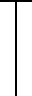|wall between two compartments, height covers three places|23|-|bottom | |
|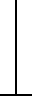|wall between two compartments, height covers three places|23|-|top | |
||small wall between two compartments, height covers two places|26|-|bottom | |
||small wall between two compartments, height covers two places|26|-|top | |
||small wall between two compartments, height covers two places|29|-|bottom | |
||small wall between two compartments,height covers two places|29|-|top | |
||very small wall between two compartments, height covers one places|32|-|bottom | |
||Very small wall between two compartments, height covers one places|32|-|top | |
||end-to-end wall|30|-|top-to-bottom | |
|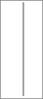|Mobile wall between sleeping compartments, height covers three places|31|-|
||arrow indicating upper level|51|-|top-to-bottom | | 
||arrow indicating lower level|52|-|top-to-bottom | |
||arrow indicating upper level|53|-|top-to-bottom | |
||arrow indicating lower level|54|-|top-to-bottom | |
||1st class area|101|-|- | |
||2nd class area |100|-|- | |
||mobile phone area|103|-|- | | 
|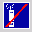|mobile phone forbidden area|104|-|- | |
||silence area |116|-|- | |
||bar area|102|-|- | |
||dining area|107|-|- | |
||bicycle area|108|-|- | |
||luggage area|109|-|- | |
||luggage locker|110|-|- | |
||conference compartment|111|-|- | |
||wardrobe|113|-|- | |
||dust bin|114|-|- | |
||children play area|117|-|- | |
||Space for prams|112|-|- | |
||family area|106|-|- | |
||PRM area|105|-|- | |
||Priority Seats|120|-|- | |
||Non-smoker area|118|-|- | |
||WC|115|-|- | |
||power socket|119|-|- | | 
||WiFi area|130|-|- | | 
|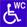|PRM toilet|131|-|- | | 
||Air condition|132|-|- | | 
||USB ports for charging|133|-|- | |
||Reclining seat|134|-|- | |
||Window|135|-|- | |
|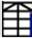|stairs upwards|136|-|- | | 
|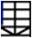|stairs downwards|137|-|- | |
|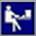|Working compartment|144|-|- | |
||Cabin for allergic passengers|145|-|- | |
||Meeting lounge for 7 persons (Pendolino)|150|-|- | |
||Meeting lounge for 12 persons|151|-|- | |
|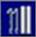|Space for skis|154|-|- | |
||Conductor working compartment|155|-|- | |
||Mobile phone booth|156|-|- | |
||T-loop (audio induction loop)|158|-|- | |
||Pets compartment|160|-|- | |
|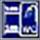|Sleeping cabin with toilet and shower|161|-|- | |
|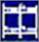|interconnectible sleeping compartments|162|-|- | |
||Shower|163|-|- | |
||Baby-care table|168|-|- | |
||push-button operated wheelchair ramp|170|-|- | |
||Sink / washbasin|171|-|- | |
||Ladies compartment|172|-|- | |
|||||||
|||||||
|icons concerning the entire coach||||||
||1st class coach|121|-|- | |
||2nd class coach|122|-|- | |
||mobile phone coach|127|-|- | |
||mobile phone forbidden in the entire coach|128|-|- | |
||1silence coach|126|-|- | |
||coffee bar|123|-|- | |
||dining car|124|-|- | |
||bicycle coach|125|-|- | |
||mixed group/individual coach|129|-|- | |
||WiFi area|139|-|- | |
||Air condition |140|-|- | |
||USB ports for charging|141|-|- | |
||business class|142|-|- | | 
||panorama coach|143|-|- | |
||luggage coach|173|-|- | |
||sleeping car|174|-|- | | 
||car-carrier|175|-|- |

## Interface Type

| Code | Description   |
|------|-------------------------------|
|`IRS90918_1_RESERVATION_BINARY` | Reservation interface according to IRS90918-1 binary message format |
|`IRS90918_1_RESERVATION_XML` | Reservation interface according to IRS90918-1 XML message format |
|`OSDM` | OSDM API |

## Language

Language codes used in OSDM are based on the [ISO 639-1](https://en.wikipedia.org/wiki/ISO_639) standard.

## Nationality

Language codes used in OSDM are based on the [ISO 639-1](https://en.wikipedia.org/wiki/ISO_639) standard.

## NUTS codes

The common classification of territorial units in the EU (COMMISSION REGULATION (EU) 2016/2066)
provides codes for different levels of geographical/political units. E.g.:

| Code | Description |
|------|-------------|
| `BE` | BELGIUM |
| `BE2` | VLAAMS GEWEST |
| `BE21` | Prov. (2) Antwerpen |
| `BE211` | Arr. Antwerpen

## OverRule Code

| Code | Description |
|------|-------------|
| `SALES_STAFF_ERROR` |  |
| `PAYMENT_ERROR` |  |
| `STRIKE` |  |

Refund because of breakage of a vehicle is handled in a separate process.

## Passenger Type (aka. Traveler Type)

| Code | Description | Transportable  | Bulk (Offline) | Online Request | Online Reply |
|------|-------------|----------------|----------------|----------------|--------------|
| `YOUNG_CHILD` | Young child defined by the carrier depending on the age || X || X |
| `CHILD` | Child defined by the carrier depending on the age || X || X |
| `YOUTH` | Youth defined by the carrier depending on the age || X || X |
| `ADULT` | Adult defined by the carrier depending on the age || X || X |
| `SENIOR` | Senior defined by the carrier depending on the age || X || X |
| `FAMILY_CHILD` | Child associated with a family traveling together || X | X | X |
| `ACCOMP_PRM` | Accompanying Person for PRM || X || X |
| `PRM_CHILD` | Handicapped young child accompanied by one person where the usual child according to the age price would be zero and the accompanying person would also be free || X || X |
| `WHEELCHAIR` | Passenger with wheel-chair ||| X ||
| `PERSON` | Used in requests together with date of birth ||| X ||
| `PRM` | Person with reduced mobility - to be used in case of accompanying person or dog, date of birth must be provided additionally ||| X ||
| `DOG` | A dog | X | X | X | X |
| `PET` | A pet but not a dog | X | X | X | X |
| `LUGGAGE` | Over-size luggage | X | X | X | X |
| `BICYCLE` | A bicycle | X | X | X | X |
| `PRAM` | A pram | X | X | X | X |
| `ACCOMP_DOG` | An accompanying dog for a PRM | X | X | X | X |
| `CAR` | A car for car-carriage trains | X | X | X | X |
| `MOTOCYCLE` | A motorcycle for car carriage trains | X | X | X | X |
| `TRAILER` | A trailer for car carriage trains | X | X | X | X |

## Passport

| Code | Description |
|------|-------------|
| `ID_CARD` |  |
| `PASSPORT` |  |
| `DIPLOMATIC_PASSPORT` |  |
| `REFUGEE_TRAVEL_DOCUMENT` |  |
| `DRIVING_LICENCE` |  |

## Personal data items

Codes for personal data items that might be transferred to the carrier if required.

| Code | Description |
|------|-------------|
|`DATE_OF_BIRTH` | Date of birth|
|`E_MAIL` | e-mail |
|`PHONE`| Phone number |
|`FULL_NAME`| Full name (first and last name)|
|`LAST_NAME`| Last name |
|`SOCIAL_MEDIA_ACCOUNT` |A social media account|
|`LANGUAGE`| Languages of the passenger|
|`TITLE` |Title of the passenger|
|`DOC_TYPE`| Type of the document if passport or id card are possible|
|`DOC_ID` | ID of the document|
|`DOC_NAME`| Name of the passenger as written on the document|
|`DOC_CITY_OF_RESIDENCE` | City of residence as written in the document|
|`DOC_COUNTRY_OF_BIRTH` ||
|`DOC_COUNTRY_OF_ISSUE`||
|`DOC_COUNTRY_OF_RESIDENCE`||
|`DOC_DATE_OF_ISSUE` ||
|`DOC_GENDER`| Gender as written in the document|
|`GENDER` | Gender to be used for special bookings |
|`DOC_NATIONALITY` | Nationality as given in the documen|
|`DOC_LIMIT_OF_VALIDITY` | Limit of validity as written on the document|
|`DOC_CITY_OF_ISSUE` ||
|`DOC_CITY_OF_BIRTH` ||
|`DOC_TYPE_PASSPORT` | Document provided must be a passport|
|`CARD_ISSUER` | Card issuer|
|`CARD_NUMBER` | Card identifier|

## Personal data transfer types

| Code | Description |
|------|-------------|
| `BOOKING` |The data will be transfered via the booking services|
| `PRE_BOOOKING` | The data will be transfered via the pre-booking (offer) services|
| `SIS_CONTROL` | The data will be transfered via security in system control data exchange (IRS 90918-4)|
| `SID` | The data will be transfered via  a barcode|

## Personal data change reasons

| Code | Description |
|------|-------------|
| `IN_GENERAL` | No specific reason|
| `MARRIAGE` ||
| `DOCUMENT_CHANGE` | E.g. passport was lost and replaced|
| `AGENT_ERROR` | Personal data were enterd wronlgy by the sales agent|

## Public Transportation Modes (ptMode)

This is a sensible subset of SIRI modes.

| PT Mode |
|----------|
| `BUS`    |
| `COACH_GROUP` |
| `HIGH_SPEED_TRAIN` |
| `HISTORIC_TRAIN` |
| `INTERCITY` |
| `REGIONAL`  |
| `INTERREGIONAL`  |
| `URBAN`  |
| `TRAM`   |
| `UNDERGROUND` |
| `NIGHT_TRAIN` |
| `SHARED_TAXI` |
| `MOTOR_RAIL`  |
| `MOUNTAIN_TRAIN` |
| `PLANE`  |
| `SHIP`   |

## Point of Interest (POI)

POICodeList: By default the code list is set to UIC.

Additional code lists can be defined by implementers. The code list name should then be prefixed
by "X_<3 letters code for the provider>". Example: "X_PAO_POIS"

POICode: Values are depending on code list and set is too large to be reproduced

## Reduction cards

The following code lists defines the commonly used cards which are not provided by a specific carrier:

| Predefined Card-Ids | Issuer | Description | Type | Included Cards |
|---------------------|--------|-------------|------|----------------|
|`UIC_EURAIL` | Eurail |Eurail Pass |PASS||
|`UIC_INTERRAIL` | Eurail |Interrail Pass |PASS||
|`UIC_FIP_LEASURE_RED` |FIP|FIP reduction (50%) |REDUCTION_CARD||
|`UIC_FIP_DUTY` | FIP  |FIP duty| PASS||
|`UIC_FIP_LEASURE_FREE` |FIP|FIP free personal use | PASS||
|`UIC_RAILPLUS` | * |A pure rail plus card | REDUCTION_CARD||
|`UIC_RIT_1` | * | RIT reduction for RIT 1 members | REDUCTION_CARD||
|`UIC_RIT_2` | * | RIT reduction for RIT 2 members | REDUCTION_CARD||
|`UIC_RIT_3` | * | RIT reduction for RIT 3 members | REDUCTION_CARD||
|`UIC_EURAIL_1` | Eurail |Eurail Pass First Class | PASS||
|`UIC_INTERRAIL_1`|Eurail|Interrail Pass First Class |PASS||
|`UIC_FIP_LEASURE_RED_1` |FIP| FIP reduction (50%) First Class |REDUCTION_CARD||
|`UIC_FIP_DUTY_1` | FIP |FIP duty First Class |PASS||
|`UIC_FIP_LEASURE_FREE_1` | FIP | FIP free personal use First Class |PASS||
|`UIC_RAILPLUS_1` | * |A pure rail plus card First Class |REDUCTION_CARD||
|`UIC_RIT_1_1` | * |RIT reduction for RIT 1 First Class members | REDUCTION_CARD||
|`UIC_RIT_2_1` | * |RIT reduction for RIT 2 First Class members | REDUCTION_CARD||
|`UIC_RIT_3_1` | * |RIT reduction for RIT 3 First Class members | REDUCTION_CARD||
|`UIC_EURAIL_2` | Eurail |Eurail Pass Second Class|PASS||
|`UIC_INTERRAIL_2`| Eurail | Interrail Pass Second Class|PASS||
|`UIC_FIP_LEASURE_RED_2`| FIP | FIP reduction (50%) Second Class|REDUCTION_CARD||
|`UIC_FIP_DUTY_2`| FIP | FIP duty Second Class|PASS||
|`UIC_FIP_LEASURE_FREE_2`| FIP | FIP free personal use Second Class|PASS||
|`UIC_RAILPLUS_2` | * |A pure rail plus card Second Class|REDUCTION_CARD||
|`UIC_RIT_1_2`| * | RIT reduction for RIT 1  members Second Class|REDUCTION_CARD||
|`UIC_RIT_2_2`| * | RIT reduction for RIT 2 members Second Class|REDUCTION_CARD||
|`UIC_RIT_3_2`| * | RIT reduction for RIT 3 members Second Class|REDUCTION_CARD||
|`UIC_EU_DISABILITY_CARD`| * | EU Disabled Card||
|`UIC_INT_DISABILITY_CARD`| * | International Disabled Card|REDUCTION_CARD|UIC_EU_DISABILITY_CARD|

Other cards should start with the RICS code of the issuer.

## Refund Overrule Codes

| Code | Description |
|------|-------------|
| `STRIKE` |   |
| `SALES_STAFF_ERROR` | Error made by sales staff |
| `PAYMENT-FAILURE` | Cancellation made by the allocator due to a failed payment |

## Reservation Preference Group

| Code | Description |
|------|-------------|
| `ACC_VEHICLE`| Different types of accompanying vehicles |
| `BERTH_LOCATION`| Location of a berth or couchette|
| `FAMILY`| Different types of places for families|
| `LEVEL` | Upper or lower deck|
| `PLACE_GROUPING` | Compartment / Open Space|
| `PLACE_LOCATION` | Place location (Aisle, Window)|
| `USAGE` | Different usage types for different coach areas|
| `VEHICLE`|  Different types of vehicles|

## Service Brands

Snapshot version, for the actual code list see [UIC Service Brand Code List](https://uic.org/passenger/passenger-services-group/article/service-brand-code-list).

| Service Brand Code | Abbreviation | Reservation Ticket Text | MERITS Description |
|--------------------|--------------|-------------------------|--------------------|
| `33`| | Ferry | Ship |
| `37`| | normal train | Train|
| `46`| `TAJ`| TAJ| Day car train|
| `47`| `TAC`| TAC| Car sleeper train, motor rail (CST)|
| `48`| `SAE`| SAE| Unaccompanied car service, motor rail|
| `49`| `EIC`| ExpressIC | Fast and Comfortable Interregional trains|
| `50`| `EC` | EuroCity | EuroCity|
| `51`| `ICE`| ICE| ICE|
| `52`| `AVE`| AVE| AVE|
| `53`| `EIL`| EUROSTAR | Eurostar|
| `54`| | | Talgo|
| `55`| `OTU`| Oresundstog | Oresundstog|
| `56`| `TGV`| TGV | TGV Bruxelles à Lille / Province|
| `58`| `TRN`| Intercités| Intercités|
| `59`| `AE`| ALLEGRO| Allegro|
| `60`| `ECB`| EuroCityBrenner | EuroCityBrenner|
| `62`| | |Suburban service|
| `63`| `IC`| Intercity| Intercity|
| `64`| || Hotel Train|
| `65`| | Ferry | hydrofoil|
| `66`| `IC`| Intercity | Inter City Lyn|
| `67`| | | TRN|
| `68`| | | International|
| `69`| | | Express|
| `70`| `EN`| EuroNight | Euro Night|
| `71`| `HST`| High-speed train | High-speed train|
| `72`| `TRN`| TRAIN | Train SNCF|
| `73`| `TGV`| TGV| TGV Sud-Est|
| `74`| `TGV`| TGV| TGV Atlantique|
| `75`| `TGV`| TGV| TGV Nord|
| `76`| `TGV`| TGV| TGV Lyria|
| `77`| `TGV`| TGV| TGV Duplex|
| `79`| `TGV`| TGV| TGV Est|
| `80`| `TGV`| TGV| TGV Interconnexion|
| `82`| |THALYS | Thalys|
| `83`| |Ferry  | Hovercraft|
| `84`| `RE`| regional train | Regional|
| `85`| `GPE`| Gotthard Panorama Express | Gotthard Panorama Express
| `87`| | PENDOLINO  | Pendolino
| `88`| | |Suburban|
| `89`| `ALV`| Alvia | Alvia|
| `90`| `AVN`| Avant | Avant|
| `91`| `TER`| TRAIN | Regional TER|
| `92`| `REG`| Regiontog | Regiontog|
| `93`| `FB`| FRECCIABIANCA |FRECCIABIANCA|
| `94`| `SC`| SuperCity| Supercity|
| `95`| `CNL`| City Night Line (D) | DB Nachtzug|
| `96`| `INI`| InterCityNotte Italia | InterCityNotte|
| `97`| `GB`| ATOC MEMBER OPERATED SERVICE | ATOC MEMBER OPERATED SERVICE|
| `98`| `ESI`| ES Italia | Eurostar Italia|
| `99`| ||Funicular|
| `100`| ||Airport train|
| `101`| ||Night train|
| `102`| ||Touristic train|
| `107`| ||Historical train, steam engine train|
| `108`| `IRE`| IRE | Interregio-Express|
| `109`| `RB`| RB| Regionalbahn|
| `110`| `RE`| RE| Regional-Express|
| `111`| `RT`| RT| RegioTram|
| `112`| || Shinkansen |
| `113`| `THT`| TrainHotel Talgo |Train hotel talgo|
| `114`| `EUR`| Euromed| Euromed
| `115`| `ALR`| Alaris| Alaris|
| `116`| `ALT`| Altaria| Altaria|
| `117`| `ARC`| Arco |Arco|
| `119`| || S-Bahn |
| `121`| | Night Train | Night Train
| `122`| `IR`| Interregional | Interregional
| `123`| `IRN`| Interregional Night Train | Interregional Night Train
| `124`| `NLT`| TOLSTOI | Tolstoi
| `126`| || ARZ|
| `128`| `AVE`| RENFE SNCF EN COOPERATION | Renfe SNCF|
| `129`| `TGV`| TGV INOUI | Renfe SNCF|
| `130`| `BUS`| IC Bus | Bus|
| `131`| `BUS`| IC Bus International |Bus|
| `153`| |special train | Sonderzug|
| `154`| ||InterCityRapid|
| `155`| ||InterPici|
| `157`| ||Fast train|
| `158`| ||Euregio|
| `159`| | Bus | IC Ersatzbus|
| `160`| | Bus | IP Ersatzbus|
| `162`| | Bus | Replacement Bus|
| `163`| `TGV`| TGV| TGV Duplex Lyria|
| `166`| `TGV`| TGV INOUI| TGV Duplex France Allemagne|
| `170`| `YHT`| YHT| High speed train in Turkey|
| `171`| `FA`| FRECCIARGENTO | FRECCIARGENTO|
| `172`| `FR`| FRECCIAROSSA | FRECCIAROSSA|
| `173`| `AP`| Albula Panorama | Albula Panorama (Panoramic Car)|
| `174`| `BEX`| Bernina Express |Bernina Express (Panorama Train)|
| `175`| `GEX`| Glacier Express | Glacier Express (Panorama Train)|
| `176`| `GP`| Golden Pass |Golden Pass (Panorama Train)|
| `177`| `BNI`| Bernina Panorama | Bernina Panorama (Panoramic Car)|
| `178`| `zb`| zb Zentralbahn AG | Luzern-Interlaken Express (Panorama Train)|
| `179`| `BXB`| Bernina Express Bus | Bernina Express (Panorama Bus)|
| `200`| `GGB`| Gornergrat Bahn | Mountain train|
| `202`| `ICE`| ICE-Allemagne France | ICE Allemagne-France|
| `203`| | ÖBB-NIGHTLINE |ÖBB Night Line|
| `205`| `ICP`| Intercity Plus| Intercity Plus|
| `206`| `RID`| Riviera Day | Riviera day|
| `207`| `RIN`| Riviera Night| Riviera night|
| `209`| `RJ`| R A I L JET| Rail Jet|
| `213`| `AZ`| DB Autozug | DB Autozug|
| `214`| | Berlin-Warszawa-Expresas | Berlin-Warszawa-Express|
| `215`| | Railpromo Austria Express/Treski| Austria Express/Treski|
| `216`| `PRECIOS`| MERCADO | Precios Mercado|
| `219`| `TGV`| TGV| TGV|
| `223`| `FB`| FB| FernBus|
| `224`| `ICB`| Intercitybus | ÖBB-Intercitybus|
| `225`| `TLK`| TLK train |Yours Rail Lines|
| `226`| `A`| RailBus | RailBus|
| `227`| `BUS`| Replacement bus for Regional Train | Replacement bus for Regional Train|
| `228`| `IR`| InterREGIO train | InterREGIO train |
| `229`| `IRB`| Replacement bus for InterRegio train | Replacement bus for InterRegio train|
| `230`| `MP`| Fast International Train | Fast International Train|
| `231`| `MR`| musicREGIO train | musicREGIO train|
| `232`| `OS`| Stopping Train | Stopping Train|
| `233`| `P`| Fast Train | Fast Train|
| `234`| `R`| REGIO train | REGIO train|
| `235`| `RE`| REGIOekspres train | REGIOekspres train|
| `236`| `VR`| viaREGIO train |viaREGIO train|
| `237`| `TK`| TurKol | TurKol|
| `238`| `EIP`| EIC Premium| High-speed train|
| `239`| `SKM`| PKP SKM w Trojmiescie | PKP SKM w Trojmiescie|
| `240`| `SA`| SAPSAN | High speed train|
| `242`| `STR`| STRIZH | Strizh night train|
| `243`| `STR`| STRIZH | Strizh interregional|
| `244`| `NJ`| NJ |NJ Night Jet|
| `245`| `CAR`| AUTOCAR | French regional buses (not sold via Hermes)|
| `246`| `RJX`| RJX | RJX railjet xpress|
| `247`| `CJX`| CJX |CJX cityjet xpress|
| `248`| | Night train BC | Night train BC |
| `249`| `TGV`| TGV INOUI | TGV INOUI|
| `250`| `TGV`| TGV INOUI | TGV INOUI DUPLEX (double decker TGV)|
| `251`| `ALI`| Aare Linth | Aare Linth (Panorama Train)|
| `252`| `TGO`| Treno Gottardo | Treno Gottardo (Panorama Train)|
| `253`| `VAE`| Voralpen-Express | Voralpen-Express (Panorama Train)|
| `254`| `LK`| FRECCIALINK |FRECCIALINK|

## Service Class

| Code | Description |
|------|-------------|
| `BEST` |  |
| `HIGH` | Standard first class |
| `STANDARD` |  |
| `BASIC` | Standard second class |

## Stations

codeList = UIC, ERA, HAFAS

Additional codelists can be defined by implementers. The codelist name should then be prefixed by "X_<3 letters code for the provider>". Example: "X_PAO_STATIONS"

*StationCode*: Values are depending on codelist and set is too large to be reproduced.

## Supported Online Services

| Code |Description |
|-----|-----------------|
|`OFFER` | Offer service (without after sales offers)|
|`BOOKING` | Preliminary booking, confirm booking and cancellation|
|`RESERVATION_LEGACY_918_1` | Services according to the 90918-1 XML or binary specification|
|`RESERVATION_PREF`| Place allocation using preferences|
|`RESERVATION_GRAPH`| Place allocation using graphical place display|
|`UPGRADE` | Upgrade to an existing booking|
|`INCREASE`| Exchange with an increase of the number of passengers|
|`DECREASE`| Exchange with an decrease of the number of passengers|
|`EXCHANGE`| Exchange with the same number of passengers|
|`FULFILLMENT`| Provides an entire tickets|
|`FULFILLMENT_ITEMS` | Providing security items for a ticket (e.g. additional bar codes)|

## TaxScope

|Code |Description |
|-----|-----------------|
|`INTERNATIONAL`|VAT applies in international tickets only. This needs to be applied in case the fare is integrated into an international ticket|
|`NATIONAL`|VAT applies in national tickets only|
|`SHORT_DISTANCE`|VAT applies in short distance tickets only|
|`LONG_DISTANCE`|VAT applies in long distance tickets only. This needs to be applied in case the fare is integrated in a longer journey. |

## Transfer Type

| Code | Description |
|------|-------------|
| `WALK` | A walk |
| `OTHER` | Other types of transfer (e.g. taxi, local city transport not included in the offer,...) |

## Transport Mode

Corresponding to numerical codes in TAP-TSI / MERITS

| Code | Description | TAP-TSI Code B.2.3 (MERITS) |
|------|-------------| --------------------------- |
| `HIGH_SPEED_TRAIN` | | 8 |
| `HISTORIC_TRAIN` | | 16 |
| `INTERCITY` | | 9 |
| `REGIONAL` | | 11 |
| `INTERREGIONAL` | | 10 |
| `TRAIN` | | 37 |
| `URBAN` | | 12 |
| `TRAM` | | 35 |
| `UNDERGROUND` | | 36 |
| `NIGHT_TRAIN` | | 13 |
| `SHARED_TAXI` | | 34 |
| `MOTOR_RAIL` | Car carriage trains | 13 |
| `MOUNTAIN_TRAIN` | | 15 |
| `PLANE` | | 3 |
| `COACH_GROUP` | Group of coaches included in multiple trains (through coaches) | 31 |
| `SHIP` | | 33 |
| `BUS` | | 32 |

## TimeReference

| Code | Description |
|-----|-----------------|
| `BEFORE_DEPARTURE` | Time value calculated relative to the departure (subtract from departure). The time zone of the departure station applies.|
| `AFTER_DEPARTURE` | Time value calculated relative to the departure (add to depature). The time zone of the departure station applies.|
| `AFTER_SALE` | Time value calculated relative to the sates time (add to sales time). The time zone of the sale applies.|
| `BEFORE_START_VALIDITY` |Before the start of the validity. The time zone of the departure station applies.|
| `AFTER_END_VALIDITY` | After the start of the validity. The time zone of the departure station applies.|

## TimeUnit

| Code |Description |
|-----|-----------------|
| `DAY` ||
| `MINUTE`||
| `HOUR` ||

## TransactionType

Transaction type used in after sales rules for fares.

| Code |Description |
|------|-----------------|
|`REFUND` ||
|`EXCHANGE` ||
|`CARRIER_CHANGE` | Exchange with a new fare of another carrier|
|`EXCHANGE` | Exchange with a new fare of the same carrier|
|`UPGRADE` | Exchange with a fare of higher value|
|`GROUP_DOWN_SIZE` | Exchange with a group of less passengers |

## TravelValidityType

Type of the travel validity of a fare.

| Code |Description |
|-----|-----------------|
| `SINGLE_TRIP` | Fare is for a single trip. |
| `MULTIPLE_TRIPS`| Fare is for multiple trips but with restrictions on the usage. |
| `UNRESTRICTED` | The fare is for multiple unrestricted use within the provided travel validity period. |

## TripAllocationProcess

Trip allocation process indicated the type of process a passenger needs to follow to make use of a multi journey ticket with restrictions.

| Code |Description |
|-----|-----------------|
| `NONE` | No action is required, the usage might be tracked automatoally or via on-board controls. |
| `MANUAL`| The passenger has to allocate a trip manually e.g. by stamping the ticket. (outdated). |
| `ACTIVATION` | The fulfillment needs to be activated for the trip. |
| `FULFILLMENT` | A separate fulfillment needs to be retrieved for the trip. |

## TripAllocationUnit

Trip allocation unit indicates the unit that can be allocatoed on a multi journey ticket with restrictions.

| Code |Description |
|-----|-----------------|
| `NONE` | Individual trips don't need to be allocated. |
| `MANUAL`|  allocation per individual trip. |
| `ACTIVATION` | The allocation is per travel day for multiple trips on the day. |
| `FULFILLMENT` | The allocation is per duration. |

## TripInterruptionProcess

Trip interruption process indicates the type of process to be followed by the passenger to interrupt a trip.

| Code |Description |
|-----|-----------------|
| `NONE` | No action is required from the passenger in case he is interrupting his trip. |
| `MANUAL`| In case a passenger is interrupting his trip he needs to receive a confirmation from train or station staff |
| `ACTIVATION` | The electronic ticket needs to be deactivated during the interruption. |
