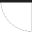
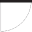
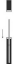
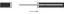

## Table of contents

1. [URNs for code lists](#URNsforcodelists)
2. [Proprietary values](#Proprietaryvalues)
   1. [Known proprietary code lists](#Knownproprietarycodelists)
3. [Accommodation Type](#AccomodationType)
4. [Accommodation Sub Type, Place Property, Reservation Place Preference](#PlaceProperty)
5. [Ancillary category](#AncillaryCategory)
6. [BarcodeType](#BarcodeType)
7. [CardType](#CardType)
8. [Company Code](#CompanyCode)
9. [ControlDataExchangeType](#ControlDataExchangeType)
10. [ControlSecurityType](#ControlSecurityType)
11. [Currency](#Currency)
12. [FareType](#FareType)
13. [Fare CoachType](#FareCoachType)
14. [Fare CompartmentTypeCode](#FareCompartmentTypeCode)
15. [FulfillmentType](#FulfillmentType)
16. [FulfillmentDocumentType](#FulfillmentDocumentType)
17. [FulfillmentMediaType](#FulfillmentMediaType)
18. [Gender](#Gender)
19. [Graphics Items](#GraphicsItems)
20. [Interface Type](#InterfaceType)
21. [Language](#Language)
22. [Leg Attributes](#LegAttributes)
23. [Nationality](#Nationality)
24. [NUTS codes](#NutsCodes)
25. [On-Demand Vehicle Process](#OnDemandVehicleProcess)
26. [On-Demand Vehicle Type](#OnDemandVehicleType)
27. [Overrule Code](#OverruleCode)
28. [Passenger Type (aka. Traveler Type)](#PassengerType)
29. [Passport](#Passport)
30. [Personal data items](#PersonalDataItems)
31. [Personal data transfer types](#PersonalDataTransferType)
32. [Personal data change reasons](#PersonalDataChangeReason)
33. [Product Tags](#ProductTags)
34. [Product Types](#ProductTypes)
35. [Public Transportation Modes (ptMode)](#PublicTansportModes)
36. [Point of Interest (POI)](#PointOfInterrest)
37. [Reduction cards](#ReductionCard)
38. [Reservation Preference Group](#ReservationPreferenceGroup)
39. [Service Brands](#ServiceBrands)
40. [Service Class](#ServiceClass)
41. [Service Facilities / Leg Attributes](#ServiceFacilities)
42. [Stations](#Station)
43. [Supported Online Services](#SupportedOnlineServices)
44. [TaxScope](#TaxScope)
45. [TimeReference](#TimeReference)
46. [TimeUnit](#TimeUnit)
47. [Transfer Type](#TransferType)
48. [Transport Mode](#TransportMode)
49. [TransactionType](#TransactionType)
50. [Travel Account Types](#TravelAccountType)
51. [TravelDirection](#TravelDirection)
52. [TravelValidityType](#TravelValidityType)
53. [TripAllocationProcess](#TripAllocationProcess)
54. [TripAllocationUnit](#TripAllocationUnit)
55. [TripInterruptionProcess](#TripInterruptionProcess)

The mandatory code lists on enums and extensible enums are provided within the
schema files.

## URNs for code lists <a name="URNsforcodelists">

| Code List                 | Name Space and domain | CodeList       | Description                                                                                                                                                                                                                                                                                                                                                      | example                    | base path for relative references |
|---------------------------|-----------------------|----------------|------------------------------------------------------------------------------------------------------------------------------------------------------------------------------------------------------------------------------------------------------------------------------------------------------------------------------------------------------------------|----------------------------|-----------------------------------|
| stations                  | `urn:uic`             | `stn`          | UIC station codes ( = TAP-TSI retail station codes as defined in TAP-TSI Technical Document B.9). The codes are defined in TAP-TSI as numerical codes starting with the TAP-TSI country code without leading zeroes. Temporary codes not jet part of TAP-TSI reference data might be added with an additional number before the country code as agreed with ERA. | `urn:uic:stn:8512345`      | `urn:uic:stn:`                    |
| metastations              | `urn:uic`             | `metastn`      | UIC meta station codes to e used for Points of Interest                                                                                                                                                                                                                                                                                                         | `urn:uic:metastn:198`      | `urn:uic:metastn:`                |
| service brands , products | `urn:uic`             | `sbc`          | UIC service brand code (TAP-TSI B.4.7009 / <https://uic.org/passenger/passenger-services-group/article/service-brand-code-list>)                                                                                                                                                                                                                                 | `urn:uic:sbc:17`           | `urn:uic:sbc:`                    |
| companies                 | `urn:uic`             | `rics:ac`      | company code (TAP-TSI <https://www.era.europa.eu/registers/ocr_en> / <https://uic.org/support-activities/it/rics>) and optional administration code (AC)                                                                                                                                                                                                         | `urn:uic:rics:1080:000011` | `urn:uic:rics:`                   |
| countries                 | `urn:iso`             | `std:iso:3166` | ISO Country Codes  https://en.wikipedia.org/wiki/List_of_ISO_3166_country_codes https://www.iso.org/iso-3166-country-codes.html                                                                                                                                                                                                                                  | `urn:iso:std:iso:3166:CH`  | `urn:iso:std:iso:3166:`           |
| currencies                | `urn:iso`             | `std:iso:4217` | ISO Currency Codes  https://en.wikipedia.org/wiki/ISO_4217  https://www.iso.org/iso-4217-currency-codes.html                                                                                                                                                                                                                                                     | `urn:iso:std:iso:4217:CFR` | `urn:iso:std:iso:4217:`           |
| stations                  | `urn:iata`            | `li`           | IATA Location Identifiers for airports or rail stations defined in [IATA Airline Coding Directory (ACD)](https://www.iata.org/en/publications/manuals/airline-coding-directory/)                                                                                                                                                                                 | `urn:iata:li:XWC`          | `urn:iata:li:`                    |

## Proprietary values <a name="Proprietaryvalues">

Be it to represent specific places, or any other type of reference data, some
OSDM providers may need to extend a code set with proprietary values in order to
support their use cases, while these values are unlikely to be relevant to the
rest of the OSDM community. To do so, an OSDM provider should then use the
following format for the proprietary values it wishes to extend the code set
with :

urn:
x\_<ascii alphanumeric letters code for the provider>:<codetype identifier>:<value>

For example: urn: x_zoo:paxtype:OLIPHANT

[RFC 8141 Section 2.1](https://datatracker.ietf.org/doc/html/rfc8141#section-2.1)
allows the domain part of the URN to be 30 ASCII alphanumeric letters at maximum
including the `x_` prefix. URN treats the domain part as case-insensitive where
OSDM mandates it to be always lower case.

### Known proprietary code lists <a name="Knownproprietarycodelists">

| Domain  | Code List | Example Value            | Description                         | 
| ------- | --------- | ------------------------ | ----------------------------------- |
| x_eva   | stn       | urn:x_eva:stn:80000123   | HAFAS station code                  |
| x_hafas | admin     | urn:x_hafas:admin:123456 | HAFAS administration ("Verwaltung") |

## Accommodation Type <a name="AccomodationType">

| Code        | Description                                                          |
| ----------- | -------------------------------------------------------------------- |
| `SEAT`      |                                                                      |
| `COUCHETTE` | Night trains only                                                    |
| `BERTH`     | Night trains only (in sleeper cabin)                                 |
| `VEHICLE`   | Place for vehicles, e.g. in car carriage trains                      |
| `STORAGE`   | Storage place for items, e.g. a hook for bicyles or space for a pram |

## Accommodation Sub Type, Place Property, Reservation Place Preference <a name="PlaceProperty">

The Accommodation Sub Type defines the characteristics of a place for an offer.
It can not be changed within the offer.

(Reservation) Place Preferences define the options that can be selected within
the offer when requesting a reservation. Place Properties define the place
characteristics for the places in a reservation.

Depending on the commercial decisions some codes might be used in accommodation
sub type with one carrier whereas another carrier might alow them in the place
preferences (e.g. Bicycle and Tandem Bicycle might have the same price (Place
Preference) of different prices (Accommodation Sub Type). There might be place
properties that indicate characteristics of a place to the traveler which are
not selectable (e.g. Place without Window)). Therefore the shown usage for the
different types are an indication but not mandatory.

Place Preference Group collects Place preferences where only one can be chosen
of by the customer.

| Code                    | Accommodation Sub Type | Place Preference | Place Property | Description                                                                                      | Place Preference Group           |
| ----------------------- | ---------------------- | ---------------- | -------------- | ------------------------------------------------------------------------------------------------ | -------------------------------- |
| `AISLE_SEAT`            | N                      | Y                | Y              | Place at the aisle                                                                               | `PLACE_OR_COMPARTMENT_LOCATION`  |
| `AIR-CONDITIONED`       | N                      | Y                | Y              | Place in air conditioned area                                                                    | `PLACE_OR_COMPARTMENT_FEATURE`   |
| `ANY_SEAT`              | Y                      | N                | Y              | Indicates within a place preference group explicitly that the selection is optional              | `COMPARTMENT_TYPE`               |
| `BISTRO`                | Y                      | Y                | Y              | Places in a coach with self-service bistro                                                       | `COMPARTMENT_TYPE`               |
| `BICYCLE`               | Y                      | Y                | Y              | Bicycle hook                                                                                     | `SPECIAL_COMPARTMENT_TYPE`       |
| `BICYCLE_LOW`           | Y                      | Y                | Y              | Bicycle hook, no or slight lift only of front wheel needed                                       | `BICYCLE_LOCATION`               |
| `BICYCLE_MIDDLE`        | Y                      | Y                | Y              | Bicycle hook, waist high lift of bike needed                                                     | `BICYCLE_LOCATION`               |
| `BICYCLE_HIGH`          | Y                      | Y                | Y              | Bicycle hook, complete lift of bike needed to reach hook                                         | `BICYCLE_LOCATION`               |
| `BUSINESS`              | Y                      | Y                | Y              | Manager compartment/business                                                                     | `COMPARTMENT_TYPE`               |
| `BUSINESS_COMFORT`      | Y                      | Y                | Y              | Business Comfort – business seat with reduced service                                            | `COMPARTMENT_TYPE`               |
| `CABIN8`                | Y                      | Y                | Y              | Special place group in TGV                                                                       | `COMPARTMENT_TYPE`               |
| `CAR_LARGE`             | Y                      | N                | Y              | Vehicle place category formotor vehicle between 4,42 m up to 5,30 m and with a roof width between 1,36 m and 1,55 m  | `SPECIAL_COMPARTMENT_TYPE`       |
| `CAR_SMALL`             | Y                      | N                | Y              | Vehicle place for motor vehicle between 4,42 m up to 5,30 m and with a roof width up to 1,35 m.  | `SPECIAL_COMPARTMENT_TYPE`       |
| `CARRE`                 | Y                      | Y                | Y              | Carré (4 seats facing normally 2nd Class)                                                        | `COMPARTMENT_TYPE`               |
| `CHILDREN_AREA`         | Y                      | Y                | Y              | Places in children area                                                                          | `PLACE_OR_COMPARTMENT_POSITION`  |
| `CLUB`                  | Y                      | N                | Y              | Club Category (RENFE)                                                                            | `COMPARTMENT_TYPE`               |
| `CLUB_2`                | Y                      | Y                | Y              | Club Duo (2 seats facing in a separate compartment)                                              | `COMPARTMENT_TYPE`               |
| `CLUB_4`                | Y                      | Y                | Y              | Club 4 (4 seats facing)                                    | `COMPARTMENT_TYPE`               |
| `COMPARTMENT`           | Y                      | Y                | Y              | Places in a compartment                                    | `COMPARTMENT_TYPE`               |
| `COMPLETE`              | N                      | N                | Y              | All places in a compartment are included, no other passengers will be located in the compartment | `COMPLETE_COMPARTMENT`           |
| `CONFERENCE`            | N                      | N                | Y              | Conference compartment                                     | `COMPLETE_COMPARTMENT`           |
| `CONNECTING_DOOR`       | N                      | Y                | Y              | Compartments with connecting door (in sleepers)            | `PLACE_OR_COMPARTMENT_ALIGNMENT` |
| `COUCHETTE_2`           | Y                      | N                | Y              | Two person couchette cabin                                 | `COMPARTMENT_TYPE`               |
| `COUCHETTE_4`           | Y                      | N                | Y              | Couchette Four-berth                                       | `COMPARTMENT_TYPE`               |
| `COUCHETTE_5`           | Y                      | N                | Y              | Couchette Five-berth                                       | `COMPARTMENT_TYPE`               |
| `COUCHETTE_6`           | Y                      | N                | Y              | Couchette Six-berth                                        | `COMPARTMENT_TYPE`               |
| `COUCHETTE_COMFORT_4`   | Y                      | N                | Y              | Couchette higher quality Four-berth                        | `COMPARTMENT_TYPE`               |
| `COUCHETTE_COMFORT_5`   | Y                      | N                | Y              | Couchette higher quality Five-berth                        | `COMPARTMENT_TYPE`               |
| `COUCHETTE_COMFORT_6`   | Y                      | N                | Y              | Couchette higher quality Six-berth                         | `COMPARTMENT_TYPE`               |
| `COUCHETTE_PRM_2`       | Y                      | N                | Y              | Couchette suitable for PRMs Two-berth                      | `SPECIAL_COMPARTMENT_TYPE`       |
| `COUCHETTE_PRM_3`       | Y                      | N                | Y              | Couchette suitable for PRMs Three-berth                    | `SPECIAL_COMPARTMENT_TYPE`       |
| `COUCHETTE_PRM_4`       | Y                      | N                | Y              | Couchette suitable for PRMs Four-berth                     | `SPECIAL_COMPARTMENT_TYPE`       |
| `DOUBLE`                | Y                      | N                | Y              | Two person sleeper compartment                             | `COMPARTMENT_TYPE`               |
| `DOUBLE_WC`             | Y                      | N                | Y              | Two person sleeper compartment with WC                     | `COMPARTMENT_TYPE`               |
| `DOUBLE_SWC`            | Y                      | N                | Y              | Double sleeper compartment with shower & WC                | `COMPARTMENT_TYPE`               |
| `DOUBLE_S`              | Y                      | N                | Y              | Double sleeper compartment with shower                     | `COMPARTMENT_TYPE`               |
| `EASY_ACCESS`           | Y                      | Y                | Y              | Place with easy access for PRMs                            | `PLACE_OR_COMPARTMENT_POSITION`  |
| `FACE_2_FACE`           | N                      | Y                | Y              | places face to face (2 seats facing)                                                             | `PLACE_OR_COMPARTMENT_ALIGNMENT` |
| `EXCELLENCE`            | Y                      | Y                | Y              | Special Excellence Places (RhB)                                                                  | `COMPARTMENT_TYPE`               |
| `FAMILY`                | Y                      | Y                | Y              | Places in family area                                                                            | `PLACE_OR_COMPARTMENT_POSITION`  |
| `FRONT_VIEW`            | Y                      | Y                | Y              | Seat with front-view                                                                             | `PLACE_OR_COMPARTMENT_POSITION`  |
| `HISTORIC_COACH`        | Y                      | Y                | Y              | Seat in historic coach                                                                           | `COMPARTMENT_TYPE`               |
| `INCLUDING_MEAL`        | N                      | Y                | Y              | Meal at the place is included                                                                    | `PLACE_OR_COMPARTMENT_FEATURE`   |
| `INCLUDING_DRINK`       | N                      | Y                | Y              | A drink is included at the place                                                                 | `PLACE_OR_COMPARTMENT_FEATURE`   |
| `KIOSQUE`               | Y                      | Y                | Y              | Kiosque (special seats in edge area of a TGV)                                                    | `COMPARTMENT_TYPE`               |
| `LADIES`                | N                      | Y                | Y              | Ladies compartment                                                                               | `GENDER`                         |
| `LOWER_BED`             | N                      | Y                | Y              | Lower bed or couchette                                                                           | `PLACE_OR_COMPARTMENT_LOCATION`  |
| `LOWER_DECK`            | N                      | Y                | Y              | Lower deck in a double deck train                                                                | `PLACE_OR_COMPARTMENT_LOCATION`  |
| `MEN`                   | N                      | Y                | Y              | Men compartment in night train                                                                   | `GENDER`                         |
| `MIDDLE_BED`            | N                      | Y                | Y              | Middle bed or couchette                                                                          | `PLACE_OR_COMPARTMENT_LOCATION`  |
| `MIDDLE_DECK`           | N                      | Y                | Y              | Middle bed or couchette                                                                          | `PLACE_OR_COMPARTMENT_LOCATION`  |
| `MIDDLE_SEAT`           | N                      | Y                | Y              | Middle seat                                                                                      | `PLACE_OR_COMPARTMENT_LOCATION`  |
| `MINI_SUITE`            | Y                      | N                | Y              | Mini Suite - single person couchette compartment (Capsule)                                       | `COMPARTMENT_TYPE`               |
| `MIXED`                 | N                      | Y                | Y              | Mixed compartment in night train                                                                 | `GENDER`                         |
| `MOTOR_CYCLE`           | Y                      | N                | Y              | Motorcycle                                                                                       | `SPECIAL_COMPARTMENT_TYPE`       |
| `MOTOR_CYCLE_SC`        | Y                      | N                | Y              | Motorcycle with sidecar                                                                          | `SPECIAL_COMPARTMENT_TYPE`       |
| `NEAR_ANIMALS`          | Y                      | Y                | Y              | Places close to place with animals                    | `PLACE_OR_COMPARTMENT_POSITION`  |
| `NEAR_ASSISTANT_DOG_AREA`| Y                      | Y                | Y              | Places close to an area where assistance dogs are kept | `PLACE_OR_COMPARTMENT_POSITION`  |
| `NEAR_DINING`           | Y                      | Y                | Y              | Places near the dining car                            | `PLACE_OR_COMPARTMENT_POSITION`  |
| `NEAR_PLAY_AREA`        | Y                      | Y                | Y              | Places near a child play area                         | `PLACE_OR_COMPARTMENT_POSITION`  |
| `NEAR_BICYCLE_AREA`     | Y                      | Y                | Y              | Places near the bicycle storage space                 | `PLACE_OR_COMPARTMENT_POSITION`  |
| `NEAR_WHEELCHAIR`       | Y                      | Y                | Y              | Used to indicate places near the wheelchair when booked by an accompanying person | `PLACE_OR_COMPARTMENT_POSITION`  |
| `OPEN_SPACE`            | Y                      | Y                | Y              | Places in open space area                                                                        | `COMPARTMENT_TYPE`               |
| `PANORAMA`              | Y                      | Y                | Y              | Places in a panorama coach                                                                       | `COMPARTMENT_TYPE`               |
| `PHONE`                 | N                      | Y                | Y              | Places in an area with mobile phone amplifier                                                    | `PLACE_OR_COMPARTMENT_FEATURE`   |
| `POWER`                 | N                      | Y                | Y              | Place with power socket                                                                          | `PLACE_OR_COMPARTMENT_FEATURE`   |
| `PRAM`                  | Y                      | N                | Y              | Place for a Pram                                                                                 | `SPECIAL_COMPARTMENT_TYPE`       |
| `PRAM_WITH_SEAT`        | Y                      | N                | Y              | Seat with space for a pram                                                                       | `SPECIAL_COMPARTMENT_TYPE`       |
| `PREMIUM`               | Y                      | Y                | Y              | Seat with premium comfort (higher than first class)                                              | `SPECIAL_COMPARTMENT_TYPE`       |
| `RESTAURANT`            | Y                      | Y                | Y              | Restaurant (places in a dining car)                                                              | `COMPARTMENT_TYPE`               |
| `SALON`                 | Y                      | Y                | Y              | Salon (6 seats facing in a separate compartment)                                                 | `COMPARTMENT_TYPE`               |
| `SILENCE`               | Y                      | Y                | Y              | Quiet Compartment (Seat)                                                                         | `PLACE_OR_COMPARTMENT_POSITION`  |
| `SINGLE`                | Y                      | N                | Y              | Single sleeper compartment                       | `COMPARTMENT_TYPE`               |
| `SINGLE_WC`             | Y                      | N                | Y              | Single sleeper compartment with WC               | `COMPARTMENT_TYPE`               |
| `SINGLE_SWC`            | Y                      | N                | Y              | Single sleeper compartment with shower & WC      | `COMPARTMENT_TYPE`               |
| `SIDE_BY_SIDE`          | N                      | Y                | Y              | Places side by side (2 seats side by side)       | `PLACE_OR_COMPARTMENT_ALIGNMENT` |
| `SLEEPERETTE`           | Y                      | N                | Y              | Sleeperette (reclining seat)                     | `COMPARTMENT_TYPE`               |
| `SOLO`                  | Y                      | Y                | Y              | Separate place without neighbor seat             | `COMPARTMENT_TYPE`               |
| `SOLO_COM`              | Y                      | Y                | Y              | Special separate place without neighbor seat (e.g. in TGV)   | `COMPARTMENT_TYPE` |
| `SPECIAL_SLEEPER`       | Y                      | N                | Y              | Special Sleeper Compartment, one Person sleeper compartment smaller than a Single | `COMPARTMENT_TYPE`               |
| `TABLE`                 | N                      | Y                | Y              | Places at a table                              | `PLACE_OR_COMPARTMENT_FEATURE`   |
| `TANDEM`                | Y                      | Y                | Y              | Tandem Bicycle                                 | `SPECIAL_COMPARTMENT_TYPE`       |          
| `TOURIST_SLEEPER_2`     | Y                      | N                | Y              | T2 sleeper compartment                         | `COMPARTMENT_TYPE`               |       
| `TOURIST_SLEEPER_3`     | Y                      | N                | Y              | T3 sleeper compartment                         | `COMPARTMENT_TYPE`               |                 
| `TOURIST_SLEEPER_3_WC`  | Y                      | N                | Y              | T3 sleeper compartment with WC                 | `COMPARTMENT_TYPE`               |
| `TOURIST_SLEEPER_3_SWC` | Y                      | N                | Y              | T3 sleeper compartment with shower & WC        | `COMPARTMENT_TYPE`               |
| `TOURIST_SLEEPER_4`     | Y                      | N                | Y              | T4 sleeper compartment                         | `COMPARTMENT_TYPE`               |                
| `UPPER_BED`             | N                      | Y                | Y              | Upper bed or couchette                         | `PLACE_OR_COMPARTMENT_LOCATION`  |
| `UPPER_DECK`            | N                      | Y                | Y              | Upper deck in a double deck train              | `PLACE_OR_COMPARTMENT_LOCATION`  |
| `VIDEO`                 | N                      | Y                | Y              | Place with video entertainment                 | `PLACE_OR_COMPARTMENT_FEATURE`   |
| `WHEELCHAIR`            | Y                      | Y                | Y              | Wheelchair place                               | `SPECIAL_COMPARTMENT_TYPE`       |
| `WHEELCHAIR_AND_SEAT`   | Y                      | Y                | Y              | Wheelchair place with additional seat          | `SPECIAL_COMPARTMENT_TYPE`       |
| `WHEELCHAIR_NO_SEAT`    | Y                      | Y                | Y              | Wheelchair space without additional seat       | `SPECIAL_COMPARTMENT_TYPE`       |
| `WIFI`                  | N                      | Y                | Y              | Place with WiFi access point                   | `PLACE_OR_COMPARTMENT_FEATURE`   |
| `WINDOW_SEAT`           | N                      | Y                | Y              | Place at the window                            | `PLACE_OR_COMPARTMENT_LOCATION`  |
| `WITH_ANIMALS`          | Y                      | Y                | Y              | Place with animals (animals allowed)           | `SPECIAL_COMPARTMENT_TYPE`       |
| `WITH_SMALL_CHILDREN`   | Y                      | Y                | Y              | Place for passengers with small children       | `PLACE_OR_COMPARTMENT_POSITION`  |
| `WITHOUT_ANIMALS`       | Y                      | Y                | Y              | Place in an area where animals are not allowed | `SPECIAL_COMPARTMENT_TYPE`       |

## Ancillary category <a name="AncillaryCategory">

| Code                  | Description                                                 |
| --------------------- | ----------------------------------------------------------- |
| `PAYMENT_VOUCHER`     | Payment voucher to be used to pay                           |
| `PRODUCT_ACCESS`      | Access to retrieve a product (e.g. electronic newspaper,..) |
| `MERCHANDISE_PRODUCT` |                                                             |
| `LUGGAGE`             | Allowance for extra luggage                                 |
| `LUGGAGE_TRANSFER`    | Service for luggage transport                               |
| `ON_BOARD_SERVICE`    | Access to service on board                                  |
| `STATION_SERVICE`     | Access to some station service, Lounge access,...           |
| `FOOD_ON_BOARD`       |                                                             |
| `DRINKS_ON_BOARD`     |                                                             |
| `WIFI`                | Access to WiFi                                              |
| `PARKING`             | parking of cars                                             |

## BarcodeType <a name="BarcodeType">

| Code      | Description                                                                                                                     |
| --------- | ------------------------------------------------------------------------------------------------------------------------------- |
| `FCB`     | Flexible Content Barcode - See IRS 90918-9 / TAP TSI B.12                                                                       |
| `TLB`     | Ticket Layout Barcode - See IRS 90918-9 / TAP TSI B.12                                                                          |
| `SSB`     | Small Structured Barcode - See IRS 90918-9 / TAP TSI B.12                                                                       |
| `DOSIPAS` | Double Signed Dynamic Barcode (static part (FCB) and dynamic part created at the control time) - See IRS 90918-9 / TAP TSI B.12 |

## CardType <a name="CardType">

| Code             | Description                                                                          |
| ---------------- | ------------------------------------------------------------------------------------ |
| `LOYALTY_CARD`   | Loyalty card                                                                         |
| `REDUCTION_CARD` | Card providing reduction                                                             |
| `CHIP_CARD`      | Chip card to load bookings/references onto it                                        |
| `PASS`           | A pass providing full or partial reduction within the region where the pass is valid |

## Company Code <a name="CompanyCode">

See code [TAP-TSI Company code
list](https://www.era.europa.eu/registers/ocr_en).

| Country | Carrier Code | Short Name                   | Full Name                                                                                     |
| ------- | ------------ | ---------------------------- | --------------------------------------------------------------------------------------------- |
| AT      | 1281         | ÖBB                          | ÖBB- Personenverkehr AG                                                                       |
| AT      | 2133         | CAT                          | City Air Terminal Betriebsgesellschaft m.b.H                                                  |
| AT      | 3039         | WLC                          | Wiener Lokalbahnen Cargo GmbH                                                                 |
| AT      | 3063         | RTS                          | RTS Rail Transport Service GmbH                                                               |
| AT      | 3153         | WIENER LINIEN                | WIENER LINIEN GmbH & Co KG                                                                    |
| AT      | 3178         | RNE                          | RailNetEurope                                                                                 |
| AT      | 3226         | LINZ LINIEN GmbH             | LINZ LINIEN GmbH für öffentlichen Personenverkehr                                             |
| AT      | 3236         | WESTbahn                     | WESTbahn Management GmbH                                                                      |
| AT      | 3268         | Holding Graz                 | Holding Graz - Kommunale Dienstleistungen GmbH                                                |
| AT      | 3282         | IVB                          | Innsbrucker Verkehrsbetriebe und Stubaitalbahn GmbH                                           |
| AT      | 3306         | VOR                          | Verkehrsverbund Ost-Region (VOR) GmbH                                                         |
| AT      | 3427         | VAL                          | ÖBB-Postbus GmbH - Vienna Airport Lines                                                       |
| AT      | 3465         | OÖVG                         | OÖ Verkehrsverbund-Organisations GmbH Nfg. & Co KG                                            |
| AT      | 3602         | VVV                          | Verkehrsverbund Vorarlberg GmbH                                                               |
| AT      | 3608         | WLB                          | WIENER LOKALBAHNEN GmbH                                                                       |
| AT      | 3613         | STB                          | Steiermarkbahn und Bus GmbH                                                                   |
| AT      | 3786         | ROeEE PV                     | Raab Odenburg Ebenfurter Eisenbahn AG Personenverkehr                                         |
| BE      | 18           | THI Factory                  | THI Factory SA                                                                                |
| BE      | 1088         | SNCB/NMBS                    | Société nationale des chemins de fer Belges / Nationale Maatschappij der Belgische Spoorwegen |
| BE      | 3018         | THI                          | Thalys International                                                                          |
| BE      | 3914         | Moonlight Express            | Moonlight Express Travel BV                                                                   |
| BE      | 7187         | VSB                          | Voyages SNCF Benelux SPRL                                                                     |
| BG      | 1052         | HOLDING BDZ                  | HOLDING BULGARIAN STATE RAILWAYS                                                              |
| BG      | 1152         | BDZ PASSENGER                | BULGARIAN STATE RAILWAYS PASSENGER                                                            |
| CH      | 1085         | SBB AG                       | Schweizerische Bundesbahnen                                                                   |
| CH      | 1185         | SBB-Passengers               | Swiss Federal Railways-Passenger subsidiary                                                   |
| CH      | 1285         | SBB-EPA                      | Schweizerische Bundesbahnen SBB Division Voyageur                                             |
| CH      | 1385         | SBB2                         | Schweizerische Bundesbahnen Personenverkehr                                                   |
| CH      | 3017         | CBB                          | Centralbahn AG                                                                                |
| CH      | 3342         | VöV                          | Verband öffentlicher Verkehr                                                                  |
| CH      | 3917         | THU                          | Regionalbahn Thurbo AG                                                                        |
| CH      | 7387         | VSS                          | Voyages SNCF Suisse SARL                                                                      |
| CZ      | 3189         | ARV                          | ARRIVA vlaky, s.r.o.                                                                          |
| CZ      | 3244         | LE                           | LEO Express Global a.s.                                                                       |
| CZ      | 3246         | RJ                           | Regiojet a.s.                                                                                 |
| CZ      | 3288         | GWTR                         | GW Train Regio a.s.                                                                           |
| CZ      | 3641         | LG                           | Lokalka Group, spolek                                                                         |
| CZ      | 3725         | LET                          | Leo Express Tenders s.r.o                                                                     |
| CZ      | 3752         | RJUK                         | Regiojet UK a.s.                                                                              |
| CZ      | 3825         | Gepard Express               | Gepard Express, SE                                                                            |
| DE      | 1080         | DB AG                        | Deutsche Bahn AG                                                                              |
| DE      | 1180         | DB Vertrieb GmbH             | DB Vertrieb GmbH                                                                              |
| DE      | 3012         | BSB                          | Bodensee-Schiffsbetriebe GmbH                                                                 |
| DE      | 3016         | evb                          | EVB Elbe-Weser GmbH                                                                           |
| DE      | 3030         | GVG                          | Georg Verkehrsorganisation GmbH                                                               |
| DE      | 3071         | EVG                          | Eifelbahn Verkehrsgesellschaft mbH                                                            |
| DE      | 3076         | Transdev                     | Transdev GmbH                                                                                 |
| DE      | 3118         | AG EMS                       | Aktien-Gesellschaft 'EMS'                                                                     |
| DE      | 3155         | RVF                          | Regio-Verkehrsverbund Freiburg GmbH                                                           |
| DE      | 3164         | agilis                       | agilis Verkehrsgesellschaft mbH & Co. KG                                                      |
| DE      | 3165         | ODEG                         | ODEG Ostdeutsche Eisenbahn GmbH                                                               |
| DE      | 3202         | SSB AG                       | Stuttgarter Straßenbahnen AG                                                                  |
| DE      | 3213         | HVV                          | Hamburger Verkehrsverbund GmbH                                                                |
| DE      | 3229         | RNV GmbH                     | Rhein-Neckar-Verkehr GmbH                                                                     |
| DE      | 3230         | Die Länderbahn               | Die Länderbahn GmbH DLB                                                                       |
| DE      | 3243         | üstra AG                     | üstra Hannoversche Verkehrsbetriebe AG                                                        |
| DE      | 3249         | NBE                          | NBE nordbahn Eisenbahngesellschaft mbH                                                        |
| DE      | 3254         | HKX                          | Hamburg-Köln-Express GmbH                                                                     |
| DE      | 3258         | metronom                     | metronom Eisenbahngesellschaft mbH                                                            |
| DE      | 3274         | S-Bahn Berlin                | S-Bahn Berlin GmbH                                                                            |
| DE      | 3275         | HOCHBAHN                     | Hamburger Hochbahn AG                                                                         |
| DE      | 3279         | RMV                          | Rhein-Main-Verkehrsverbund GmbH                                                               |
| DE      | 3284         | VBK GmbH                     | Verkehrsbetriebe Karlsruhe GmbH                                                               |
| DE      | 3295         | FlixMobility                 | FlixMobility GmbH                                                                             |
| DE      | 3312         | Ticex GmbH                   | Ticex GmbH                                                                                    |
| DE      | 3314         | BVG                          | Berliner Verkehrsbetriebe (AöR)                                                               |
| DE      | 3316         | AVG                          | AVG Augsburger Verkehrsgesellschaft mbH                                                       |
| DE      | 3318         | MVV                          | Münchner Verkehrs- und Tarifverbund GmbH                                                      |
| DE      | 3321         | MVG                          | Münchner Verkehrsgesellschaft mbH                                                             |
| DE      | 3392         | highQ                        | highQ Computerlösungen GmbH                                                                   |
| DE      | 3393         | SVDE                         | SNCF Voyages Deutschland GmbH                                                                 |
| DE      | 3396         | DB Fernverkehr               | DB Fernverkehr AG                                                                             |
| DE      | 3426         | BVGHT                        | B.Verkehrsbetriebe HT                                                                         |
| DE      | 3453         | MVB                          | Magdeburger Verkehrsbetriebe GmbH & Co. KG                                                    |
| DE      | 3469         | Naldo                        | Verkehrsverbund Neckar-Alb-Donau GmbH (Naldo)                                                 |
| DE      | 3493         | WEG                          | Werra-Eisenbahnverkehrsgesellschaft mbH                                                       |
| DE      | 3496         | VIASP                        | VIAS Passenger                                                                                |
| DE      | 3510         | BTE                          | BTE BahnTouristikExpress GmbH                                                                 |
| DE      | 3540         | INVG                         | Ingolstädter Verkehrsgesellschaft mbH                                                         |
| DE      | 3541         | SP SE                        | SPITZKE SE                                                                                    |
| DE      | 3546         | VVW                          | Verkehrsverbund Warnow GmbH                                                                   |
| DE      | 3549         | ERB                          | KEOLIS Deutschland GmbH & Co. KG                                                              |
| DE      | 3591         | AKN                          | AKN Eisenbahn AG                                                                              |
| DE      | 3594         | Abellio                      | Abellio GmbH                                                                                  |
| DE      | 3607         | AVG                          | Albtal-Verkehrs-Gesellschaft mbH                                                              |
| DE      | 3684         | ABRM                         | Abellio Rail Mitteldeutschland GmbH                                                           |
| DE      | 3719         | RFG                          | Regiobahn Fahrbetriebsgesellschaft mbH                                                        |
| DE      | 3722         | erixx                        | erixx GmbH                                                                                    |
| DE      | 3729         | RDC Deutschland              | RDC Deutschland GmbH                                                                          |
| DE      | 3817         | DVB                          | Dresdner Verkehrsbetriebe AG                                                                  |
| DE      | 3834         | VRB                          | Verkehrsverbund Region Braunschweig GmbH                                                      |
| DE      | 3837         | SVG                          | Schienenverkehrsgesellschaft mbH                                                              |
| DE      | 3841         | HANS                         | Hanseatische Eisenbahn GmbH                                                                   |
| DE      | 3848         | Go Ahead BW                  | Tricon                                                                                        |
| DE      | 3849         | NXG                          | National Express Rail GmbH                                                                    |
| DE      | 3864         | DB Regio                     | DB Regio AG                                                                                   |
| DE      | 3873         | RTB                          | Rurtalbahn GmbH                                                                               |
| DE      | 3885         | BEG                          | Brohltal-Schmalspureisenbahn Betriebs-GmbH                                                    |
| DE      | 3925         | VIASR                        | VIAS Rail GmbH                                                                                |
| DE      | 7287         | VSD                          | Voyages SNCF Deutschland GmbH                                                                 |
| DK      | 1186         | DSB-Passenger                | Danske Statsbaner-Passenger subsidiary                                                        |
| DK      | 1286         | DSB-EPA                      | DSB - Passenger - Reservations issued via EPA                                                 |
| ES      | 1071         | Renfe                        | Renfe Operadora                                                                               |
| ES      | 1171         | RENFE VIAJEROS               | RENFE VIAJEROS, S.A                                                                           |
| ES      | 3256         | ELIPSOS                      | ELIPSOS INTERNACIONAL                                                                         |
| ES      | 3780         | Rielsfera                    | RIELSFERA SAU                                                                                 |
| ES      | 3860         | ILSA                         | ILSA Intermodalidad de Levante                                                                |
| ES      | 7587         | VSE                          | Voyages SNCF Espana SRLU                                                                      |
| FI      | 3191         | HMVY                         | Haapamäen museoveturiyhdistys ry                                                              |
| FI      | 3204         | PMR                          | Porvoon Museorautatie ry                                                                      |
| FR      | 14           | CWL                          | Compagnie des Wagons-Lits                                                                     |
| FR      | 1187         | SNCF Voyages                 | SNCF Voyages                                                                                  |
| FR      | 3216         | THELLO                       | THELLO                                                                                        |
| GB      | 15           | RMF                          | Rail Manche Finance                                                                           |
| GB      | 17           | ENS                          | European Night Services Ltd                                                                   |
| GB      | 19           | Eurostar I                   | Eurostar International Limited                                                                |
| GB      | 1170         | ATOC Ltd                     | Association of Train Operating Companies Limited                                              |
| GB      | 3008         | StL UK                       | Stena Line UK Ltd                                                                             |
| GB      | 3048         | STA Travel                   | STA Travel International Ltd                                                                  |
| GB      | 3448         | STC                          | Switzerland Travel Center Ltd                                                                 |
| GB      | 7087         | VSUK                         | Voyages SNCF UK Limited                                                                       |
| HR      | 1178         | HŽ Putnički prijevoz d.o.o.  | HŽ Putnički prijevoz d.o.o. za prijevoz putnika                                               |
| HU      | 1143         | GYSEV Passenger              | Győr-Sopron-Ebenfurti Vasút Zrt. Személyszállítás                                             |
| HU      | 1155         | MÁV-Start                    | MÁV-Start Vasúti Személyszállító Zrt.                                                         |
| HU      | 1355         | MAV START Zrt                | MAV START Railway Passenger Transport Co.                                                     |
| IT      | 77           | FS EPA                       | Ferrovie dello Stato Italiane SpA EPA                                                         |
| IT      | 1183         | TI                           | TRENITALIA                                                                                    |
| IT      | 1280         | DB B I                       | DB Bahn Italia Srl                                                                            |
| IT      | 3270         | TN                           | Trenord Srl                                                                                   |
| IT      | 3280         | SAD                          | SAD Trasporto Locale SpA                                                                      |
| IT      | 3451         | FT SpA                       | Ferrotramviaria SpA                                                                           |
| IT      | 3454         | TT                           | Trentino Trasporti SPA                                                                        |
| IT      | 3455         | TFT S.p.A.                   | Trasporto Ferroviario Toscano S.p.A.                                                          |
| IT      | 3458         | GTT                          | Gruppo Torinese Trasporti                                                                     |
| IT      | 3460         | Fergargano                   | Ferrovie del Gargano S.r.l.                                                                   |
| IT      | 3462         | BI                           | Busitalia Sita Nord s.r.l.                                                                    |
| IT      | 3463         | AIR                          | ARRIVA Italia Rail S.r.l.                                                                     |
| IT      | 3470         | NTV SPA                      | Nuovo Trasporto Viaggiatori SpA                                                               |
| IT      | 3827         | OBB IT                       | OBB Italia S.r.l.                                                                             |
| IT      | 7487         | VSI                          | Voyages SNCF Italia SRL                                                                       |
| LT      | 24           | LTG                          | AB 'Lietuvos geležinkeliai'                                                                   |
| LT      | 1124         | LTG Link                     | UAB LTG Link                                                                                  |
| LU      | 1182         | CFL Voyageurs                | Société Nationale des Chemins de Fer Luxembourgeois.                                          |
| NL      | 6            | StL Holland                  | Stena Line Holland BV                                                                         |
| NL      | 1084         | NS holding                   | N.V. Nederlandse Spoorwegen                                                                   |
| NL      | 1184         | NS Reizigers                 | NS Reizigers BV                                                                               |
| NL      | 3095         | Arriva                       | Arriva Nederland                                                                              |
| NL      | 3553         | Keolis                       | Keolis Nederland                                                                              |
| NL      | 3564         | HTM                          | HTM Personenvervoer N.V.                                                                      |
| NL      | 3604         | GoAbout                      | GoAbout B.V.                                                                                  |
| NL      | 3606         | Qbuzz                        | Qbuzz B.V.                                                                                    |
| NL      | 3626         | GVB                          | GVB Exploitatie BV                                                                            |
| NL      | 3888         | European Sleeper             | European Sleeper Cooperatie U.A.                                                              |
| NL      | 8999         | Connexxion                   | Connexxion Openbaar Vervoer N.V.                                                              |
| NL      | 9901         | Eurail B.V.                  | Eurail B.V.                                                                                   |
| NL      | 9902         | Eurail Group - management    | Eurail Group G.I.E. management                                                                |
| NO      | 3028         | Narvik                       | Visit Narvik                                                                                  |
| NO      | 3403         | FT                           | Flytoget AS                                                                                   |
| NO      | 3822         | Vy Tog                       | Vy Tog AS                                                                                     |
| PL      | 1051         | PKP                          | Polskie Koleje Państwowe Spółka Akcyjna                                                       |
| PL      | 1151         | PR                           | Przewozy Regionalne Spółka z o.o.                                                             |
| PL      | 1251         | PKP Intercity                | PKP Intercity S.A.                                                                            |
| PL      | 1351         | SKMT                         | PKP SKM w Trójmieście Spółka z o.o.                                                           |
| PL      | 3151         | KM                           | 'Koleje Mazowieckie-KM' Sp. z o.o.                                                            |
| PL      | 3238         | Arriva RP Sp. z o.o.         | Arriva RP Spółka z ograniczoną opdowiedzialnością                                             |
| PL      | 3252         | KD                           | Koleje Dolnośląskie S.A.                                                                      |
| PL      | 3253         | KW                           | Koleje Wielkopolskie Sp. z o.o.                                                               |
| PL      | 3397         | Eurotrans                    | Eurotrans Sp.z o.o.                                                                           |
| PL      | 3495         | WISKOL                       | WISKOL Sp. z o.o.k spolka komandytowa                                                         |
| PT      | 1094         | CP                           | CP - Comboios de Portugal, E.P.E.                                                             |
| PT      | 3390         | FERTAGUS                     | FERTAGUS, Travessia do Tejo, Transportes, S.A.                                                |
| RO      | 1153         | CFR Călători                 | Societatea Naţională de Transport Feroviar de Călători                                        |
| RO      | 3322         | REGIOTRANS                   | SC Regiotrans SRL Brasov                                                                      |
| RO      | 3570         | REGIO CALATORI               | REGIO CALATORI S.R.L.                                                                         |
| RO      | 3942         | IRC                          | SC Interregional Calatori SRL                                                                 |
| RS      | 1172         | SV                           | Srbija Voz a.d.                                                                               |
| RU      | 1120         | JSC 'FPC'                    | Joint Stock Company 'FEDERAL PASSENGER COMPANY'                                               |
| SE      | 1174         | SJ                           | SJ AB                                                                                         |
| SE      | 3027         | Länstrafiken                 | Länstrafiken i Norrbotten AB                                                                  |
| SE      | 3051         | Snälltåget                   | Snälltåget i Sverige                                                                          |
| SE      | 3126         | Öresundtåg                   | Skånetrafiken, Region Skåne                                                                   |
| SE      | 3197         | VT                           | Västtrafik AB                                                                                 |
| SE      | 3251         | Scandlines AB                | Scandlines AB                                                                                 |
| SE      | 3294         | Botniatåg                    | Botniatåg AB                                                                                  |
| SE      | 3350         | ITAB                         | Inlandsbanan Turism AB                                                                        |
| SE      | 3550         | Tagab                        | Tågåkeriet i Bergslagen AB                                                                    |
| SE      | 3578         | SL                           | AB Storstockholms Lokaltrafik                                                                 |
| SI      | 1079         | SŽ, d.o.o.                   | Slovenske železnice, d.o.o.                                                                   |
| SI      | 1179         | SŽ - Potniški promet, d.o.o. | Slovenske železnice - Potniški promet d.o.o.                                                  |
| SI      | 1279         | SŽ - Potniški promet         | Slovenske železnice / Potniški promet d.o.o.                                                  |
| SK      | 1156         | ZSSK                         | Železničná spoločnosť Slovensko, a.s.                                                         |
| SK      | 3425         | VIALTE                       | VIALTE s.r.o.                                                                                 |
| SK      | 3524         | Arriva SK                    | Arriva Service s.r.o.                                                                         |
| US      | 3287         | Amtrak                       | National Railroad Passenger Corporation                                                       |

## ControlDataExchangeType <a name="ControlDataExchangeType">

| Code        | Description                                                            |
| ----------- | ---------------------------------------------------------------------- |
| `REGISTRY`  | See IRS 90918-4 / TAP TSI B.14, data are delivered to the UIC registry |
| `PEER2PEER` | See IRS 90918-4 / TAP TSI B.14, data are exchange peer 2 peer          |

## ControlSecurityType <a name="ControlSecurityType">

| Code | Description                                                                          |
| ---- | ------------------------------------------------------------------------------------ |
| SIP  | `SIP Security in Paper -CIT secure background See IRS 90918-9                        |
| SID  | `SID Security in Data (e.g. signed barcode) See IRS 90918-9                          |
| SIS  | `SIS Security in System (Online control vs. Ticket registry) See IRS 90918-9/90918-4 |

## Currency <a name="Currency">

Currency codes used in OSDM are based on the [ISO
4217](https://en.wikipedia.org/wiki/ISO_4217) standard.

## FareType <a name="FareType">

| Code          | Description                                |
| ------------- | ------------------------------------------ |
| `ADMISSION`   | transport contract                         |
| `RESERVATION` | seat allocation might include a supplement |
| `ANCILLARY`   | ancillary                                  |

## Fare CoachType <a name="FareCoachType">

Legacy reservation code defined in UIC 90918-1 / TAP TSI B.5.51.1 .

## Fare CompartmentTypeCode <a name="FareCompartmentTypeCode">

Legacy reservation code defined in UIC 90918-1 / TAP TSI B.5.51.2.

## FulfillmentType <a name="FulfillmentType">

| Code             | Description                         |
| ---------------- | ----------------------------------- |
| `ETICKET`        | Electronic ticket                   |
| `CIT_PAPER`      | Value paper                         |
| `PASS_CHIP`      | Fulfillment loaded on pass          |
| `PASS_REFERENCE` | Reference to booking loaded on pass |

## FulfillmentDocumentType <a name="FulfillmentDocumentType">

| Code               | Description                                |
| ------------------ | ------------------------------------------ |
| `BOARDING_PASS`    | Boarding Pass - not a ticket               | 
| `BOOKING_RECEIPT`  | Financial receipt for a booking            |
| `INFORMATION`      | Miscellaneous information, e.g. CO2 Report |
| `TICKET`           | Ticket - valid for travel                  |
| `VOUCHER`          | Voucher - e.g. for non-cash refunds        |

## FulfillmentMediaType <a name="FulfillmentMediaType">

| Code              | Description                                                                                 |
| ----------------- | ------------------------------------------------------------------------------------------- |
| `RCT2`            | RCT2 secure paper format (including compressed format)                                      |
| `RCCST`           | Credit Card Size format                                                                     |
| `UIC_PDF`         | PDF according to UIC Standard                                                               |
| `PDF_A4`          | proprietary A4 pdf format                                                                   |
| `PKPASS`          | pkpass file format                                                                          |
| `RETAILER_APP`    | mobile ticket in retailer specific format to be loaded into mobile app of the retailer      |
| `DISTRIBUTOR_APP` | mobile ticket in distributor specific format to be loaded into mobile app of the distriutor |
| `TICKETLESS`      | no ticket                                                                                   |
| `SMS`             | ticket information of link to the fulfillment send by SMS                                   |

## Gender <a name="Gender">

| Code     | Description |
| -------- | ----------- |
| `MALE`   | Male        |
| `FEMALE` | Female      |
| `X`      | Diverse     |

## Graphics Items <a name="GraphicsItems">

| Icon                                                             | Description                                                           | Icon Code | Orientation Used | Mounting Used |
| ---------------------------------------------------------------- | --------------------------------------------------------------------- | --------- | ---------------- | ------------- |
|  | seat                                                                  | 1         | to right         | -             |
|  | seat                                                                  | 1         | to left          | -             |
|  | seat                                                                  | 1         | up               | -             |
|  | seat                                                                  | 1         | bottom           | -             |
|  | berth                                                                 | 2         | to left          | -             |
|  | berth                                                                 | 2         | to right         | -             |
|  | couchette                                                             | 3         | to right         | -             |
|  | couchette                                                             | 3         | to left          | -             |
|   | wheelchair space                                                      | 4         | -                | -             |
|  | small table                                                           | 20        | -                | top           |
|  | small table                                                           | 20        | -                | bottom        |
|  | big table                                                             | 21        | -                | top           |
|  | big table                                                             | 21        | -                | bottom        |
|  | wall with angle to left, height covers three places                   | 24        | -                | bottom        |
|  | wall with angle to right, height covers three places                  | 25        | -                | bottom        |
|  | wall with angle to left, height covers three places                   | 24        | -                | top           |
|  | wall with angle to right, height covers three places                  | 25        | -                | top           |
|  | small wall with angle to left, height covers two places               | 27        | -                | bottom        |
|  | small wall with angle to right, height covers two places              | 28        | -                | bottom        |
|  | small wall with angle to left, height covers two places               | 27        | -                | top           |
|  | small wall with angle to right, height covers two places              | 28        | -                | top           |
|  | wall between two compartments, height covers three places             | 23        | -                | bottom        |
|  | wall between two compartments, height covers three places             | 23        | -                | top           |
|  | small wall between two compartments, height covers two places         | 26        | -                | bottom        |
|  | small wall between two compartments, height covers two places         | 26        | -                | top           |
|  | small wall between two compartments, height covers two places         | 29        | -                | bottom        |
|  | small wall between two compartments,height covers two places          | 29        | -                | top           |
|  | very small wall between two compartments, height covers one places    | 32        | -                | bottom        |
|  | Very small wall between two compartments, height covers one places    | 32        | -                | top           |
|  | end-to-end wall                                                       | 30        | -                | top-to-bottom |
|  | Mobile wall between sleeping compartments, height covers three places | 31        | -                |               |
|  | arrow indicating upper level                                          | 51        | -                | top-to-bottom |
|  | arrow indicating lower level                                          | 52        | -                | top-to-bottom |
|  | arrow indicating upper level                                          | 53        | -                | top-to-bottom |
|  | arrow indicating lower level                                          | 54        | -                | top-to-bottom |
|  | 1st class area                                                        | 101       | -                | -             |
|  | 2nd class area                                                        | 100       | -                | -             |
|  | mobile phone area                                                     | 103       | -                | -             |
|  | mobile phone forbidden area                                           | 104       | -                | -             |
|  | silence area                                                          | 116       | -                | -             |
|  | bar area                                                              | 102       | -                | -             |
|  | dining area                                                           | 107       | -                | -             |
|  | bicycle area                                                          | 108       | -                | -             |
|  | luggage area                                                          | 109       | -                | -             |
|  | luggage locker                                                        | 110       | -                | -             |
|  | conference compartment                                                | 111       | -                | -             |
|  | wardrobe                                                              | 113       | -                | -             |
|  | dust bin                                                              | 114       | -                | -             |
|  | children play area                                                    | 117       | -                | -             |
|  | Space for prams                                                       | 112       | -                | -             |
|  | family area                                                           | 106       | -                | -             |
|  | PRM area                                                              | 105       | -                | -             |
|  | Priority Seats                                                        | 120       | -                | -             |
|  | Non-smoker area                                                       | 118       | -                | -             |
|  | WC                                                                    | 115       | -                | -             |
|  | power socket                                                          | 119       | -                | -             |
|  | WiFi area                                                             | 130       | -                | -             |
|  | PRM toilet                                                            | 131       | -                | -             |
|  | Air condition                                                         | 132       | -                | -             |
|  | USB ports for charging                                                | 133       | -                | -             |
|  | Reclining seat                                                        | 134       | -                | -             |
|  | Window                                                                | 135       | -                | -             |
|  | stairs upwards                                                        | 136       | -                | -             |
|  | stairs downwards                                                      | 137       | -                | -             |
|  | Working compartment                                                   | 144       | -                | -             |
|  | Cabin for allergic passengers                                         | 145       | -                | -             |
|  | Meeting lounge for 7 persons (Pendolino)                              | 150       | -                | -             |
|  | Meeting lounge for 12 persons                                         | 151       | -                | -             |
|  | Space for skis                                                        | 154       | -                | -             |
|  | Conductor working compartment                                         | 155       | -                | -             |
|  | Mobile phone booth                                                    | 156       | -                | -             |
|  | T-loop (audio induction loop)                                         | 158       | -                | -             |
|  | Pets compartment                                                      | 160       | -                | -             |
|  | Sleeping cabin with toilet and shower                                 | 161       | -                | -             |
|  | interconnectible sleeping compartments                                | 162       | -                | -             |
|  | Shower                                                                | 163       | -                | -             |
|  | Baby-care table                                                       | 168       | -                | -             |
|  | push-button operated wheelchair ramp                                  | 170       | -                | -             |
|  | Sink / washbasin                                                      | 171       | -                | -             |
|  | Ladies compartment                                                    | 172       | -                | -             |
| 	 | Medium window, width covers two spaces	                               | 174       | -                | -             |
| 	 | Big window, width covers three spaces	                               | 175       | -                | -             |
|  | Door with left opening (traditional)                                  | 176       | Left             | -             |
|  | Door with left opening (traditional)                                  | 176       | Top              | -             |
|  | Door with left opening (traditional)                                  | 176       | Right            | -             |
|  | Door with left opening (traditional)                                  | 176       | Bottom           | -             |
|  | Door with right opening (traditional)                                 | 177       | Left             | -             |
|  | Door with right opening (traditional)                                 | 177       | Top              | -             |
|  | Door with right opening (traditional)                                 | 177       | Right            | -             |
|  | Door with right opening (traditional)                                 | 177       | Bottom           | -             |
|  | Door (sliding)                                                        | 178       | Left             | bottom        |
|  | Door (sliding)                                                        | 178       | Top              | right         |
|  | Entrance                                                              | 179       | Left             | -             |
|  | Entrance                                                              | 179       | Top              | -             |
|  | Entrance                                                              | 179       | Right            | -             |
|  | Entrance                                                              | 179       | Bottom           | -             |

| Icons concerning the entire coach                                | description                                | icon code |
| ---------------------------------------------------------------- | ------------------------------------------ | --------- |
|  | 1st class coach                            | 121       |
|  | 2nd class coach                            | 122       |
|  | mobile phone coach                         | 127       |
|  | mobile phone forbidden in the entire coach | 128       |
|  | 1silence coach                             | 126       |
|  | coffee bar                                 | 123       |
|  | dining car                                 | 124       |
|  | bicycle coach                              | 125       |
|  | mixed group/individual coach               | 129       |
|  | WiFi area                                  | 139       |
|  | Air condition                              | 140       |
|  | USB ports for charging                     | 141       |
|  | business class                             | 142       |
|  | panorama coach                             | 143       |
|  | luggage coach                              | 173       |
|  | sleeping car                               | 174       |
|  | car-carrier                                | 175       |

## Interface Type <a name="InterfaceType">

| Code                            | Description                                                                              |
| ------------------------------- | ---------------------------------------------------------------------------------------- |
| `IRS90918_1_RESERVATION_BINARY` | Reservation interface according to IRS90918-1 binary message format / TAP TSI B.1 binary |
| `IRS90918_1_RESERVATION_XML`    | Reservation interface according to IRS90918-1 XML message format / TAP TSI B.5 soap      |
| `OSDM`                          | OSDM API                                                                                 |

## Language <a name="Language">

Language codes used in OSDM are based on the [ISO
639-1](https://en.wikipedia.org/wiki/ISO_639) standard.

## Leg Attributes <a name="LegAttributes">

See [Service Facilities](#ServiceFacilities).

## Nationality <a name="Nationality">

Language codes used in OSDM are based on the [ISO
639-1](https://en.wikipedia.org/wiki/ISO_639) standard.

## NUTS codes <a name="NutsCodes">

The common classification of territorial units in the EU (COMMISSION REGULATION
(EU) 2016/2066) provides codes for different levels of geographical/political
units. E.g.:

| Code    | Description         |
| ------- | ------------------- |
| `BE`    | BELGIUM             |
| `BE2`   | VLAAMS GEWEST       |
| `BE21`  | Prov. (2) Antwerpen |
| `BE211` | Arr. Antwerpen      |

## On-Demand Vehicle Process <a name="OnDemandVehicleProcess">

| Code                      | Description                                                                                                       |
| ------------------------- | ----------------------------------------------------------------------------------------------------------------- |
| `PRE_ALLOCATION_REQUIRED` | Ressource pre-allocation is necessary for this service                                                            |
| `SHALLOW_INTEGRATION`     |                                                                                                                   |
| `DEEP_INTEGRATION`        |                                                                                                                   |
| `PREPAID`                 | The service needs to be paid before usage                                                                         |
| `POSTPAID`                | The service needs to be paid after usage                                                                          |
| `AUTO_START_USAGE`        | Usage starts automatically (e.g. by entering a key code at the vehicle)                                           |
| `AUTO_END_USAGE`          | Usage ends automatically (e.g. by locking the service), the end of the usage does not need to be handled via OSDM |
| `BLOCKING_TRACKING`       | Updates provided before pick-up (e.g. current location of a taxi)                                                 |
| `USAGE_TRACKING`          | Updates provided after pick-up (e.g. price for current usage)                                                     |
| `PARKING_IMAGE_REQUIRED`  | Parking image required at the end of the usage                                                                    |
| `TIP_SUPPORTED`           | A driver tip is supported                                                                                         |

## On-Demand Vehicle Type <a name="OnDemandVehicleType">

| Code               | Description |
| ------------------ | ----------- |
| `BICYCLE`          |             |
| `ELECTRIC_BICYCLE` |             |
| `CARGO_BICYCLE`    |             |
| `SCOOTER`          |             |
| `TAXI`             |             |
| `SELF_DRIVING_CAR` |             |

## Overrule Code <a name="OverruleCode">

| Code                          | Description                                                                            | Support by Implementer |
| ----------------------------- | -------------------------------------------------------------------------------------- | ---- |
| `CONNECTION_BROKEN`           | The next leg can not be reached by passenger as previous leg failed.                   | **Mandatory** |
| `EQUIPMENT_FAILURE`           | Vehicle can no longer be operated.                                                     | **Optional** |
| `PAYMENT_FAILURE`             | Payment failure.                                                                       | **Optional** |
| `PRM_SUPPORT_UNAVAILABLE`     | A PRM has booked a trip which is not available to him/her.                             | **Optional** |
| `SALES_STAFF_ERROR`           | Sale staff error.                                                                      | **Mandatory** |
| `STOP_NO_SERVED`              | Vehicle did not serve the stop place.                                                  | **Optional** |
| `STRIKE`                      | Strike.                                                                                | **Mandatory** |
| `TECHNICAL_FAILURE`           | Technical failure on the distribution channel.                                         | **Mandatory** |
| `TICKET_NOT_USED`             | Ticket not (fully) used by passenger.                                                  | **Optional** |
| `DEATH`                       | Death of a traveller                                                                   | **Optional** |
| `INABILITY_TO_TRAVEL`         | Inability to travel due to accident or sickness.                                       | **Optional** |
| `EXTERNAL_COMPENSATION`       | Offer has been compensated outside of the provider system in another way.              | **Optional** |
| `DISRUPTION`                  | Inability to operate due to disruption.                                                | **Optional** |
| `JOURNEY_OBSOLETE`            | Due to external factors it's senseless to start the trip, thus the travel is obsolete. | **Optional** |
| `CERTIFIED_MEDICAL_CONDITION` | A medical certificate certifies that the passenger is unable to travel.                | **Optional** |
| `DELAY_COMPENSATION`          | Allows to override conditions in context of passenger rights regulation (PRR).         | **Optional** |

## Passenger Type (aka. Traveler Type) <a name="PassengerType">

| Code           | Description                                                                                                                                                     | Transportable | Bulk (Offline) | Online Request | Online Reply | 918-9 FCB Version 3                           |
| -------------- | --------------------------------------------------------------------------------------------------------------------------------------------------------------- | ------------- | -------------- | -------------- | ------------ | --------------------------------------------- |
| `YOUNG_CHILD`  | Young child defined by the carrier depending on the age                                                                                                         |               | X              |                | X            | freeAddonChild                                |
| `CHILD`        | Child defined by the carrier depending on the age                                                                                                               |               | X              |                | X            | child                                         |
| `YOUTH`        | Youth defined by the carrier depending on the age                                                                                                               |               | X              |                | X            | youth                                         |
| `ADULT`        | Adult defined by the carrier depending on the age                                                                                                               |               | X              |                | X            | adult                                         |
| `SENIOR`       | Senior defined by the carrier depending on the age                                                                                                              |               | X              |                | X            | senior                                        |
| `FAMILY_CHILD` | Child associated with a family traveling together                                                                                                               |               | X              | X              | X            | freeAddonChild                                |
| `ACCOMP_PRM`   | Accompanying Person for PRM                                                                                                                                     |               | X              |                | X            | adult                                         |
| `PRM_CHILD`    | Handicapped young child accompanied by one person where the usual child according to the age price would be zero and the accompanying person would also be free |               | X              |                | X            | child + flag passengerWithReducedMobility     |
| `WHEELCHAIR`   | Passenger with wheel-chair                                                                                                                                      |               |                | X              |              | wheelchair indication in the reservation data |
| `PERSON`       | Used in requests together with date of birth and in replies in case of products that might include a change of passenger type along the route                   |               |                | X              | X            |                                               |
| `PRM`          | Person with reduced mobility - to be used in case of accompanying person or dog, date of birth must be provided additionally                                    |               |                | X              |              | flag passengerWithReducedMobility             |
| `DOG`          | A dog                                                                                                                                                           | X             | X              | X              | X            | dog                                           |
| `PET`          | A pet but not a dog                                                                                                                                             | X             | X              | X              | X            |                                               |
| `LUGGAGE`      | Over-size luggage                                                                                                                                               | X             | X              | X              | X            | special luggage data                          |
| `BICYCLE`      | A bicycle                                                                                                                                                       | X             | X              | X              | X            | bicycle                                       |
| `PRAM`         | A pram                                                                                                                                                          | X             | X              | X              | X            | special code in the reservation data          |
| `ACCOMP_DOG`   | An accompanying dog for a PRM                                                                                                                                   | X             | X              | X              | X            | dog                                           |
| `CAR`          | A car for car-carriage trains                                                                                                                                   | X             | X              | X              | X            | special car carriage data                     |
| `MOTOCYCLE`    | A motorcycle for car carriage trains                                                                                                                            | X             | X              | X              | X            | special car carriage data                     |
| `TRAILER`      | A trailer for car carriage trains                                                                                                                               | X             | X              | X              | X            | special car carriage data                     |

## Passport <a name="Passport">

| Code                      | Description |
| ------------------------- | ----------- |
| `ID_CARD`                 |             |
| `PASSPORT`                |             |
| `DIPLOMATIC_PASSPORT`     |             |
| `REFUGEE_TRAVEL_DOCUMENT` |             |
| `DRIVING_LICENCE`         |             |

## Personal data items <a name="PersonalDataItems">

Codes for personal data items that might be transferred to the carrier if
required.

| Code                       | Description                                              |
| -------------------------- | -------------------------------------------------------- |
| `DATE_OF_BIRTH`            | Date of birth                                            |
| `E_MAIL`                   | e-mail                                                   |
| `PHONE`                    | Phone number                                             |
| `FULL_NAME`                | Full name (first and last name)                          |
| `LAST_NAME`                | Last name                                                |
| `SOCIAL_MEDIA_ACCOUNT`     | A social media account                                   |
| `LANGUAGE`                 | Languages of the passenger                               |
| `TITLE`                    | Title of the passenger                                   |
| `DOC_TYPE`                 | Type of the document if passport or id card are possible |
| `DOC_ID`                   | ID of the document                                       |
| `DOC_NAME`                 | Name of the passenger as written on the document         |
| `DOC_CITY_OF_RESIDENCE`    | City of residence as written in the document             |
| `DOC_COUNTRY_OF_BIRTH`     |                                                          |
| `DOC_COUNTRY_OF_ISSUE`     |                                                          |
| `DOC_COUNTRY_OF_RESIDENCE` |                                                          |
| `DOC_DATE_OF_ISSUE`        |                                                          |
| `DOC_GENDER`               | Gender as written in the document                        |
| `GENDER`                   | Gender to be used for special bookings                   |
| `DOC_NATIONALITY`          | Nationality as given in the documen                      |
| `DOC_LIMIT_OF_VALIDITY`    | Limit of validity as written on the document             |
| `DOC_CITY_OF_ISSUE`        |                                                          |
| `DOC_CITY_OF_BIRTH`        |                                                          |
| `DOC_TYPE_PASSPORT`        | Document provided must be a passport                     |
| `CARD_ISSUER`              | Card issuer                                              |
| `CARD_NUMBER`              | Card identifier                                          |

## Personal data transfer types <a name="PersonalDataTransferType">

| Code           | Description                                                                            |
| -------------- | -------------------------------------------------------------------------------------- |
| `BOOKING`      | The data will be transfered via the booking services                                   |
| `PRE_BOOOKING` | The data will be transfered via the pre-booking (offer) services                       |
| `SIS_CONTROL`  | The data will be transfered via security in system control data exchange (IRS 90918-4) |
| `SID`          | The data will be transfered via a barcode                                              |

## Personal data change reasons <a name="PersonalDataChangeReason">

| Code              | Description                                          |
| ----------------- | ---------------------------------------------------- |
| `IN_GENERAL`      | No specific reason                                   |
| `MARRIAGE`        |                                                      |
| `DOCUMENT_CHANGE` | E.g. passport was lost and replaced                  |
| `AGENT_ERROR`     | Personal data were enterd wronlgy by the sales agent |

## Product Tags <a name="ProductTags">

| Code              | Description                                                                                                                                                                                                                                                                                                                                                                                              |
| ----------------- | -------------------------------------------------------------------------------------------------------------------------------------------------------------------------------------------------------------------------------------------------------------------------------------------------------------------------------------------------------------------------------------------------------- |
| SPLIT_RESERVATION | Indicate for the provider that the distributor is prepared to get reservations including a split inside the reservation Without this indication the provider is not allowed to use the SplitSection Object inside a reservation. The implementation of SPLIT_RESERVATION is not recommended. To provide reservations that do not cover a full leg multiple reservations as offerParts should be created. |
| Product Types     | All product types can be used as Product Tags in the search                                                  |      
| CARD_LOST         | Tag used to request a non-trip offer to replace a lost card. This applies to physical cards only. | 
| TICKET_LOST       | Tag used to request a non-trip offer to replace a lost ticket. This applies to physical tickts only. |    

## Product Types <a name="ProductTypes">

| Code                    | Description                                        |
| ----------------------- | -------------------------------------------------- |
| `ADMISSION_MULTI_RIDE`  | admission that can be used for multiple journeys   |
| `ADMISSION_POINT2POINT` | admission for a single (point to point) journey    |
| `ADMISSION_PASS`        | admission for a pass to be used unlimitedly within |
| `UPGRADE_PASS`          | upgrade for a pass to be used unlimitedly within   |
| `UPGRADE_POINT2POINT`   | upgrade for a single (point to point) journey      |
| `UPGRADE_MULTI_RIDE`    | upgrade that can be used for multiple journeys     |
| `RESERVATION`           | reservation                                        |
| `ANCILLARY_SERVICE`     | ancillary service                                  |
| `ANCILLARY_ITEM`        | ancillary item (e.g. merchandising item)           |
| `REDUCTION_CARD`        | reduction card                                     |

## Public Transportation Modes (ptMode) <a name="PublicTansportModes">

see Transport Modes

## Point of Interest (POI) <a name="PointOfInterrest">

POICodeList: By default the code list is set to UIC.

POICode: Values are depending on code list and set is too large to be reproduced

## Reduction cards <a name="ReductionCard">

The following code lists defines the commonly used cards which are not provided
by a specific carrier:

| Predefined Card-Ids       | Issuer | Description                                  | Type           | Included Cards         |
| ------------------------- | ------ | -------------------------------------------- | -------------- | ---------------------- |
| `UIC_EURAIL`              | Eurail | Eurail Pass                                  | TRAVEL_PASS    |                        |
| `UIC_INTERRAIL`           | Eurail | Interrail Pass                               | TRAVEL_PASS    |                        |
| `UIC_FIP_LEASURE_RED`     | FIP    | FIP reduction (50%)                          | REDUCTION_CARD |                        |
| `UIC_FIP_DUTY`            | FIP    | FIP duty                                     | TRAVEL_PASS    |                        |
| `UIC_FIP_LEASURE_FREE`    | FIP    | FIP free personal use                        | TRAVEL_PASS    |                        |
| `UIC_RAILPLUS`            | \*     | A pure rail plus card                        | REDUCTION_CARD |                        |
| `UIC_RIT_1`               | \*     | RIT reduction for RIT 1 members              | REDUCTION_CARD |                        |
| `UIC_RIT_2`               | \*     | RIT reduction for RIT 2 members              | REDUCTION_CARD |                        |
| `UIC_RIT_3`               | \*     | RIT reduction for RIT 3 members              | REDUCTION_CARD |                        |
| `UIC_EURAIL_1`            | Eurail | Eurail Pass First Class                      | TRAVEL_PASS    |                        |
| `UIC_INTERRAIL_1`         | Eurail | Interrail Pass First Class                   | TRAVEL_PASS    |                        |
| `UIC_FIP_LEASURE_RED_1`   | FIP    | FIP reduction (50%) First Class              | REDUCTION_CARD |                        |
| `UIC_FIP_DUTY_1`          | FIP    | FIP duty First Class                         | TRAVEL_PASS    |                        |
| `UIC_FIP_LEASURE_FREE_1`  | FIP    | FIP free personal use First Class            | TRAVEL_PASS    |                        |
| `UIC_RAILPLUS_1`          | \*     | A pure rail plus card First Class            | REDUCTION_CARD |                        |
| `UIC_RIT_1_1`             | \*     | RIT reduction for RIT 1 First Class members  | REDUCTION_CARD |                        |
| `UIC_RIT_2_1`             | \*     | RIT reduction for RIT 2 First Class members  | REDUCTION_CARD |                        |
| `UIC_RIT_3_1`             | \*     | RIT reduction for RIT 3 First Class members  | REDUCTION_CARD |                        |
| `UIC_EURAIL_2`            | Eurail | Eurail Pass Second Class                     | TRAVEL_PASS    |                        |
| `UIC_INTERRAIL_2`         | Eurail | Interrail Pass Second Class                  | TRAVEL_PASS    |                        |
| `UIC_FIP_LEASURE_RED_2`   | FIP    | FIP reduction (50%) Second Class             | REDUCTION_CARD |                        |
| `UIC_FIP_DUTY_2`          | FIP    | FIP duty Second Class                        | TRAVEL_PASS    |                        |
| `UIC_FIP_LEASURE_FREE_2`  | FIP    | FIP free personal use Second Class           | TRAVEL_PASS    |                        |
| `UIC_RAILPLUS_2`          | \*     | A pure rail plus card Second Class           | REDUCTION_CARD |                        |
| `UIC_RIT_1_2`             | \*     | RIT reduction for RIT 1 members Second Class | REDUCTION_CARD |                        |
| `UIC_RIT_2_2`             | \*     | RIT reduction for RIT 2 members Second Class | REDUCTION_CARD |                        |
| `UIC_RIT_3_2`             | \*     | RIT reduction for RIT 3 members Second Class | REDUCTION_CARD |                        |
| `UIC_EU_DISABILITY_CARD`  | \*     | EU Disabled Card                             |                |                        |
| `UIC_EU_DISABILITY_CARD_BLIND`  | \*     | EU Disabled Card for a blind person  |                |                        |
| `UIC_EU_DISABILITY_CARD_WHEELCHAIR`  | \*     | EU Disabled Card for a person using a wheelchair                            |                |                        |
| `UIC_INT_DISABILITY_CARD` | \*     | International Disabled Card                  | REDUCTION_CARD | UIC_EU_DISABILITY_CARD |
| `UIC_INT_DISABILITY_CARD_BLIND` | \*     | International Disabled Card for a blind person                     | REDUCTION_CARD | UIC_EU_DISABILITY_CARD_BLIND |
| `UIC_INT_DISABILITY_CARD_WHEELCHAIR` | \*     | International Disabled Card for a person using a wheelchair   | REDUCTION_CARD | UIC_EU_DISABILITY_CARD_WHEELCHAIR |

Note: A card associated with a person in a request might result in a reduction applied to an accompagning person or pet.

Other cards should start with the RICS code of the issuer.

## Reservation Preference Group <a name="ReservationPreferenceGroup">

| Code                             | Description                                                     |
| -------------------------------- | --------------------------------------------------------------- |
| `COMPARTMENT_TYPE`               | Type of seat or compartment                                     |
| `SPECIAL_COMPARTMENT_TYPE`       | Type of seat, compartment or vehicle storage for specific needs |
| `PLACE_OR_COMPARTMENT_POSITION`  | Positioning of seat or compartment relative to other items      |
| `PLACE_OR_COMPARTMENT_ALIGNMENT` | Facing / Side by Side                                           |
| `PLACE_OR_COMPARTMENT_FEATURE`   | Miscellaneous attributes of seats or compartments               |
| `PLACE_OR_COMPARTMENT_LOCATION`  | Place or compartment location (Aisle, Window, Uppper, Lower)    |

## Service Brands <a name="ServiceBrands">

Snapshot version, for the actual code list see [UIC Service Brand Code
List](https://uic.org/passenger/passenger-services-group/article/service-brand-code-list).

| Service Brand Code | Abbreviation | Reservation Ticket Text              | MERITS Description                          |
| ------------------ | ------------ | ------------------------------------ | ------------------------------------------- |
| `33`               |              | Ferry                                | Ship                                        |
| `37`               |              | normal train                         | Train                                       |
| `46`               | `TAJ`        | TAJ                                  | Day car train                               |
| `47`               | `TAC`        | TAC                                  | Car sleeper train, motor rail (CST)         |
| `48`               | `SAE`        | SAE                                  | Unaccompanied car service, motor rail       |
| `49`               | `EIC`        | ExpressIC                            | Fast and Comfortable Interregional trains   |
| `50`               | `EC`         | EuroCity                             | EuroCity                                    |
| `51`               | `ICE`        | ICE                                  | ICE                                         |
| `52`               | `AVE`        | AVE                                  | AVE                                         |
| `53`               | `EIL`        | EUROSTAR                             | Eurostar                                    |
| `54`               |              |                                      | Talgo                                       |
| `55`               | `OTU`        | Oresundstog                          | Oresundstog                                 |
| `56`               | `TGV`        | TGV                                  | TGV Bruxelles à Lille / Province            |
| `58`               | `TRN`        | Intercités                           | Intercités                                  |
| `59`               | `AE`         | ALLEGRO                              | Allegro                                     |
| `60`               | `ECB`        | EuroCityBrenner                      | EuroCityBrenner                             |
| `62`               |              |                                      | Suburban service                            |
| `63`               | `IC`         | Intercity                            | Intercity                                   |
| `64`               |              |                                      | Hotel Train                                 |
| `65`               |              | Ferry                                | hydrofoil                                   |
| `66`               | `IC`         | Intercity                            | Inter City Lyn                              |
| `67`               |              |                                      | TRN                                         |
| `68`               |              |                                      | International                               |
| `69`               |              |                                      | Express                                     |
| `70`               | `EN`         | EuroNight                            | Euro Night                                  |
| `71`               | `HST`        | High-speed train                     | High-speed train                            |
| `72`               | `TRN`        | TRAIN                                | Train SNCF                                  |
| `73`               | `TGV`        | TGV                                  | TGV Sud-Est                                 |
| `74`               | `TGV`        | TGV                                  | TGV Atlantique                              |
| `75`               | `TGV`        | TGV                                  | TGV Nord                                    |
| `76`               | `TGV`        | TGV                                  | TGV Lyria                                   |
| `77`               | `TGV`        | TGV                                  | TGV Duplex                                  |
| `79`               | `TGV`        | TGV                                  | TGV Est                                     |
| `80`               | `TGV`        | TGV                                  | TGV Interconnexion                          |
| `82`               |              | THALYS                               | Thalys                                      |
| `83`               |              | Ferry                                | Hovercraft                                  |
| `84`               | `RE`         | regional train                       | Regional                                    |
| `85`               | `GPE`        | Gotthard Panorama Express            | Gotthard Panorama Express                   |
| `87`               |              | PENDOLINO                            | Pendolino                                   |
| `88`               |              |                                      | Suburban                                    |
| `89`               | `ALV`        | Alvia                                | Alvia                                       |
| `90`               | `AVN`        | Avant                                | Avant                                       |
| `91`               | `TER`        | TRAIN                                | Regional TER                                |
| `92`               | `REG`        | Regiontog                            | Regiontog                                   |
| `93`               | `FB`         | FRECCIABIANCA                        | FRECCIABIANCA                               |
| `94`               | `SC`         | SuperCity                            | Supercity                                   |
| `95`               | `CNL`        | City Night Line (D)                  | DB Nachtzug                                 |
| `96`               | `INI`        | InterCityNotte Italia                | InterCityNotte                              |
| `97`               | `GB`         | ATOC MEMBER OPERATED SERVICE         | ATOC MEMBER OPERATED SERVICE                |
| `98`               | `ESI`        | ES Italia                            | Eurostar Italia                             |
| `99`               |              |                                      | Funicular                                   |
| `100`              |              |                                      | Airport train                               |
| `101`              |              |                                      | Night train                                 |
| `102`              |              |                                      | Touristic train                             |
| `107`              |              |                                      | Historical train, steam engine train        |
| `108`              | `IRE`        | IRE                                  | Interregio-Express                          |
| `109`              | `RB`         | RB                                   | Regionalbahn                                |
| `110`              | `RE`         | RE                                   | Regional-Express                            |
| `111`              | `RT`         | RT                                   | RegioTram                                   |
| `112`              |              |                                      | Shinkansen                                  |
| `113`              | `THT`        | TrainHotel Talgo                     | Train hotel talgo                           |
| `114`              | `EUR`        | Euromed                              | Euromed                                     |
| `115`              | `ALR`        | Alaris                               | Alaris                                      |
| `116`              | `ALT`        | Altaria                              | Altaria                                     |
| `117`              | `ARC`        | Arco                                 | Arco                                        |
| `119`              |              |                                      | S-Bahn                                      |
| `121`              |              | Night Train                          | Night Train                                 |
| `122`              | `IR`         | Interregional                        | Interregional                               |
| `123`              | `IRN`        | Interregional Night Train            | Interregional Night Train                   |
| `124`              | `NLT`        | TOLSTOI                              | Tolstoi                                     |
| `126`              |              |                                      | ARZ                                         |
| `128`              | `AVE`        | RENFE SNCF EN COOPERATION            | Renfe SNCF                                  |
| `129`              | `TGV`        | TGV INOUI                            | Renfe SNCF                                  |
| `130`              | `BUS`        | IC Bus                               | Bus                                         |
| `131`              | `BUS`        | IC Bus International                 | Bus                                         |
| `153`              |              | special train                        | Sonderzug                                   |
| `154`              |              |                                      | InterCityRapid                              |
| `155`              |              |                                      | InterPici                                   |
| `157`              |              |                                      | Fast train                                  |
| `158`              |              |                                      | Euregio                                     |
| `159`              |              | Bus                                  | IC Ersatzbus                                |
| `160`              |              | Bus                                  | IP Ersatzbus                                |
| `162`              |              | Bus                                  | Replacement Bus                             |
| `163`              | `TGV`        | TGV                                  | TGV Duplex Lyria                            |
| `166`              | `TGV`        | TGV INOUI                            | TGV Duplex France Allemagne                 |
| `170`              | `YHT`        | YHT                                  | High speed train in Turkey                  |
| `171`              | `FA`         | FRECCIARGENTO                        | FRECCIARGENTO                               |
| `172`              | `FR`         | FRECCIAROSSA                         | FRECCIAROSSA                                |
| `173`              | `AP`         | Albula Panorama                      | Albula Panorama (Panoramic Car)             |
| `174`              | `BEX`        | Bernina Express                      | Bernina Express (Panorama Train)            |
| `175`              | `GEX`        | Glacier Express                      | Glacier Express (Panorama Train)            |
| `176`              | `GP`         | Golden Pass                          | Golden Pass (Panorama Train)                |
| `177`              | `BNI`        | Bernina Panorama                     | Bernina Panorama (Panoramic Car)            |
| `178`              | `zb`         | zb Zentralbahn AG                    | Luzern-Interlaken Express (Panorama Train)  |
| `179`              | `BXB`        | Bernina Express Bus                  | Bernina Express (Panorama Bus)              |
| `200`              | `GGB`        | Gornergrat Bahn                      | Mountain train                              |
| `202`              | `ICE`        | ICE-Allemagne France                 | ICE Allemagne-France                        |
| `203`              |              | ÖBB-NIGHTLINE                        | ÖBB Night Line                              |
| `205`              | `ICP`        | Intercity Plus                       | Intercity Plus                              |
| `206`              | `RID`        | Riviera Day                          | Riviera day                                 |
| `207`              | `RIN`        | Riviera Night                        | Riviera night                               |
| `209`              | `RJ`         | R A I L JET                          | Rail Jet                                    |
| `213`              | `AZ`         | DB Autozug                           | DB Autozug                                  |
| `214`              |              | Berlin-Warszawa-Expresas             | Berlin-Warszawa-Express                     |
| `215`              |              | Railpromo Austria Express/Treski     | Austria Express/Treski                      |
| `216`              | `PRECIOS`    | MERCADO                              | Precios Mercado                             |
| `219`              | `TGV`        | TGV                                  | TGV                                         |
| `223`              | `FB`         | FB                                   | FernBus                                     |
| `224`              | `ICB`        | Intercitybus                         | ÖBB-Intercitybus                            |
| `225`              | `TLK`        | TLK train                            | Yours Rail Lines                            |
| `226`              | `A`          | RailBus                              | RailBus                                     |
| `227`              | `BUS`        | Replacement bus for Regional Train   | Replacement bus for Regional Train          |
| `228`              | `IR`         | InterREGIO train                     | InterREGIO train                            |
| `229`              | `IRB`        | Replacement bus for InterRegio train | Replacement bus for InterRegio train        |
| `230`              | `MP`         | Fast International Train             | Fast International Train                    |
| `231`              | `MR`         | musicREGIO train                     | musicREGIO train                            |
| `232`              | `OS`         | Stopping Train                       | Stopping Train                              |
| `233`              | `P`          | Fast Train                           | Fast Train                                  |
| `234`              | `R`          | REGIO train                          | REGIO train                                 |
| `235`              | `RE`         | REGIOekspres train                   | REGIOekspres train                          |
| `236`              | `VR`         | viaREGIO train                       | viaREGIO train                              |
| `237`              | `TK`         | TurKol                               | TurKol                                      |
| `238`              | `EIP`        | EIC Premium                          | High-speed train                            |
| `239`              | `SKM`        | PKP SKM w Trojmiescie                | PKP SKM w Trojmiescie                       |
| `240`              | `SA`         | SAPSAN                               | High speed train                            |
| `242`              | `STR`        | STRIZH                               | Strizh night train                          |
| `243`              | `STR`        | STRIZH                               | Strizh interregional                        |
| `244`              | `NJ`         | NJ                                   | NJ Night Jet                                |
| `245`              | `CAR`        | AUTOCAR                              | French regional buses (not sold via Hermes) |
| `246`              | `RJX`        | RJX                                  | RJX railjet xpress                          |
| `247`              | `CJX`        | CJX                                  | CJX cityjet xpress                          |
| `248`              |              | Night train BC                       | Night train BC                              |
| `249`              | `TGV`        | TGV INOUI                            | TGV INOUI                                   |
| `250`              | `TGV`        | TGV INOUI                            | TGV INOUI DUPLEX (double decker TGV)        |
| `251`              | `ALI`        | Aare Linth                           | Aare Linth (Panorama Train)                 |
| `252`              | `TGO`        | Treno Gottardo                       | Treno Gottardo (Panorama Train)             |
| `253`              | `VAE`        | Voralpen-Express                     | Voralpen-Express (Panorama Train)           |
| `254`              | `LK`         | FRECCIALINK                          | FRECCIALINK                                 |

## Service Class <a name="ServiceClass">

| Code       | Description           |
| ---------- | --------------------- |
| `BEST`     |                       |
| `HIGH`     | Standard first class  |
| `STANDARD` |                       |
| `BASIC`    | Standard second class |

## Service Facilities / Leg Attributes <a name="ServiceFacilities">

| OSDM code                       | Description                                                                                                    | TAP-TSI code list | TAP-TSI code |
| ------------------------------- | -------------------------------------------------------------------------------------------------------------- | ----------------- | ------------ |
|                                 | - classes -                                                                                                    |                   |              |
| `FIRST_CLASS`                   | First class accommodation                                                                                      | B.4.7037          | 6            |
| `SECOND_CLASS`                  | Second class accommodation                                                                                     | B.4.7037          | 7            |
| `NO_CLASS`                      | Unified class For services with no class differentiation. A service with only one class UIC                    | B.4.9039          | 70           |
| `PREMIUM`                       | Premium class A class with comfort level higher than first class Business, etc Includes Comfort, Club, Pullman | B.4.9039          | 54           |
| `PREFERENTE`                    | Preferente Spanish first class on long distance trains                                                         | B.4.9039          | 55           |
| `TURISTA`                       | Turista Spanish second class on long distance trains                                                           | B.4.9039          | 56           |
| `EXECUTIVE`                     | Executive class A class with comfort level higher than first class Trenitalia                                  | B.4.9039          | 66           |
| `BUSINESS`                      | Business class First class Trenitalia                                                                          | B.4.9039          | 67           |
| `PREMIUM`                       | Premium class A second class with comfort level higher than normal second class Trenitalia                     | B.4.9039          | 68           |
| `STANDARD`                      | Standard class Trenitalia’s normal second class Trenitalia                                                     | B.4.9039          | 69           |
|                                 | - boarding hints -                                                                                             |                   |              |
| `LOADING_ADDITIONAL`            | Additional loading of vehicles on a train of accompanied motorcars                                             | B.4.7161          | 3            |
| `UNLOADING_ADDITIONAL`          | Additional unloading of vehicles from a train of accompanied motorcars                                         | B.4.7161          | 4            |
| `LOADING`                       | Loading of vehicles on a train of accompanied motorcars                                                        | B.4.7161          | 7            |
| `UNLOADING`                     | Unloading of vehicles from a train of accompanied motorcars                                                    | B.4.7161          | 9            |
| `BOARDING_POSSIBLE_2H`          | Boarding is possible 2 hours before departure                                                                  | B.4.7161          | 33           |
| `ALIGHTING_POSSIBLE_2H`         | Alighting is possible up to 2 hours after arrival                                                              | B.4.7161          | 34           |
| `BOARDING_POSSIBLE_30M`         | Boarding is possible 30 minutes before departure                                                               | B.4.7161          | 35           |
| `ALIGHTING_POSSIBLE_30M`        | Alighting is possible up to 30 minutes after arrival                                                           | B.4.7161          | 36           |
| `OVERNIGHT_STAY_ALLOWED`        | Overnight stay possible on board                                                                               | B.4.7161          | 40           |
| N/A                             | Time at which the traveller checks in                                                                          | B.4.7161          | 44           |
| N/A                             | Time at which the traveller checks out                                                                         | B.4.7161          | 45           |
|                                 | - special passenger facilities -                                                                               |                   |              |
| `BABY_ROOM`                     | Baby care facilities available                                                                                 | B.4.9039          | 24           |
| `NURSERY_SERVICE`               | Nursery service                                                                                                | B.4.7161          | 30           |
| `CHILDREN_SERVICE`              | Services for children                                                                                          | B.4.7161          | 11           |
| `FAMILY_COMPARTMENTS`           | Family compartment(s) available                                                                                | B.4.9039          | 48           |
| `ARMY_FAMILY_SERVICES`          | Special services for army families                                                                             | B.4.7161          | 32           |
| `BUSINESS_SERVICES`             | Services for business people                                                                                   | B.4.7161          | 29           |
| `DISABLED_SERVICES`             | Services for disabled persons                                                                                  | B.4.7161          | 27           |
| `DISABLED_FACILITIES`           | Facilities for heavily disabled persons available                                                              | B.4.9039          | 21           |
| `WHEELCHAIR_ACCESS`             | Access for wheelchairs possible                                                                                | B.4.9039          | 28           |
| `WHEELCHAIR_TOILET`             | Dedicated toilet together with dedicated space for wheelchair                                                  | B.4.9039          | 107          |
| `POSTAL_SERVICES`               | Postal services available                                                                                      | B.4.7161          | 37           |
| `LUGGAGE_TRANSFER_OFFERED`      | Luggage transport offered                                                                                      | B.4.7161          | 41           |
| `LUGGAGE_TRANSFER_NOT_OFFERED`  | Luggage transport is not offered                                                                               | B.4.7161          | 42           |
|                                 | - entertainment -                                                                                              |                   |              |
| `VIDEO`                         | Video coach available                                                                                          | B.4.9039          | 33           |
| `MOVIES`                        | Movies                                                                                                         | B.4.7161          | 28           |
| `MUSIC`                         | Music                                                                                                          | B.4.7161          | 43           |
| `WIFI_FREE`                     | Free WiFi service on board available                                                                           | B.4.7161          | 46           |
| `WIFI_OFFERED`                  | WiFi service on board available                                                                                | B.4.7161          | 47           |
|                                 | - place categories -                                                                                           |                   |              |
| `SEAT`                          | seats                                                                                                          |                   |              |
| N/A                             | First-class seats                                                                                              | B.4.9039          | 4            |
| N/A                             | Second-class seats Also: standard, etc.                                                                        | B.4.9039          | 5            |
| N/A                             | First-class sleepers                                                                                           | B.4.9039          | 2            |
| N/A                             | Standard class (second class) sleepers                                                                         | B.4.9039          | 3            |
| `SLEEPER`                       | sleepers                                                                                                       |                   |              |
| `SLEEPERETTE`                   | Sleeperette Sleeperette or reclining seat                                                                      | B.4.9039          | 8            |
| `SLEEPER_SINGLE`                | sleeper, single                                                                                                |                   |              |
| `SLEEPER_SPECIAL`               | sleeper, special                                                                                               |                   |              |
| `SLEEPER_DOUBLE`                | sleeper, double                                                                                                |                   |              |
| `SLEEPER_T2`                    | Sleeper, T2 (two-bed compartment) 0                                                                            |                   |              |
| `SLEEPER_T3`                    | Sleeper, T3 (three bedcompartment) 0                                                                           |                   |              |
| `SLEEPER_T4`                    | Sleeper, T4 (four-bed compartment) 0                                                                           |                   |              |
| N/A                             | First-class sleeper, single                                                                                    | B.4.9039          | 11           |
| N/A                             | First-class sleeper, special                                                                                   | B.4.9039          | 12           |
| N/A                             | First-class sleeper, double                                                                                    | B.4.9039          | 13           |
| N/A                             | Sleeper, T3 Second-class sleeper, T3 (three-bed compartment) 0                                                 | B.4.9039          | 16           |
| N/A                             | Sleeper T4 Second-class sleeper, T4 (four-bed compartment) 0                                                   | B.4.9039          | 17           |
| N/A                             | Second class sleeper for two                                                                                   | B.4.9039          | 60           |
| N/A                             | Second-class sleeper, T2 (two-bed compartment) 0                                                               | B.4.9039          | 15           |
| N/A                             | First-class sleeper, single with shower 0                                                                      | B.4.9039          | 18           |
| N/A                             | First-class sleeper, double with shower 0                                                                      | B.4.9039          | 19           |
| `SLEEPER_SINGLE_SHOWER_WC`      | sleeper, single with shower and WC                                                                             |                   |              |
| `SLEEPER_DOUBLE_SHOWER_WC`      | sleeper, double with shower and WC                                                                             |                   |              |
| `SLEEPER_T2_SHOWER_WC`          | sleeper for two with shower and toilets                                                                        |                   |              |
| `SLEEPER_T3_SHOWER_WC`          | sleeper, T3, shower, WC                                                                                        |                   |              |
| N/A                             | First-class sleeper, single with shower and WC                                                                 | B.4.9039          | 57           |
| N/A                             | First-class sleeper, double with shower and WC                                                                 | B.4.9039          | 58           |
| N/A                             | Second class sleeper for two with shower and toilets                                                           | B.4.9039          | 61           |
| N/A                             | Second class sleeper, T3, shower, WC                                                                           | B.4.9039          | 59           |
| `COUCHETTE`                     |                                                                                                                |                   |              |
| N/A                             | First-class couchettes                                                                                         | B.4.9039          | 6            |
| N/A                             | Second-class couchettes                                                                                        | B.4.9039          | 7            |
| `COUCHETTE_2`                   | compartment with 2 couchettes                                                                                  |                   | 62           |
| `COUCHETTE_4`                   | compartment with 4 couchettes                                                                                  |                   | 63           |
| `COUCHETTE_6`                   | compartment with 6 couchettes                                                                                  |                   | 64           |
| N/A                             | Second class compartment with 2 couchettes                                                                     | B.4.9039          | 62           |
| N/A                             | Second class compartment with 4 couchettes                                                                     | B.4.9039          | 63           |
| N/A                             | Second class compartment with 6 couchettes                                                                     | B.4.9039          | 64           |
| `COUCHETTE_WHEELCHAIR`          | Couchette with wheelchair space                                                                                |                   |              |
| N/A                             | Second class couchette with wheelchair space                                                                   | B.4.9039          | 65           |
| `VEHICLE_TRAINSPORT`            | Facilities for vehicle transport etc. Not bicycles. Cars, boats, trailers, motorbikes                          |                   |              |
|                                 | - food -                                                                                                       |                   |              |
| `RESTAURANT`                    | Restaurant facility                                                                                            |                   |              |
| `BAR`                           | A bar is available                                                                                             | B.4.9039          | 47           |
| N/A                             | Restaurant service in 1st class only                                                                           | B.4.7161          | 22           |
| `COLD_BUFFET`                   | Cold buffet service                                                                                            | B.4.7161          | 21           |
| `HOT_BUFFET`                    | Hot buffet service                                                                                             | B.4.7161          | 23           |
| `MEAL_INCLUDED`                 | Meal service included                                                                                          |                   |              |
| `BUFFET`                        | Buffet                                                                                                         | B.4.7161          | 31           |
| `MEAL_AT_SEAT`                  | Meal is provided at the seat                                                                                   | B.4.7161          | 38           |
| `MEAL_SELF_SERVICE`             | Self service meals                                                                                             | B.4.7161          | 39           |
| `TROLLEY_FOOD_SERVICE`          | Trolley service (beverage and food cart)                                                                       | B.4.7161          | 25           |
| `SNACK`                         | Snack                                                                                                          | B.4.7161          | 26           |
| `BREAKFAST`                     | Breakfast                                                                                                      | B.4.7161          | 5            |
| `DINNER`                        | Dinner                                                                                                         | B.4.7161          | 6            |
| `LUNCH`                         | Lunch                                                                                                          | B.4.7161          | 8            |
| `BUFFET_MACHINE`                | Buffet machine available                                                                                       | B.4.9039          | 50           |
| `MINI_BAR`                      | Mini-bar available                                                                                             | B.4.9039          | 34           |
| N/A                             | Meal service included for 1st class passengers                                                                 | B.4.7161          | 24           |
|                                 | - other -                                                                                                      |                   |              |
| `MASK_MEDI_GRADE`               | Medical-grade masks must be worn                                                                               | B.4.9039          | 71           |
| `MASK`                          | Mask obligation according to legal regulation Mask obligation according to legal regulation                    | B.4.9039          | 72           |
| `VACCINATION`                   | Vaccinated, tested, recovered rule applies on trains, valid proof must be presented                            | B.4.9039          | 106          |
| N/A                             | Metro connection Metro, subway, underground connection Only used in TSDUPD                                     | B.4.9039          | 101          |
| N/A                             | Taxi connection Taxi connection Only used in TSDUPD                                                            | B.4.9039          | 102          |
| N/A                             | Bus connection Bus connections available Used only in TSDUPD                                                   | B.4.9039          | 103          |
| N/A                             | Tram connection Tram connections available Used only in TSDUPD                                                 | B.4.9039          | 104          |
| N/A                             | 2nd Class couchette five beds C5 2nd Class couchette five beds C5 DB Nachtzug                                  | B.4.9039          | 105          |
| `BICYCLE`                       | Facility for bicycle transport available                                                                       | B.4.9039          | 26           |
| `PANORAMA`                      | Panorama coach available                                                                                       | B.4.9039          | 36           |
| `TELEPHONE`                     | Telephone service is available                                                                                 | B.4.9039          | 44           |
| `POWER`                         | Service provides power supply sockets                                                                          | B.4.9039          | 45           |
| `NON_SMOKER`                    | The travel service is non-smoking                                                                              | B.4.9039          | 20           |
| `PULLMAN`                       | Pullman car seats                                                                                              | B.4.9039          | 46           |
| `WARNING_STRIKE`                | Warning! Service may be affected by strike action                                                              | B.4.7161          | 48           |
|                                 | - sales hints -                                                                                                |                   |              |
| `NO_BOOKING`                    | The product is not bookable                                                                                    | B.4.7037          | 25           |
| `BOOKING_ON_BOARD_ONLY`         | Booking is possible on board of the vehicle only                                                               |                   |              |
| `BOOKING_ON_LOCAL_STATION_ONLY` | Booking is possible at the local station / stop only                                                           |                   |              |
| `BOOKING_ON_LOCALLY_ONLY`       | Booking is possible locally only                                                                               |                   |              |
| `RESERVATION`                   | Reservation possible                                                                                           | B.4.7037          | 11           |
| `SUPPLEMENT`                    | A supplement is charged                                                                                        | B.4.7037          | 12           |
| `RESERVATION_MANDATORY`         | Reservation is compulsory                                                                                      | B.4.7037          | 13           |
| `RESERVATION_RECOMMENDED`       | Reservation is recommended                                                                                     | B.4.7037          | 14           |
| `RESERVATION_MANDATORY_PAR`     | Reservation is compulsory for parties                                                                          | B.4.7037          | 15           |
| N/A                             | Reservation is compulsory in first-class                                                                       | B.4.7037          | 16           |
| `GROUPS_RESTRICTED`             | Group booking restricted                                                                                       | B.4.7037          | 17           |
| `NO_GROUPS`                     | Groups of travellers are not allowed                                                                           | B.4.7037          | 18           |
| `NO_RESERVATION`                | Reservation is not possible                                                                                    | B.4.7037          | 19           |
| N/A                             | Reservation in first class only                                                                                | B.4.7037          | 20           |
| `RESERVATION_MANDATORY_ORIGIN`  | Reservation compulsory from origin station                                                                     | B.4.7037          | 21           |
| `RESERVATION_RESTRICTED`        | Reservation allowed for some classes or products                                                               | B.4.7037          | 22           |
| N/A                             | Reservation in second class only                                                                               | B.4.7037          | 23           |
| `NOT_AVAILABLE`                 | Not available                                                                                                  | B.4.7037          | 24           |
| `BOOKABLE_INT`                  | Bookable through an international reservation system                                                           | B.4.7037          | 26           |
| `BOOKABLE_NAT`                  | Bookable through a national reservation system                                                                 | B.4.7037          | 27           |
| `BOOKABLE_LOCAL`                | Bookable manually at Rus selling point                                                                         | B.4.7037          | 28           |

## Stations <a name="Station">

codeList = UIC, ERA

Additional codelists can be defined by implementers. The codelist name should
then be prefixed by "X\_<3 letters code for the provider>". Example:
"X_PAO_STATIONS"

_StationCode_: Values are depending on codelist and set is too large to be
reproduced.

## Supported Online Services <a name="SupportedOnlineServices">

| Code                       | Description                                                       |
| -------------------------- | ----------------------------------------------------------------- |
| `OFFER`                    | Offer service (without after sales offers)                        |
| `BOOKING`                  | Preliminary booking, confirm booking and cancellation             |
| `RESERVATION_LEGACY_918_1` | Services according to the 90918-1 XML or binary specification     |
| `RESERVATION_PREF`         | Place allocation using preferences                                |
| `RESERVATION_GRAPH`        | Place allocation using graphical place display                    |
| `UPGRADE`                  | Upgrade to an existing booking                                    |
| `INCREASE`                 | Exchange with an increase of the number of passengers             |
| `DECREASE`                 | Exchange with an decrease of the number of passengers             |
| `EXCHANGE`                 | Exchange with the same number of passengers                       |
| `FULFILLMENT`              | Provides an entire tickets                                        |
| `FULFILLMENT_ITEMS`        | Providing security items for a ticket (e.g. additional bar codes) |

## TaxScope <a name="TaxScope">

| Code             | Description                                                                                                                     |
| ---------------- | ------------------------------------------------------------------------------------------------------------------------------- |
| `INTERNATIONAL`  | VAT applies in international tickets only. This needs to be applied in case the fare is integrated into an international ticket |
| `NATIONAL`       | VAT applies in national tickets only                                                                                            |
| `SHORT_DISTANCE` | VAT applies in short distance tickets only                                                                                      |
| `LONG_DISTANCE`  | VAT applies in long distance tickets only. This needs to be applied in case the fare is integrated in a longer journey.         |

## TimeReference <a name="TimeReference">

| Code                    | Description                                                                                                                |
| ----------------------- | -------------------------------------------------------------------------------------------------------------------------- |
| `BEFORE_DEPARTURE`      | Time value calculated relative to the departure (subtract from departure). The time zone of the departure station applies. |
| `AFTER_DEPARTURE`       | Time value calculated relative to the departure (add to depature). The time zone of the departure station applies.         |
| `AFTER_SALE`            | Time value calculated relative to the sates time (add to sales time). The time zone of the sale applies.                   |
| `BEFORE_START_VALIDITY` | Before the start of the validity. The time zone of the departure station applies.                                          |
| `AFTER_END_VALIDITY`    | After the start of the validity. The time zone of the departure station applies.                                           |

## TimeUnit <a name="TimeUnit">

| Code     | Description |
| -------- | ----------- |
| `DAY`    |             |
| `MINUTE` |             |
| `HOUR`   |             |

## Transfer Type <a name="TransferType">

| Code    | Description                                                                             |
| ------- | --------------------------------------------------------------------------------------- |
| `WALK`  | A walk                                                                                  |
| `OTHER` | Other types of transfer (e.g. taxi, local city transport not included in the offer,...) |

## Transport Mode <a name="TransportMode">

Corresponding to numerical codes in TAP-TSI (B.2.3) / UIC
(<https://uic.org/passenger/passenger-services-group/article/service-brand-code-list>)

| Code               | Description                                                    | TAP-TSI Code B.2.3 |
| ------------------ | -------------------------------------------------------------- | ------------------ |
| `HIGH_SPEED_TRAIN` |                                                                | 8                  |
| `HISTORIC_TRAIN`   |                                                                | 16                 |
| `INTERCITY`        |                                                                | 9                  |
| `REGIONAL`         |                                                                | 11                 |
| `INTERREGIONAL`    |                                                                | 10                 |
| `TRAIN`            |                                                                | 37                 |
| `URBAN`            |                                                                | 12                 |
| `TRAM`             |                                                                | 35                 |
| `UNDERGROUND`      |                                                                | 36                 |
| `NIGHT_TRAIN`      |                                                                | 13                 |
| `SHARED_TAXI`      |                                                                | 34                 |
| `MOTOR_RAIL`       | Car carriage trains                                            | 13                 |
| `MOUNTAIN_TRAIN`   |                                                                | 15                 |
| `PLANE`            |                                                                | 3                  |
| `COACH_GROUP`      | Group of coaches included in multiple trains (through coaches) | 31                 |
| `SHIP`             |                                                                | 33                 |
| `BUS`              |                                                                | 32                 |

## TransactionType <a name="TransactionType">

Transaction type used in after sales rules for fares.

| Code                    | Description                                  |
| ----------------------- | -------------------------------------------- |
| `REFUND`                |                                              |
| `EXCHANGE`              |                                              |
| `CARRIER_CHANGE`        | Exchange with a new fare of another carrier  |
| `EXCHANGE_SAME_CARRIER` | Exchange with a new fare of the same carrier |
| `UPGRADE`               | Exchange with a fare of higher value         |
| `GROUP_DOWN_SIZE`       | Exchange with a group of less passengers     |

## Travel Account Types <a name="TravelAccountType">

| Code           | Description                                                              |
| -------------- | ------------------------------------------------------------------------ |
| TRAVEL_PASS    | A travel account or card that also serves as ticket in some area         |
| REDUCTION_CARD | A customer card providing reductions                                     |
| MULTI_RIDE     | A travel account that provides a limited number of trips or item         |
| LOYALTY_CARD   | A customer/traveler card that only serves to collect loyality incentives |
| LINKED_TICKET  | A travel account that is only valid with a given other travel account    |

## TravelDirection <a name="TravelDirection">

Trave direction of a coach. To get the direction of travel for a place the
direcion information of the coah needs to be combined with the direction of the
seat in the coach layout.

| Code                             | Description                                      |
| -------------------------------- | ------------------------------------------------ |
| `UNSPECIFIED`                    | The direction of travel is undefined             |
| `IN_DIRECTION`                   | In direction of travel                           |
| `OPPOSITE_DIRECTION`             | Opposite to direction                            |
| `CHANGING`                       | direction is changing                            |
| `STARTING_IN_DIRECTION`          | starting in direction but changing later         |
| `STARTING_OPPOSITE_TO_DIRECTION` | starting oposite to direction but changing later |

## TravelValidityType <a name="TravelValidityType">

Type of the travel validity of a fare.

| Code             | Description                                                                           |
| ---------------- | ------------------------------------------------------------------------------------- |
| `SINGLE_TRIP`    | Fare is for a single trip.                                                            |
| `MULTIPLE_TRIPS` | Fare is for multiple trips but with restrictions on the usage.                        |
| `UNRESTRICTED`   | The fare is for multiple unrestricted use within the provided travel validity period. |

## TripAllocationProcess <a name="TripAllocationProcess">

Trip allocation process indicated the type of process a passenger needs to
follow to make use of a multi journey ticket with restrictions.

| Code          | Description                                                                              |
| ------------- | ---------------------------------------------------------------------------------------- |
| `NONE`        | No action is required, the usage might be tracked automatoally or via on-board controls. |
| `MANUAL`      | The passenger has to allocate a trip manually e.g. by stamping the ticket. (outdated).   |
| `ACTIVATION`  | The fulfillment needs to be activated for the trip.                                      |
| `FULFILLMENT` | A separate fulfillment needs to be retrieved for the trip.                               |

## TripAllocationUnit <a name="TripAllocationUnit">

Trip allocation unit indicates the unit that can be allocatoed on a multi
journey ticket with restrictions.

| Code          | Description                                                     |
| ------------- | --------------------------------------------------------------- |
| `NONE`        | Individual trips don't need to be allocated.                    |
| `TRIP`        | Allocation per individual trip.                                 |
| `DAY`         | The allocation is per travel day for multiple trips on the day. |
| `DURATION`    | The allocation is per duration.                                 |

## TripInterruptionProcess <a name="TripInterruptionProcess">

Trip interruption process indicates the type of process to be followed by the
passenger to interrupt a trip.

| Code         | Description                                                                                                 |
| ------------ | ----------------------------------------------------------------------------------------------------------- |
| `NONE`       | No action is required from the passenger in case he is interrupting his trip.                               |
| `MANUAL`     | In case a passenger is interrupting his trip he needs to receive a confirmation from train or station staff |
| `ACTIVATION` | The electronic ticket needs to be deactivated during the interruption.                                      |
