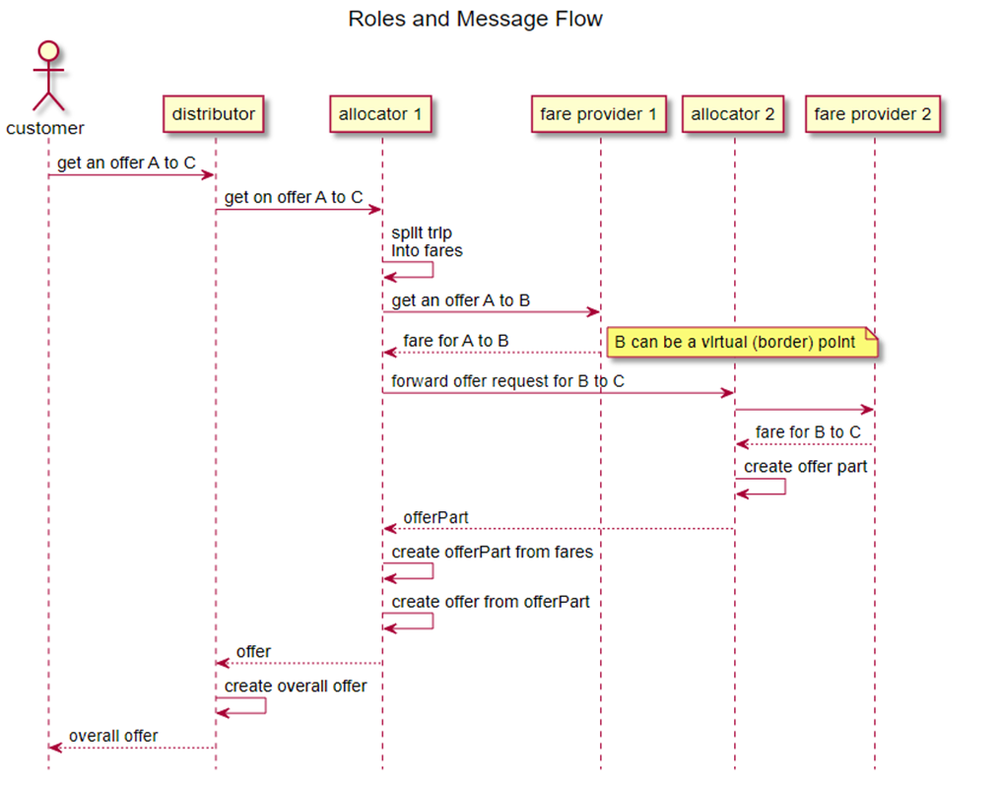

## Compliance

To be compliant with the OSDM specification in total a party must be compliant
with the offline as well as the online part of the specification. However, a
party can decide based on their business need to implement the offline or the
online part online based on the role they want to play in the sales process.

## Compliance with the Offline Part

An implementation of the bulk data exchange specification is compliant with the
specification if

- A feature specified in the data structure is implemented

Or

- A fare providing the feature in its data is excluded from sale

A system receiving data for a fare must be able to understand all features and
rules of the fare defined in the data and obey these features and rules or must
not sell such a fare.

## Compliance with the Online Part

### Compliance as a Distributor

The following services/features are mandatory/optional to implement:

| Resources                                                                                                                          | Description                                                                                       | Need to Support                                                               |
| ---------------------------------------------------------------------------------------------------------------------------------- | ------------------------------------------------------------------------------------------------- | ----------------------------------------------------------------------------- |
| `/places` and `/trips`                                                                                                             | Resources to search for trip and places                                                           | **Optional** for train stations TAP TSI retail code needs to be supported.    |
| `/offers`                                                                                                                          | Resources to get bookable offers                                                                  | **Mandatory** is to provide at least admission offers.                        |
| `/availabilities`                                                                                                                  | Resources to get information on available seats for a booking                                     | _Conditional_; mandatory to be supported in case seat assignment is provided. |
| `/bookings/{bookingId}/bookedOffer/{bookedOfferId}/admissions` and `/bookings/{bookingId}/bookedOffer/{bookedOfferId}/ancillaries` | Resources to manipulate parts of a booking consisting of, e.g., admissions or ancillaries         | **Mandatory**                                                                 |
| `/bookings/{bookingId}/bookedOffer/{bookedOfferId}/reservations`                                                                   | Resources to manipulate seat assignment                                                           | _Conditional_; mandatory to be supported in case seat assignment is provided. |
| `/bookings`                                                                                                                        | Resources to manipulate bookings                                                                  | **Mandatory**                                                                 |
| `/bookings/{bookingId}/passengers`                                                                                                 | Resources to manipulate passenger information at every stage of the flow                          | **Mandatory**                                                                 |
| `/bookings/{bookingId}/purchaser`                                                                                                  | Resources to manipulate a purchasers information at every stage of the flow                       | **Mandatory**                                                                 |
| `/products`                                                                                                                        | Resources to retrieve products information on one or more products                                | _Optional_                                                                    |
| `/bookings/{bookingId}/fulfillments` and `/fulfillments`                                                                           | Resources to retrieve fulfillments, e.g. tickets                                                  | **Mandatory** is to support A4 PDF tickets.                                   |
| `/bookings/{bookingId}/refundOffers`                                                                                               | Resources to get and accept a refund offer                                                        | **Mandatory** is to support full refund.                                      |
| `/coachLayouts`                                                                                                                    | Resources to get layouts of coaches                                                               | _Optional_                                                                    |
| `/complaints`                                                                                                                      | Resources to manage complaints                                                                    | _Optional_                                                                    |
| `/bookings/{bookingId}/exchangeOperations`                                                                                         | Resources to manage exchange operations                                                           | _Optional_                                                                    |
| `/bookings/{bookingId}/releaseOffers`                                                                                              | Resources to get and accept a release offer to return a ticket as a preliminary step for a refund | _Optional_                                                                    |
| `/bookings/{bookingId}/reimbursements`                                                                                             | Resources to manage reimbursements of unused tickets                                              | _Optional_                                                                    |
| `/bookings/{bookingId}/onHoldOffers`                                                                                               | Resources to manage on hold offers (extensions of the booking time limit)                         | _Optional_                                                                    |
| `/bookings/{bookingId}/cancelFulFillmentOffers`                                                                                    | Resources to cancel a fulfillment                                                                 | _Optional_                                                                    |

All [non-functional requirements](../non-functional-requirements) defined in the
services must be fulfilled.

Especially all implementations most support the Tolerant Reader pattern. This
integration pattern helps creating robust communication systems. The idea is to
be as tolerant as possible when reading data from another service. This way,
when the communication schema changes, the readers must not break.

### Compliance as a Carrier, Fare Provider

The following services/features are mandatory/optional to implement:

| Resources                                                                                                                          | Description                                                                                       | Need to Support                                                                                                                 |
| ---------------------------------------------------------------------------------------------------------------------------------- | ------------------------------------------------------------------------------------------------- | ------------------------------------------------------------------------------------------------------------------------------- |
| `/places` and `/trips`                                                                                                             | Resources to search for trip and places                                                           | _Optional_                                                                                                                      |
| `/offers`                                                                                                                          | Resources to get bookable offers                                                                  | **Mandatory**                                                                                                                   |
| `/availabilities`                                                                                                                  | Resources to get information on available seats for a booking                                     | _Conditional_; mandatory to be supported in case seat assignment is provided.                                                   |
| `/bookings/{bookingId}/bookedOffer/{bookedOfferId}/admissions` and `/bookings/{bookingId}/bookedOffer/{bookedOfferId}/ancillaries` | Resources to manipulate parts of a booking consisting of, e.g., admissions or ancillaries         | **Mandatory**                                                                                                                   |
| `/bookings`                                                                                                                        | Resources to manipulate bookings                                                                  | **Mandatory** is to support bookings consisting of fares except in the special case of direct sale fare offers                  |
| `/offers/{offerId}/passengers` and `/bookings/{bookingId}/passengers`                                                              | Resources to manipulate passenger information at every stage of the flow                          | _Conditional_, mandatory to be supported in case personal data are required by the fare provider                                |
| `/bookings/{bookingId}/fulfillments` and `fulfillments`                                                                            | Resources to retrieve fulfillments, e.g. tickets                                                  | _Conditional_, mandatory to be supported in case fulfillment items need to be provided                                          |
| `/bookings/{bookingId}/refundOffers`                                                                                               | Resources to get and accept a refund offer                                                        | **Mandatory** is to support for full refund, partial refund is optional. Not required in the special case of direct sale offers |
| `/bookings/{bookingId}/exchangeOffers`                                                                                             | Resources to get and accept an exchange offer                                                     | _Optional_                                                                                                                      |
| `/coachLayouts` and `/coachLayouts/{layoutId}`                                                                                     | Resources to get layouts of coaches                                                               | _Optional_                                                                                                                      |
| `/complaints`                                                                                                                      | Resources manage complaints                                                                       | _Optional_                                                                                                                      |
| `/bookings/{bookingId}/exchangeOperations`                                                                                         | Resources to manage exchange operations                                                           | _Optional_                                                                                                                      |
| `/bookings/{bookingId}/releaseOffers`                                                                                              | Resources to get and accept a release offer to return a ticket as a preliminary step for a refund | _Optional_                                                                                                                      |
| `/bookings/{bookingId}/reimbursements`                                                                                             | Resources to manage reimbursements of unused tickets                                              | _Optional_                                                                                                                      |
| `/bookings/{bookingId}/onHoldOffers`                                                                                               | Resources to manage on hold offers (extensions of the booking time limit)                         | _Optional_                                                                                                                      |
| `/bookings/{bookingId}/cancelFulFillmentOffers`                                                                                    | Resources to cancel a fulfillment                                                                 | _Optional_                                                                                                                      |

All [non-functional requirements](../non-functional-requirements) defined in the
services must be fulfilled.

On a technical level the implementation must support the Tolerant Reader
pattern. This integration pattern helps creating robust communication systems.
The idea is to be as tolerant as possible when reading data from another
service. This way, when the communication schema changes, the readers must not
break.

An implementation of specification is compliant with the specification if for a
given version

- A feature specified in the data structure is implemented

Or

- A fare providing the feature in its data is excluded from sale

A system receiving data for a fare must be able to understand all features and
rules of the fare defined in the data and obey these features and rules or must
not sell such a fare.
