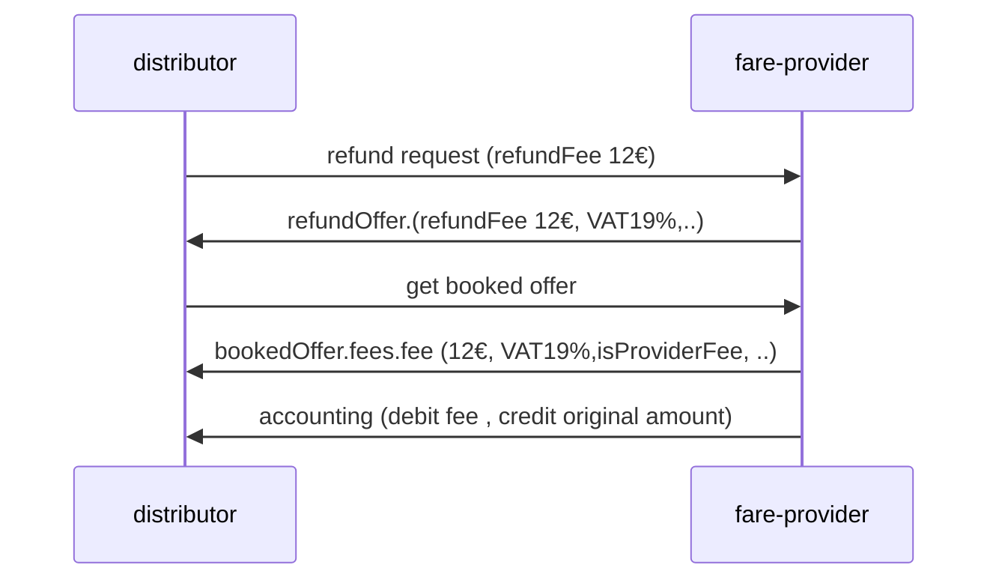

## Table of contents

1. [Introduction](#Intro)
2. [Passengers](#Passengers)
3. [Combination Rules](#CombinationRules)
4. [Combining Rules](#RegionalValidity)
5. [Reservation Fares](#Reservation)
6. [Combining After Sales Rules](#AfterSalesRules)
7. [Creating Fulfillments](#Fulfillments)
8. [Handling After Sales](#AfterSales)

## Introduction <a name="Intro">

Fares are building blocks for a distributor to form products, product based
offers and transport contracts including different carriers/fare providers. The
fares can be provided by a carrier/fare provider using the OSDM online API as
offers for fares or via the offline fare data. The distributor has the task to
combine the fares from different providers into products according the the rules
set in the fares.

By nature the fares are foreseen to be used in combination with other fares,
However a fare from one provider could be used to create a product. This is
mainly done with offline fares as for OSDM online the original products of the
provider can be accessed. Converting a single online fare from only one provider
without combining it is not recommended and might be prohibited by the provider.

Offline and Online Fares share some data objects, but the data context is
different. Online Fares are always part of an offer for a specified trip and a
specified list of passengers, whereas in Offline Fares this context is missing
and the Offline Fares must provide all data required to link them into such a
context.

As fares are only building blocks to construct a product they do not include all data a
product based admission includes. The Fare and Fulfillments on Fares do not
include:

- A product definition
- A `FulfillmentDocument` as the fulfillment is constructed by the Distributor.
  However a fare might include fulfillment parts that need to be integrated in
  the fulfillment (e.g. additional bar code,..)
- In some Business Models the Fare specifies a type of after sales rule only,
  not the exact after sales fees

Additionally Fares include data to support the construction process. These are
not included in products like admissions.

- Combination Models defining the allowed combinations with other fares
- AfterSales Models defining the way after sales can be handled by the
  distributor
- Rules on through ticketing to allow of deny through ticketing with fares of
  other providers
- Connection Points for connecting routes at borders between tariff regimes.
  (Tariff regime borders are usually not part of a trip specification)

Offline Fares need to provide additional data to link them to the sales context
(trips, passengers, language, ...):

- Availability for Sale (Sales Window)
- Travel validity
- Passenger Constraints to link fares to passengers
- Multiple Languages

The RegionalValidity is included in Offline and Online Fares, but the usage of
the data is different. The data included in the Offline Fares are used to link
the fare to possible trips by the distributor. With online fares this is already
done by the fare provider. The regional validity in the online fare is used to
provide this information to the passenger and to the control staff via ticket
bar codes.

Fares can be requested via the `POST \offers` indicating `FARE_ADMISSION`,`FARE_RESERVATION` or,
`FARE_ANCILLARY` in `offerSearchCriteria.requestedOfferParts`.

The offer request might ask for product based admissions at the same time. Use
cases for a mixed request might be that some part of the requested trip part is
covered by products only. E.g. Fare Salzburg-Vienna + Product Based admission
for Vienna city traffic.

In case of free transport a fare with zero price needs to be provided to allow
the construction of products.

## Passengers <a name="Passengers">

An offer must always include fares for all passengers. In case the pricing can
be split between passengers a fare per passenger should be created. Otherwise
Fares for multiple passengers are used.

## Fare Combination Rules <a name="CombinationRules">

Fare Combination Rules are included in Offline and Online Fares. They govern the
combination of fares from different providers.

[Fare Combination Rules - Data
Structures](https://osdm.io/spec/common-data-structures/#FareCombinationConstraint)

The combination rules include:

- business model ('model') that governs the combination. This mainly defines the
  was after sales conditions must be applied:
  - `CLUSTERING_MODEL`: The Distributor is allowed to apply his standard after
    sales rules for the flexibility cluster of the final product.
  - `COMBINING_MODEL`: The distributor must obey the after sales fees provided for
    the fare. In case of an Online Fare these are provided in the offer for
    customer information and during the online after sales in the message
    exchange.
- providers where a fare combination is allowed
- indication whether the fare is allowed to be converter into a product without
  combining it with fares from another fare provider
- list of flexibility clusters of the final product that can contain this fare
  (`allowedClusters`)
- allowed distributors (Offline Fares only)
- list of fare providers with whom a through ticket is allowed
  (`allowedCommonContracts`). Note: Separate contracts can be contained on one
  fulfillment Document (Ticket) but the separation of contracts has to be
  indicated clearly on the ticket.

A Fare can have multiple combination constraints. One of them must match to
construct a combination.

CLUSTERING and COMBINING rules are based on a classification of Products and
Fares according to their flexibility:

| CLUSTER_MODEL | description                                                                                           |
| ------------- | ----------------------------------------------------------------------------------------------------- |
| `BUSINESS`    | Refundable/Exchangeable after the departure or last day of validity                                   |
| `FULL_FLEX`   | Refundable/Exchangeable before the departure or last day of validity                                  |
| `SEMI_FLEX`   | Refundable/Exchangeable with fee depending on conditions of the distributor. Minimum validity applies |
| `NON_FLEX`    | Non refundable. Non exchangeable. Minimum validity applies                                            |
| `PROMO`       | Used on a bilateral basis only. Non refundable. Non exchangeable. Minimum validity applies            |

A Product build from Fares must follow one of the cluster models. The Fare
provides rules on the cluster models that are allowed to contain the fare. The
rules usually ensure that a Fare can only be included in a product of the same
cluster model or a cluster model that allows less flexibility in terms of after
sales rules.

E.g. A `FULL_FLEX` fare might be allowed to be included in a `SEMI_FLEX` product,
but not in a `BUSINESS` product.

## Combining Regional Validity <a name="RegionalValidity">

The usage of the regional validity is different in Offline and in Online Fares.
In Offline Fares they must provide the data to match the route with a trip from
the distributors time table engine. In Online fares the matching is done by the
fare provider, the distributor implementation is therefore much simpler.

The data model of the Route is identical in online and offline fares but the
representation differs as the online representation avoids recursive data
structures for security reasons.

[Regional Constraint - Data
Structures](https://osdm.io/spec/common-data-structures/#RegionalConstraint)

Route example:

### Regional Validity in Online Fares

The route description of a product combined from fares is a concatenation of the
route descriptions of the individual Fares with the addition of an indication of
the tariff border usually using an abbreviation '(GR)' od '(fr)' and '\*' as
separation signs. A Station name from the connection point of the two regional
constraint might be added:

'<route description fare 1>_connectionPointStation name (fr)_<route description
of fare 2>'

The online fare does not necessarily need the structured route description from
routeItem/routeItemList, the description can be build from the route summary.
However the structured route enables more use cases e.g. automated control of
bar codes, graphical displays of the route).

If structured route data are provided it is recommended to build the description
based on the structured data.

The (fare) connection point(s) where the route can be connected to other fare routes is
provided by the fare provider. It is recommended to check the matching of the
connection points on distributor side to ensure that the routes from different
providers are selected properly and match without gap.

### Regional Validity in Offline Fares

For offline fares the connection point(s) and the structured route data are
essential for aligning the route to trips, therefore the structured route
information is mandatory. Combinations with other fares are only allowed when
the connectionPoint(s) are matching.

)

Data model:

Object model:

## Reservation Fares <a name="Reservation">

Reservations can follow the fare model. These are then requested as
`FARE_RESERVATION` and indicated with distributionMode `FARE_MODE`. The
differences to Product based reservations are marginal (with OSDM v.4.0 the
reservation object will be used in both cases), the fulfillment of a reservation
fare does not include a fulfillment document as the reservation will be
integrated in the documents constructed by the distributor. The fare reservation
will not include or link to a reservation fee as the fee is added by the
distributor according to his general reservation fee rules.

As the difference to normal reservations is almost neglectable and with version
4 there will be only one reservation object. With OSDM v.3 the fare object with
reservation data is available but deprecated. The general reservation should
already with OSDM v.3 be used as fare reservation indicating the
distributionMode `FARE_MODE` in the reservation.

Reservations obtained by the H2O converter of Hitrail are by definition fare
reservations as the Hermes Protokoll only implements the fare model.

## Creating Fulfillments <a name="Fulfillments">

The distributor constructs the fulfillment for the product offer. The booking of
the fare returns a fulfillmentId for the fares, but usually the content of the
fulfillment will be empty. The restrictions on fulfillments provided in
`fulfillmentConstraint` must be obeyed.

In special cases additional fulfillment parts can be provided by the fare
provider (e.g. proprietary bar codes) based on bilateral agreements.

The fare provides a list of TCOs involved in the ticket control (`involvedTCOs`)
that should be informed by the distributor in case a ticket control exchange is
in place.

The fare provides additional information on age restrictions
(`passengerConstraints`) to be included in the barcode.

## Combining After Sales Rules <a name="AfterSalesRules">

### Clustering Model

In the clustering model the distributor applies its own after sales conditions
depending of the cluster of the product.

### Combination Model

The fare provides the exact after sales fees. The product adds the after sales
fees of all included fares. This results in an after sales fee that increases
whenever one of its fares after sales fees changes.

E.g.

- Distributor product including fare 1 and fare 2
- Fare 1 refund fee 10€ 10 days before traveling
- Fare 2 refund fee 8€ 15 days before traveling
- Product: 8€ refund fee 15 days before traveling, 18€ refund fee 10 days before
  traveling.

## Handling After Sales <a name="AfterSales">

### Clustering Model

In the clustering model the distributor applies its own after sales conditions
depending of the cluster of the product. Although the distributor calculates the
refund fee the refund has to be made via the OSDM API online.

The refund fees or exchange fees can follow two accounting models. In one model
the fee belongs to the client (distributor), in the other model the fee belongs
to the provider (fare provider / carrier). This is indicated in the
AfterSalesConditionsLink of the Fare (`isProviderFee: true`). If the fee belongs
to the provider the client will indicate the fee amount in the refund / exchange
request in `RefundSpecification.refundFee`. The provider will then use this amount
as refund fee and add the VAT split. The accounting flow fillows the usual fees,
the privide debits the fee to the client.

The accounting model will also be indicated in the resulting fee object created
by the provider.

### clustering model with provider fee flow

### Combination Model

The fare provides the after sales fees. The product adds the after sales fees of
all included fares. This results in an after sales fee that increases whenever
one of the fare after sales fees changes.

The Fee is subject to VAT according to the fare provider.
