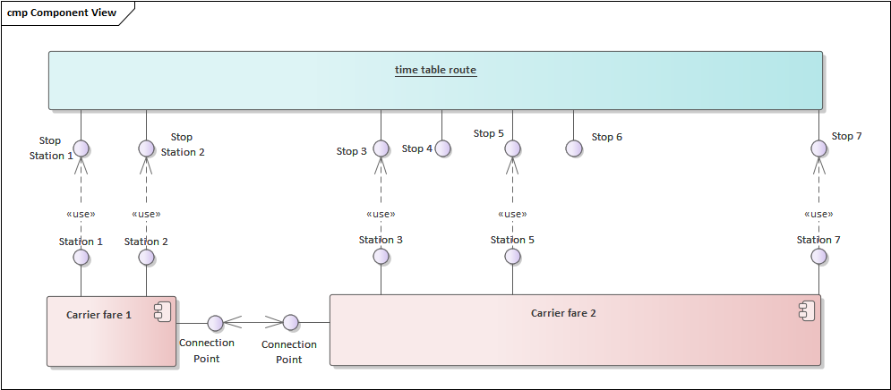

## Table of contents

1. [Introduction](#Intro)
2. [Passengers](#Passengers)
3. [Combination Rules](#CombinationRules)
4. [Combining Rules](#RegionalValidity)
5. [Combining After Sales Rules](#AfterSalesRules)
6. [Creating Fulfillments](#Fulfillments)
7. [Handling Aftersales](#Aftersales)

## Introduction <a name="Intro">

Fares are bricks for a distributor to form products, product based offers and transport contracts including different carriers/fare providers. The fares can be provided by a carrier/fare provider using the OSDM online API as 
offers for fares or via the offline fare data. The distributor has the task to combine the fares from different providers into products according the the rules set in the fares. 

By nature the fares are forseen to be used in combination with other fares, However a fare from one provider could be used to create a product. This is mainly done with offline fares as for OSDM online the original products of the provider can be accessed. Converting a single online fare from only one provider without combining it is not recommended and might be prohibted by the provider.

Offline and Online Fares share some data objects, but the data context is different. Online Fares are always part of an offer for a specified trip and a specified list of travellers, whereas in Offline Fares this context is missing and the Offline Fares must provide all data required to link them into such a context. 

As fares are only bricks to construct a product they do not include all data a product incudes. A fare does not include:

 - A product object as this will be conbstructed by teh Distributor
 - A FulfillmentDocument as the fulfillment is constructed by the Distributor. However a fare might include fulfillment parts that need to be integrated in the fulfillment (e.g. additional bar code,..)
 - In some Business Models the Fare specifies a type of after sales rule only, not the exact after sales fees 

Additionally Fares include data to support the construction process. These are not included in products likke admissions.

 - Combination Models defining the allowed combinations with other fares
 - AfterSales Models defining the way after sales can be handled by the distributor
 - Rules on through ticketing to allow of deny through ticketing with fares of other providers
 - Coonection Points for connecting routes at borders between tariff regimes. (Tariff regime borders are usually not part of a trip specification)

Offline Fares need to provide additional data to link them to the sales context (trips, passengers, language, ...):

 - Availability for Sale (Sales Window)
 - Travel validity
 - Passenger Constraints to link fares to passengers
 - Multiple Languages

The RegionalValidity is included in Offline and Online Fares, but the usage of the data is different. The data included in the Offline Fares are used to link the fare to possible trips by the distributor. With online fares this is already done by 
the fare provider. The regional validity in the online fare is used to provide this information to the traveller and to the controll staff via ticket bar codes. 

Fares are via the 'POST \offfers' indicating 'FARE_ADMISSION','FARE_RESERVATION' in 'offerSearchCriteria.requestedOfferParts'. 

The offer request might ask for product based admissions at the same time. Use cases for a mixed request might be that some part of the requested trip part is covered by products only. E.g. Fare Salzburg-Vienna + Prduct Based admission for Vienna city traffic.

## Passengers <a name="Passengers">

An offer must include always fares for all passengers. In case the pricing can be split between passengers a fare per passenger should be created. Otherwise Fares for multiple passegers are used.

## Fare Combination Rules <a name="CombinationRules">

Fare Combination Rules are included in Offline and Online Fares. They govern the combination of fares from different providers. 

[Fare Combination Rules - Data Structures](https://osdm.io/spec/common-data-structures/#FareCombinationConstraint)

The combination rules include:
  - business model ('model') that governs the combination. This mainly defines the was after sales conditions must be applied:
     - CLUSTERING_MODEL:   The Distributor is allowed to apply his standard after sales rules for the flexibility cluster of the final product.
     - COMBINING_MODEL:  The distributor must obey the after sales fees provided for the fare. In case of an Online Fare these are provided in the offer for customer information and during the online after sales in the message exchange.
  - providers where a fare combination is allowed
  - indication whether the fare is allowed to be converter into a product without combining with another fare provider
  - list of flexibility clusters of the final product that can contain this fare ('allowedClusters')
  - allowed distributors (Offline Fares only)
  - list of fare providers with whoom a throught ticket is allowed ('allowedCommonContracts'). Note: Separate contracts can be contained on one fulfillment Document (Ticket) but the separation of contracts has to be indicated clearly on the ticket.

A Fare can have multiple combination constraints. One of them must match to construct a combination. 

## Combining Regional Validity <a name="RegionalValidity">

THe usage of the regional vaidity is different in Offline and in Online Fares. In Offline Fares they must provide the data to match the route with a trip from the distributors time table engine. In Online fares the matching is done by the fare provider, the 
distributor implementation is therfore much simpler.

The data model of the Route is identical in online and offline fares but the representation differs as the online representation avoids recursice data strucrures for security reasons. 

[Regional Constraint - Data Structures](https://osdm.io/spec/common-data-structures/#RegionalConstraint)

Route example:

### Regional Validity in Online Fares

The route description of a product combined from fares is a concatenation of the route descriptions of the individual Fares with the addition of an indication of the tariff border usually using an abbreviation '(GR)' od '(fr)' and '*' as separation signs. A Station name from the connection point of the two regional constraint might be added:

   '<route description fare 1>*connectionPointStation name (fr)*<route description of fare 2>'

The online fare does not neccessarily need the structured route description from routeItem/routeItemList, the description can b build from the route summary. However the structured route enables more use cases e.g. automated control of bar codes, graphical displays of the route).

If structured route data are provided it is recommended to build the description based on the structured data.

The connection point(s) where the route can be connected to other fare routes is provided by the fare provider. It is recommended to check the matching of the comnnection points on distributor side to ensure that the routes from different providers are seleced properly and match without gap.

### Regional Validity in Offline Fares

For offline fares the connection point(s) and the structured route data are essential for aligning the route to trips, therefore the structured route information is mandatory. Combinations with other fares are only allowed when the connectionPoint(s) are matching.

)

Data model:

Object model:

## Combining After Sales Rules <a name="AfterSalesRules">

### Clustering Model

In the clustering model the distributor applies his own after sales conditions depending of the cluster of the product.

### Combination Model

The fare provides the aftersales fees. The product adds the after sales fees of all included fares. This results in an aftersales fee that increases whenever one of the fare after sales fees changes.

## Creating Fulfillments <a name="Fulfillments">

The distributor constructs the fulfillment for the product offer. The booking of the fare returns a fulfillmentId for the fares, but usually the conet of the fulfillment will be empty. The restrictions on fulfillments provided in 'fulfillmentConstraint' must be obeyed.

In special cases additional filfilment parts can be provided by the fare provider (e.g. proprietary bar codes) based on bilateral agreements.

The fare provides a list on TCOs involved in the ticket control ('involvedTCOs') that should be informed by the distributor in case a ticket control exchange is in place.

The fare provides additional information on age restrictions ('passengerConstraints') to be included in the barcode. 

## Handling Aftersales <a name="Aftersales">

### Clustering Model

In the clustering model the distributor applies his own after sales conditions depending of the cluster of the product. Although the distributor calculates the refund fee the refund has to be made via the OSDM API online.

--> TODO discussion on exchange of fee (seems to be lost in the messages), indication of carrier fee lost in online fares

### Combination Model

The fare provides the aftersales fees. The product adds the after sales fees of all included fares. This results in an aftersales fee that increases whenever one of the fare after sales fees changes.

The Fee is subject to VAT according to the fare provider.
