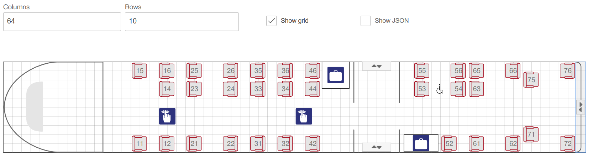
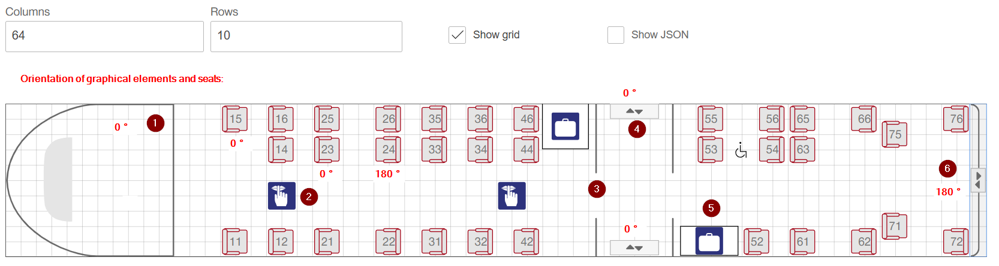

# Graphical Place Reservation

OSDM offers a standardized API for graphical place reservation. The API consists
of a resource to get the availabilities and a resource to get the logical coach
deck layout.

While the availability is called after a offer request dynamically, the coach
deck layout data should be imported periodically as a master data import.

## Getting Availabilities

There are two flows to get place availabilities. Either you pass in a offer id,
for which you would like to get availabilities or you pass in a existing booking
id.

The availability response is structured as follows: a vehicle consists of
coaches which can have multiple decks. The decks consist of different
compartment types. The type of compartment is defined by service class,
accommodation type and accommodation sub type. For example compartment can be a
second class family compartment. For each deck layouts an id references to the
logical deck layout.

Compartments consists of places. Places can be seats, couchettes or berth. For
each place a status indicates whether it's free, allocated or restricted. The
reservation reference allows to link the place to the correct reservation part.

Optionally it is possible for the reservation system to preselect places or
compartments.

## Getting Deck Layouts

The deck layout response is a logical description of a coach deck. A coach deck
layout is a grid of a given dimension (x, y). All entities describing a coach
deck are placed on this grid. The entities are either graphic elements or
service icons. A graphical element is e.g. a seat, a staircase, or a toilet . A
service icon is e.g. a first class icon indicating a first class service. See
[graphic items](https://osdm.io/spec/catalog-of-code-lists/#GraphicsItems) for a
list of all graphic items.

Both graphical elements as well as service icons are positioned on the grid
according to their defined rectangle which consists of a position (x, y, z) and
a size (width, height). A graphical element can also be rotated using a rotation
angle. This e.g. allows to use only one graphical element of a seat and to
arrange them around a table.

Per convention the grid layout out is in horizontal presentation of a vehicle
driving from right to left. The (0, 0) position is at the top left corner of the
grid.

Next is an example with orientation values of graphical elements and seats
shown. Zero degree denotes to the right direction, 90 degree to the bottom
direction, 180 degree to the left direction and 270 degree to the top direction.

Additionally, some of the graphical elements and service icons are denoted: (1)
driver area, (2) silence icon, (3) compartment passage, (4) entry/exit, (5)
luggage area and (6) coach passage.

