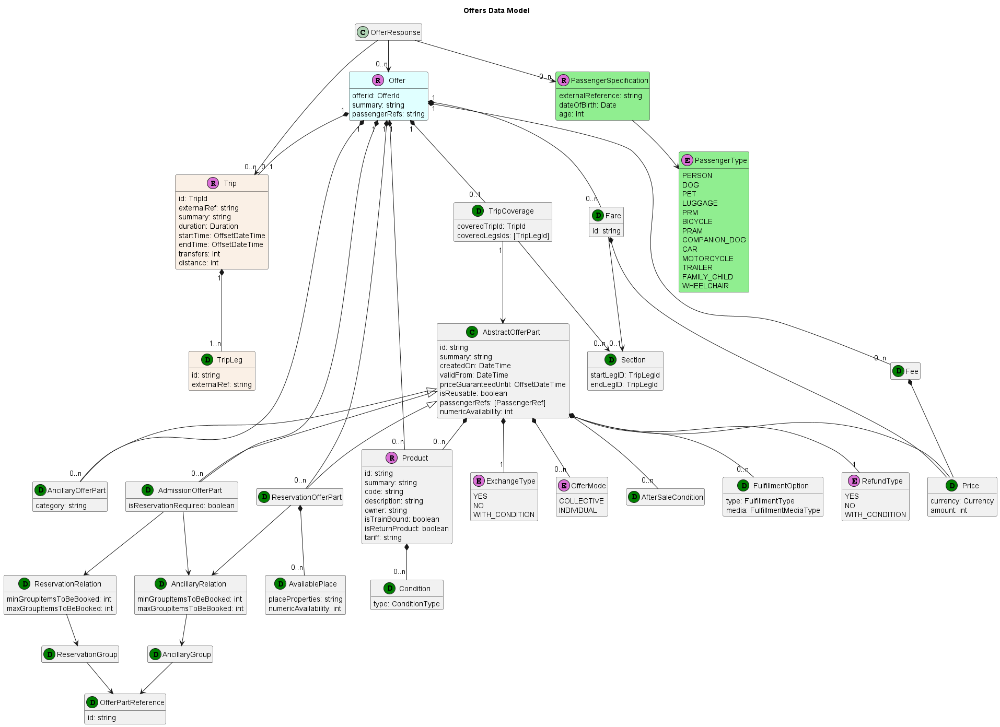
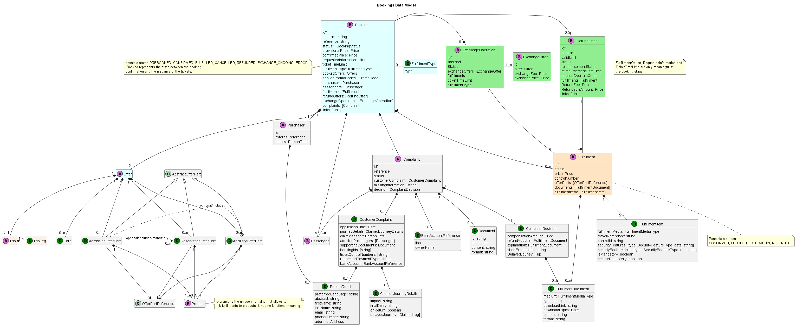
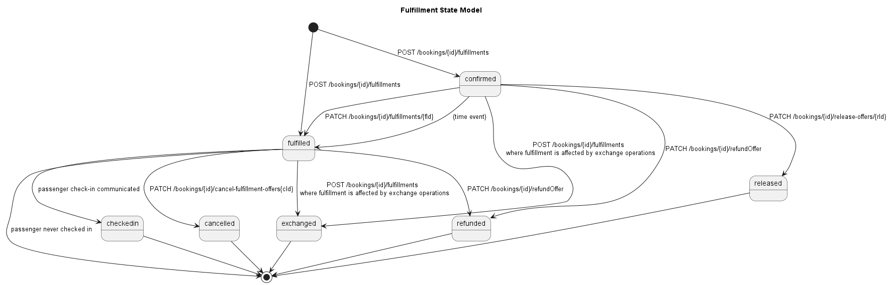

## Introduction

This page shows a representation of the data models underlying the API
specifications. It is therefore not a strict representation of the resources
themselves (those are self-represented in the OpenAPI specifications.)

As such, some of the details of how the information is structured in the API
are not represented or simplified in the data models. The main purpose of this data
model is therefore to help a quicker understanding of the API and its underlying
concepts.

### Legend

## Trips and Places

### Places Data Model

### Places

Places are resources representing a specific location in a trip: departure,
origin, intermediate stop or other. They can be of different types:

- **Address**: any street address can be represented here. Is included to
  foresee extension towards multi modality and first/last miles solutions

- **PointOfInterest**: used to represent a specific point of interest

- **StopPlace**: represent a place where a train or a bus stops. It is obviously
  the most relevant type for OSDM. StopPlaces can be indicated as codes from
  different code sets. As with other code list based representations in the API,
  using the UIC code set is highly recommended and mandatory for train stations.

- **GeoCoordinate**: allows providing any location on the globe using its
  geographical coordinates.

- **FareConnectionPoint**: allows to model virtual border points by defining
  stations within the connection point lies.

Places are modelled in the API as resources with a long time-to-live, which
should allow efficient caching of this data, therefore removing the need of
getting full location details in transactional operations.

### Trip Data Model

### Trips

Trips represent the concrete realization of a trip going from departure station
to destination station.

- **origin**: departure location of the tripleg
- **destination**: arrival location of the tripleg

A trip is composed of one or more `triplegs` and can be of one the following type:

- **TimedLeg**: A type of leg with a timetable schedule such a provided by
  public transport
- **TransferLeg**: A type of leg that links two legs such as walking from
  one stop to another
- **ContinousLeg**: A type of leg that is not bound to a timetable. This
  leg is mainly aimed at new modes such as scooter, taxis,..

Each `tripleg` (also sometimes called leg) represents a connection between two
places where the traveller will either step in a transport or step out of a
transport (most likely a train).

Regardless of whether the products to travel these triplegs are train-bound, or
based on with a validity period of any duration, triplegs (and by extension
trips) are always train-bound and represent the realization of the travel wish
using specific trains at a specific moment in time.

Trips can be retrieved with or without details of all intermediate stops on the
way between departure and arrival of each `tripleg`.

## Offers

### Offers Data Model

## Main Resources

### Offers

In the **Distributor Mode**, offers represent a collection of `OfferParts`,
representing bookable elements that covers exactly one a specific trip (or the
requested section of a trip in case of allocator request to an nTM Provider).
Note that the offer contains a reference to the trip resource it is built for,
although this reference can be redundant when the `TripOffer` the offer is part
of is already known to the API consumer

Some of these elements can be optional (see further).

In the **Allocator Mode**, an offer will not contain offer parts but it will 
contain a fare element, that the allocator can use to build the final product to be
distributed to travellers. There can also be hybrid situations where offers will
contain both offer parts and fares if the provider offers product in the two
flavors.

In some cases, API consumers will be required to provide some additional
information in order to proceed with the provisional booking. In this case, the
information needed will be specified in the `requestedInformation` element using
a notation akin to regular expressions.

Offers should always contain a `minimalPrice` (= the price of the offer without
any of the optional offer parts), a global service class, service level and
flexibility. Although the calculation rules for these global values are up to
the OSDM provider, the following rules are recommended:

- `ServiceClass`: the lowest class of a significant offer part should be the
  service class of the offer (1st class + 2nd class = 2nd class)

- `ServiceLevel`: the highest service Level should be the service level of the
  offer  (bed + berth in compartment of 2 + berth in compartment of 4 = berth
  in compartment of 2)

- `Flexibility`: the lowest flexibility of a significant offer part should be the
  service class of the offer (full flex + mid flex = mid flex)

Offers usually have a validity period, that is the period over which, from the
fare conditions, the offer is likely to be proposed. It is not a guarantee
that the offer remains available for that period

Offer resources and all related resources (`TripOffers` and all sub resources)
should have a limited lifetime (recommended value 30 minutes) and be discarded
when expired or at booking time.

### TripOffers

`TripOffers` are the resources grouping all the offers relating to one same trip.
Indeed, in most cases the **Allocator** provider will propose several offers of
different comfort and flexibility levels. In this resources, the trip resource
representing the trip the offers are for and the passengers for the trip.

#### Offers with Partial Coverage

It is possible in OSDM to propose offers covering only a subset of the requested trip
under specific conditions:

- the triplegs covered by a given offer are indicated through the `coveredTripLegIndexes`
  property
- all offers covering the same set of triplegs belong to the same  `offerCluster`. All offers related to the same `offerCluster` therefore have an identical set of `coveredTripLegIndexes`
- a `tripleg` can only be covered in one `offerCluster` within a `tripOffer` (no overlap)
- each `tripleg` of the `trip` must be covered by at least one `offer` in each `TripOffer`
  (no gap)

*Example with no overlap*

*Example with no gap*

### OfferParts

Although `OfferParts` are by themselves not a resources, they deserve a separate
section in order to for the reader to clearly understand the data model design.
The idea is that `OfferParts` represent an instantiation of a product that can
be sold.

*Example*:

- A carrier proposes an "Early bird Holiday Fare" product for all its
  high-speed trains riding towards the seaside of the country, offered when
sales date is at least 15 days prior to travel.

- Whenever an offer request is received and this fare can apply, an offer part
  is created and proposed, specifically to the date, origin and destination of
that specific request, and referencing this product. As such it is therefore
the offer part that for example will carry the actual price.

These offer parts can be of different type, depending on what they represent:

- **Admissions**
- **Reservations**
- **Ancillaries**
- **Fees**

However, all these different type share a significant amount of
characteristics: they all apply to a defined set of passengers, have a price
(calculated individually or collectively), and a few additional attributes.
They also fill in the same fundamental role in the offer, which is why they are
represented here as an abstract parent class.

#### Multiplicity

In OSDM, offer parts are not normalized, but will reflect the reality of the
products generated. This means that one offer part will almost always equal one
fulfillment in the resulting booking, should it be completely realized and
confirmed.

So, two passengers travelling together happen to get exactly the same product
(because their profile is identical in terms of age, reductions etc), will
still get two individual offer parts (one per passenger) if the product covered
has individual pricing and fulfillment, while they would be grouped in one
offer part in case of collective pricing and fulfillment. (see examples at the
end of the offer section)

### Offer Parts - Admissions

Admission offer parts represent a travel right, or the entitlement to travel
onboard a train between the given origin and destination, following the given
route, without a seat reservation. In most cases, these train products will not
be train-bound either.

In some vehicles, seat reservations or an ancillary products (such as a
WIFI connection or a meal onboard) can  be associated with the admission for
one or more of the triplegs. A link will in this case point from the admission
to the reservations or ancillaries, and the link will be qualified. Ancillaries
can be either included or optional, while reservation can also be mandatory to
travel. Finally there can be a cases where all reservations associated are
optional while it is mandatory to pick at least one (it can be the case for
night trains for example). In this case the reservations will all be qualified
as optional, but the reservationRequired flag of the admission will be set to
true.

### Offer Parts - Reservations

Reservation offer parts represent a seat (or other accommodation) reservation
on the transportation. In contrast with admissions, a reservation is in essence
bound to a specific train, although it normally does not include the
entitlement to board the train. Travellers therefore typically need an a
associated admission offer part or other entitlement (such as a pass)  in order
to actually travel.

Note booking an offer will not book the reservations in the offer unless they
have an `included` relationship with an admission of that offer. In order to
add a non-included reservation to a booking, the reservation ids will have to
be passed in.

Reservations have several additional attributes due to their specificities
compared to admission products:

- Reservation Details provide additional information on the service Level and,
  once the offer will have been booked, the exact reserved places, with their
  properties and links to the concerned passengers

- Place selection Details: contains several elements related to the selection
  of places:

  - `ReservationOptions` show, at offer retrieval stag which options are
    available for this reservation.

  - `SelectedOptions` allows the API consumer to specify desired options.

  - `SelectablePlaces` and `SelectedPlaces` are only relevant to graphical
    selection of seats (seat map).

#### Modelling Lump Sum Reservations

For some trains, especially in Germany and Austria today, a specific form of
reservation booking can be found where the price for adding an optional or
mandatory (but not free) reservation remains the same regardless of the number
of reservations actually booked. In order to represent this type of reservation
with the current model, two approaches are proposed to implementers:

- Generate two distinct offers: one with all (available) reservations proposed as
  included, the lump sum for the reservations being integrated in the admission
price. In this approach it is assumed that a passenger will always book all
available reservation, since the price is the same anyway. This approach also
allows to not propose a reservation if there is none available on one of the
tripleg, while still offering the offer for the complete trip with reservations
on all triplegs where it is available

- Propose all reservations as optional reservations with an identical unit
  price equals to 0 or to the reservation lump sum, associated with specific
information in the product conditions or the offer messages. At booking time, a
price update (increase or decrease) is then applied so that the lump sum is
counted once and only once, associated with a booking message warning that the
price update took place.

### Offer Parts - Ancillaries

Ancillaries are used to represent non-transport products associated with the
transportation request submitted. It could be onboard services such as a WIFI
connection or a meal, or services associated with one of the stops, or
origin/destination, like a parking spot or lounge access.

This offer part is significantly simpler than those instantiating transport
products, and only has one additional attribute, being the category of the
ancillary.

### Offer Parts - Fees

Fees are used to represent additional costs for services or products. Offer
parts of type "fee" can be applied to the booking process (e.g. a service fee),
the trip (e.g. a reservation fee which is applied to all reservations in trains
running in the same direction, namely outward or inward travel) or other offer
parts. In contrast to other offer parts in OSDM, the customer is not free whether
to choose a fee or not: fees are generated and applied to other services or
products by the provider system.

### Products

Products are the products actually offered by the OSDM provider, either directly
or either as distributor if the OSDM provider itself retrieves the products  (or
constitutive fares) from another provider. Products resources contain all the
conditions and attributes of the product, regardless of the actual sale case.
Typically this matches commercial products having the same name and
recognizable common sales & after sales characteristics.

Although no manipulation is performed on products, it is nevertheless proposed
as a resource mainly to allow caching of the information. Indeed, since product
information usually does not change too frequently (and usually at well defined
dates), those resources can then be exposed with a significantly longer
time-to-live and save significant bandwidth. It also allows for a "product
catalog" functionality to be built by the API consumer, should he want to do
that.

### Fares

Fares should be seen as the counter part of `OfferParts` in case of interactions
between an allocator and a fare provider. The key difference here
is that where offer parts are products defined by the provider and fulfilled by
it as well, the fares do not constitute a distributable product. It is up to
the allocator to build the distributable product (that he could then distribute
as an offer part via an OSDM API), based on one single fare or by combining
fares coming from different providers. In consequence, the fulfillment of the
resulting product is the responsibility of the allocator as well.

For distribution systems also able and allowed to act as allocators,
encapsulating both fares and offer product in offers allows to have a similar
flow of interactions regardless of the type of provider.

### Passengers

As the name suggests, passenger resources represent the passengers for whom the
offers are proposed. All offers generated are always proposed for the complete
set of passengers (no partial offers covering only a part of the passengers is
generated). However, it is possible that because of age, reductions or other,
some passengers are allowed to travel some triplegs without actually needing a
travel right or reservation. It is for example usually the case for infants
travelling on their parents lap.

While a lot of attributes can be set for passengers, only a few are required at
this stage (and even later). The key elements at offer stage are already
specified in the offer request. The link between the possibly anonymous
passenger profiles (in most basic form:  a unique (in the booking) reference,
age and reduction entitlement if any) created in the offer request and the
passenger resources in the `TripOffers` can be made based on the passenger
reference attribute.

The passenger resources created in the context of offers have their lifetime
strictly limited to the lifetime of the offer resource they are part of. The
resource and all local traces of it should be discarded once the offer has been
booked or reached the end of the lifetime, in order to avoid any privacy
concern.

### Passengers Representation

In the railway world, several elements are used to define a passenger profile
(mostly in order to define the products it is entitled to):

- the passenger's age
- the reduction cards the passenger owns
- whether the passenger is a reduced-mobility or otherwise disabled passenger
- other specific status entitling to specific fares (military, senator, journalist...)

While in some systems, all the notions above are mixed into one "passenger
type" notion, this approach is much more difficult, and cumbersome, to apply
when multiple providers are involved, which is highly likely with OSDM. Indeed,
different systems often have different age limits for types, and different ways
to represent the other elements. For this reason, in OSDM we decide to map the
elements above to two kinds of attributes:

- Passenger birth date, modelled as-is in the API. Note it could be a dummy
  birth date. Each implementer is then free to map this value to the age-related
passenger types he is using internally

- Some attributes related to passengers disabilities (for accommodation
  purposes mainly)

- All other notions are modelled as reductions. Again, each implementer can map
  internally this clearly defined notion to the internal representation.

The presentation hereunder provides some additional examples of high-level
offer modelings for pure-OSDM offers.

### Booker

A booker represent the entity which has booked an offer. It is the person to
contact in case of changes to the booking primary.

A booker does not need to travel thus is not necessary a passenger.

Common attributes of a passenger and a passenger are factored in the person entity.

## Booking

### Booking Data Model

### Main Resources

### Booking

The booking represents the local (to the OSDM provider) booking for the offers
that have been selected. It contains a set of sub resources, most of which were
encountered in the offer stage. but also adds a few specific attributes and
information, the most important undoubtedly being the booking status (see for
the state model below). The booking will indeed evolve over time based on API
consumer actions, time elapsed or other business events.

The booking also contains additional attributes that are needed to manage and
control the confirmation of the booking when it is in provisional state, such
as the ticket time limit or the fulfillment options.The ticket time limit is
the time during which the booking is guaranteed to remain available for
confirmation for the price and possible reservations assigned at provisional
booking time. Basically, it is the time given to the API consumer to perform
all updates needed to confirm the booking, and trigger that confirmation.

At the root of the booking structure, Two balance elements are provided, in
order to clarify the state of the financial exchange between an API consumer or
booker and the OSDM:Distributor:

- conditional balance is the balance of the booking that is not confirmed. It
  is the amount that will be due to the provider if the booking is further
  confirmed.

- confirmed balance: is the balance of the booking that is confirmed. Unless
  after sales takes place on one or more fulfillments in the booking, this
  amount now must be paid to the provider.

Also located at the root of the booking structure is the ticket time limit.
This is the time for which the provider will hold a booking in pre-booked
state, waiting for the confirmation while guaranteeing the booking for the
given products, spaces at the announced price. Obviously, this value only has a
meaning for a booking in pre-booked state. A commonly accepted value would be
around 30 minutes, which is normally sufficient to allow finalizing the
booking,while not monopolizing resources too long in case the booking is
abandoned without properly cancelling it. However, some systems may decide a
longer time. Obviously, the value for the booking ticket-time limit can never
exceed the earliest ticket time limit of any of its offer parts.

`FulfillmentOptions` allows the API consumer to specify the format desired for
the fulfillment. Only electronic fulfillment is considered in the MVP scope.

### BookedOffers

`BookedOffers` are actually the same resources as the offers except that they are
now booked. Most of the resource remains unchanged, except for the sections on
reservation details (either in reservation `Offerpart`s, or in fares), where
but the sections related to the reserved places (in reservationDetails) will
now be populated with the references to the space allocated by the provider
system where the transport product is hosted.

### Fulfillments

`Fulfillments` could once have been called tickets. But the evolutions in the
industry have led this to be a limitative naming, as various kinds of
ticketless onboard controls are rapidly taking over and become the norm rather
than the exception. Since in OSDM only the distribution part of the process is
in scope, the details of how to produce or control fulfillment are not covered.
From a distribution standpoint, the only needs are

The possibility to point at a fulfillment representing an offer part (= the id)
for after sales operations.  The capability to link this fulfillment to that
associated offer part they relate to.  A business identifier that can be used
in associated processes. For railways, that would be the Ticket Control Number
(TCN).

Links to the documents or other security features that can be used to
represent and control fulfillment status. In most case it is a PDF document
and/or a barcode.  These are all provided in the fulfillment sub resource.

### Passengers

The passengers sub-resource in the booking is actually the same as the one in
the tripOffers, but it is worth mentioning it separately here as

- being a sub-resource, it will have a different path
- as mentioned in the section about offers, the passengers in the `TripOffers`
  will disappear with the booking or the time-to-live expiry of the offers, and
  the passengers created in the booking will have a different id.

### RefundOffers

Refund offers represent a provisional refund request that is made on all or a
subset of the fulfillments contained in a booking.

### ExchangeOperations

An exchange operations represent an ongoing exchange process, either in provisional
state of in confirmed state (depending on its status). Much like a provisional booking,
a provisional exchange contains the provisionally selected (new) Exchange Offer, a
status and a ticket-time-limit. In addition, it also contains a reference to the
fulfillments that are involved in the exchange, and will be cancelled as a result
of its confirmation. Confirmed exchange operations are very similar, except for
their status that will change, obviously, and the fact that the exchangeOffer is
then transformed into a booked Offer in the booking and only referenced in the
exchangeOperation

## Exchange Offers

The exchange offers (and related models such as exchangeTripOffers) are totally
similar to their offer counterpart, with the difference that ExchangeOffers
also have a link to the fulfillments involved in the exchange operation, and
also have 2 additional attributes for the exchange fee and exchange balance
(= the difference between the value that can be returned form the fulfillment
and the value of the current offers + the exchange fees =  the total amount
to be paid or refunded if/when confirming the exchange)

## State Models

### Booking State Model

### Fulfillment State Model

### Refund State Model

### Exchange State Model
Values are a subset of the booking status values

