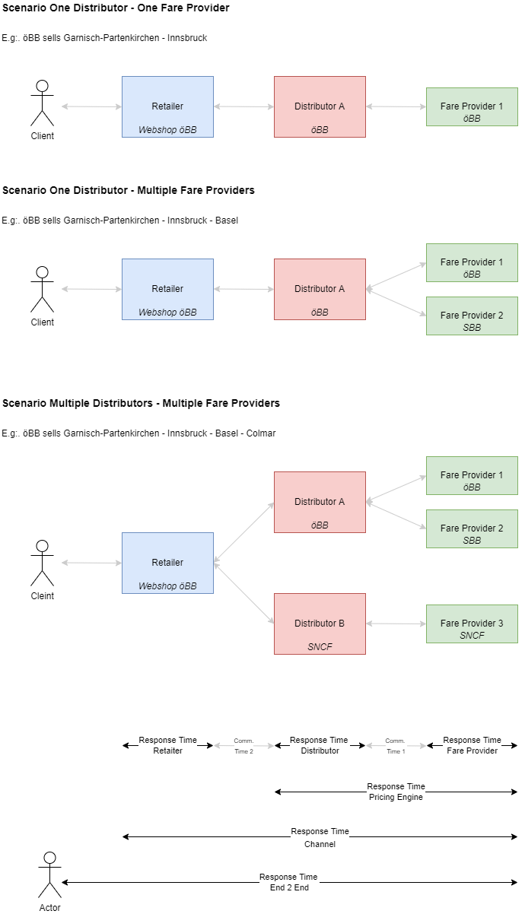

## Table of contents 

1. [Best Practices for Non-Functional Requirements](#BestPracticesforNonFunctionalRequirements)
   1. [Non-Functional Requirements for a "Channel"](#NonFunctionalRequirementsfora"Channel")
   2. [Non-Functional Requirements for the role "Fare Provider"](#NonFunctionalRequirementsfortherole"FareProvider")

## Best Practices for Non-Functional Requirements <a name="BestPracticesforNonFunctionalRequirements">

From a customer point of view, to book a trip he or she expects a seamless and
fluid user experience. Fundamental to achieving this goal are fast responses for
all requests triggered by the customer.

From a business point of view, the
[response time of a site directly correlates with the conversion rate](https://www.thinkwithgoogle.com/marketing-strategies/app-and-mobile/mobile-page-speed-conversion-data/).
This means if a site takes too long to load, the customer will leave the site
with out actually buying a ticket.

In order to achieve a seamless and swift user experience, all parties involved
most play their part and provide fast adn predictable response times. Formally,
by `95% Response Time` we denote the response time for 95% of all request. By
`Max Response Time` we denote the maximum time a response can take before a time
out must be expected.

For achieve a good customer experience, we need to define some response time for
a each parties and we assume the fare providers and pricing engines can be
called in parallel.

| Response time                | Description                                                                                 |
| ---------------------------- | ------------------------------------------------------------------------------------------- |
| Fare Provider Response Time  | Time to calculate/fares                                                                     |
| Distributor Response Time    | Time to calculate an offer from (remote) fare provider(s)                                   |
| Retailer Response Time       | Time to combine offers from                                                                 |
| Pricing Engine Response Time | `Distributor Response Time + max(Fare Provider Response Times 1..m) + Communication Time 1` |
| Channel Response Time        | `Retailer Response Time + max(Pricing Engine Response Time 1..n) + Communication Time 2`    |

The following illustration highlights the different response times:

To achieve a good user experience with fast response time the following the
three response times are crucial.

1. The longest response of any fare provider involved.
2. The longest response of any distributor involved.
3. The time it takes the retailer to render the content.

This observation leads to the following non-functional requirements for a given
role.

### Non-Functional Requirements for a "Channel" <a name="NonFunctionalRequirementsfora"Channel"">

Mandatory service level requirements to be fulfilled by a channel.

The Look-2-Book rate relates to the number of bookings created by the type of
offer request. The expected response time in milliseconds that a service must
provide includes the infrastructure of the provider of the server (firewalls,
load balancer, circuit breaker and application) but not the network in-between
the sender and receiver.

| Resources                       | Look to Book Rate | 95% Response Times (msec) | Max. Response Time (msec) | Required Error Handling                                                                                                                                                                                                                                                                              |
| ------------------------------- | ----------------- | ------------------------- | ------------------------- | ---------------------------------------------------------------------------------------------------------------------------------------------------------------------------------------------------------------------------------------------------------------------------------------------------- | --- |
| `/places`                       | -                 | 60                        | 80                        |                                                                                                                                                                                                                                                                                                      |
| `/trips`                        | -                 | 400                       | 600                       |                                                                                                                                                                                                                                                                                                      |
| `/offers`                       | 1000:1            | 1000                      | 2000                      |                                                                                                                                                                                                                                                                                                      |     |
| `/bookings`                     | 1:1               | 400                       | 600                       | Retry of the booking request followed by a `DELETE /booking/{bookingId}` in case the booking is not needed any more. The error handling must be repeated for three days but no further than the train departure or until an appropriate reply was received indicating that the booking was not made. |
| `/bookings/{id}/...`            | 5:1               | 800                       | 1600                      |                                                                                                                                                                                                                                                                                                      |
| `/bookings/{id}/passengers`     | 0.01:1            | 600                       | 900                       | retry                                                                                                                                                                                                                                                                                                |
| `/bookings/{id}/fulfillments`   | 1:1               | 600                       | 1200                      |                                                                                                                                                                                                                                                                                                      |
| `/fulfillments`                 | 1.1:1             | 600                       | 1000                      |                                                                                                                                                                                                                                                                                                      |
| `/bookings/{id}/refundOffers`   | 0,5:1             | 1000                      | 2000                      |                                                                                                                                                                                                                                                                                                      |
| `/bookings/{id}/exchangeOffers` | 0.01:1            | 1000                      | 2000                      |                                                                                                                                                                                                                                                                                                      |

### Non-Functional Requirements for the role "Fare Provider" <a name="NonFunctionalRequirementsfortherole"FareProvider"">

Mandatory service level requirements to be fulfilled by a fare provider /
carrier.

The Look-2-Book rate relates to the number of bookings created by the type of
offer request. The expected response time in milliseconds that a service must
provide includes the infrastructure of the provider of the server (firewalls,
load balancer, circuit breaker and application) but not the network in-between
the sender and receiver.

| Resources                       | Look to Book Rate | 95% Response Times (msec) | Max. Response Time (msec) | Required Error Handling                                                                                                                                                                                                                                                                              |
| ------------------------------- | ----------------- | ------------------------- | ------------------------- | ---------------------------------------------------------------------------------------------------------------------------------------------------------------------------------------------------------------------------------------------------------------------------------------------------- |
| `/places`                       | -                 | 50                        | 75                        |                                                                                                                                                                                                                                                                                                      |
| `/offers`                       | 100:1             | 400                       |                           |                                                                                                                                                                                                                                                                                                      |
| `/bookings`                     | 1:1               | 200                       |                           | Retry of the booking request followed by a `DELETE /booking/{bookingId}` in case the booking is not needed any more. The error handling must be repeated for three days but no further than the train departure or until an appropriate reply was received indicating that the booking was not made. |
| `/bookings/{id}/...`            | 5:1               | 400                       |                           |                                                                                                                                                                                                                                                                                                      |
| `/bookings/{id}/passengers`     | 0.01:1            | 200                       |                           | retry                                                                                                                                                                                                                                                                                                |
| `/bookings/{id}/fulfillments`   | 1:1               | 200                       |                           |                                                                                                                                                                                                                                                                                                      |
| `/fulfillments`                 | 1.1:1             | 400                       |                           |                                                                                                                                                                                                                                                                                                      |
| `/bookings/{id}/refundOffers`   | 0.5:1             | 400                       | 800                       |                                                                                                                                                                                                                                                                                                      |
| `/bookings/{id}/exchangeOffers` | 0.01:1            | 400                       | 800                       |                                                                                                                                                                                                                                                                                                      |
| `/coachLayouts`                 | Once per day      | 8000                      | 10000                     |                                                                                                                                                                                                                                                                                                      |
| `/coachLayouts/{layoutId}`      | 2:1               | 200                       | 300                       |                                                                                                                                                                                                                                                                                                      |
