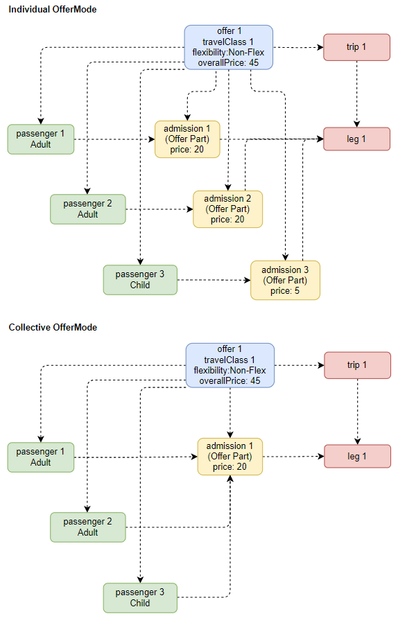
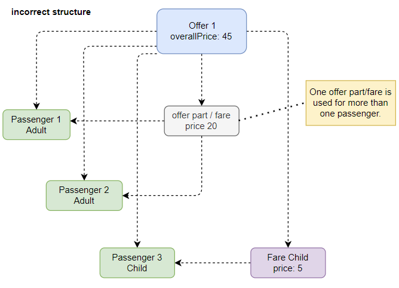
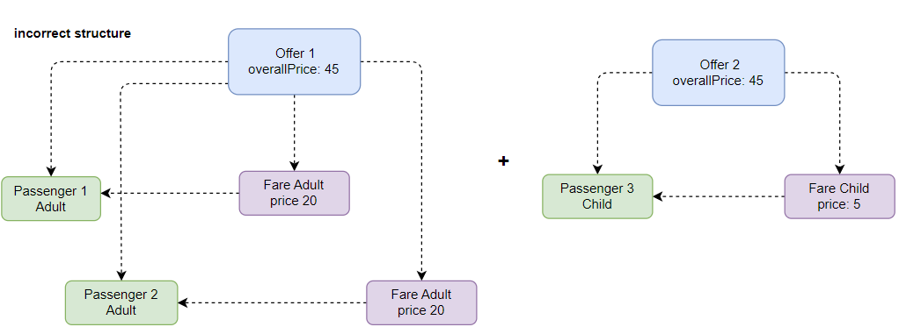

## Table of contents

- [Table of contents](#table-of-contents)
- [Introduction ](#introduction-)
- [General rules for Offer parts ](#general-rules-for-offer-parts-)
  - [1. An offer should contain all offer parts per travel class and flexibility/product code.](#1-an-offer-should-contain-all-offer-parts-per-travel-class-and-flexibilityproduct-code)
  - [2. Per passenger there should be an offer part for different parts of the trip, e.g. legs.](#2-per-passenger-there-should-be-an-offer-part-for-different-parts-of-the-trip-eg-legs)
  - [3. Even if a trip provides partial first class support only, a first class offer is provided.](#3-even-if-a-trip-provides-partial-first-class-support-only-a-first-class-offer-is-provided)
  - [4. If a part of a trip is free, an offer part with price 0 must be provided.](#4-if-a-part-of-a-trip-is-free-an-offer-part-with-price-0-must-be-provided)
- [General rules for fares](#general-rules-for-fares)
  - [1. An offer should contain all fares per travel class and per flexibility/product code.](#1-an-offer-should-contain-all-fares-per-travel-class-and-per-flexibilityproduct-code)
  - [2. Per passenger there should be a fare for different parts of the trip, e.g. legs.](#2-per-passenger-there-should-be-a-fare-for-different-parts-of-the-trip-eg-legs)
  - [3. Even if a trip provides partial first class support only, a first class offer is always provided.](#3-even-if-a-trip-provides-partial-first-class-support-only-a-first-class-offer-is-always-provided)
  - [4. If a part of a trip is free, a fare with price 0 must be provided.](#4-if-a-part-of-a-trip-is-free-a-fare-with-price-0-must-be-provided)
  - [5. Pricing is individual (if possible).](#5-pricing-is-individual-if-possible)
- [Incorrect offer structures](#incorrect-offer-structures)

## Introduction <a name="introduction">

The OSDM offer structure is very powerful and flexible. However if various
parties interpret the structure in different ways, this can lead to
interoperability issues. As interoperability is a key goal of OSDM, this
document defines some rules for the structuring of offers. To ensure real
interoperability, an offer must not only be syntactically valid, but also comply
with these rules.

## General rules for Offer parts <a name="Generalrulesofferparts">

The following figure shows the overall structure of an offer in OSDM:

Individual offer mode means that each passenger is given individual admissions
and reservations. Thus, in individual mode, for every passenger a distinct offer
part should be provided. In collective mode, one offer part per trip part should
be provided. Collective mode is used by DB foremost, but is also needed for
group bookings.

For offer parts such as admissions, reservations, or ancillaries, the following
rules apply:

### 1. An offer should contain all offer parts per travel class and flexibility/product code.

Assuming first and second class are supported on the given trip, and there exist
flexible, semi-flexible, and non-flexible products, then the offer should
contain six offer parts per passenger:

- first class, flexible
- first class, semi-flexible
- first class, non-flexible
- second class, flexible
- second class, semi-flexible
- second class, non-flexible

### 2. Per passenger there should be an offer part for different parts of the trip, e.g. legs.

Assuming a trip consists of three legs, then the offer should contain three
offer parts per passenger, one for each leg of the trip. Or one offer part could
span multiple legs. Most importantly, there should be no leg without an offer
part.

### 3. Even if a trip provides partial first class support only, a first class offer is provided.

Assuming a trip consists of three legs, and one leg does not support first
class. Then the offer should nevertheless contain a first class offer part for
the whole trip.

### 4. If a part of a trip is free, an offer part with price 0 must be provided.

Again, assuming a trip consists of three legs, and one leg is free of charge.
Then the offer should nevertheless contain an offer part for that leg, with
price 0.

## General rules for fares

Apart from offer parts, OSDM also supports the distribution of fares. Fares
priced segments of a journey that can be combined by a distributor to create an
offer.

The following rules apply for fares:

### 1. An offer should contain all fares per travel class and per flexibility/product code.

Contrary to offer parts, multiple fares might be needed to cover one leg as
fares regional validity is not always bound to a trip. E.g a fare's validity can
end at a countries border with no train station or stop.

### 2. Per passenger there should be a fare for different parts of the trip, e.g. legs.

Similar to offer parts, there should be no leg without a fare.

### 3. Even if a trip provides partial first class support only, a first class offer is always provided.

Similar to offer parts, even if a trip provides partial first class support
only, a first class offer is always provided.

### 4. If a part of a trip is free, a fare with price 0 must be provided.

Similar to offer parts, if a part of a trip is free, a fare with price 0 must be
provided.

### 5. Pricing is individual (if possible).

In fare mode pricing is always individual, i.e. each passenger has its fare(s).

## Incorrect offer structures

Next examples of incorrect offer structures are given:

Here the same offer part is reused for two different passengers. This data
structure make it difficult when booking as the same offer part of fare needs to
be booked twice.

Next is an example where multiple offers need to be booked to get a complete
booking for three passengers:

This would force a distributor to do complex book keeping to ensure that for all
passenger a booking exists. Also multiple booking would be needed, which
especially in error scenarios would require complex error handling and
compensation mechanisms.
