## General Scenarios

Within the offline sales model the participating companies agreed to allow sales based on the provided fare data. The receiving company is responsible to apply the rules defined within the fare data. In case the implementation does not cover some features it is not allowed to sell fares that use these features.

## Fare Exchange

Fares can be exchanged by bilateral file exchange, via a queue provided according to this specification or via some common exchange platform like the upcoming OSDM data exchange platform in case the company is a member of the platform.

Exchanged fare data deliveries can be defined to be implemented mandatory or to be optional thus allowing to continue the sales with the previous version. In case a mandatory version replaces a previous version it also replaces all previous optional version with-in the chain.

A data delivery might specify a minimal version number of the schema that needs to be supported to use the data.

## Versioning of Data Delivery Schemas

The data delivery will contain the version number of the used json schema and the version number which is required to process the data. Also, a change in a minor version might restrict the usage of older version in case a carrier used a new optional feature which is mandatory to his fares.

## Versioning of Data Delivery Data

The data delivery has a unique id. It can indicate that it replaces a previous delivery
by indicating the data delivery id of the delivery to be replaced. Deliveries can be
marked as optional. In this case a user of the data delivery might ignore the delivery.
Deliveries marked as mandatory have to be used.

## Automated Bulk Data Exchange

Automated asynchronous bulk data transfer is an option implemented by queues. The queues must implement the [AMQP 1.0 specification](https://www.amqp.org/about/what).

On bilateral agreement other queue technologies might be used between two systems.

Queue authentication and encryption must use TLS version 1.2.

### AMPQ Header Parameter

| Parameter              | Usage                                                                    |
| ---------------------- | ------------------------------------------------------------------------ |
| `message-id`           | Technical id of the data transfer, not the data delivery id in the data. |
| `user-id`              |                                                                          |
| `to`                   |                                                                          |
| `subject`              | „fare-data-delivery\_“\<version\>                                        |
| `reply-to`             | N/A                                                                      |
| `correlation-id`       | N/A                                                                      |
| `content-type`         | `application/json`                                                       |
| `absolute-expiry-time` | 1 year ahead                                                             |
| `creation-time`        | Time stamp when the data are put to the queue                            |
| `group-id`             |
| `group-sequence`       |
| `reply-to-group-id`    |                                                                          |

## Asynchronous Fare Data Delivery

The fare structure delivery is the bulk data object collecting the fare data `fareStructure` of
a delivery and the delivery meta data `delivery`.

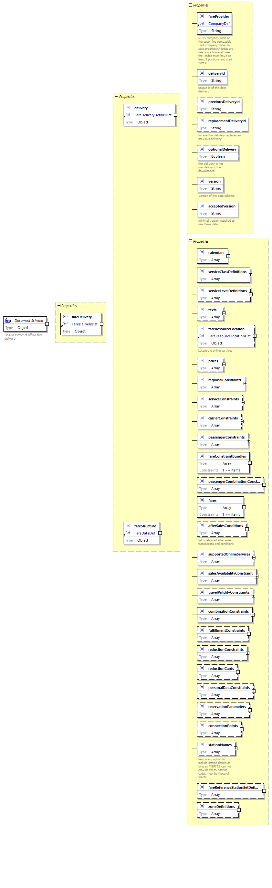

### Definition of a single fare

The single fare represents the smallest unit to be integrated in an offer. Within the
offline data the fare collects the references to the constraints that need to be applied
and the price.

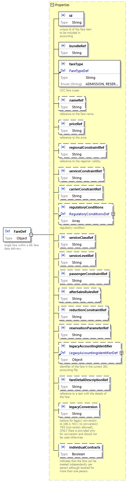

Some constraints are bundled within the fare constraint bundle to avoid repeating the
same data too many times:

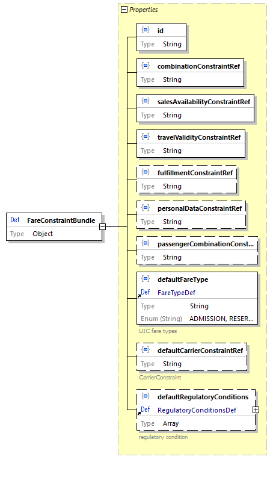

## Basic definitions included in the data delivery

Basic definitions are provided within each data delivery. The basic definitions are
included only once and are references within the data via their id.

### Calendar

A data structure to define a calendar e.g. used in sales availability.

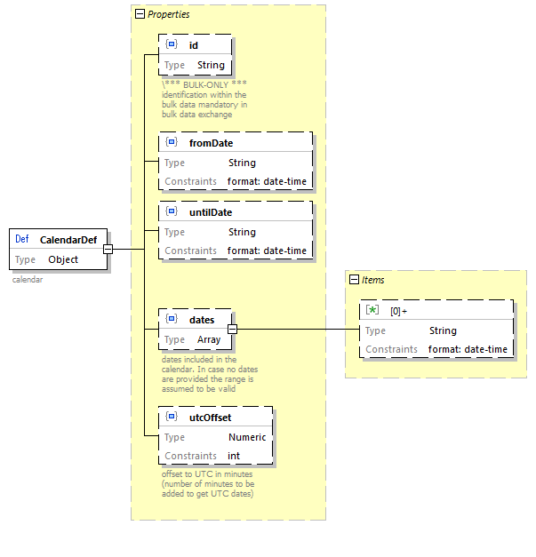

### Text

All texts provided wit the data use the text data structure providing short and long texts
and translations in different languages. To support legacy implementations and the conversation
to the 108.1 specification additional texts without special characters can be defined.

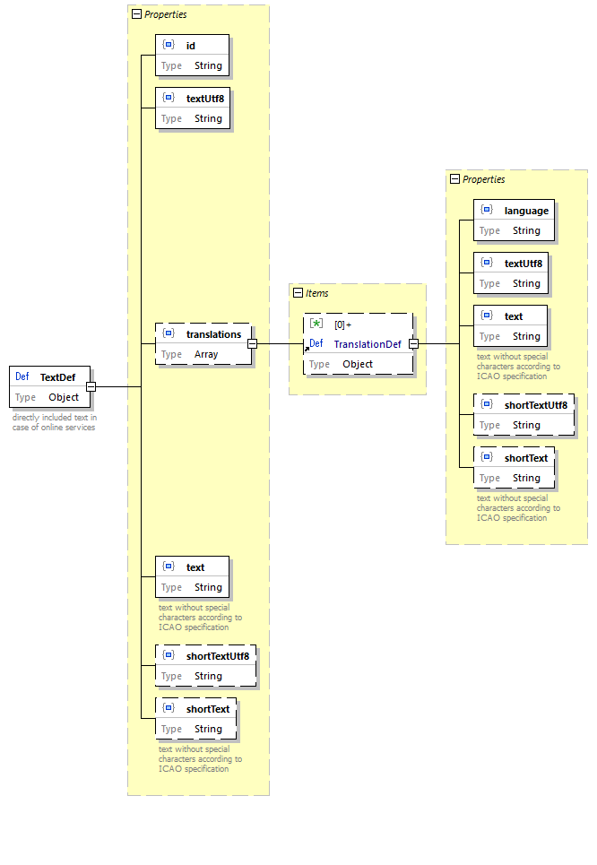

### Station Names

Station names have been included within the data exchange to support names including special characters and
names of different length. If in the future the station data exchange of MERITS is capable of providing these
names they can be removed here. The station codes used must be codes as defined in MERITS / TAP-TSI.

Station names provides multi language names in short and long form as currently no
other data source can provide these names. Short names are used within the route
descriptions whereas the long for is used for entry and exit stations.

A legacy border point code can be provided during the migration to the OSDM data model.

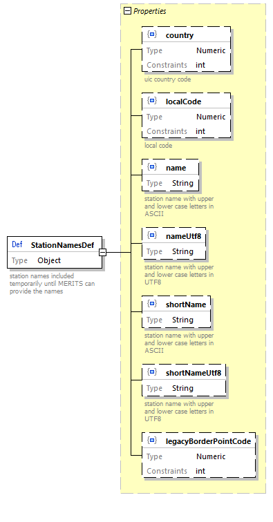

### Reduction Cards

Tis covers the definition of reduction cards used in the fares. The name and some basic information of the
cards can be defined. The reduction itself (percentage) is not included as the fare price already provides the
reduced price. Some provider specific cards are accepted by other carriers as a generic card. This can be
expressed via the included cards feature. E.g. MyCard could be accepted as RailPlus card by others, so MyCard
includes RailPlus.

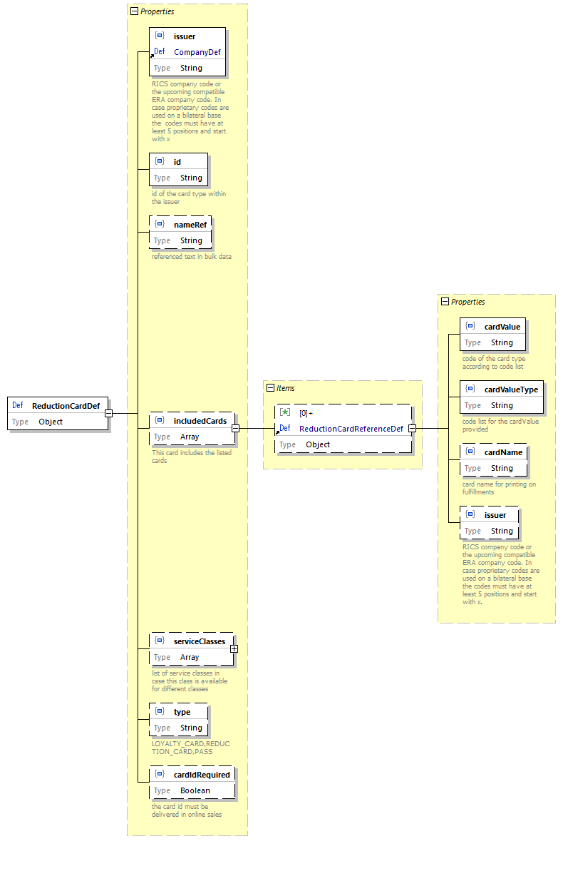

### Connection Points

Connection points define the options to connect one fare with another fare a a point. In case the connecting
point is a real station the connection point is defined by a set including just that station. In case the fares
are connected between two stations the connection point includes two sets each including the station on one
side. There light be cases where a connection is possible between more than two stations, in this rare case the
set(s) might contain more than one station (e.g. Stations _A_ and _B_ for carrier 1 are connected to stations
_C_ and _D_ of carrier 2 and allowed route go via _A-C_ or _B-D_).

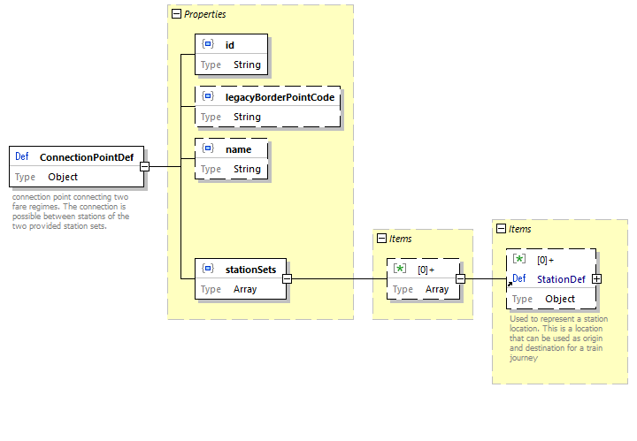

### fare reference station set

Fare reference station set defines a set of stations that can be used in a route. All station(s) of the set can
be used by the passenger.

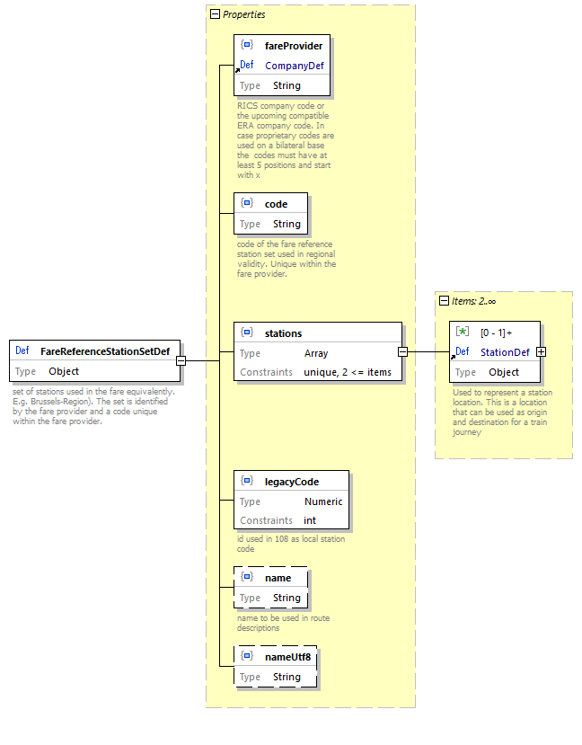

### Price

The price of a fare of the refund fee on an after-sale. VAT details can be provided for the price. The default
currency is EUR, but other currencies might be used based on bilateral agreements.

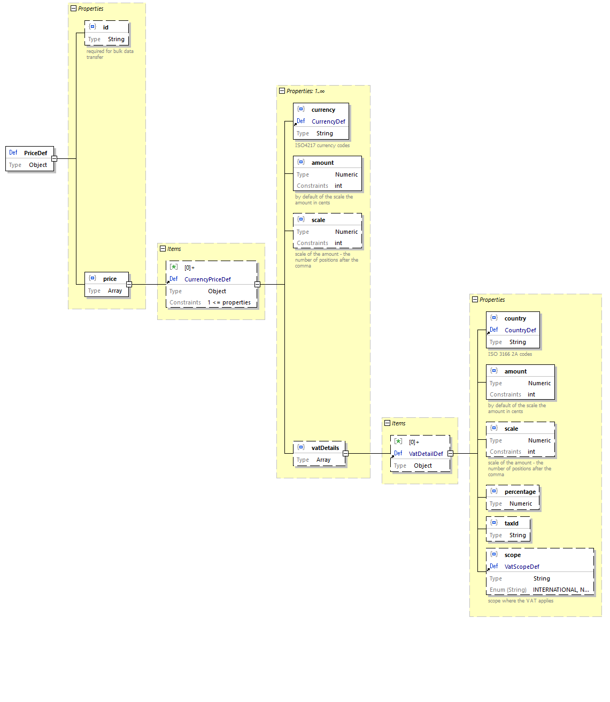

## Definitions of a Different Fare Constraints

### Fare After Sales Constraint

Definition of the after sales conditions to be applied. Depending on the fare combination mode the after
sales constraint can be omitted in case the allocator is responsible for the after sales fees.

### Fare Carrier Constraint

The carrier constraint defines the carriers that can be used. Either a list of the allowed carriers can be
provided or a list on excluded carriers. In the case of excluded carriers all carriers not listed can be used.

The carrier constraint can be referenced by a fare via the id.

Carrier constraint limits an open fare - not linked to a train - to some carriers. The carriers can
be specified either as exclusion list or alternatively as inclusion list.

Carriers are specified by their Company code (RICS code).

<!-- Figure 5 carrier constraint data structure (offline) -->

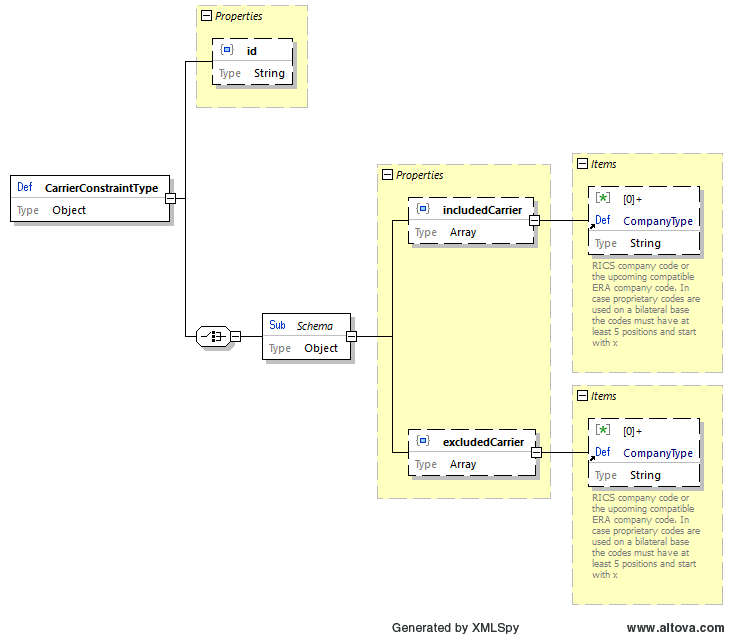

The included / excluded carriers are also part of the FCB barcode (_IRS 90918-4_) content and the ticket
control data (_IRS 90918-9_).

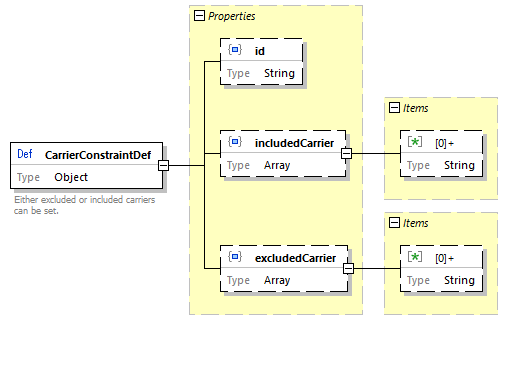

### Fare Combination Constraint

Constraints ruling the possible combinations with other fares of other providers.

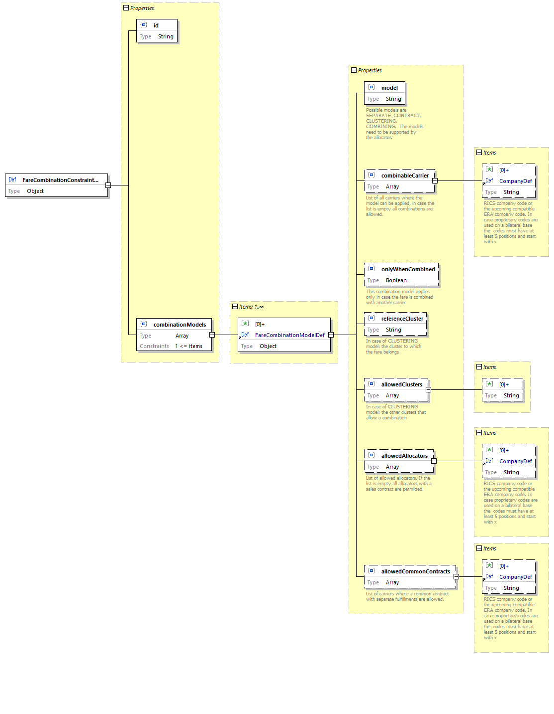

### Fare Passenger Combination Constraint

Constraints ruling the possible combinations of passengers for combination on a ticket.

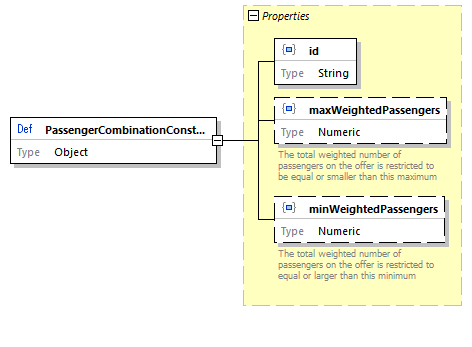

### Fare Personal Data Constraint

Definition of the personal data required e.g. in a bar code of via online ticket control.

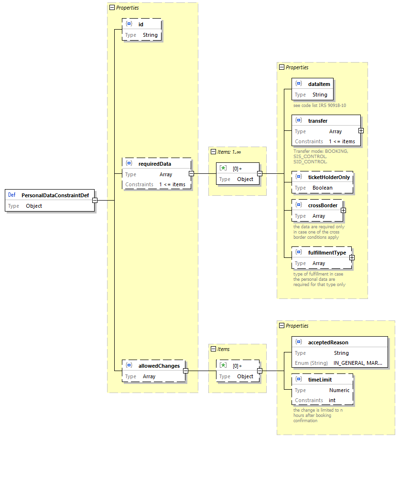

### Fare Reduction Constraint

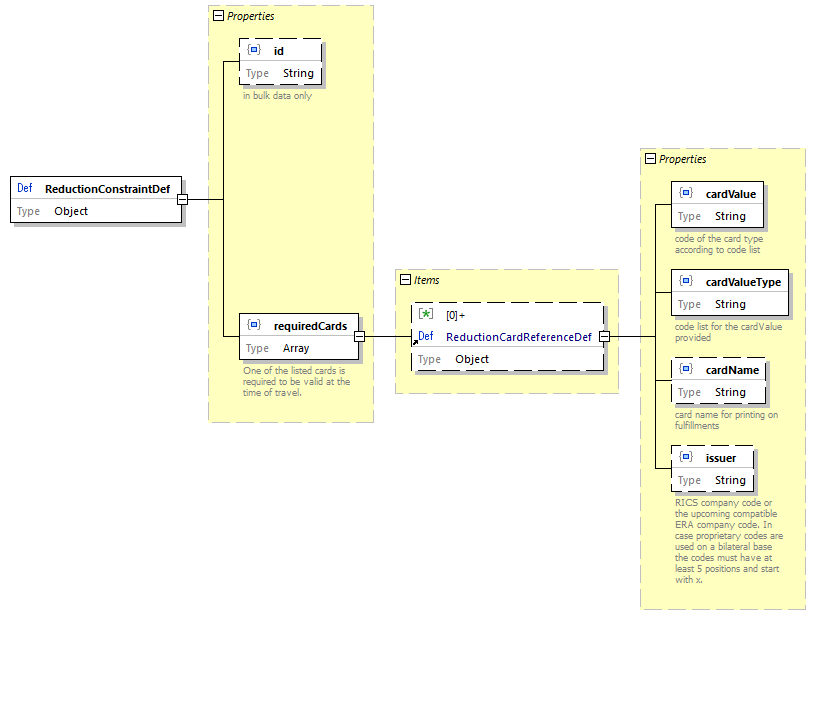

### Fare Regional Constraint

The regional constraint defines the options to combine the fare at the start and end point via connection points.

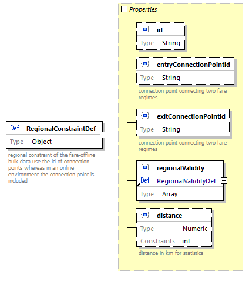

Data model regional constraints:

The regional validity defines the geographical validity of the fare. It is defined as an ordered list along
the route. Options to define a part of the route include Zones (regional areas), Lines, route descriptions
(viaStations) that can define sequences of stations, alternative routes and fare reference sets. Areas can
also be defined by geo-coordinates.

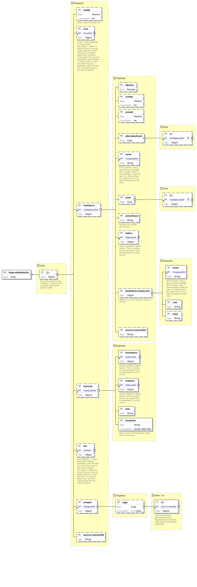

### Route Description example in the regional validity

Route example:

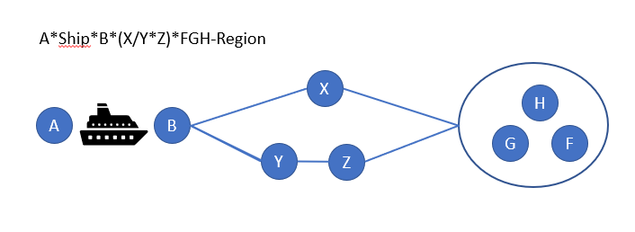

Object model:

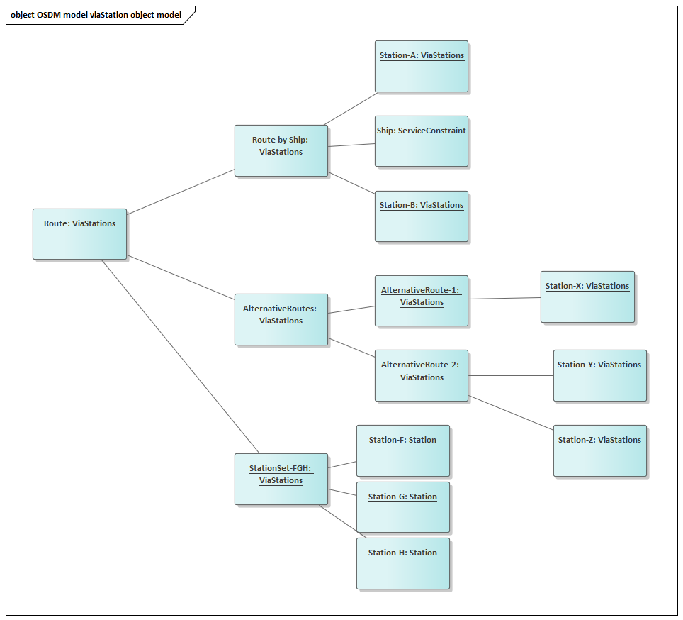

### Fare Sales Availability Constraint

Sales availability defines the constraints on the time when a sale of a fare can start or end. The sales
availability is used in the offline data exchange only. A constraint is provides as a list of
`salesRestrictions` that have to be applied.

Sales restrictions can define a start and end of the sale relative to the date of sale or the date of travel.

A reference to a calendar can be provided to indicate all sales dates.

#### Data Constraint on SalesAvailability

| Code                       | Description                 |
| -------------------------- | --------------------------- |
| `startOfSale`, `endOfSale` | `startOfSale` < `endOfSale` |

### Fare Service Constraint

The service constraint defines restrictions to specific service brands. Either a list of service brands of a list of excluded service brands can be provided.

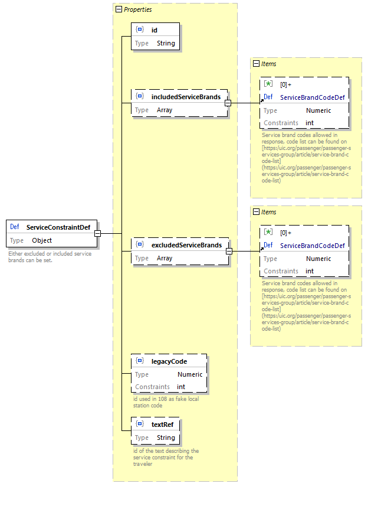

#### Data Constraint on ServiceConstraint

| Code                                             | Description                                                       |
| ------------------------------------------------ | ----------------------------------------------------------------- |
| `includedServiceBrands`, `excludedServiceBrands` | Only one of the lists can be used. Using both lists is forbidden. |

### Fare Travel Validity Constraint

The travel validity defines the duration the passenger has to make his travel. Optional time slots (e.g. peak hours) can be excluded.

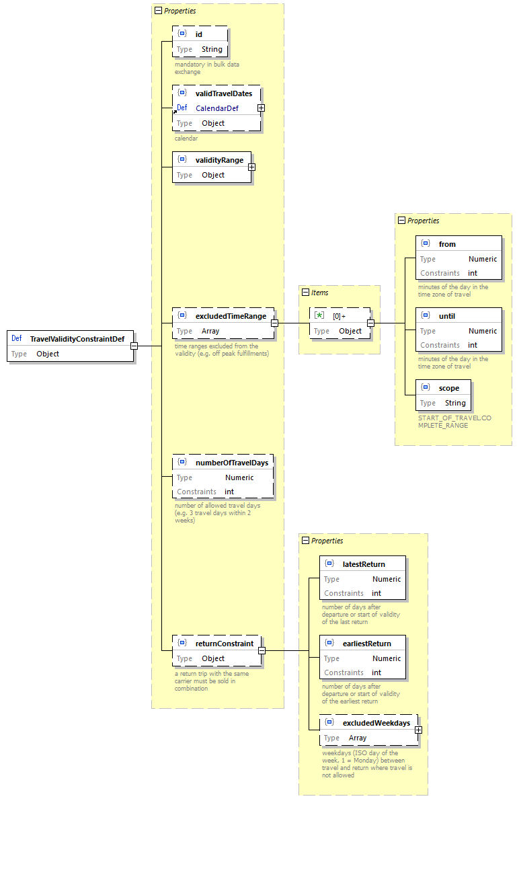

#### Data Constraint on TravelValidity

| Code                 | Description                       |
| -------------------- | --------------------------------- |
| `excludedTimeRange`  | `from` time < `until` time        |
| `numberOfTravelDays` | A duration must be provided       |
| `returnConstraint`   | `earliestReturn` < `latestReturn` |

#### Constraint on Trip Interruptions

#### Constraint on Activation of Multi Journey Fares

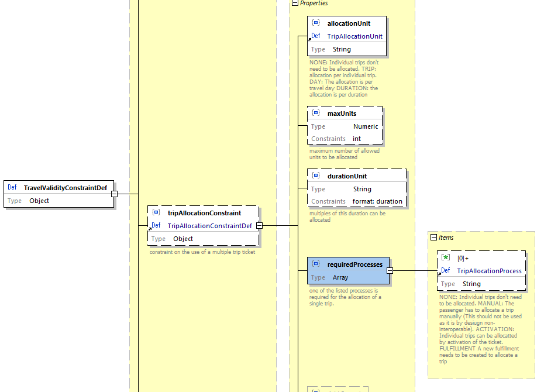

## Data Supporting Online Services

Additional data to support the online sales services can be exchanged.

### Fare Resource Places

Information on where to fine resources for online services of OSDM online or via 90918-1 APIs

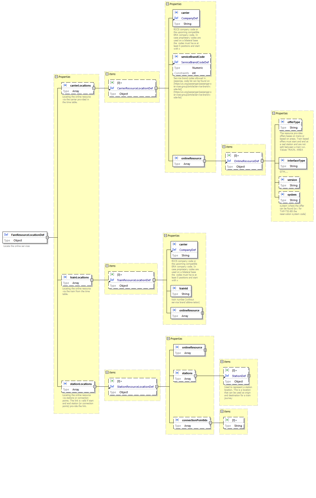

### Fare Reservation Parameters

Data to define reservation requirements related to a fare.

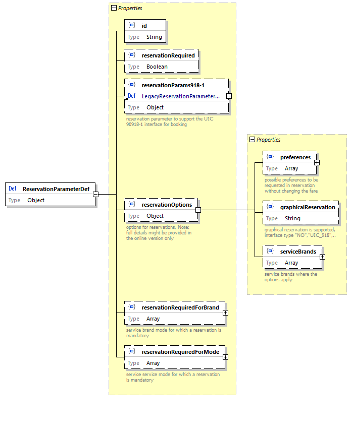
