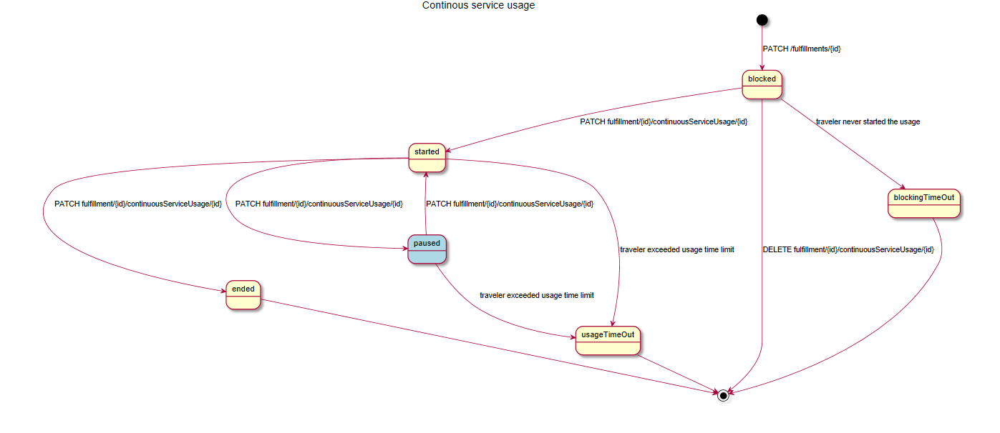

## Table of contents

1. [Introduction](#introduction)
2. [Use Cases](#useCases)
3. [Process Options](#options)
4. [Offer and Booking Process](#Booking)
5. [Allocation of Service](#Allocation)
6. [Usage of Service](#Usage)
7. [Reembourcement](#Reembourcement)


## Introduction <a name="introduction">

The process described covers unscheduled on-demand transport modes. These include:

   - bicycles (e-bike, bike, cargo bike, scooter)
   - cars (taxis, self-driving vehicles,..)

The initial booking follows the OSDM flow from offer to fulfillment. The additional processes to allocate the devide are handled in the fulfillment resource. Pos-Payment is 
handled via an additional booking part generated on the provider side at the end of the usage of the vehicle.

Scheduled services which need to be confirmed (e.g. by phone) to stop are not considered here, they follow the existing OSDM sales flow.

## Use Cases <a name="useCases">

A consumer of a trip offer collection where the first mile can be made via an On-Demand-Service. The retailer expects a complete offer and the distributor to handle the connection to the provider of the On-Demand-Service.
The consumer can search for available vehicles that can provide the service. He can select a service which becomes blocked for other consumers. 

A consumer of a trip offer collection where the last mile can be made via an On-Demand-Service. The retailer expects a complete offer and the distributor to handle the connection to the provider of the On-Demand-Service.
The offer can be confirmed and the consumer can search for available vehicles that can provide the service later-on during the journey. He can select a service which becomes blocked for other consumers. 


The consumer can start the usage of the service with the allocated vehicle.

The consumer can end the usage of the service with the vehicle in use.

The providers may have implemented different pricing and payment schemes:
        - prepayed fixed price or included in an overall admission booking part
        - prepayed with pay per use and a refund on unused time or distance
        - postpayment with pay per use based on time or distance


## Process Options <a name="options">

### Shallow Integration of on-demand services

The OSDM API provides the trip including the continuous services and also provides initial offers for the service. This service can be booked in OSDM, but the 
fulfillment only includes a link to the application providing the service. The actual booking and payment of the service is made in the application of the service provider. 
The traveller needs to install the provider app (or use a web interface if possible) and he needs to register there.    

### Deep Integration of on-demand services

The OSDM API handles the complete process of booking a continuous service, searching for the devices, starting and ending the usage of the devices and providing the pricing information.

### Deep Integration of on-demand services - pre-payment

The initial booking requires a payment. In case the usage does not cover the full amount a refund is created.

### Deep Integration of on-demand services - post-payment

The initial booking does not require a payment. In case the price is provided at the end of the usage of the service.

### Reembourcement

The existing reembourcement flow is used to handle claims due to issues with the devices like damages, empty batteries, ...)

### Get updates on the service usage (optional)

Information on time till arrival at pick-up, costs of usage, ...


## Offer and Booking Process <a name="Booking">


### find on-demand service in trip search

The trip search provides on-demand services as continuous services. The continuous service provides the possibility for using this service, not the individual device (e.g. bicycle). 

 - The ModeFilter can be iused to exclude bicycles, taxis or scooters from the search
 - The IndiviualMode can indicate the on demand modes electric bicycle, scooter, ...


### offer for ContinuousService

The offer for the continuous service is provided as ContinuousServiceOfferPart inheriting from AbstractOfferPart. The ContinuousServiceOfferPart includes a list of possible pick-up places for the vehiocles available.

The pick-up-place includes:

- id
- description
- access procedure description on how to select and unlock a vehicle to use it.
- available number and types of vehicles (bicycles, scooters, taxis, large taxis, ...)
- indication whether a vehicle can be blocked for usage - is the device already available for blocking until the usage starts
- time limit for blocking - who long can the device be blocked until the usage starts
- process indications - indication how the service usage is handled
   - shallow integration
   - deep integration
   - prepayed
   - postpayed
   - usage starts automatically (e.g. by entering a key code at the vehicle)
   - usage ends automatically (e.g. by locking the service) - The end of the usage does not need to be handled via OSDM
   - updates provided before pick-up (e.g. current location of a taxi)
   - updates provided after pick-up (e.g. price for current consumption)
   - parking image required - upload of an image of the parking at the end of the usage is required.
   - tip supported (e.g. tax)
  - geo-location of the service (pick-up-place)
  - estimated time of the vehicle to arrival at pick-up-place (taxi,..) - When is the devide to be expected at the pic-up place
  - estimated time of the traveler to arrival at pick-up-place
       

Updates of the availablity can be received via:
    
```
GET /availabilities/continuousServiceOfferPart/{id}    to get an updated list of available vehicles and pick-up places
```

### booking

Creates an bookingPart for the continuousServiceOfferPart. The ContinousServiceBookingPart includes the pricing status:

        
Depending on the payment process the pricing status is:

- Fixed price of the booking
   - pricing status fixed
     
- Pre-Payment
    - pricing status fixed
    - the price includes the amount to be prepaid
    - after the use of the vehicle a refundwill be created.
    
- Post payment
    - pricing status upcoming
    - the price is zero


To get an updated list of available vehicles and pick-up places:

```
GET /availabilities/continuousServiceBookingPart/{id}   
```
       

### confirm booking

The confirmation creates fulfillments for the continuousServiceBookingPart(s):

```
POST /bookings/{bookingId}/fulfillments  
```

including:

 - In case of a shallow integration
   - a smart link to the mobility provider app

- In case of a deep integration
   - a fulfillment that needs to be patched to block the vehicle for the service

Up to here the steps are made together with the booking of the other booking parts. In case of a combined long distance journey the next steps would follow shortly before
the on-demand service will be used.

In case of a shallow integration the OSDM flow ends here. Allocating the vehicle, and the payment are handled by the linked app.


## Allocation of a vehicle for the service <a name="Allocation">

Blocking a vehicle reserves the vehicle for some time to walk to the pick-up-place or until the car arrives.

To get an updated list of available pick-up places and vehicles:

```
     GET /availabilities/continuousServiceBookingPart/{id}    
```

To block the vehicle:

```
PATCH /fulfillments/{fulfillmentId}
```

The Patch request must provide the selected pick-up-place and vehicle type as ContinuousServiceVehicleSelection.

The patch reply provides the fulfiullment, taht contains a ContinuousServiceUsage object to unlock the vehicle and start the usage.


 ContinuousServiceUsage:
 - id
 - status
   - vehicle-blocked
   - usage-started
   - blocking-time-out
   - usage-ended
   - usage-time-out
- usage procedure descriptions
- credentials to start the usage  (e.g. nfc-enabled pkpass, ...)
- time limit for start of usage

A fee might be added to the booking part in acse the blocking is subject to a fee.

### delete 


Delete a blocking in case you change your mind or the vehicle is broken

```
   DELETE fulfillment/{id}/continuousServiceUsage/{id}
```

##Using the vehicle <a name="Usage">

### start usage

Start using the vehicle. This might as well been triggered by the vehicle itself. 

```
   PATCH fulfillment/{id}/continuousServiceUsage/{id}:
```

Start usage on continuous service usage by id and status = start


### tracking (optional)

Get updates on the usage status, costs and location.

```
  GET fulfillment/{id}/continuousServiceUsage/{id}:
```

ContinuousServiceUsage:
    - status
    - geo-location of the vehicle
    - amount to pay (at the current usage)
    - remaining amount for prepayed usage
    - time till arrival at pick-up-place (taxi,..)


### end usage 

This ends the usage. This might as well be triggered by the vehicle itself (e.g. be locking the vehicle).

```
  PATCH fulfillment/{id}/continuousServiceUsage/{id}:
```


At the end of the usage the provider updates the booking to reflect the required payment:

- in case of post-payment: update ContinuousServiceBookingPart in the booking:
  - including the price                   
  - pricing status --> final
  - fulfillment documents on the pricing / calculation of costs
- in case of pre-payment: 
  - including a new refund on the existing ContinuousServiceBookingPart
  - fulfillment documents on the pricing / calculation of costs

### continous service usage - state model 




### Reimbursement <a name="Reimbursement">

Reimbursement uses the already defined reimbursement flow.

Additional reasons for reembourcement can be set:
  - vehicle broken
  - vehicle battery empty
  - vehicle not found
  - vehicle did not arrive


