## Introduction

This page shows a representation of the data models underlying the API
specifications. It is therefore not a strict representation of the resources
themselves (those are self-represented in the OpenAPI specifications.)

The main purpose of this document is therefore to help a quicker understanding
of the API and its underlying concepts. As such, some of the details of how the
information is structured in the API are not represented or simplified in the
data models.

## Overview of Services

| Resources                                          | Description                                                            |
| -------------------------------------------------- | ---------------------------------------------------------------------- |
| `/places`                                          | Resources to search for places                                         |
| `/trips`                                           | Resources to search for trips                                          |
| `/offers`                                          | Resources to get bookable offers                                       |
| `/availabilities`                                  | resources to retrieve availability information on places (seats,..)    |
| `/bookings`                                        | Resources to manipulate bookings                                       |
| `/bookings/{bookingId}/passengers/`                | Resources to change passengers                                         |
| `/bookings/{bookingId}/purchaser/`                 | Resources to change purchaser                                          |
| `/bookings/{bookingId}/booked-offers/`             | resources to change pre-booked bookings, e.g. provide place selections |
| `/bookings/{bookingId}/reimbursements`             | resources to reimburse unused tickets                                  |
| `/bookings/{bookingId}/release-offers`             | resources to release tickets                                           |
| `/bookings/{bookingId}/cancel-fulfillments-offers` | resources to cancel fulfillments                                       |
| `/products`                                        | retrieve products information on one or more products                  |
| `/bookings/{bookingId}/fulfillments`               | retrieve fulfillments, e.g. tickets                                    |
| `/fulfillments`                                    | confirm a booking and retrieve fulfillments                            |
| `/bookings/{bookingId}/refund-offers`              | Resources to get and accept a refund offer                             |
| `/bookings/{bookingId}/exchange-operations`        | Resources to get and accept a exchange offer                           |
| `/bookings/{bookingId}/exchange-offers`            | _dito_                                                                 |
| `/bookings/{bookingId}/release-offers`             | Resources to get, accept or delete a release offer                     |
| `/bookings/{bookingId}/cancel-fulfillment-offers`  | Resources to get, accept or delete a cancelFulfillment offer           |
| `/complaints`                                      | resources to create and manipulate complaints                          |
| `/coach-layouts`                                   | Returns all coach layouts.                                             |
| `/reduction-cards`                                 | retrieve reduction card types                                          |
| `/products`                                        | retrieve product information                                           |
| `/zones`                                           | retrieve zone information                                              |

## Process Flow


The process flow starts with getting offers which can be chosen by the customer.
Once selected they can be pre-booked and after the payment process (which is
outside of the scope of this document) they can be booked. The fulfillment of
the booking can either be on paper or paperless.

If needed bookings can either be refunded or exchanged by providing the customer
with a refund or exchange offer which can then be booked by the customer.

## Trips and Places Processes

### Looking Up Places

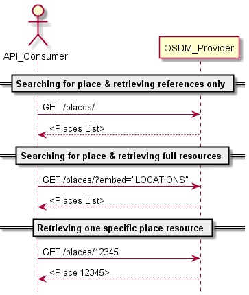

The `\places` Lookup can be used by an API provider in order to search for
places. Two typical uses cases would be

- getting a set of places (in full or as reference) from a substring of the name
- getting full details on a location based on one of its codes

Note that the functionality is not intended to trigger a "dump" of the complete
places list or to build a full "browsing" functionality, hence the lack of
pagination features here.

Given the high stability of this information, places are given a long time to
live and get responses can be cached for a long period, so these operations
should not be too costly in terms of calls or bandwidth.

#### Error Handling

Error handling by the **Retailer** remains basic here as a handful of cases have
to be handled:

- invalid characters in the search string
- no result found for the given criteria.
- The search did not return any result
- unknown error on server side

In all cases, the error handling starts and stops with the **Retailer**
returning the appropriate JSON Problem element.

In case the error can apply to multiple fields, it is recommended to provide
additional details such as the incriminated field in the detail property of the
`Problem` element.

### Getting and Browsing Trips

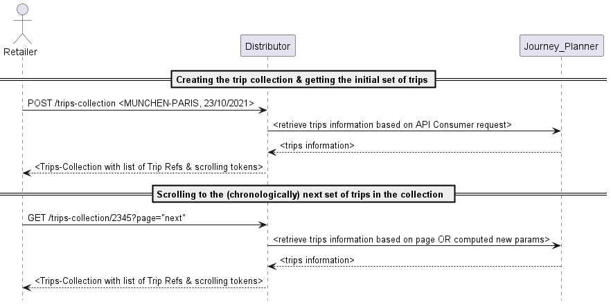

If the API consumer only needs a schedule, and no bookable offer, it has the
possibility to create a trips collection using `POST /trip-collection`. If the
query is successful, the initial response to this will be a set of trips
matching the provided search criteria.

Please refer to the Yaml specifications for the list of search criteria
available. Depending on their respective journey planner capabilities, it could
be that some criteria cannot be supported by one or the other distributor In
this case it is up to the implementing party to clearly document those
limitations together with the publishing of its endpoints. In all cases, at
least `origin`, `destination` and `travelDateTime` must be supported

Based on an initially returned trips collection, it is then possible to retrieve
earlier or later trips using `GET the trip-collection` by specifying the
appropriate scrolling-tokens. As with all cases where nested resources can be
returned, individually or in list, the embed feature allows specifying whether
complete trips should be returned or only a title and a link. A GET verb without
any scrolling-token will simply return the last set of trips return.

It is important to ensure that once a trip has been generated, its id can be
re-used in possible subsequent operations within a reasonable time-frame:

- When scrolling back and forth over time, a same trip should maintain the same
  id, so the API consumer can, if desired, expand the set of trips in its own
  context and have the guarantee that one same trip (in terms of content) will
  remain with the same id (in terms of resource id).
- It could be used in a subsequent offer request, so that offers are now built
  for that specific trip

#### Error Handling

Since requesting trips still does not involve any transactional operation, the
error handling is also limited to returning a JSON problem element. The
following cases are to be considered:

- A search criteria value contains invalid value or invalid characters
- A search criteria lies outside accepted boundaries: it could be the date in
  the past, or too far in the future, or value outside bounds for the max number
  of changes
- The origin or destination is not known
- The search did not return any result
- Unknown error on server side

In case the error can apply to multiple fields, it is recommended to provide
additional details such as the incriminated field in the detail property of the
`Problem` element.

## Offers

### Getting and Browsing Offers

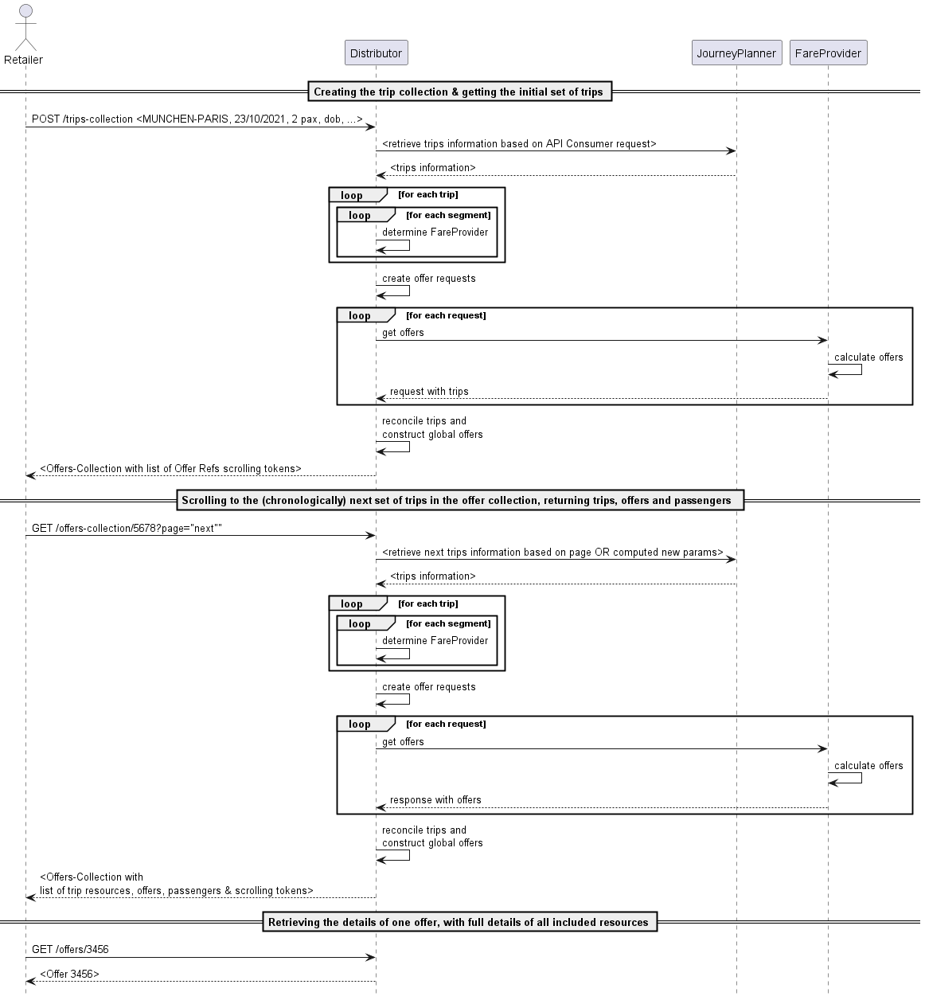

Requesting and browsing offers works a lot like the trips: the API consumer
submits search criteria, and a collection of "trip offers" is returned. This
collection can be browsed to earlier and later trips the same way as the trips
collections.

The search criteria for offers extend the search criteria available for trips
with additional criteria applicable to the fares and products that can be
returned such as the fare flexibility, the service class or the currency the
offers should be proposed in.

Although the trip-related search criteria are present and will likely be the
easiest and most used option, there is an alternative way to search offers if a
set of specific trips is already known: provide the complete trip structure for
one or several trips. This the only way to go for a request to a fare provider
working according to fare rules. The trips provided may be larger than the part
for which fares are requested. For this reason, the requested section must then
be provided so that the provider knows which portion to work on. When this
method is used, the API consumer can provide a "tripkey" together with the trip
specification, which will be echoed in the tripoffer element matching that
specific trip, for an explicit reconciliation between requested trips and
provided offers.

An offer request to an **distributor** or **fare provider** can lead to offers
with multiple `OfferParts`, potentially coming from different sub-providers
(OSDM compliant or not). However, in preparing offers with multiple offer parts
for the API consumer, the **Retailer** must follow the following rules:

- While the combination logic on fares is left to the **Distributor**, it is
  recommended to only build and retain offers that are _homogeneous_ (as much as
  possible) in terms of flexibility and comfort.
- As with the trips, it must remain possible to scroll forward or backwards over
  offers.

As described further on, any additional information required for the provisional
booking can be provided in the booking operation itself

The resources used at offer steps optionally offer various levels of embedding
(returning complete structure is the only mechanism mandatory to be implemented)
and multiple granularity for the retrieval of information, so each implementing
party can fine-tune the queries in order to get all the information needed for
the processing at hand, and only that information.

#### Offer Messages

During the offer construction, the **distributor** or **fare provider** can
encounter events that, while not halting the process or constituting an error,
may be relevant for handling of the response by the API consumer. These events
can then be passed on using the offer `Message` element. The following events
are identified and relevant to this section

- Overbooking
- Schedule correction applied

### Round Trip Handling

We define a round trip as a mirrored couple of trips _(A-B B-A)_, each made of
one or more segments.

The construction of a round trip is always a two-step process, where the outward
offers are requested separately from the inward offers.

#### Receiving offers with return products and fares

In order to indicate to the provider that the intention is to build a return
trip, the `returnSearchParameters` are used:

When requesting offers for the outward travel, the API consumer has to provide a
return date. The response will contain a set of offers. Each of these offers
will have a tag. Usage of it is described further below.

To get offer for the inward travel, the API consumer will have to provide:

- The id of the outward `tripCollectionId` (allows knowing the context in which
  the outward offers are made)

- Depending on the targeted fare provider, the `offerTag` for the selected
  outward offer, or the set of potential offers (as the `offerTag` does not have
  to be unique. E.g. all offers for a given date might have the same if the
  constraint is only on date) can or must be provided. Whether the `offerTag` is
  mandatory in the inward offer request is indicated by the "mandatory flag"
  that is provided in the outward offer response next to each offerTag. If the
  tag is provided in the inward offer request, the provider should then only
  return offers that are compatible with the indicated (set of) outward
  offers.  
  Note that depending on whether the `offerTag` is mandatory or not and whether
  it is unique per outward offer, it may or may not be mandatory to select the
  outward offer before the inward offer request can be constructed.

#### Using returnTags

Besides the `offerTag` discussed above, some offers may have one or more
`returnTag(s)` as well. As the name suggests, these can be used in order to
determine how to combine offers in a return trip.

The idea is actually fairly simple: in case no filtering is applied on the
inward offers using the `offerTag` filter mentioned above, the returned inward
offers may not all be compatible with all outward offers. Compatible pairs are
simply identified by the fact that they have the same (set of) `returnTag(s)`.
Offers with no return `returnTag` have no constraints.

Hereunder an example illustrating this concept:

##### Outward Offers

- Offer1: -
- Offer2: #123
- Offer3: #234, #123
- Offer4: -

##### Inward Offers

- Offer5: -
- Offer6: #123
- Offer7: #345
- Offer8: #123, #234

##### Valid Combinations

- Offer1 + Offer5 (no constraint on Tags)
- Offer4 + Offer5
- Offer2 + Offer6
- Offer3 + Offer8

Offer7 cannot be combined with any offer on the outward set.

#### Products Covering Both Directions

While in most cases the two trips are materialized with distinct products/fares
for the fare provider, there are fare providers still proposing unique products
covering the outward as well as the return. In this case, the product element
can be flagged as covering the mirrored segment as well. As for the offer
construction process, the provider will simulate the two steps approach by using
one of the following approach:

- The same product covering both outward and return is proposed in the offers
  for the two directions

- For one of the two directions, a dummy product is returned.

Regarding the price, it can either be placed in full on the offers in the two
directions (but then the total price will be incorrect when looking at the
complete return travel), or split in any way desired between the outward and the
return.

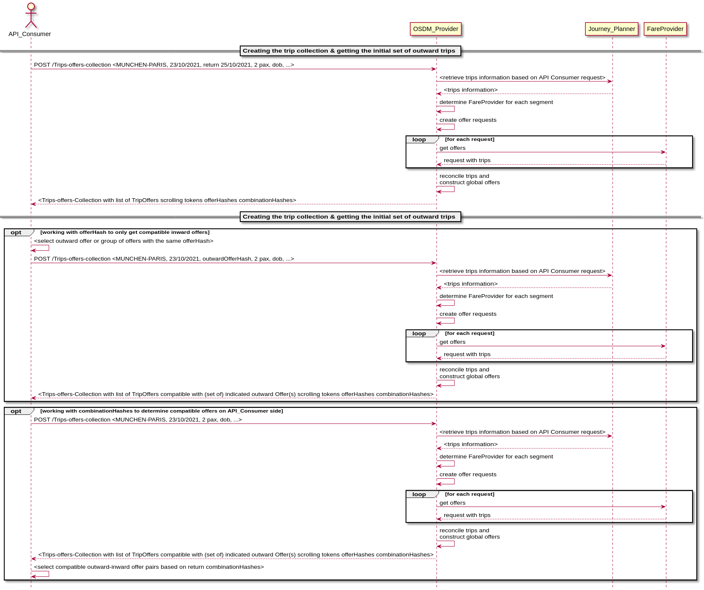

#### Error Handling

- the referenced trip cannot be found
- A search criteria value contains invalid value or invalid characters
- A search criteria lies outside accepted boundaries: it could be the date in
  the past, or too far in the future, or value outside bounds for the max number
  of changes
- The origin or destination is not known
- The trip search did not return any result
- No offer could be built for any of the discovered trips
- Schedule mismatch between systems
- Unknown error on server side

#### Place Availability of Offers

Each reservation item may provide availability information in `availablePlaces`.
The total number of places is specified when availability of accommodation sub
type `ANY_SEAT` is presented, optionally with all possible place properties. Sum
of all available places object does not build the total number, some of these
availabilities might be subset of the total. The fare provider is free to
provide either total capacity only, or detail on other accommodation types and
sub types.

```
...
{
  "availablePlaces": [
    {
      "accommodationType": "SEAT",
      "accommodationSubType": "ANY_SEAT",
      "placeProperties": [
        {
          "code": "SILENCE"
        },
        {
          "code": "WINDOW"
        },
        {
          "code": "AILE"
        },
        {
          "code": "TABLE"
        },
        {
          "code": "OPEN_SPACE"
        }
        ],
        "numericAvailability": 123,
        "tripLegCoverage": {
            "tripId": 1,
            "legId": 2
        }                
      ]
    },
    {
      "accommodationType": "SEAT",
      "accommodationSubType": "WITH_ANIMALS",
      "placeProperties": [
            {
              "code": "WITH_ANIMALS"
            }
        ],
        "numericAvailability": 5,
        "tripLegCoverage": {
            "tripId": 1,
            "legId": 2
        }                
    }
  ]
}
...
```

#### Getting Coach Layouts

Graphical seat reservation allows a customer to conveniently choose its
preferred place. Therefore two resources are added: First, `GET /coachLayouts`
to import all coach-layouts of an distributor or fare provider. This service can
be used periodically as master data service . Second,
`GET /coachLayouts/{layoutId}` returns the information for a given `layoutId`
and can be used during the on-line offering and booking process.

## A Complex Example Mixing Offers and Fares

### Request From Front-end

I want to go from Rotterdam to Wien Stephansplatz via Antwerp.

### Request Submitted to SNCB

Proposed trip by timetable system:

| Origin - Destination          | Train Number                         |
| ----------------------------- | ------------------------------------ |
| Rotterdam ? Antwerp           | Thalys 9324 (mandatory reservation)  |
| Antwerp ? Liège               | IC 2345 + IR 5567                    |
| Liège ? Frankfurt             | ICE 122 (mandatory reservation)      |
| Frankfurt ? Wien Hbf          | RailJet RJ 23 (optional reservation) |
| Wien Hbf ? Wien Stephansplatz | Metro                                |

### Fare Provider Resolution returns

| Origin - Destination          | Train Number                         | Fare Provider                      | Consolidated |
| ----------------------------- | ------------------------------------ | ---------------------------------- | ------------ | --- |
| Rotterdam ? Antwerp           | Thalys 9324 (mandatory reservation)  | PAO                                | PAO          |
| Antwerp ? Liège               | IC 2345 + IR 5567                    | Fare SNCB                          | Fare SNCB    |
| Liège ? Frankfurt             | ICE 122 (mandatory reservation)      | GUS                                | GUS          |
| Frankfurt ? Wien Hbf          | RailJet RJ 23 (optional reservation) | Frankfurt ? Salzburg (Border)      | Fare DB      |
|                               |                                      | Salzburg (Border) ? WienHbf        | Fare ÖBB     |     |
|                               |                                      | Frankfurt ? Wien Hbf (reservation) | Fare ÖBB     |
| Wien Hbf ? Wien Stephansplatz | Metro                                | Fare ÖBB                           |

## Booking Processes

### Creating a Booking Based on Offers

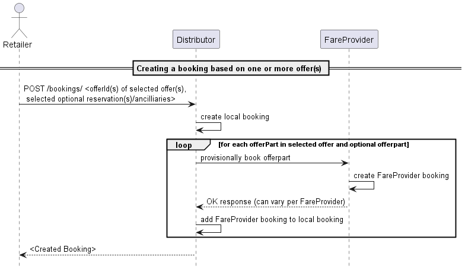

Once the offer has been selected, the API consumer can proceed to the booking of
that offer. Along with the offer, optional or mandatory reservations or
ancillaries can be booked as well. The optional offer parts can be identified
easily in the offers as they will always be linked with an admission product (in
`admission.reservations` or `admission.ancillaries`). The link contains the
relationType property, which indicates whether the pointed reservation or
ancillary is included (in which case it is not needed to explicitly add it in
the booking request), mandatory (the reservation or ancillary must be added in
the booking request) or optional (the reservation or ancillary can be added in
the booking request.

Adding optional or mandatory elements is simply done by adding the respective
offer part in the booking request (cf YAML specifications) `POST /bookings`.

It is also possible to book several offers in one operation to the same booking.
This is especially relevant to support return trips, where in most times it will
be mandatory. If this is the case, a collection of offer ids (and associated
reservations and ancillaries) is given instead of just one. However, note that
in this case the passengers party for all booked offers needs to be the same. To
ensure this, the passenger reference of each member of the passenger party must
remain the same from one offer to the other.

If the booking succeeds, a new booking resource is created. In this booking, the
booked offers can be found and should look a lot like the offers as they were in
the offer responses, with the exception that for reservations and fares, the
reservedPlaces element will now be populated with the places that have actually
be assigned to the passengers for this offer part.

### Additional availability information before provisional booking step

In most cases the offer will not contain information on specific place
properties for reservations. the reservation resource in the offer provides
information on the availability of places with the selected offer:

- Places with specific properties; please refer to the section _Place
  Availability of Offers_ on the semantics of provided Place Availabilities.
- Places nearby another place
- A graphical display of available places.

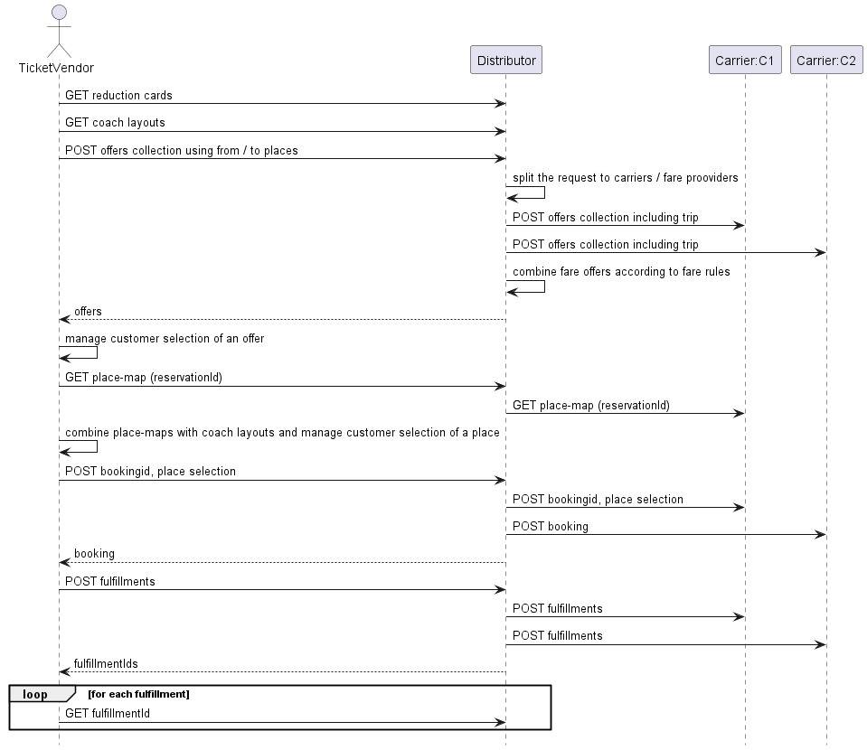

### Additional information in provisional booking step

In some cases, additional information must be provided before or at the
provisional booking time in order to be taken into account, such as:

- Additional passenger identity information
- Additional accommodation preferences regarding the accommodation, or its exact
  location.

While providing accommodation preferences is often optional, some information
(usually on passengers) may be mandatory in order to proceed with the booking.
The `RequestedInformation` property will provide the details of what needs to be
specified in order to book a given offer. These details are provided under the
form of a boolean expression, referring to the passenger model elements using
dot notation (with the `TripOffer` as the root). For example, if it is required
that name and first name are set to proceed`RequestedInformation` would be :

`passenger[<uuid>].details.firstName AND passenger[<uuid>].details.name`

Another example, if on top of first and last names, at least one email or one
phone number is needed:

`(passenger[0].details.firstName AND passenger[0].details.name AND (passenger[0].details.eMail OR passenger[0].details.phone))`

By parsing this structure, the API consumer is able to identify the elements
that need to be filled-in to proceed. An initial version the
[grammar for required information](../requested-information-grammar.html) is
available for review.

The two types of information (accommodation preferences and passenger data
updates) are both to be added in the POST /booking body:

- passenger information can be specified in the passengers array:
  `bookingRequest.selectedOffers[].passengers`
- seating preferences can be provided in
  `bookingRequest.selectedOffers[].placeSelections`

#### Reusable offers

A reusable offer is an offer that can be booked several times, as long as there
is sufficient availability, in distinct bookings and for different, but
equivalent, sets of passengers from those of the initial offer request.

The new set is considered equivalent when composed of passengers with a similar
profile (same reductions and birth date entitling to the same product(s)).

In case of:

- booking a reusable offer for a new set of passengers, all passengers'
  attributes need to be be fully specified in the `POST /booking` body, except
  the `id` that is always generated by the server.
- booking an offer, reusable or not, for the same set of passengers of the offer
  request, all properties are updatable except:
  - `id`
  - `externalReference`

Note however that updating a property can influence the eligible product in the
offer (such as date of birth or reduction cards) may lead to the booking being
rejected in case of incoherence.

It is the choice of the OSDM provider to declare offers as reusable, or not, in
the reply to `POST /offers`. Reusable offers however should be favored whenever
possible: while the OSDM provider retains control, it allows implementation of
powerful business use-cases (e.g. a ticket machine at the station that could
continue selling reusable offers while experiencing network issues and would
then synchronize the sales upon connection re-establishement).

Reminder: the accommodation preferences can be found in the `reservationOptions`
elements
`(offer.fare|integratedReservation|reservation.placeSelection.reservationOptions)`

The passengers in the booking resources are also the same type of resources as
the ones present in offers. However, they could be different resources, with
different ids (the passengers references do remain unchanged).

Initially, a booking will have the status `PREBOOKED` (see also the booking
status model).

#### Error Handling

- The requested reservation option is not available on this transport
- An invalid value is provided for a passenger property
- Referenced offer or offer part not found (offer expired ?)
- No rights to access referenced offer
- Incompatible offer part with the offer
- Missing information
- Reservation to sub-system failed for one or more offer parts
- Insufficient availability for one of the requested products
- Requested place not available

#### Provisionally Booking a Return Trip

While this may not be true for all providers, most of them require that the
outward and the return parts of a return trips are booked together in order to
actually book a return-specific product. Therefore, when building a return
travel, the API consumer should always specify the outward offer(s) and return
offer(s) in the same `POST /bookings` operation.

#### Provisionally booking a trip with offers clusters

When booking for a trip for which several offer clusters were provided
([see offer clusters](../models#offers-with-partial-coverage))), the API
consumer must be careful to always select one and only one offer from each offer
cluster in the tripOffer. This ensures that even though the selection is done
per offer cluster, the complete trip is covered exactly without any gap nor
overlap. However, the provider implementers must verify and validate the set of
offers selected is valid. if the trip being booked is also a return trip, then
the rule applies for each direction.

### Handling Partial Success of Pre-Booking


As a **Retailer**, partial pre-booking is not expected. As a consequence all
pre-booking operations are either fully successful or not executed at all.

However, a **Distributor** system may be configured in such ways that it is able
to combine offers from different fare providers (via an OSDM-compliant API or
not) and propose them in turn as one offer to its API to consumers, as one non
dividable product or as a bundled pack.

Unfortunately, when the booking is attempted, the process may encounter errors
leading to the booking failing with some of the sub-providers, while it will
have succeeded for other parts of the offer, directed to other sub-providers.
The result is a partially pre-booked booking. Since this situation is not
compliant with the OSDM specifications, this situation needs to be rolled back.
This can be done by cancelling the pre-bookings that were successful (on an OSDM
sub-provider, it would be performed using the `DELETE /booking/id` verb). An
appropriate error message is then returned in the booking response, under the
form of a JSON problem element.

As it was the case with offers, during the booking process, some events may
occur that are worth communicating to the API consumer, while they do not really
constitute an error nor should interrupt the booking process. These events and
situations can be communicated through the `Warning` messages:

- Price change: the booking succeeded, but the price of the offer has been
  modified between the offer generation and its actual booking
- Overbooking

#### Notes

- Booking an offer will not book the reservations in the offer unless they have
  an "included" relationship with an admission of that offer. In order to add a
  non-included reservation to a booking, the reservation ids will have to be
  passed additionally or it will not be booked.
- It is up to the OSDM API implementing party to decide whether booked offers
  can have the same resource ids as the offers in the shopping stage. However,
  it is assumed in the specifications that this is not the case, and the API
  Consumer should not rely on this possibility.
- In case the passengers details are different in the different offers added
  together in a booking, the passenger information of the first offer will be
  copied in the booking, and those of the following offers will be ignored.

### Completing Booking for Confirmation and Fulfillment

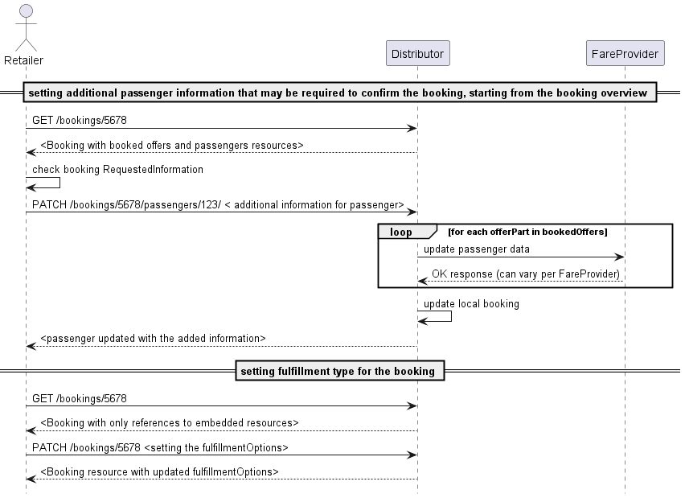

When the booking has been successfully created, some additional changes may be
desired or even required before the booking can be confirmed.

- As with offers, some passenger information may be required. If this is the
  case, the mechanism used is exactly the same as for offers: the
  `requestedInformation` property at booking level will indicate which
  information is needed to confirm using boolean expressions and dot notation.
  Updating the values is done via a PATCH on passenger sub-resources of the
  booking (as for the offer). Even if all the required data is already present,
  it could still be relevant to update these values. For example a dummy date of
  birth might, due to the selected fulfillment type now be requested to be the
  exact date and require an update, even though the property is already
  filled-in.

- It may be needed or desired to change or set fulfillment type and options. It
  is however recommended to the **Retailer** implementers to set a default value
  for these properties (especially if only one value is possible). Note that the
  choice of the fulfillment type & options may impact the requestedInformation.
  This property should therefore be re-evaluated whenever the fulfillment type
  is modified (both on the provider and on the consumer side).

#### Notes

The modifications on the passenger's properties will never impact the products
in the offer (thus also not the price), even if this leads to an inconsistency
between the offered product and the updated passenger property.

#### Error handling

- An invalid value is provided for a passenger property
- Attempted to modify a read-only property
- The booking is confirmed/refunded/cancelled and does not allow modifications

### Cancel a Not Confirmed Booking

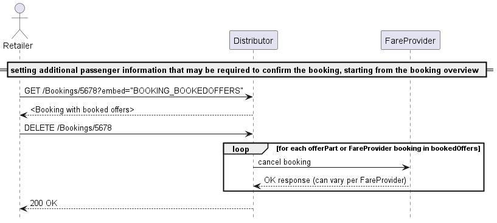

In case a pre-booked booking is abandoned by its user, and this event is
captured, it is recommended for the API consumer to properly cancel the booking
on the **Retailer** side. In case this is not done the booking will be cancelled
when the ticket time limit is reached, but in the meantime all related resources
(seats etc) will remain unavailable for other requests. Upon receiving a
`DELETE /bookings` for a given booking, the **Retailer** should obviously do its
own cleaning as well, and if needed pass on the cancel to its sub-providers.

In case of a partial success for booking, the `DELETE /bookings` can also be
used to clean-up the bookings on sub-providers where the pre-booking succeeded
and who support the OSDM protocol.

Regardless of whether the cancel occurred through an explicit `DELETE /bookings`
or expiry of the ticket-time-limit, the booking state will then change to
`CANCELLED` for a short "grace" period, before being completely cleaned-up
(offer parts are well cleaned-up immediately). This grace period aims at
ensuring that any ongoing operation with the booking is given sufficient time to
get an explicit info on the cancelled status of the booking. The choice of the
duration of that grace period is left to the implementor.

#### Error handling

- the booking is already confirmed
- the booking is already cancelled
- unknown error on the server side

### Payment information and Payment Vouchers

OSDM does not currently handle the payment process directly, which means that
payment from the customer has to be taken by the distributor outside of this
API.

It is necessary for the distributor or fare provider to know about certain
aspects of the payment, e.g. the method of payment (e.g. Invoice, Cash, Non-Cash
methods like Credit/Debit cards or Direct Debit).

It is also necessary to be able to use Payment Vouchers, such as those that are
given by distributors or fare providers in response to Passenger Rights Claims,
or that are used as means of refund on certain tariffs (e.g. Deutsche Bahn
Sparpreis).

As a Payment Voucher is a kind of payment, the handling of these goes together
in the API.

The process for a booking which uses one or more Payment Vouchers, and that
specifies the means of payment, is as follows:

1. Create the preliminary booking by using the `POST /bookings` endpoint
2. Add any Payment Vouchers by using the `PATCH /bookings` endpoint and filling
   out the payments information only for the Payment Vouchers presented
3. This will return a preliminary booking structure which has the payment
   information for these vouchers added, including the value of the vouchers.
   Should the value of the vouchers exceed the value of the booking, an
   Ancillary Offer will have been added to the booking which represents a new
   voucher covering the overpayment.
4. Add the payment information for the balance of the booking (should there be
   any) in another `PATCH /bookings` call
5. The booking is now "balanced", i.e. the sum of all payments equals the sum of
   all offers

## Confirmation and Fulfillment Processes

### Fulfillment Process

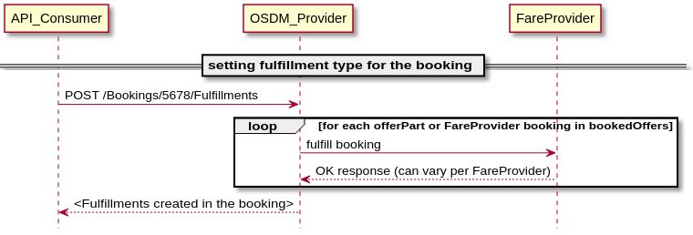

The fulfillment is the final step of the booking. In most cases, the booking
will be confirmed and fulfilled in one step from the API consumer standpoint:

- fulfillments elements are created with the appropriate status (see below)
- the provisional balance becomes confirmed
- the status of the booking changes to `FULFILLED` (for most systems) or
  `CONFIRMED` (see below)
- if relevant the documents elements in the fulfillment resources are created
  and linked

The **Distributor** will have to

- confirm or fulfill the bookings towards all his providers
- retrieve the fulfillment details to populate its own booking responses (and
  databases, most likely)
- build the fulfillments
- update relevant booking properties as described above.

A fare provider will rarely provide real fulfillments as the distributors is
responsible to create the fulfillments of the combined offers. However the fare
provider has the option to provide fulfillment parts (e.g. visual security
elements,..) to be integrated by the distributor in the combined fulfillment.

#### Fulfillment Process of Multi-Journey Products

Multi-journey products provide the right to travel on multiple journeys. These
can be defined in the product as a specific number of travel days or of
journeys. In order to use the travel right the fulfillment has to be enhanced
with additional information on the intended use. e.g.:

| Travel right                                          | Required information                                                                                   |
| ----------------------------------------------------- | ------------------------------------------------------------------------------------------------------ |
| Pass for a number of travel days                      | The day of travel is provided and as a result the fulfillment for that selected day becomes fulfilled. |
| Travel right a number of journeys                     | The day or start time is provided and as result the fulfillment for one journey becomes fulfilled.     |
| Travel right for a number of trips of a limited range | The time when the journey starts and the starting place needs to be added                              |
| Tickets for a selectable number of zones              | the selected zones need to be provided                                                                 |

After the booking confirmation the fulfillment will be in state of `available`
in case the fulfillment just requires additional selections to be come
fulfilled. To fulfill it the patch endpoint of the API on the fulfillment needs
to be used to select more options like travel date or zones. The fulfillment in
the state available provides information on the selections to be made.

A fulfillment can be in state `on hold` if it is not yet available to be
fulfilled. This corner case exists tickets providing a limited number of trips
per time (e.g. 5 trips per week) and the number has already been used for the
current time range.

Fulfillment can be in state expired if they had been available but were not
requested in time.

#### Error handling

In the confirmation and fulfillment process, the following issues can arise:

- Unknown error on provider side
- Missing information in the booking
- No fulfillment type selected
- Booking already confirmed/fulfilled/cancelled

#### The Special Case of Partial Success

If a booking is composed of multiple offer parts, some of them potentially
coming from sub-providers, it could be that at confirmation (or fulfillment)
time, the operation only succeeds for some of the bookings. Unfortunately, a
clean roll back to the previous state is not possible here for the succeeded
confirmation. The middle **Retailer** (combining offers of its sub-providers on
request of its API consumer) has several options to handle the situation:

In all cases, the middle **Retailer** obviously has the option of proactively
retrying to confirm on OSDM sub-providers where the confirmation failed. But
this may keep on failing beyond a reasonable waiting time for the API consumer.
A different strategy then needs to be applied:

The first possibility is to completely clean up the booking by:

- cancelling unconfirmed content
- refunding confirmed content (with overrule if needed)
- returning an error message to the API consumer

In this case, the specific error handling remains concealed for the API
consumer, who only will be informed of the final result, being the the booking
has failed and been completely cancelled.

The second option is to expose the situation to the API Consumer and let it
decide of the course to be taken. In this case, the resulting partial booking is
returned to the API consumer with an error state

The choice of the strategy to follow here is left to the implementers. However,
the implementer who would choose to expose the situation and let the API
consumer handle it, also needs to implement the logic described hereunder. This
may be slightly more complex than proactively cleaning up the booking in its
entirety.

If this strategy is chosen, the partial booking will then be returned with the
following specific characteristics:

- the returned booking has an `ERROR` status
- fulfillment is available/fulfilled only for some of the `OfferParts`
- the confirmed balance amount only totals offer parts where the confirmation
  actually succeeded, while the provisional balance amounts to the total of the
  offer parts where the error occurred (or where the confirmation was never
  attempted because the error came too soon)

The following options are then available to the API Consumer:

- Explicitly request a retry on the confirmation, by re-triggering a POST or
  PATCH / Fulfillment. The **Retailer** will then re-attempt to confirm the
  not-yet confirmed content in the booking, while leaving the confirmed
  unchanged.
- Either directly, or after a few attempts on re-confirming, the booking needs
  to be cleaned-up so it can have a consistent status again (meaning the
  totality of the content is confirmed). To do so:

  - The API consumer must start by cancelling the non-confirmed content. He can
    do so by sending a PATCH on the booking where the `cleanupPartialBooking`
    property set on TRUE. This will result in
    - the cancellation of all non confirmed content,
    - adaptation of the balance values (provisional balance = 0, confirm balance
      = sum of confirmed products)
    - a reset of the booking status to `FULFILLED` (or `CONFIRMED`, depending on
      the confirmed content fulfillment status)
  - If deemed relevant, the API consumer can even completely remove the booking
    by refunding the confirmed part, if needed using an overrule code.

### Confirm booking without fulfillment

For some providers or products, the booking confirmation and the fulfillment
step are distinct steps, while for others/most, booking confirmation and
fulfillment are performed together. For products where this is the case, the
fulfillment item generated by the `POST fulfillment` will show several
differences from those where the product is confirmed and fulfilled in one step:

- The most obvious difference is the status, that is set to `CONFIRMED` instead
  of `FULFILLED`
- No document nor fulfillment item will be provided
- The fulfillment may not have a controlNumber.

In terms of process, creating this fulfillment at this stage allows an uniform
confirmation process (the totality of the booking is confirmed in one step) for
bookings that would mix the two kinds of fulfillment processes. The fulfillments
can later get PATCHed in order to trigger the actual fulfillment.

When a confirmation request is received by the **Retailer**, it should first
ensure that the operation is indeed supported for all offer parts in the booking
(whether the **Retailer** is hosting those or they are coming from
sub-providers). Indeed, OSDM does not support partial confirmation or partial
fulfillment.

If this check is successful, then the execution of the confirm can start:

- All offer parts will be confirmed (locally or via requests to sub-providers),
  in parallel or sequentially
- The ticket-time-limit is invalidated (set to 0)
- The state of the booking is set to `CONFIRMED`
- The provisional balance is set to 0
- The confirmed balance is set to the total amount of the booking
- Response is sent to the API consumer

As of that point, cancelling the order becomes impossible (except for cleaning
up cases, cf below) and any subsequent change should be handled as an after
sales operation. Once the booking is confirmed, it becomes also impossible to
modify any element in the booking (such as fulfillment type or passenger
information)

### Interlude: Requested Information per Process Step

These are the required information needed per process step for major parties

| Distributor         | Pre-booking Step                                                                                                                                                                                                                                                                                               | Booking Step                                                                                                                            |
| ------------------- | -------------------------------------------------------------------------------------------------------------------------------------------------------------------------------------------------------------------------------------------------------------------------------------------------------------- | --------------------------------------------------------------------------------------------------------------------------------------- |
| **Bene**            |                                                                                                                                                                                                                                                                                                                | `firstName` and `lastName`                                                                                                              |
| **DB**              | In general one `firstName` and `name`, regardless of the number of passengers. In case of regional trains, however, all names and sur names are needed, unless printed on security paper.                                                                                                                      |
| **öBB**             | Both `firstName` and `lastName` are needed. `dateOfBirth` date may be needed. Some reduction cards require the number to be provided at pre-booking time, in order to be pre-checked. In other cases, the cards are simply checked on-board `phoneNumber` or `eMail` (once per order - as contact information) | `phoneNumber` or `eMail` (once per order - as contact information)                                                                      |
| **RENFE**           | Per passenger: `firstName`, `lastName`, surname document type and identity document (DNI, NIE or passport). A `phoneNumber` or `eMail`.                                                                                                                                                                        | Per passenger: `firstName`, `lastName`, surname document type and Identity document. (DNI, NIE or passport) A `phoneNumber` or `eMail`. |
| **SBB**             | Per passenger: `name` and `first name` and `dateOfBirth. Additional sales parameters for some products such as `phoneNumber`or`eMail` for reservations                                                                                                                                                         |                                                                                                                                         |
| **SJ**              | Todo                                                                                                                                                                                                                                                                                                           |                                                                                                                                         |
| **SNCF**            | `dateOfBirth` is mandatory, a fake date can be used at offer time, but the real one must be provided at pre-booking time                                                                                                                                                                                       |
| **Eurostar/Thalys** | `firstName` and `lastName`                                                                                                                                                                                                                                                                                     | Thalys loyalty card number                                                                                                              |

## After Sales Processes

### Refund

#### Request a Refund Offer

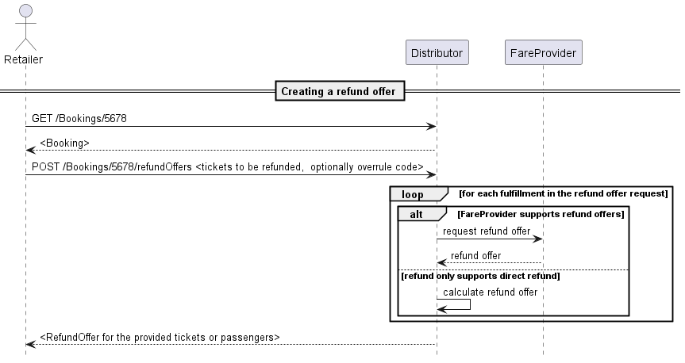

On a confirmed booking, and if it is allowed, after sales operations are also
possible via the OSDM API. In OSDM, the refunds are taking place based on
fulfillment resources. There is no partial refund of one fulfillment possible.
This also means that in case of collective ticketing, all passengers will be
refunded in one go.

In order to perform a refund, the API consumer first has to create a refundOffer
in the booking where the fulfillments to refund are located with a
`POST refundOffer`. If the set of fulfillments provided is a valid set for
refund, the operation creates a refundOffer that contains the information that
is relevant to the refund operation at the moment the refund offer was created.
This includes information such as the amount that will be refunded, any
potential refund fee, etc (see the model for more details).

#### Cancel a Refund Offer

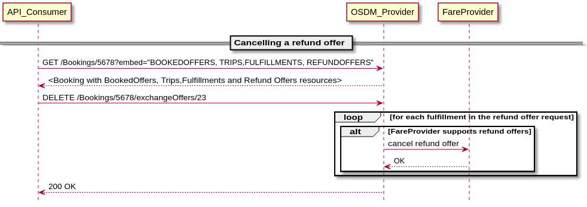

#### Confirm a Refund Offer

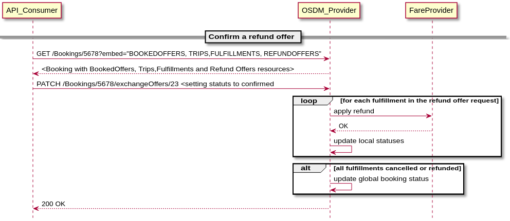

### Release a Booking

#### Request a release Offer

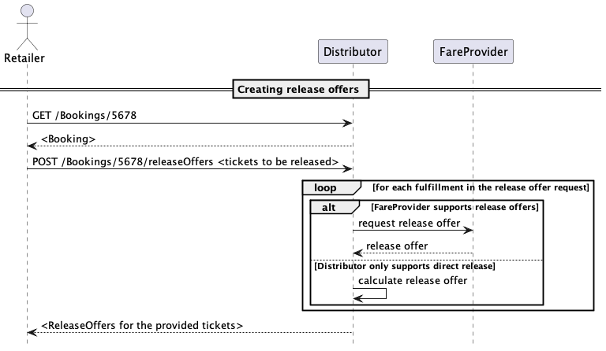

The release of a ticket is an intermediate step towards a refund. The release
invalidates the admission and frees resources such as reserved seats. It does
not refund the money to the customer as this is done later on at the retailer.
This intermediate step allows other parties to initiate the refund process (e.g.
one of the involved carriers) and to reuse the resources. The customer benefits
as the time for calculating the refund amount wll be the time of the release.

The process of releasing a ticket is similar to the refund process. A release
offer is requested and needs to be confirmed to be applied.

#### Cancel a Release Offer

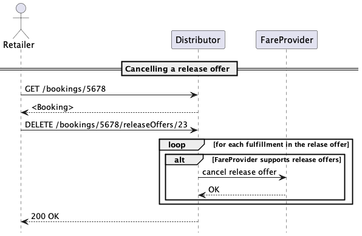

#### Confirm a Release Offer

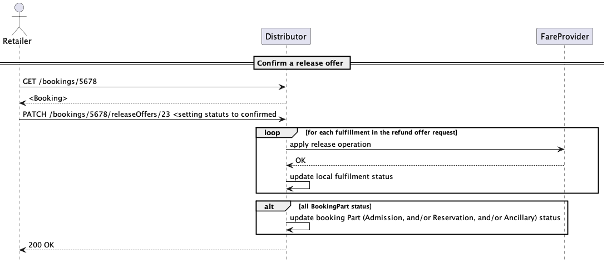

### Cancel Fulfillment

#### Cancel Fulfillment request

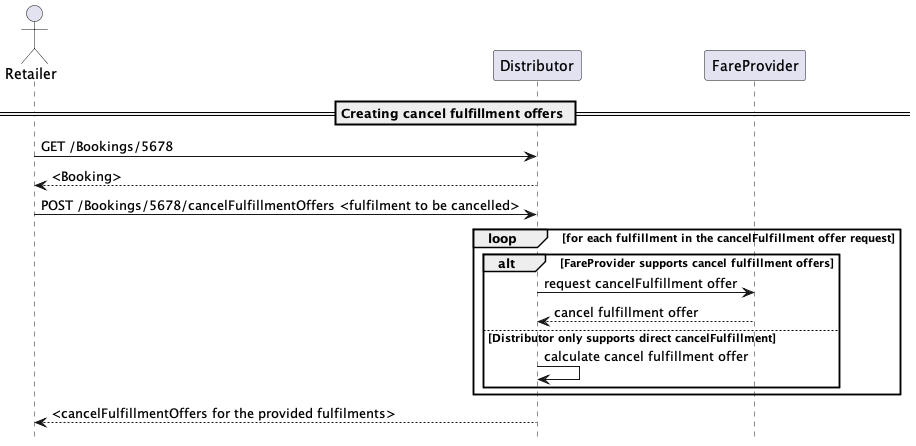

A fulfillment can be cancelled and regenerated. This might be necessary in case
of fulfillments linked to physical items (secure paper, phones or cards). The
cancelled fulfillment can be recreated later on.

To cancel a fulfillment a cancel fulfillment offer needs to be requested. This
offer can be confirmed to delete the fulfillment.

#### Cancel a CancelFulfillment Offer

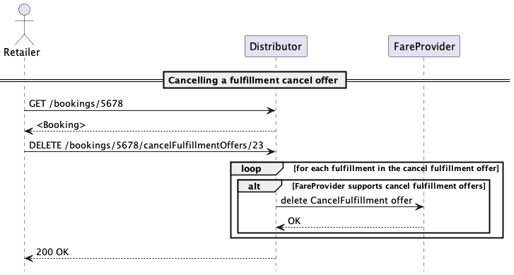

#### Confirm a CancelFulfillment Offer

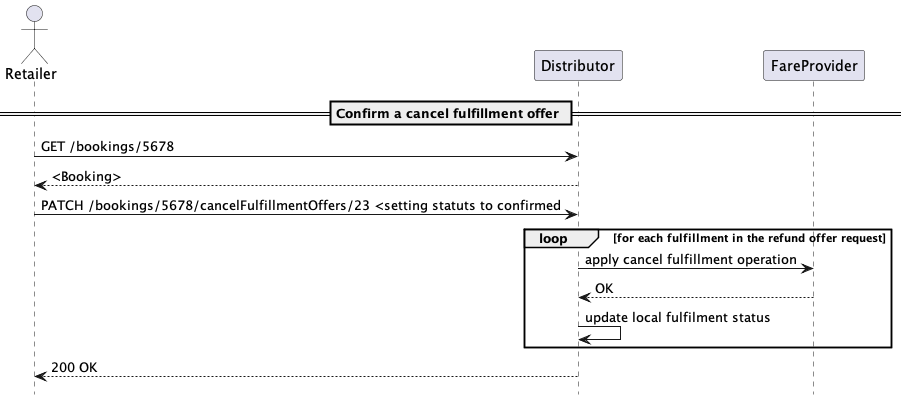

### On Hold Bookings

An unconfirmed booking will expire after the time limit of the booking. An
extension of the time limit can be requested as a OnHold-Offer. The offer can be
requested and needs to be confirmed to extend the time limit. The OnHold offer
might be subject to a fee.

## Example End-to-end Interaction

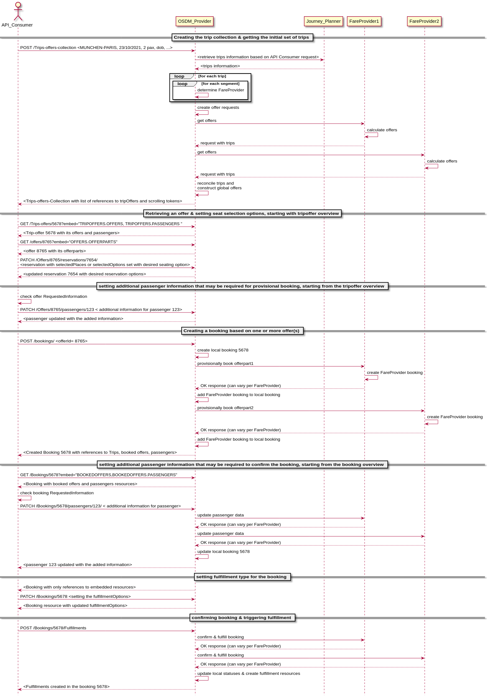

### Exchange

#### Requesting an exchange offer

Requesting an exchange offer is almost identical to requesting a standard offer.
The only difference in the request is that the fulfillment that the API consumer
wants to exchange, and an overrule code if relevant, are also provided.

### Replacement of lost tickets and cards

The replacement is used to replace physical cards and tickets. There is no
replacement for electronic tickets or anonymous tickets.

#### Requesting a replacement for a lost ticket

The replacement is requested similar to the request for a non-trip based offer.
The search tags must include the key word CARD_LOST or TICKET_LOST. The provider
will ask for the required data of the lost card or ticket to be provided with
the passengers card data (card number).

The offer for a replacement returned might include a fee. The replacement offer
needs to be accepted and booked the same way as a usual offer.

### Complaints

Complaints can be provided on behalf of a passenger. Complaints might concern a
delay of a train or a service degradation on the journey. The handling of
complaints is subject to the EU PRR and COTIV where minimal compensation amounts
and time lines for the decision of a claim are defined. According to PRR the
customer can decide whether he wants to be compensated by money or would accept
vouchers.

The handling of a claim is an asynchronous process, where the claim is placed
and decided by the carriers/fare provides involved later-on.

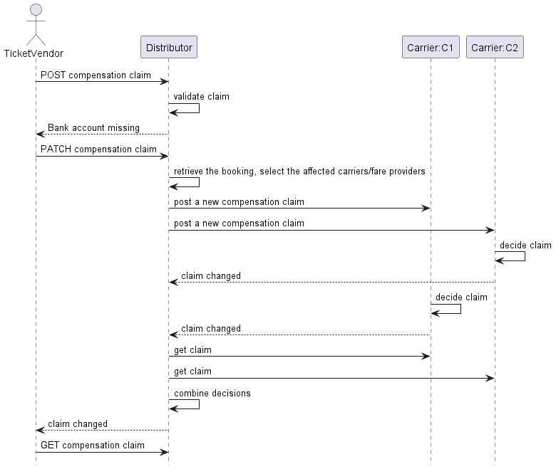

As the distributor is usually also involved as a carrier and then responsible to
keep the legal time lines he can decide to compensate and inform the fare
provides/carriers on his decision if the time line would otherwise can not be
held.

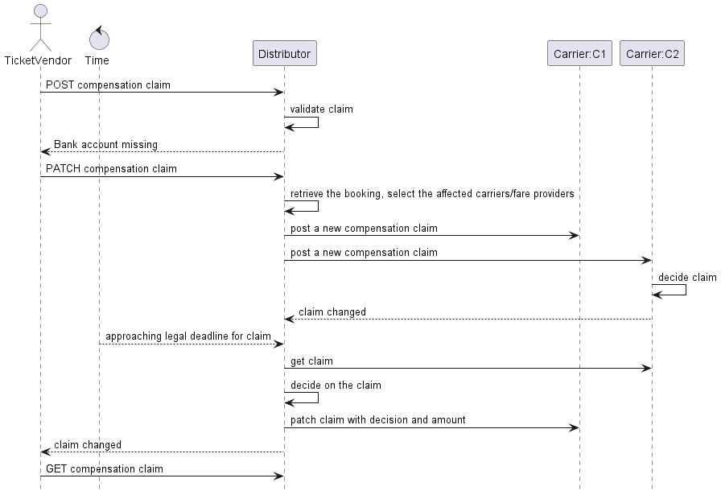

### Reimbursement

Customers who have bought a ticket which allows reimbursement and which have not
traveled or traveled partially only can claim to be reimbursed. The customer
must prove that he has not or only partially used the ticket. A partial use
might be a only a part of the trip was traveled or only some of the travelers
were traveling or a combination of both.

The non use of a ticket might be proven by documents that were provided to the
passenger on a train or at a station. This prove can also be provided in
electronic form by a carrier or TCO (UIC IRS 909181-4 / TAP-TSI B.14).

The customer must be able to make the reimbursement claim via a retailer to the
distributor which needs to request the reimbursement from the involved fare
providers / carriers.

The reimbursement process is very similar to the complaint process where instead
of a complaint a reimbursement request is created. If the reimbursement request
is valid the special overrule code `TICKET_UNUSED` can be used in the refund
process to refund otherwise non-refundable bookings.
