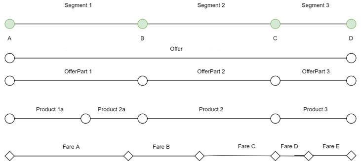

The entities represent different concepts.

An `offer` spans the whole trip consisting of segments. An `offerpart` spasn a
segment or - in the case of thru fares - multiple segments. An `offerpart`
reference one or two products, whereas two products are only referenced
in some rare TGV-TER scenarios.

A `fare` is not necessarily bound to segments but reflects the tariff
worlds. A `fare` often starts or ends at country borders where no train station exist.
This border points are thus called virtual border points. Fares are
combined following the fare combination models to offers.

## Three Scenarios

In order for a

### First Scenario: Offline import of complete fare data

An allocator imports all fares of a given RU using a batch import from
the OSDM-Offline platform.

The fares contain all relevant information to create offers, bookings
and fulfillments (aka. tickets). If booking has occurred the RU informs
it the fare owner, i.e., the RU of the fare sold.

Accounting is done using the existing downstream UIC 301 flows.

### Second Scenario: Import of relevant fares at offer step

At offer time, an allocator looks up the fares for a given O/D in its
database. If it doesn't find it the allocator imports the relevant
fares.

Accounting is done using the existing downstream UIC 301 flows.

### Third Scenario: No import of fares

For a given origin/destination and date of travel the relevant fares are
returned as part of the Offer. The

### Models for combination

In the offer creation step we have four models of combination to support

1.  `SEPARATE_CONTRACTS` model
2.  `SEPARATE_TICKETS` model
3.  `CLUSTERING` model
4.  `COMBINATION` model

### Attributes of An Online Fare

### Roles of Fare Attributes in the Booking /After Sales Process

### Common Misunderstanding

  **Flexibility**   **FareCombinationConstraintDef.combinationModels.allowedClusters**
  ----------------- --------------------------------------------------------------------
  FULL-FLEX         BUISNESS, FULL-FLEX
  MID-FLEX          SEMI-FLEX
  NON-FLEX          NON-FLEX, PROMO

