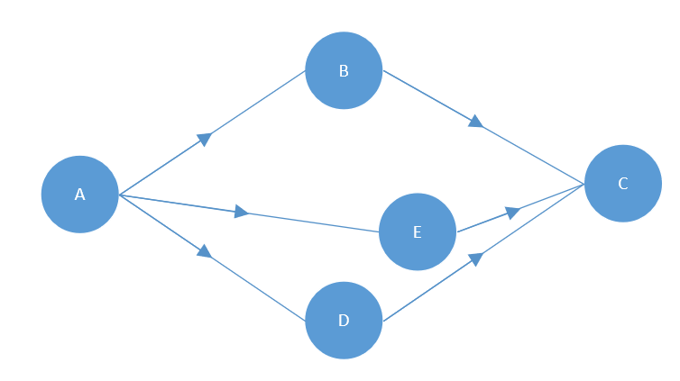
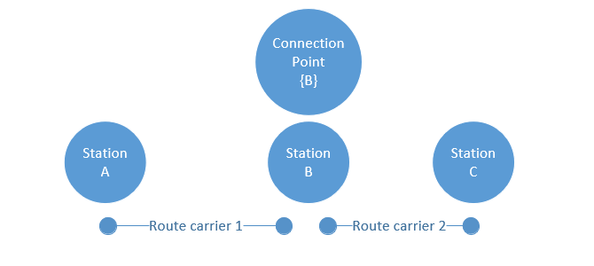
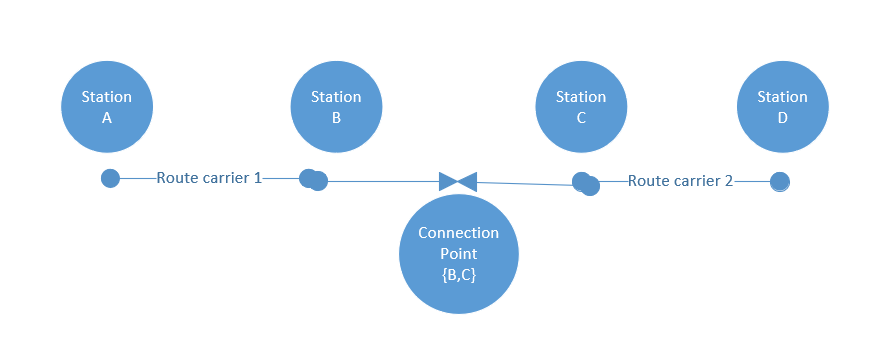
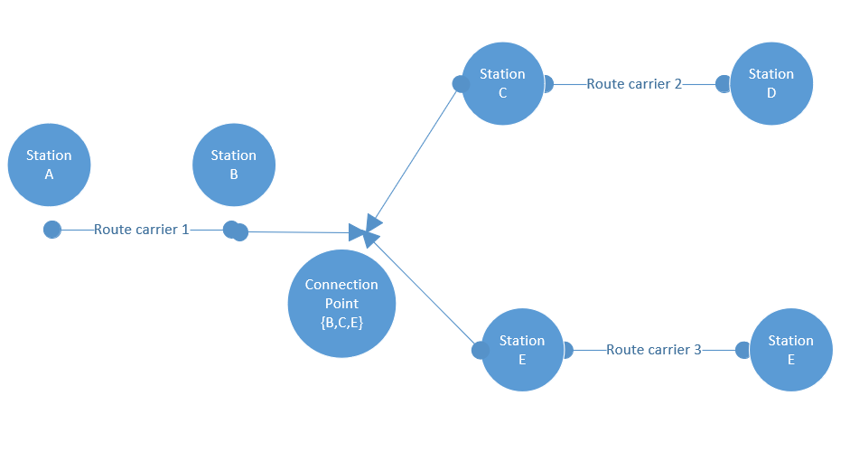

## Common Functional Requirements

### Requirements on Product Range

It must be possible to distribute and sell all existing products on a fare as
well as on an offer basis. Existing products include admissions (a.k.a Tickets),
reservations and ancillaries.

### Requirements on Price

A price has a currency, an amount and a scale. Per default the scale is set to
two.

A price has a set of value added taxes. A tax is valid for a country and has
amount.

### Requirements on Personal Data

The needed personal data must be indicated. Only personal data needed for the
given business process can be transferred between the parties involved.

## Functional Requirements of the Retailer

### Requirements on Passenger

A passenger is the person travailing on a vehicle. A passenger must not
necessarily be the person who has bought the booking, i.e. the customer.

A passenger has a gender (male, female or X) and date of birth. A passenger can
own reductions, most often in the form of cards.

A reduction has a type, a name and an issuer.

Passenger information must be collected sparsely and only if needed for a
dedicated process step. Passenger details providing personal information shall
only be used to meet the requirements of the offer. It is not allowed to send
personal information not required in the offer reply. It is not allowed to send
these personal data already in the offer request.

Additional personal data of a passenger are title, first name, last name, phone
numbers, emails or other social account.

For certain context it might be necessary to have information about the
passenger’s passport. This information can be added to a passenger if needed
(e.g. Eurostar trains).

A passenger can have a set of reduction cards.

A passenger can further transport dogs, bicycles, cars, motorcycles or trailers
if this is supported by the transport vehicle.

### Requirements on Location

A location uniquely identifies a place in space. A location can be of type
station, point-of-interest, address or geo-coordinate.

For railway stations the UIC code station codes most be supported.

To support other means of transportation the types can potentially be extended.

### Requirements on Trip

A trip must contain the following information.

- `origin`: a location where the vehicle departs
- `destination`: a location where the vehicle arrives
- `duration`: the duration of the trip
- `tripLegs`: a list of tripLegs

A trip is composed of one or more `tripLegs` and can be of one the following
type:

- **TimedLeg**: A type of leg with a timetable schedule such a provided by
  public transport
- **TransferLeg**: A type of leg that links two legs such as walking from one
  stop to another
- **ContinuosLeg**: A type of leg that is not bound to a timetable. This leg is
  mainly aimed at new modes such as scooter, taxis,..

A tripLeg represents a subsection of a trip that is realized with the same
transport vehicle. In railways it is typically one train (between the moment
passenger steps on-board until stepping out of that train) but could be using
different means of transportation. A tripLeg has an origin, a destination and
duration.

A vehicle is defined by a number or line and a service brand.

A transfer is a special kind of tripLeg, defining how long the transfer takes.

### Requirements on Offers

An overall offer presented to a retailer or a distributer bundles offers that
contain admissions, reservation and ancillaries.

An offer has an overall comfort class and an overall flexibility.

An offer has a minimal price. The minimal price is the price that does not
include optional reservations or ancillaries.

An offer is valid for a given time.

An offer can be pre-booked.

An offer should span at least one tripLeg of the trip and include all needed
services.

#### Requirements on Admission

An admission provides the right to travel on a vehicle.

An admission has a price. In general, the price is calculated per passenger.

An admission offer is valid for a given time. An admission offer shows which
reductions has been applied.

An admission is linked to one or more passengers.

An admission is in state **CONFIRMED, FULFILLED, USED, REFUNDED.**

In general, there’s a one-to-one relationship between offer and product. Only
for some combinations of TGV and TER in France an offer must support referencing
two products. Additionally, an included reservation does not reference a
product.

An admission might be linked mandatorily or optional to one or more reservations

#### Requirements on Reservation

A reservation provides the right to sit or lay on dedicated place in a vehicle

A reservation has a price.

A reservation can be **OPTIONAL, MANDATORY,INCLUDED** to an admission.

A reservation offer is valid for a given time. An admission offer shows which
reductions have been applied.

A reservation is linked to one or more passengers.

A reservation is in state **CONFIRMED, FULFILLED, USED, REFUNDED.**

A reservation has a one-to-one relationship to a product.

An integrated reservation shall be modelled as an admission with an included
reservation.

#### Requirements on Ancillary

An ancillary is a service that can be offered to a customer. Examples for
ancillary services: Wifi access or on-board meal.

An ancillary has a price.

An ancillary can be **OPTIONAL, MANDATORY,INCLUDED** to an admission or
reservation.

An ancillary offer is valid for a given time.

An ancillary is linked to one or more passengers.

An ancillary is in state **CONFIRMED, FULFILLED, USED, REFUNDED.**

An ancillary has a one-to-one relationship to a product.

#### Requirements on Fees

Fees of a distributor or a carrier can be required upon the sale of
reservations, admissions or ancillaries or collectively for a set of
reservations, or for a booking.

A fee has a value.

A fee applies to one or more offer parts, and to one or more passengers.

A fee is automatically added to a booking if the relevant offer parts are
included, e.g. a reservation fee is automatically added when any reservation has
been selected.

Whether a fee is refundable is defined by the tariff.

The state of a fee depends on the state of the associated product.

### Requirements on Prolonging an Offer

_Optional requirement_

Especially for travel agency a common use case is to prolong the validity of an
offer, so that the customer has more time to decide. This process can also be
understood as putting an offer on hold.

If a supported by the underlying system it must be possible to request an on
hold offer to put an offer on hold for given time period.

If accepted a deposit will be charged from the requestor. Additionally, a fee
can be requested once the prolonged offer is actually booked.

### Requirements on Offer Combination

Offers from different providers might have a restriction to be sold in
combination only.

The combination might not be be required by all offers. E.g. an offer from
provider A might only be sold if offer B of another provider is sold but offer B
can be sold stand alone.

The combination logic needs to be fast (<20ms).

### Requirements on Round Trips

Round trip offers should be possible considering both trips when making the
offer.

Support for round trips consisting of one or two products need to be supported.

### Requirements on Booking

A booking consists of a selected offer and optionally reservations or optional
ancillaries.

It must be possible to search for bookings:

- Passenger first name, last name or passenger date
- Booking reference
- Fulfillment reference
- Travel date or end
- Origin or destination

To support stateless booking a explicit pre-booking step is _not_ supported by
design.

A booking has a purchaser which has booked the booking. The booking can but most
not be a passenger.

Booking must be supported by all parties.

### Requirements on Products

A product must contain the following information:

- An id uniquely identifying the product, e.g. "Sparschiene".
- A textual description of the product.
- A structured description of the sales or after-sales conditions which are
  machine interpretable as well as a human readable.
- A indication whether a product is _refundable_, _refundable with conditions_
  or _not refundable_.
- A indication whether a product is _exchangeable_, _exchangeable with
  conditions_ or _not exchangeable_.
- The service class describing the level of comfort.
- Define the supported fulfillment media types.

A product does not have a price, as the price is bound to an offer as an
instantiation of a product.

### Requirements on Fulfillment

A fulfillment must be in a well-defined state (**CONFIRMED, FULFILLED,
CHECKED_IN, REFUNDED**) and have a unique control number. The fulfillment must
reference the offer parts covered by the fulfillment.

A fulfillment must reference fulfillment documents (aka. tickets). Fulfillment
documents in form of a UIC PDF ticket most be supported by all parties. A
fulfillment is provided for a specific FulfillmentType (e.g. CIT_PAPER) and
FulfillmentMedia specifying the format (e.g. RCT2).

**In distributor mode only:** A fulfillment may reference fulfillment items such
as visual security elements, additional bar codes or control key.

### Requirements on Documents

It must be possible to add and delete a document to a booking. Such a document
can be a booking receipt, a CO2 report, a explanatory documentation to a
complaint or any other general document.

A document can reference a booking or a passenger in a booking.

### Requirements on Refund

For a given a booking a refund can be requested.

A refund can have a fee.

Cancellation (a.k.a. revoke) is a special kind of refund where no fees apply,
and the complete amount is returned triggered by an overrule code.

Cancellation must be supported by all parties.

Total refund must be supported by all parties.

### Requirements on Partial Refund 

Partial refund allows to remove passengers and booking parts (only if supported by the
underlying tarif) from a booking.

A partial refund can have a fee.

Partial refund may be supported by all parties.

### Requirements on Exchange

Exchange allows to change trip and passengers.

An exchange can have a fee.

Exchange may be supported by all parties.

### Requirements on Seat Change

_Optional requirement_

If supported by the underlying system, it most be possible to change of seat
after the booking is confirmed and fulfilled. This change can either be free or
a fee can be requested from the carrier.

The following scenario exist:

1. Specific seat and coach requested: Optionally, a seat map can be requested,
   so that the user knows which seat is available. The user can then select a
   specific coach and seat number.
2. Near to a given seat: The user provides in the request a seat number he
   wishes to be seated next to.
3. Seat preferences: The user provides seat arrangement such as window, aisle
   etc…

Some providers give the possibility to up sell to a better seat after booking.
This is an adjacent but not equivalent case, as the change of seat should not
affect allocation or update the inventory.

### Requirement to Release Allocated Resources

_Optional requirement_

For some systems (e.g in the French or Swedish market) it must be possible to
allocated resources such as places, meal or others.

### Requirement to Cancel a Fulfillment

_Optional requirement_

For some systems (e.g. in the French) it must be possible to cancel a
fulfillment (_Void PNR_).

### Requirements on Complaints

It must be possible to manage a complaint according to (EU) **2021/782**.

It must be possible that the claim is managed by a separate person on behalf of
the passenger.

It must be possible to retailers or distributors to submit a claim for a booking
or parts of it (e.g. in case of a return trip) where the service has not been
provided as promised. This includes:

- Delays of trains
  - In case the train was not restricted to specific trains this includes also
    trains which were not mentioned in the trip of the booking
  - A description of the cause is needed delayed trains incl. the delay, missed
    connections, cancelled trains,...
  - Abandoned travel (e.g. in case of a return, subsequent trains,..)
- Service derogation (e.g. first class not available, ...)

It must be possible to provide documentation to support the claim (e.g. scanned
manual remark of train staff) (Alternatively require exchange via **UIC
90918-4**).

It must be possible to demand the that the claimed amount is issued as a voucher
or transferred to a bank account.

It must be possible to lookup the status of the claim made.

In case a claim is accepted or rejected the actor that made the request must be
informed. The accepted or rejected claim must provide an explanation for the
decision especially if the amount covers the ticket price only partially.

It must be possible to inform the distributor / fare provider that the payment
was made and the claim is settled.

It must be possible for a distributor to inform the fare provider that the claim
was accepted because the fare provider missed a legal time line to handling the
claim.

### Requirements on Reimbursements

Customers who have bought a ticket which allows reimbursement and which have not
traveled or traveled partially only can claim to be reimbursed. The customer
must prove that he has not or only partially used the ticket.

A partial use might be a only a part of the trip was traveled or only some of
the travelers were traveling or a combination of both.

The non use of a ticket might be proven by documents that were provided to the
customer/traveler on a train or at a station. This prove can also be provided in
electronic form by a carrier.

The customer must be able to make his claim via a retailer to the disributor
which needs to request the reimbursement from the involved carriers.

## Functional Requirements of a Distributor

The requirements covered by this specification are listed here with references
to the implementation. Changes in the requirements during the lifecycle of this
specification might lead to changes in the corresponding implementations.

### Requirements on regional validity

Users of the data:

- The distributor to link a journey from the timetable to the valid offers based
  on the fare data (automated)
- The passenger in a readable form to know which transport connections he can
  use (manual)
- A controller to validate the ticket on a train or station or station (manual
  and/or automated (e.g. gates))

Non-functional:

- The fares depend on the timetable. The station data are not part of the fare
  structure. Stations will always be referenced by the station code used in the
  timetable. Station codes used are those in the timetable according to EU
  TAP-TSI B.1.

Functional concepts:

#### Station

A station which could be used in timetable data to embark and/or disembark
passengers.

#### Fare reference station set (virtual pricing point)

A fare reference station is a list of stations where the fare is valid with a
common name.

#### Route

A route is defined as an ordered list of stations or “fare reference stations”
along a possible travel route. In the human readable form, the stations are
separated by “\*”.

A route can split into optional routes indicated in the human readable route by
“/”.

The end of a route of one carrier when combined to another route of another
carrier might be indicated with an additional text (e.g. FR or GR) in the human
readable form if it is not at a “real” station.

##### Are routes used as line routes or as bubble routes?



`A*B/D*C` as line routes: `A-E-C` is not allowed

`A*B/D*C` as bubble route: `A-E-C` is allowed

_Decision_: only the line routes will be supported, “bubbles” must be defined as
areas

More than two alternative routes must be possible in the route description.

#### Areas

Areas for the regional validity are needed. The areas defined in IRS 90918-4
(control) and IRS 90918-9 (bar codes) will be available for the fares as well:

- Zones
- Countries
- Geographical polygons

Route for dynamic fares:

- Train bound ticket only

  - No route
  - List of train number, travel date and time, service brand (optional),
    from/to station

- Route based only

  - Route same as for non-yielded NRT
  - Optionally depending on service brand(s)

- Train bound (long distance) + route (regional)

  - Yield management can be on both parts combined, so the complete part must be
    requested online

- Train bound (carrier 1) + Train bound (carrier 2)

  - Train bound offer until the border point/connection point on both sides
  - Train bound can be combined into one

- Train bound (carrier 1) + route (carrier 2)
  - Train bound offer until the border point/connection point
  - Route description from the border point/connection point onwards

#### Connection Point

Regions (routes) of different carriers can be connected at defined connection
points. The old concept of a central predefined list of points (as part of
TAP-TSI) is replaced by the concept of “connection points” which can be defined
by each carrier independently using the station codes.

ConnectionPoints provide information on the points where two fares of different
provides can be glued together.

As in principle every station can become a connection point (e.g. all stops from
Aachen to Brussels are connection points from DB to SNCB as the train is a DB
train also inside of Belgium).







As on both sides of a connection multiple small stations could be connected and
not all of them might be in the timetable of a train the connection point should
allow to connect sets of stations.

### Requirements on Allowed Service

#### Allowed Services

Open tickets - not linked to a train - might be valid for some carriers or
services on the route only.

As the offers should be created based on the timetable the allowed services in
an offer should be defined based on the service brand code in the timetable
data.

Carriers and service brands can be included or excluded.

#### Class of Service

List of classes allowed in the ticket. Railways use different notions and names
on service classes on their trains. A common type is needed to combine different
levels of service from different railways.

There needs to be a marketing name for the class.

Service class is optional for transportables

- Bicycle
- Dog (might depend on the class of the ticket)
- Luggage (might depend on the class of the ticket)
- Oversize Luggage (might depend on the class of the ticket)

IRT fares don’t use classes but service levels (defined in IRS 90918-1) to cover
the more detailed products available via reservation.

In case NRT and Reservation needs to be combined, rules are needed which service
levels of the reservation are allowed in combination with a fare.

### Requirements on availability for purchase

An offer is available a specific time range before the start of travel at the
first departure station in the time zone of the departure station.

An offer might become unavailable a specific time range before the start of
travel at the first departure station in the time zone of the departure station.

An offer might be available from a specific time onwards or in a time range or
time ranges (either in UTC or alternatively in the time zone of the ticket
vendor).

**SalesAvailability** defines the constraints on the time when a sale of a fare
can start or end. The sales availability is used in the offline data exchange
only. A constraint is provided as a list of salesRestrictions that have to be
applied.

Sales restrictions can define a start and end of the sale relative to the date
of sale or the date of travel.

A reference to a calendar can be provided to indicate all sales dates.

_Example:_

- Offer A is available from 3 months before departure until 2 days before
  departure and can be purchased in June and July on Thursdays only.

Real examples

- Available for purchase 180 to 3 days before departure day
- Available for purchase 01 JUN – 30 JUN for travels 01 JUL – 31 AUG for 30
  consecutive days of validity

  - purchase 01 JUN – 30 JUN
  - travels in 01 JUL – 31 AUG (validity for usage)
  - 30 days of validity (validity for usage)

- Available for purchase 180 to 0 days before departure day, valid for two
  consecutive days

The following rules can be defined (and combined):

- Sales start hours or days prior to the departure in the time zone of the
  departure station

- Sales ends minutes, hours or days prior to the departure in the time zone of
  the departure station

- Sales start hours or days prior to the start of validity in the time zone of
  the departure station

- Sales ends minutes, hours or days prior to the start of validity in the time
  zone of the departure station

- Sales ends minutes, hours after the start of validity in the time zone of the
  departure station

  - A specific range of days in UTC

- A specific range of days in the time zone of the sales location

### Requirements on validity for usage

The validity of usage defines the time when the passenger is allowed to use a
fare. To define this time there is a need to:

- Simple duration (number of days starting from the first day of validity 00:00
  in the time zone of the departure station until the number of days and hours
  later at a specified time in the time zone of the arrival station:

_Example:_

> Start of Validity: 1.1.2020 00:00 CET
>
> Validity data: 4 days 5 hours
>
> End of Validity: 5.1.2020 05:00 GMT
>
> Printed text on the ticket: 1.1.2020 – 4.1.2020

- Duration as number of days and hours + number of days of the journey according
  to the timetable

- Exclusions (e.g. not valid during peak hours 8:00 – 10:00)

  - Peak hours in case the journey starts in the peak hours (e.g. at NS)
  - Peak hours in general

- Restrictions to specific days

  - Mondays
  - Tuesdays
  - …
  - Sundays
  - Specific dates or date ranges

- Restriction on return tickets
  - return ticket of the same carrier must be sold
  - the number of nights in between the inbound and outbound part of a return
    ticket
  - a specific weekday in between the inbound and outbound part of a return
    ticket is not allowed

_Decision_: no return tickets on one “paper” but return fares should be
possible.

- Validity for passes

  - Indication that the ticket is a pass
  - Start and end of validity in UTC
  - Start and end date of validity in local dates (e.g. for passes that cover
    more than one time zone)
  - Number of allowed trips or days
  - The validity might depend on the time of Boarding or De-Boarding of a train.
    E.g. a pass might be valid on the train if the the passenger boards the
    train during the validity of the pass.

- Examples:
  - Valid Monday – Friday if work day from 09:00 until 03:00 the following day
  - Valid Saturday – Sunday and public holidays from 00:00 until 03:00 the
    following day

### Requirements on validity for passengers / transportables

Transportables can be different types of passengers, animals or other items
carried by a passenger.

- A passenger might have an upper and / or lower age limit.
- A passenger might have an additional age limit for traveling alone.
- There might be a limit on the number of accompanying passengers of one type a
  passenger of another type can accompany. (e.g. not more than 8 children with
  one adult)
- A passenger might have an additional age limit for being entitled for
  reservation.
- A number of passengers might be entitled to carry a number of passengers of
  another type for free (1 Adult + 1 accompanying person for PRM).

A fare might be available with a specific number of passengers only (group
fares):

The passenger weight of each passenger type needs to be considered.

### Requirements on validity for reductions

Reductions are price reductions due to a reduction “card” an existing ticket or
a pass which the passenger already holds. It might be that the physical card
does not correspond to a specific reduction but provides the option to carry
different reductions.

Different prices due to the age of the passenger are separate fares, not
reductions to a fare.

- A card might be valid only for combined tickets only (special NS card)

- Multiple cards might apply to the same route tripLeg, but only one of them
  would be applied.

- A reduction might grant a 100% price reduction

  In this case an NRT is created up to the final station the customer goes with
  the price to the border of the area. The ticket indicates that the ticket has
  a reduction of 100% within the area and an indication that it is valid only
  together with the card. Pricing data are needed for the free travel area to
  get the route description.

### Requirements on prices

Prices might be needed in more than one currency.

- Currency (local currency might be required additionally due to local
  legislation for two carriers in one country)
- Amount

Value Added Tax (VAT) details must be given to the customer to enable a business
customer to claim a refund. The VAT details include:

- Country
- VAT-Company-Id
- Percentage
- Amount

The VAT given is the VAT the carrier pays for this fare to the countries where
he is providing his service. The VAT might depend additionally on whether the
fare is issued as national ticket, international ticket or integrated in an
international ticket. Also, the VAT might depend on whether the fare is used for
short distance or integrated in a long-distance ticket.

**Note**: There are national rules on where and when to display the VAT on a
ticket or receipt when a ticket is sold in that country. These are not
considered here.

Possible Price formats are:

- Fixed prices attached to a route (and fare) including VAT details (country,
  percentage, amount, VAT id)
- Prices depending on an intermediate distance (“fare kilometer”)
- Price depending of other prices.

_Decision_: The price will be delivered also in case of reductions or
kilometers. No calculation is needed at the receiver side of the data.

### Requirements on the basic fare structure

The basic fare element links the constraints and the price.

A name of the fare needs to be provided.

### Requirements on the after sales conditions

After sales conditions define fees to be taken in case of an after sales
transaction on behalf of a customer. The after sales transactions considered
are:

- Cancellation (Refund)
- Exchange with a new fare of the same carrier
- Exchange with a new fare of another carrier
- Exchange for the same travel day
- Upgrade

After sales transactions due to service violations of the carrier are governed
by PRR rules and are not considered here.

Some railways make refunds using other “means of payment” like bonus points,
vouchers. These are not considered here and thus will not apply to the fares
defined here.

Some railways apply different refund rules depending on the type of payment.
These restrictions will not be considered here. It is assumed that the refund
will be processed by the distributor who manages the combined fare. He needs to
consider payment restrictions in order to avoid fraud (e.g. no cash refund on
electronically payed tickets, no refund unless ticket control data have been
received, …).

The refund fee can be claimed by the carrier.

### Requirements on conditions on fulfillment

The fulfillment defines the required types of creating a ticket for the
passenger and therefore especially the required types of security to be applied.

The fulfillment might be restricted depending on:

- Allowed types of fulfillment
- Accepted / required bar codes
- Required control data exchange
- Individual ticketing

The Required personal data might depend on the fulfillment:

- Required personal data to be provided from the distributor to the carrier
  depending on type of fulfillment

- Depending on border crossing and train types (Belgium border crossing of
  high-speed trains requires personal data)

- Data might be required for ticket holders only or for all passengers

Fares should provide the involved TCOs that need to have access to the ticket
data for control of fulfillments.

### Requirements on dynamic fares and train linked tickets

#### Indication of dynamic fares available online

The distributor needs to find where he can request offers online.

- Solution 1: add the carrier(s) providing offers in their systems to the trains
  in the timetable

- Solution 2: publish station or ODs (optionally also by country) and/or train
  types (service brands) and/or the carrier(s) mentioned in the timetable where
  fares can be requested

- Solution 3: publish for which carriers and service brands (and optionally
  trains) offers can be requested

_Decision_: The solution should be independent from the timetable.

#### Indication of train links on the ticket

Tickets might be linked to the use of specific trains even in case there is no
reservation. There are different options on how to indicate this restriction:

- DB solution: The train information replaces the corresponding route part

- ÖBB solution: The route description is identical to the ticket without train
  link and the trains are added in the condition description

_Decision_: in case of a train bound ticket the route of the train should
replace the route description for the part of the train bound\*

Train link should include:

- Date and departure time
- Service Brand Abbreviation (e.g. RJ, ICE) (can be retrieved from timetable
  data)
- Train number
- Departure Station (short name)
- Arrival Station (short name)

#### Request for online fares

- The complete connection must be sent

  - To check whether it is international
  - To check that it is not inside some regional tariff area
  - To calculate the correct VAT
  - To check for supplements applicable only at the start or end of the journey

- The part where the offer should be built must be provided

  - the station/connection point from and to where the offer is needed

### Requirements on combining fares

Multiple models are defined for combining fares. The carrier defines in the fare
data which model(s) the distributor can apply.

Combining the fares tries to achieve:

- Apply the conditions set by the carrier for the service he provides to secure
  the business model and financial interests of the carrier
- Create a simple combined fare for the customer

It is not possible to achieve both target at the same time. The different models
of combining fares implement different priorities given to these targets.

In general, the basic parameters defining the price must be listed separately on
the combined offer:

- route description / train link
- class of service
- passenger types

The combined price is always the sum of the prices of the parts. The distributor
might add a handling fee.

#### SEPARATE_CONTRACTS model

This is the model for not combining the fares in one ticket and not allowing the
integration in one contract. The rules applied for this ticket are exactly the
rules defined by the carrier in the fare data.

The distributor must ensure that it is clear for the customer that no common
contract was established.

##### Implementation Aspect

Relevant attributes:

```js
-FareCombinationConstraintDef.combinationModels.model ==
  SEPARATE_CONTRACT -
    FareCombinationConstraintDef.combinationModels.allowedCommonContracts;
```

##### Business Rule

Let CC_A be the set of allowedCommonContracts for Fare A and let CC_B be the set
of allowedCommonContracts for Fare B.

**If** the intersection of two sets CC_A and CC_B is empty, **then** separate
contracts most be issued. Otherwise a combined contract can be issued.

#### CLUSTERING model

The `CLUSTERING` model tries to simplify conditions and fares for the customer
but sacrifices a part of the control of the carrier on its fares.

Similar types of fares are defined to belong to the same “cluster”. The after
sales conditions for a cluster are defined by the distributor. However, the
after sales conditions must respect basic rules on after sales for that cluster.

The clusters correspond to the flexibility a passenger receives to change the
booked train. This corresponds directly to the after sales conditions. Hereby
the fees to be paid for such an exchange are essential for the definition of
clusters and not the complexity of the process to change. Thus, a train bound
ticket and an open ticket belong to the same cluster in case the fees to change
to different trains / times are comparable.

The after sales fees can be demanded by the carrier.

The other conditions might either be listed per carrier or combined by rules.

The customer buying products from one distributor has a simple unique view on
after sales conditions. Optionally this might be restricted by a list of
carriers and/or distributors where this combination is allowed.

The validity for usage is combined to be:

> The minimal validity of all included fares but at least the time needed for
> the combined journey according to a timetable information.

The combined fare is available for sale only if all parts are available for
sale.

The following clusters are defined (with the order from high to low
flexibility): `BUSINESS` > `FULL-FLEX` > `SEMI-FLEX` > `NON-FLEX` > `PROMO`.

Any of the clusters can contain train-linked or non train-linked offers.

Offers of a less restrictive cluster can be included in a more restrictive
cluster using the more restrictive rules for the combined offer, e.g.,
`BUSINESS` + `FULL-FLEX` leads to `FULL-FLEX`.

`BUSINESS`:

- Refundable after the departure or last day of validity
- Exchangeable after the departure or last day of validity

`FULL-FLEX`:

- Refundable before the departure or last day of validity
- Exchangeable before the departure or last day of validity

`SEMI-FLEX`:

- Refundable with fee depending on conditions of the distributor
- Exchangeable with fee depending on conditions of the distributor
- Minimum validity applies

`NON-FLEX`:

- Non refundable
- Non exchangeable
- Minimum validity applies

`PROMO`:

- Non refundable
- Non exchangeable
- Minimum validity applies
- Restricted combination with other cluster offers

##### Implementation Aspect

Relevant attributes:

```js
-FareCombinationConstraintDef.combinationModels.model ==
  CLUSTERING -
    FareCombinationConstraintDef.combinationModels.combinableCarriers -
    FareCombinationConstraintDef.combinationModels.referencedCluster -
    FareCombinationConstraintDef.combinationModels.allowedDistributors;
```

##### Business Rule

Let A, B be fares.

**If** A.referenceCluster is element of B.allowedClusters AND if the fare
provider of fare B is in A.combinableCarriers AND if the fare provider of fare A
is in B.combinableCarriers **then** the fare A and B are combinable according to
the CLUSTERING MODEL.

#### COMBINATION model

The `COMBINING` model tries to be close to the fare conditions defined by the
carrier but sacrifices the simplicity of the fare towards the customer.

The after sales conditions of the different fares will be combined into one
condition to best reflect the conditions of all included carriers.

The after sales conditions will thus depend on the combinations of carriers.

Optionally this might be restricted by a list of carriers where this combination
is allowed.

The combination model tries to apply all rules of the involved carriers but
sacrifices simplicity of rules.

The validity is combined to be:

> The minimal validity of all included fares but at least the time needed for
> the combined journey according to a timetable information.

The combined fare is available for sale only if all parts are available for
sale.

The after sales fees are combined accordingly:

> At any time, the fees defined by the carriers are applied on the price part of
> these carriers only. The result is a list of times with increasing fees.

Example

- Fare 1: 10% 20 days before departure, price: 100€
- Fare 2: 90% 2 days before departure, price: 200 €
- Result: 10€ fee 20 days before departure

10€ + 180€ = 190€ fee 2 days before departure

#### Implementation Aspect

Relevant attributes:

```js
-FareCombinationConstraintDef.combinationModels.model ==
  COMBINING -
    FareCombinationConstraintDef.combinationModels.combinableCarriers -
    AfterSalesCondition.afterSalesRules.fee -
    AfterSalesCondition.afterSalesRules.applicationTime;
```

### Requirements on Reservation

It should be possible to book reservations within the same technology.

The existing reservation services in IRS 90918-1 should also be supported.

### Requirements on Trip Interruptions

Restrictions oon allowed trip interruptions must be indicated in a fare.

Restrictions on interruptions can specify the maximal number of interruptions
and the maximal duration of interruptions.

The fare must provide information whether the interruption has to be confirmed
by staff of by deactivation of the electronic ticket.

### Requirements on Multi-Journeys Tickets

The restrictions on the use of a multi-journey ticket for individual trips must
be described in the fare.

Restrictions can specify the number of das, trips or time units to be used.

The process to use an individual trip with a multi journey ticket must be
indicated. These  
include separate fulfillments per individual trips or activation for a trip.

### Requirements on Fare Exchange

In principle prices for customers are created by addition of prices per fare
provider. Nevertheless, bi-multilateral agreements may include other
regulations.

Conversion from Euro into a national currency (if necessary, vice versa) is
subject to national distribution systems of the carrier/distributor concerned.

## Architectural Requirements

### Requirements on aligned processes end to end

The processes must be are aligned over all actors to reduce overall complexity
and thus costs.

### Requirements on aligned services

The services must be aligned such that there is a close mapping to the processes
supported by the services.

The services must be aligned such that the call chain between the services does
not involve unnecessary mappings between different actors.

### Requirements on messages

The messages of the online services must contain no unnecessary attributes or
data structures. Unnecessary attributes are attributes that are not needed for
the online processes.

### Requirements on extendibility

The specification must be extendible in various dimensions:

- Support of new products on the fare as well as on the offer level
- Support of new processes, e.g. product-based distribution
- Support of new modes of transportation, e.g. scooters or rail

### Requirements on security

The specification must include the protocols to ensure secure authentication and
data transfer.

## Legal Requirements

The flowing legal regulations provide requirements that affect the solution:

### Rail PRR Regulation (EC) 1371/2007 on Rail Passengers’ Rights and Obligations

This regulation must be fulfilled.

### GDPR: Regulation (EU) 2016/679 on data protection

- The passenger must be informed on the use of his data and on passing his data
  to the carrier and TCO
- The passenger must be informed which data are stored including data passed to
  the carrier and TCO
- The passenger has the right to ask to delete the data in case the data are not
  required to fulfil the contract of carriage
- The passenger has the right to ask for data correction in case the data are
  wrong
- Legal basis for processing of personal data with a view of black listing

  Although the exchange of blacklists is not in the scope of the specification
  the data exchanged can be used by the distributor for a local blacklist. He
  has therefore to obey the regulations when using the data.

  Two processing actions (automated profiling) are concerned:

  1. Collection and analysis of personal data on regular basis for trigger
     points: consent of passengers or legitimate interests of the rail carrier
     is needed

  2. Storage of information in the blacklists: legitimate interest of the rail
     carrier is needed

- General black list for use by multiple companies is allowed

  1. No access to the full list is provided
  2. No automatic checking in all cases

- Pre-cautions to be pursued by the railway undertaking

  1. Ensure right of access and objection
  2. Information preceding such processing and notification of inclusion into
     the blacklist
  3. Safeguards to prevent confusion
  4. Additional organizational and technical safeguards for processing

#### Art. 101§1 TFEU (Competition Law)

All agreements between undertakings, decisions by associations of undertakings
and concerted practices which are restrictive of competition are prohibited and
void

Sensitive activities are:

- Information sharing
- Joint purchasing/selling
- Technical standards
- Standard terms and conditions

The following guidelines apply:

- Technical specifications for data formats should be ok

- Technical specifications for data exchange scenarios should be ok, but
  excessive error handling scenarios should be optional and agreed bilaterally
  as unnecessarily high requirements would be a restriction for small companies

- Service Level Requirements should be minimal requirements as unnecessarily
  high requirements would be a restriction for small companies, higher service
  levels must be agreed bilaterally

- Information exchange is allowed between the carriers within one contract of
  carriage as they are all involved in the contract. This does not apply in case
  of separate contracts.

## Requirements not in Scope

- Payment procedures including payment procedures via private currencies alike
  bonus points

  Information whether such payments are allowed can be included in the fare
  data, but the required service to handle such payments are not specified here.

- Validation of customer cards

- Combination with non-rail related fares, e.g., flight

- Combination with fares build on pay-per-use basis. e.g., scooters
