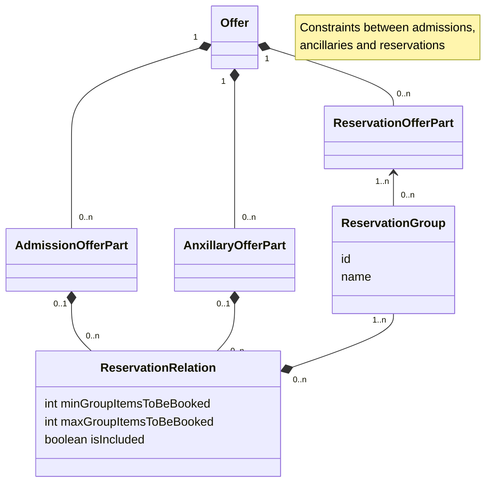
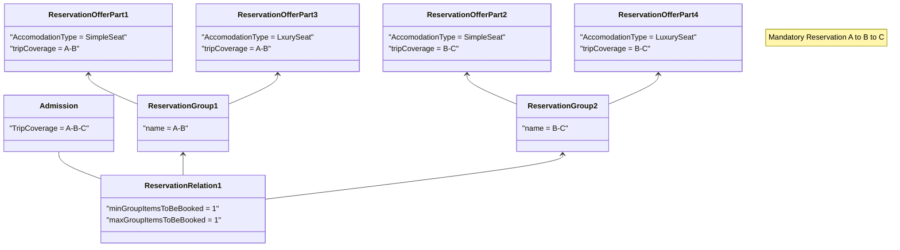
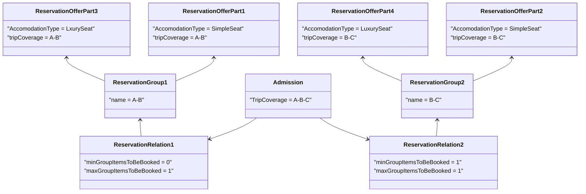
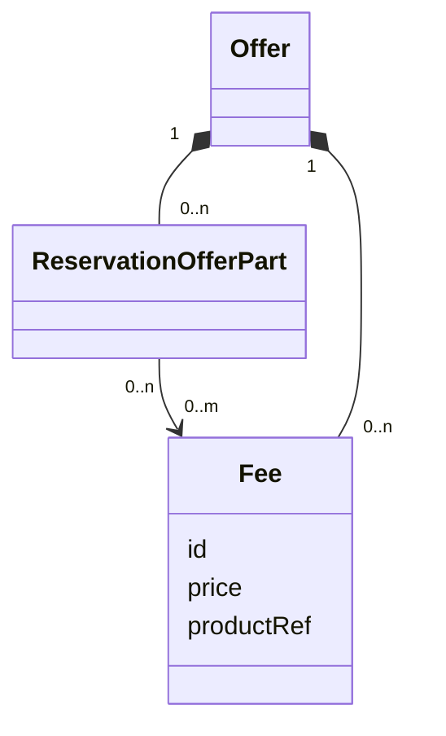

## Table of contents

1. [Introduction](#introduction)
2. [Mandatory and Optional Reservations](#mandatoryOtional)
3. [Reservation Fees](#reservationFees)
4. [Selecting Places](#selectingPlaces)
5. [reallocating places by the carrier](#reallocation)

## Introduction <a name="introduction">

Reservations are used to allocate seats or berths to travellers, but also hooks to bicycles and at some carriers to accocae space for items of a traveller (e.g. prams, cars, motorcycles,..). 

Reservations might be sold alongside of admissions or ancillaries, but can also be sold stand alone if the traveller already has a ticket.

Reservations might come with an additional fee or a additional price or both. The reservation fee might cover multiple reservations.

## Mandatory and Optional Reservations <a name="mandatoryOptional">

For some trains the reservation a reservation is mandatory. This might be the case due to commercial condition of due to legislation.

The possible reservations will be provided as offer parts with each offer. The retailer must provide the correct selection of reservations for booking in 
order to have reservations foor all trains with mandatory reservations. These rules are provided with the offer parts in the ReservationRelation Object linked to eigther an admission offer part or an ancillary offer part.
An anxillary or an admission can have multiple reservation relations. Each of these needs to be satisfied to make the booking.

ReservationRelation Class diagram

 
Example 1: A reservation is mandatory on both trains, A-B and B-C. Eigther a simple seat or a luxury seat can be selected.

Example 2: A reservation is mandatory on the train B-C, the reservation on A-B is optional. Eigther a simple seat or a luxury seat can be selected.

## Reservation Fees <a name="reservationFees">

Reservation fees might be taken per train or per trip. The reservation fees is aincluded in the offer as a separate objkect. All reservations that are subject 
to the fee link to the fee via feeRef in the reservationOfferPart. The fee is applied if one of the linked reservations is included in the booking.

If the fee is incuded in the admission price this can be indicated by the 'isIncluded' flag in the 'reservationRelation'. 

## Selecting Places <a name="selectingPlaces">

The selection of places is a separate optional API calls. There are separate calls to retrieve:

 - a graphical representation of seat availability in trains to provide a graphical UI for seat selection
 - the availability of for a specific set of seat properties
 - the availability of seats snerby a referenced seat

The selected seats need to be added to the reservation using a patch.

Selecting seats is optional. IN case no seat is selected the provider will allocate them on booking confirmation.

The selection of seats might be subject to fees. This is independent from the reservation fee for geting a reservation and is applied in case the graphical selection is used. This fee might 
depend on the seat and the fee is shown in the seat availability for the selection. This fee is added to the booking in case of a selection, so it is not part of the original offer price and changes the total price.

## Reallocation <a name="reallocation">

Due to change of material a carrier might have to change the reserved seats. This is indicated via an Event of type 'BOOKING_REACCOMMODATED'. In case the travellers e-mail address has been
provided the carrier will usually inform the traveller directly.
