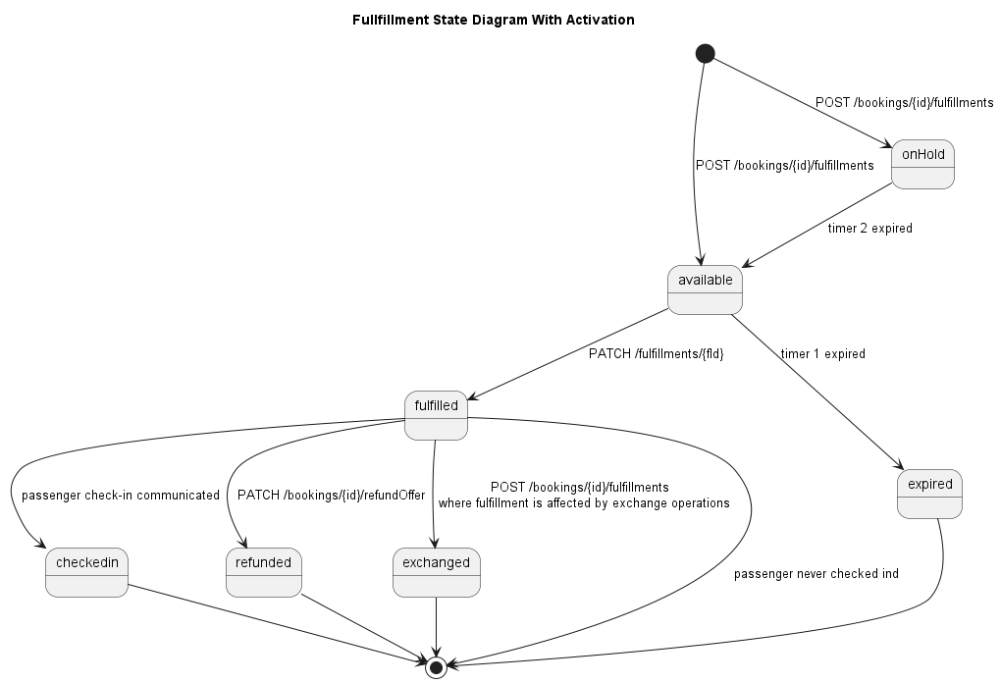

## Table of contents

1. [State Models](#stateModels)
   1. [Trip State Model](#trip)
   2. [Booking State Model](#booking)
   3. [Booking Part State Model](#bookingPart)
   4. [Fulfillment State Model](#fulfillment)
   5. [Fulfillment State Model with Activation](#fulfillmentActivation)
   6. [Refund State Model](#refund)
   7. [Exchange State Model](#exchange)
   8. [Complaint State Model](#complaint)

## State Models <a name="stateModels">

### Trip State Model <a name="trip">

The state `PLANNED` is relevant for trips on touristic trains or if trains only
run if a certain amount of bookings have been made. If the the trip is
confirmed, the purchaser can be informed using the webhook API.

### Booking State Model <a name="booking">

The status applies to the booking parts, no booking state exists.

### Booking Part State Model <a name="bookingPart">

### Fulfillment State Model <a name="fulfillment">

### Fulfillment State Model with Activation <a name="fulfillmentActivation">

In case of multi-journey products, a fulfillment needs to be activated before,
thus it changes from `AVAILABLE` to `FULFILLED`.

### Refund State Model <a name="refund">

### Exchange State Model <a name="exchange">

Values are a subset of the booking status values (see before).

### Complaint State Model <a name="complaint">

