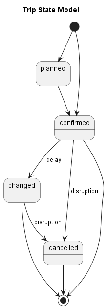
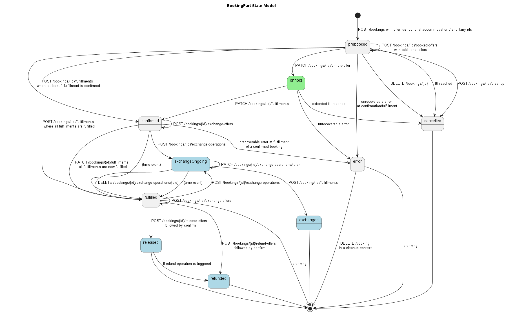

## State Models <a name="stateModels">

### Trip State Model

The state `PLANNED` is relevant for trips on touristic trains or if trains only
run if a certain amount of bookings have been made. If the the trip is
confirmed, the purchaser can be informed using the webhook API.

### Booking State Model

The status applies to the booking parts, no booking state exists.

### Booking Part State Model

### Fulfillment State Model

### Fulfillment State Model with Activation

In case of multi-journey products, a fulfillment needs to be activated before,
thus it changes from `AVAILABLE` to `FULFILLED`.

### Refund State Model

### Exchange State Model

Values are a subset of the booking status values (see before).

### Complaint State Model

