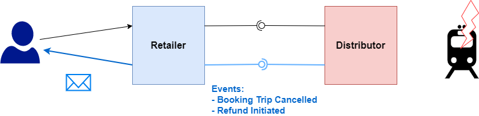

## Synchronization

For carriers or distributors to inform retailers about changes in a trip or a
booking, we have added an API that a carrier or distributor system can inform a
retailer about that fact, that a trip or a booking has changed. The retailer can
then itself inform a passenger or the purchaser e.g. a travel agency about
changes to the trip, the booking or the complaint.

The API informs authorized listener of the fact that changes have occurred using
[Webhook](https://en.wikipedia.org/wiki/Webhook).

## Event Types and Their Semantics

### Booking

- `BOOKING_TRIP_CONFIRMED`

  A trip related to the booking which was uncertain has been confirmed. For
  large groups it is possible to book before the train is actually available.

  The recommended action is to reload and update the related booking, i.e. the
  related fulfillments and to bubble the event up. If it reaches the final
  partner, it informs the client. You may want to re-confirm the client is
  traveling and if relevant trigger confirmation the payment process.

- `BOOKING_TRIP_CHANGED`

  A trip which was booked (but has not departed yet) has had its schedule
  updated. Thus, it does not cover real-time updates. The trip on the level of
  that provider is still feasible.

  The recommended action is to reload and update the booking from this provider
  i.e. the related fulfillments. If part of a multi-provider trip, check the
  total trip is still feasible and bubble the event up. If it reaches final
  partner, it informs the client.

- `BOOKING_REAL_TIME_EVENT_OCCURRED`

  A train involved in a trip of the linked booking is experiencing some
  unexpected change in the actual schedule.

  The recommended action is to notify the client if it is subscribed to some
  kind of real time update. If relevant, start some contingency flow.

- `FULFILLMENT_AVAILABLE`

  A new fulfillment has been created in the booking. Note that the creation of a
  fulfillment can be an asynchronous process.

  The recommended action is to retrieve the booking and update the local
  representation.

- `FULFILLMENT_REFUNDED`

  A fulfillment has been refunded. In case of deferred refund, it would be at
  the end of the _waiting period_. In case of seat release, it will take place
  at the moment of the actual refund.

  The recommended action is to retrieve the booking and update the local
  representation. If relevant trigger matching payment transactions.

- `FULFILLMENT_EXCHANGED`

  A fulfillment has been exchanged. In case of deferred refund, it would be at
  the end of the _waiting period_. In case of seat release, it will take place
  at the moment of the actual refund.

  The recommended action is to retrieve the booking and update the local
  representation. If relevant trigger matching payment transactions (only in
  case of price decrease).

- `FULFILLMENT_CONTROLLED`

  A fulfillment in the booking has been checked in.

  The recommended action is to retrieve the booking and update the local
  representation.

- `ACCOMMODATION_RELEASED`

  An accommodation in the booking has been released, meaning it is made
  available again in the inventory.

  The recommended action is to retrieve the booking and inform the customer.

- `REFUND_INITIATED`

  A refund process has been initiated for one or several fulfillments in the
  booking using `PATCH /bookings/{id}/refunds`.

  The recommended action is to retrieve the booking and update the local
  representation.

- `EXCHANGE_INITIATED`

  An exchange process has been initiated for one or several fulfillments in the
  booking using `PATCH /bookings/{id}/exchangeOperations`.

  The recommended action is to retrieve the booking and update the local
  representation.

- `PURCHASER_CHANGED`

  A passenger has been updated by `PATCH /bookings/{id}/purchaser`.

  The recommended action is to retrieve the booking and update the local
  representation.

- `PASSENGER_CHANGED`

  A passenger has been updated by `PATCH /bookings/{id}/passenger`.

  The recommended action is to retrieve the booking and update the local
  representation.

### Complaints

- `INITIATED`

  A complaint has been submitted using `POST /complaints`.

  The recommended action is to retrieve the complaint and inform the customer.

- `DECIDED`

  A decision has been taken on the complaint (CONFIRMED or REJECTED) using
  `PATCH /complaints/{complaintId}`.

- `SETTLED`

  A previously CONFIRMED complaint has been settled using
  `PATCH /complaints/{complaintId}`.

  The recommended action is to retrieve the complaint and inform the customer.

- `INFORMATION_MISSING`

  The complaint has been examined and some information is missing
  `PATCH /complaints/{complaintId}`.

  The recommended action is to retrieve the complaint and inform the customer.

## Subscribing to Events

A receiver has to provide the following information:

- The events it is interested in. E.g. `BOOKING` or `COMPLAINT`
- The end point the events need to be sent to. E.g.
  `https://trainline.com/api/webhooks/db`
- Sign message to guarantee that the sender is in fact who it claims to be. E.g.
  `HMAC`
- IP whitelist
