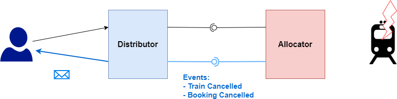

## Synchronization Management

For carriers or allocators to inform distributors about changes in a trip or a booking, we have added an API that a carrier/allocator system can inform a distributor about that fact, that a trip or a booking has changed. The distributor can then itself inform a passenger or the buyer e.g. a travel agency about changes to the trip, the booking or the complaint.

The API informs authorized listener of the fact that changes have occurred using [Webhook](https://en.wikipedia.org/wiki/Webhook).

## Event Types and Their Semantics

### Booking

- `BOOKING_CANCELED` - `DELETE /bookings/{id}`: pre-booking has either been cancelled by distributor or pre-booking has timed out
- `BOOKING_CONFIRMED` - `POST /bookings/{id}/fulfillments`: booking has been confirmed
- `FULFILLMENT_REFUNDED` - `PATCH /bookings/{id}/refunds`: either refunded by original distributor or (depending on agreements) other party
- `FULFILLMENT_EXCHANGED` - `PATCH /bookings/{id}/exchangeOperations`: either exchanged by original distributor or (depending on agreements) other party
- `FULFILLMENT_FULFILLED` - `PATCH /bookings/{id}/fulfillments`: fulfillment has been fulfilled. Happens (for most providers) when `BOOKING_CONFIRMED`
- `FULFILLMENT_CONTROLLED` - only to be used when subsequent booking (e.g. train as "feeder flight") depends on use of the booking. Not to be used for "no refund after travel", as this decision stays with the provider/allocator

- `REFUND_INITIATED` - refund initiated at provider level, e.g. at the station office. Needs to happen before travel. This implies releasing potentially booked places or ancillaries (e.g. meal).

- `BOOKER_CHANGED` - `PATCH /bookings/{id}/booker`: name or contact data changed
- `PASSENGER_CHANGED` - `PATCH /bookings/{id}/passenger`: name or contact data changed

### Complaints

- `DECIDED` - `PATCH /complaints/{complaintId}`: A decision on the complaint has been made
- `SETTLED` - `PATCH /complaints/{complaintId}`: The complaint has been settled, i.e. a voucher has been issued or a bank transfer has been made
- `INFORMATION_MISSING` - `PATCH /complaints/{complaintId}`: To make a decision additional information is needed.

To verify whether a booking has changed on the distributor's side, a **revision number** (or **timestamp**) on the booking is required.

## Subscribing to Events

A receiver has to provide the following information:

- The events it is interested in. E.g. `BOOKING` or `COMPLAINT`
- The end point the events need to be sent to. E.g. `https://trainline.com/api/webhooks/db`
- Sign message to guarantee that the sender is in fact who it claims to be. E.g. `HMAC`
- IP whitelist
