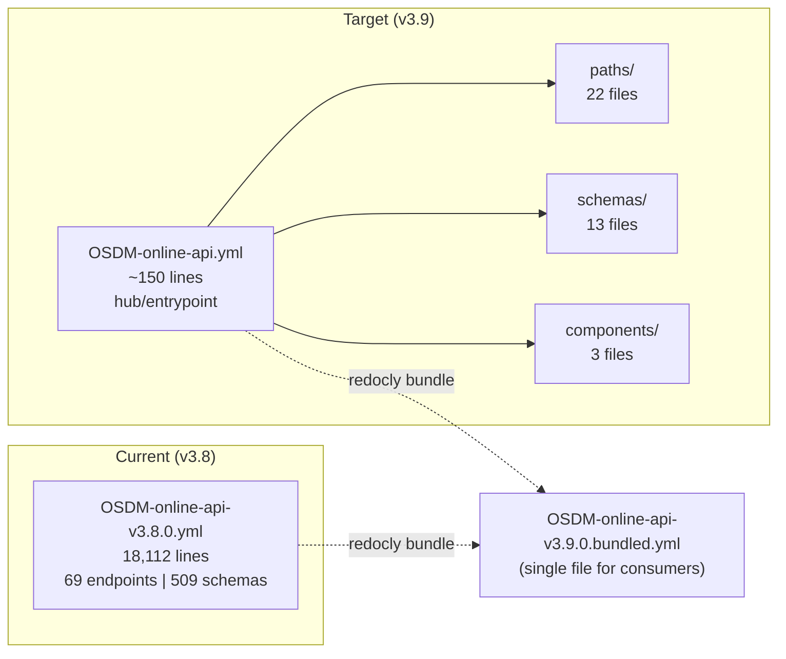
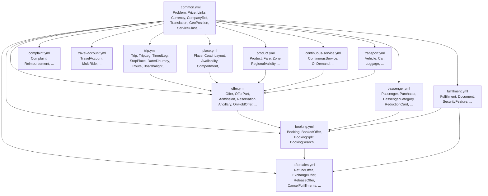
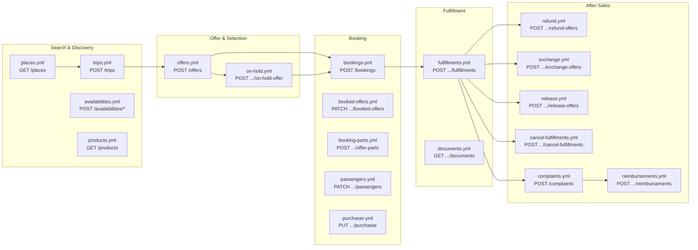
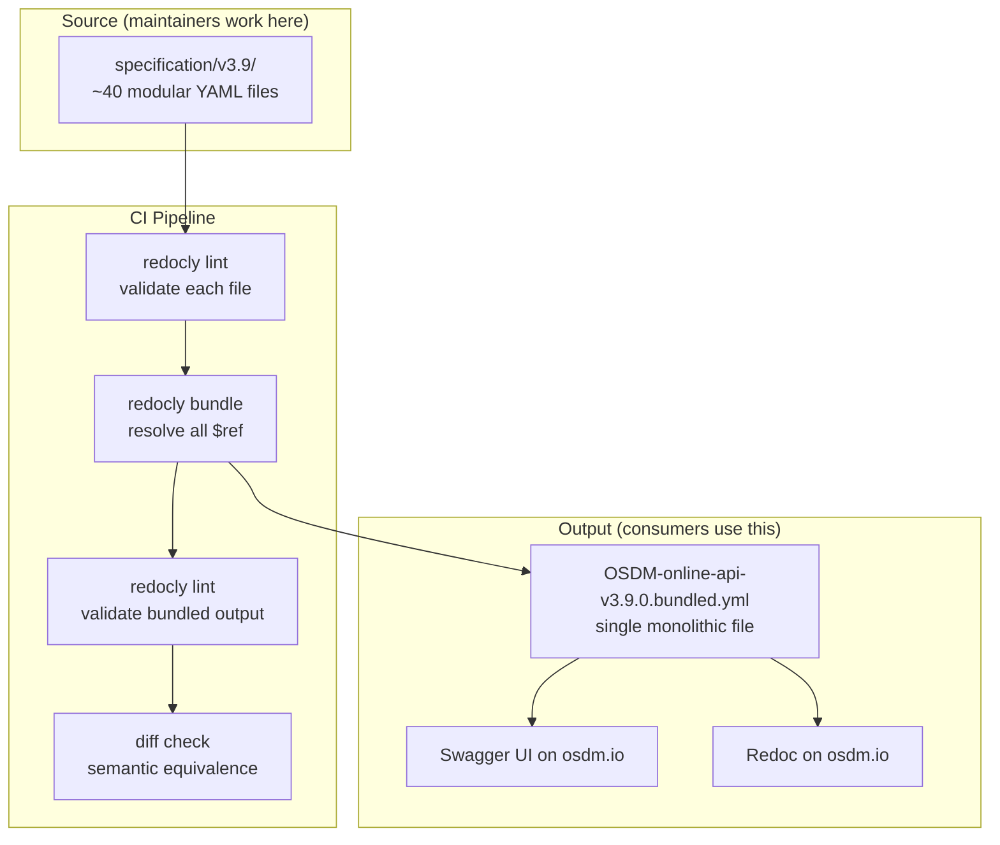
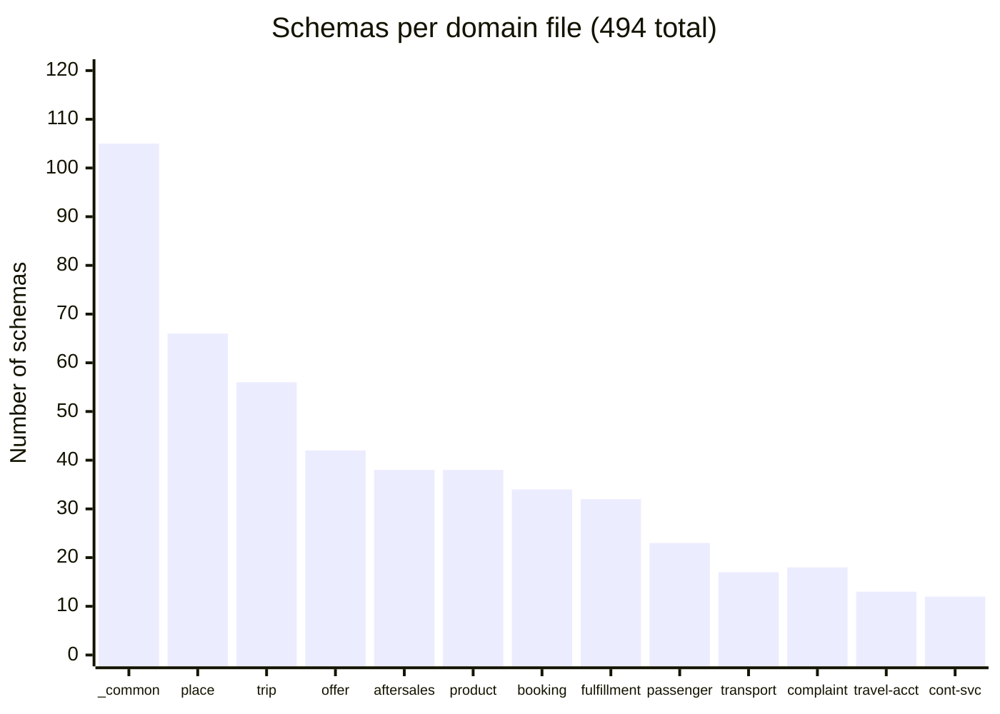

# OSDM v3.9 Specification Modularization

## 1. Current State vs Target

## 2. Proposed Directory Structure

```mermaid
graph TD
    ROOT["specification/v3.9/"]
    ROOT --> HUB["OSDM-online-api.yml<br/>(entrypoint)"]
    ROOT --> WH["OSDM-online-webhook-v3.9.0.yml"]
    ROOT --> CL["Changelog-3.9.0.md"]

    ROOT --> PATHS["paths/"]
    ROOT --> SCHEMAS["schemas/"]
    ROOT --> COMP["components/"]

    PATHS --> P1["versions.yml"]
    PATHS --> P2["places.yml"]
    PATHS --> P3["trips.yml"]
    PATHS --> P4["offers.yml"]
    PATHS --> P5["availabilities.yml"]
    PATHS --> P6["bookings.yml"]
    PATHS --> P7["booked-offers.yml"]
    PATHS --> P8["booking-parts.yml"]
    PATHS --> P9["fulfillments.yml"]
    PATHS --> P10["refund.yml"]
    PATHS --> P11["exchange.yml"]
    PATHS --> P12["...8 more"]

    SCHEMAS --> S0["_common.yml<br/>~80 schemas"]
    SCHEMAS --> S1["trip.yml<br/>~45 schemas"]
    SCHEMAS --> S2["offer.yml<br/>~35 schemas"]
    SCHEMAS --> S3["booking.yml<br/>~30 schemas"]
    SCHEMAS --> S4["fulfillment.yml<br/>~25 schemas"]
    SCHEMAS --> S5["aftersales.yml<br/>~40 schemas"]
    SCHEMAS --> S6["place.yml<br/>~40 schemas"]
    SCHEMAS --> S7["...6 more"]

    COMP --> C1["parameters.yml"]
    COMP --> C2["responses.yml"]
    COMP --> C3["security-schemes.yml"]
```

## 3. Schema Dependency Graph

## 4. Booking Lifecycle — Paths Mapping

## 5. Build Pipeline

## 6. Schema Size Distribution

