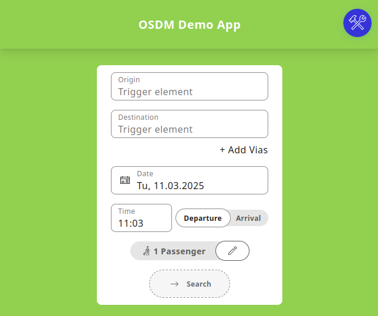

## Aim

The aim of the [**OSDM-Demo-App**](https://github.com/UnionInternationalCheminsdeFer/OSDM-demo-app) is to provide a working app to interesting parties to start
implementing their apps and clients.

The app covers the complete booking flow, will include the reservation of seats and ancillary services, and supports trains, buses or other means of public transport.

The first Demo-App implementation has been implemented by [SBB](https://www.sbb.ch) in 2021 in only 7 days using Flutter.

The current implementation of the [**OSDM-Demo-App**](https://github.com/UnionInternationalCheminsdeFer/OSDM-demo-app) has been developed as a web-application by [xatellite](https://xatellite.space) and [bileto](https://bileto.cz/), following up to the corresponding challenge at the 2024 Drei-Länder-Hack.

## Online-Demo

A deployed version of the demo application can be found here: [https://osdm-demo.xatellite.space/](https://osdm-demo.xatellite.space/)

To test the demo-application one needs a [sandbox](/tools/sandboxes/) or production OSDM service, that supports the [client credentials authentification](/spec/authentication/#client_credentials) flow and sets http access control headers accordingly.

## Contact
For issues or feature requests please file them [here](https://github.com/UnionInternationalCheminsdeFer/OSDM-demo-app/issues).

For any further questions or support please contact:

[xatellite - David Prenninger](mailto:david@xatellite.space)

