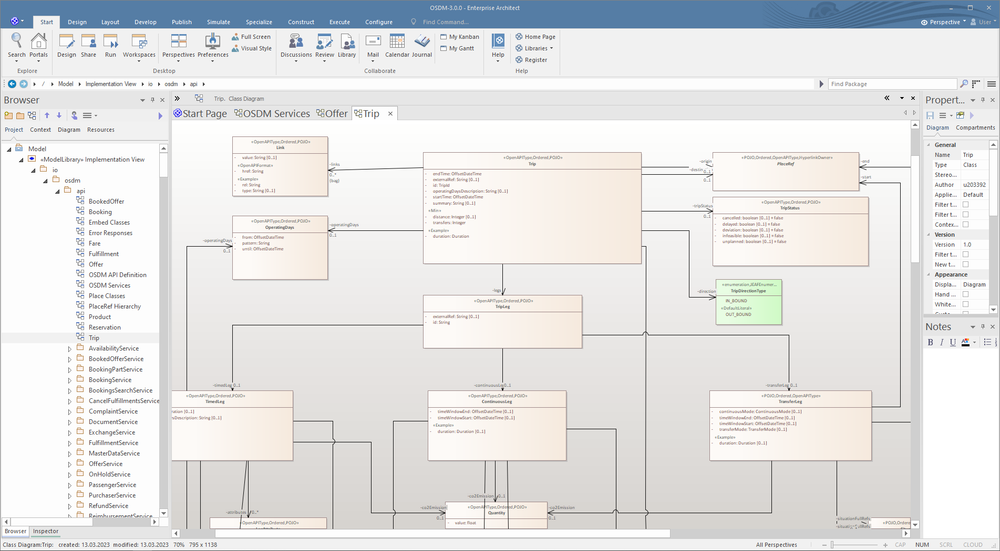

## UML Model

We are using an
[UML model](https://github.com/UnionInternationalCheminsdeFer/OSDM/blob/master/specification/v3.0/OSDM-3.0.0.eapx)
to generate the _YAML_ specification as well as other code artefacts.

